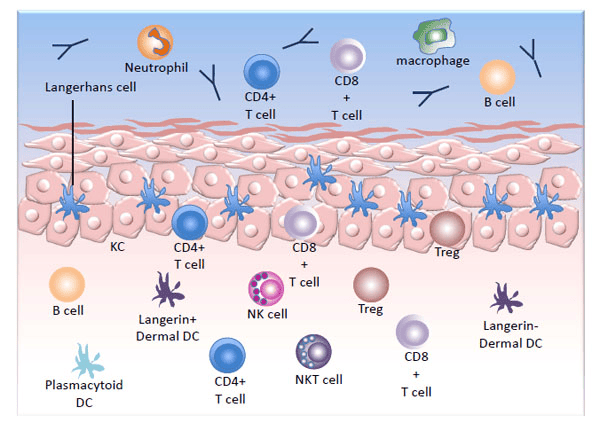

Human Papilloma Virus (HPV) là virus gây u nhú ở người, nguyên nhân hàng đầu gây ung thư cổ tử cung và nhiều bệnh lý đường sinh dục ở cả nam và nữ.

## Human Papillomavirus (HPV)

### Cấu tạo

HPV thuộc họ Papovaviridae, đường kính ~55 nm, không có màng lipid. Capsid gồm 72 capsom hình sao 5 cánh, chính bởi protein L1; protein L2 ít hơn, giữ vai trò nâng đỡ.

Bên trong là DNA kép vòng, dài 7.904 bp, gồm các gen:
- **E1, E2:** nhân bản.
- **E4, E5:** tái tổ hợp.
- **L1, L2:** protein vỏ capsid.
- **E6, E7:** đa chức năng, tương tác với p53 và pRb, quyết định khả năng sinh ung thư.

_Sơ đồ DNA 7.904 bp của HPV type 16._

### Các type

Hơn 200 type HPV đã được định danh, trong đó ~85 type đã mô tả đầy đủ gene; >40 type lây qua quan hệ tình dục. Do chỉ có capsid, HPV bền ngoài môi trường, có thể lây gián tiếp qua tiếp xúc đồ dùng.  

- **Nhóm da:** tổn thương ở da tay, chân.
- **Nhóm niêm mạc:** xâm nhiễm tế bào đáy niêm mạc môi, miệng, hô hấp, cơ quan sinh dục.

**Nguy cơ thấp:** 6, 11, 42, 43, 44.
**Nguy cơ cao:** 16, 18, 31, 33, 34, 35, 39, 45, 51, 52, 56, 58, 59, 66, 68, 70.

### Yếu tố nguy cơ lây nhiễm

1. Quan hệ tình dục sớm, nhiều bạn tình, tiền sử STI.
2. Bao cao su không hoàn toàn ngăn HPV.
3. Phổ nhiễm cao ở 18–30 tuổi, giảm sau 30 do tế bào cổ tử cung biệt hóa hoàn chỉnh.

### HPV và ung thư

- Đa số lành tính, có thể tự khỏi nếu miễn dịch tốt.
- Nhiễm tồn tại (>2 năm) tăng nguy cơ tái phát và sinh ung thư.
- Biểu hiện: mụn cóc da, mụn cóc miệng (Heck’s), u nhú thanh quản.
- Tại cổ tử cung: HPV type thấp gây mụn cóc sinh dục; type cao (16, 18, 31, 45…) liên quan đến tổn thương tiền ung và ung thư.

**Cơ chế sinh ung thư:**  
- E6 liên kết p53 → thoái giáng p53 → mất kiểm soát chu kỳ tế bào.
- E7 bất hoạt pRb → giải phóng E2F1 → kích hoạt phân bào không kiểm soát.

Miễn dịch qua trung gian tế bào quyết định khả năng thanh thải HPV.

_Cơ chế hình thành tế bào bất tử khi nhiễm HPV._

_Miễn dịch bẩm sinh và thích nghi qua trung gian tế bào bảo vệ chống HPV._

## Vaccine HPV

### Cơ chế của vaccine

- Dùng virus-like particles (VLP) từ protein L1, không chứa DNA, không gây nhiễm.
- Kích thích B-cell và T-cell tạo kháng thể IgG đặc hiệu.
- Không tạo miễn dịch chéo giữa các type khác nhau.

### Các loại vaccine

- **Nhị giá (2vHPV):** bảo vệ type 16, 18.
- **Tứ giá (4vHPV):** thêm type 6, 11.
- **Cửu giá (9vHPV):** bổ sung 31, 33, 45, 52, 58.

| Thông số                          | Vaccine HPV từ giá            | Vaccine HPV nhị giá            |
|-----------------------------------|--------------------------------|---------------------------------|
| Thời gian theo dõi                | 36 tháng (nâng cao)           | 15 tháng (tạm thời)            |
| Type bảo vệ                       | 6, 11, 16, 18                 | 16, 18                         |
| Hiệu quả trên CIN 2* do 16 hay 18  | Đã được chứng minh             | Đã được chứng minh              |
| Hiệu quả trên CIN 2* do 16         | Đã được chứng minh             | Đã được chứng minh              |
| Hiệu quả trên CIN 2* do 18         | Đã được chứng minh             | Chưa chứng minh                |
| Hiệu quả trên CIN 2 do 16 hay 18   | Đã được chứng minh             | Đã được chứng minh              |
| Hiệu quả trên CIN 3 do 16 hay 18   | Đã được chứng minh             | Chưa chứng minh                |
| Hiệu quả điều trị                 | Không                         | Không                          |
| Hiệu quả trên tân sinh biểu mô âm hộ | Đã được chứng minh         | Chưa được báo cáo              |
| Hiệu quả trên tân sinh biểu mô âm đạo | Đã được chứng minh         | Chưa được báo cáo             |
| Hiệu quả trên mụn cóc sinh dục    | Đã được chứng minh             | Không phải là mục tiêu         |
| An toàn sau 6 năm theo dõi        | An toàn                       | An toàn                        |
| Tính chấp nhận (dung nạp)         | Chấp nhận                     | Chấp nhận                      |
| Thời gian bảo vệ                  | 5-6 năm                       | 5-6 năm                        |
| Tạo miễn dịch ở vị thành niên     | Đã được chứng minh             | Đã được chứng minh              |
| Tạo miễn dịch ở nữ lớn tuổi hơn   | Đã được chứng minh             | Đã được chứng minh              |
| Ký ức miễn dịch sau 6 năm         | Đã được chứng minh             | Chưa báo cáo                   |

_So sánh vaccine HPV nhị giá và tứ giá._

### Sử dụng vaccine theo ACIP

:::note[Đối tượng]
- Gái/trai 9–12 tuổi (khuyến cáo mạnh: 11–12 tuổi), 4vHPV cho trai.
- Chưa tiêm: nữ đến 26, nam đến 21 (mở rộng đến 26 cho người đồng tính và chuyển giới).
- Trẻ em bị lạm dụng tình dục: bắt đầu từ 9 tuổi.
:::

:::note[Phác đồ]
- Trước 15 tuổi: 2 liều, cách 6–12 tháng.
- Từ 15 tuổi: 3 liều (0, 1–2 tháng, 6 tháng).
:::

:::caution[Lưu ý]
- Tuân thủ khoảng cách tối thiểu: liều 1–2 ≥4 tuần, 2–3 ≥12 tuần, 1–3 ≥40 tuần.
- Tiếp tục lịch khi trễ hẹn, không phải lặp lại từ đầu.
- Chống chỉ định: dị ứng nấm men (4v/9vHPV), không tiêm khi mang thai.
- Tiêm chung với các vaccine khác được, không trộn chung ống tiêm.
- Theo dõi 15 phút sau tiêm.
:::

> **FDA** chỉ dán nhãn 4vHPV và 9vHPV cho bé trai; 9vHPV được khuyến nghị vì hiệu quả rộng và chi phí quản lý hợp lý.  
> Dù tiêm đầy đủ, vẫn cần tầm soát ung thư cổ tử cung định kỳ (Pap smear và/hoặc HPV DNA) do vaccine không phòng được hết tất cả các loại virus HPV.

## HPV testing

- Thường thực hiện cùng Pap smear (co-testing).  
- Âm tính HPV → độ tin cậy cao, có thể tầm soát 3 năm/lần.  

:::note[Chỉ định]
1. Reflex testing khi ASC-US.
2. Co-testing cho phụ nữ 30–65 tuổi.
3. Sau điều trị HSIL.
4. Có xu hướng làm test đầu tay từ 25 tuổi.
:::

:::note[Quy trình quản lý (ACOG/ASCCP)]
- HPV (−): xét nghiệm lại sau 3 năm.
- HPV (+) type 16/18: soi cổ tử cung.
- HPV (+) type cao khác: làm tế bào học; nếu bình thường → theo dõi 1 năm; nếu bất thường → soi cổ tử cung.
:::

## Tóm tắt

- **HPV** là virus Papovaviridae, không có màng lipid, capsid 72 capsom, chứa DNA kép vòng 7.904 bp.  
- Có >200 type; >40 type lây qua đường tình dục. Nhóm nguy cơ cao (16, 18, 31, …), nhóm nguy cơ thấp (6, 11, 42, …).  
- **Yếu tố nguy cơ**: quan hệ sớm, nhiều bạn tình, tiền sử STI, dùng bao cao su không hoàn toàn bảo vệ, độ tuổi 18–30.  
- **Bệnh lý**: phần lớn lành tính; E6/E7 tương tác p53 và pRb, kéo dài >2 năm có thể dẫn đến mụn cóc sinh dục, tổn thương tiền ung và ung thư cổ tử cung.  
- **Vaccine**:  
  - 2vHPV (16, 18); 4vHPV (6, 11, 16, 18); 9vHPV (6, 11, 16, 18, 31, 33, 45, 52, 58).  
  - Phác đồ: trước 15 tuổi — 2 liều (cách 6–12 tháng); từ 15 tuổi — 3 liều (0, 1–2 tháng, 6 tháng).  
  - Khuyến cáo tiêm 9–12 tuổi, mở rộng đến 26 tuổi; vẫn phải tầm soát Pap/HPV định kỳ.  
- **HPV testing**: thường kết hợp Pap smear (co-testing) cho phụ nữ 30–65 tuổi; âm tính HPV → tái tầm soát sau 3 năm; dương tính type 16/18 → soi cổ tử cung; dương tính type cao khác → thêm tế bào học và theo dõi.  

## Nguồn tham khảo

- Trường Đại học Y Dược TP. HCM (2020) – _TEAM-BASED LEARNING_
