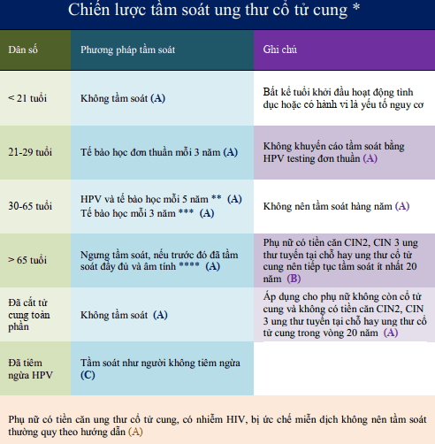

Ung thư cổ tử cung là ung thư phổ biến thứ 4 ở phụ nữ và phổ biến thứ 2 ở phụ nữ trong độ tuổi sinh sản, sau ung thư vú.

## Chiến lược tầm soát ung thư cổ tử cung

_\* Các khuyến cáo dựa theo: American Cancer Society (ACS), The American Society for Colposcopy and Cervical Pathology (ASCCP), và The American Society for Clinical Pathology (ASCP). A: khuyến cáo mạnh, chứng cứ rõ ràng, hằng định. B: khuyến cáo trung bình, chứng cứ không hằng định. C: theo kinh nghiệm. ** Ưu tiên. \*** Chấp nhận được nhưng không phải là lựa chọn tối ưu. \*\*\*\* Kết quả tầm soát âm tính đầy đủ được định nghĩa là có 3 kết quả tầm soát tế bào học âm tính chính thức hoặc có 2 kết quả co-testing chính thức âm tính trong vòng 10 năm trước, kết quả gần nhất phải được thực hiện trong 5 năm trước._

## Nguồn tham khảo

- Trường Đại học Y Dược Thành phố Hồ Chí Minh (2020) - TEAM-BASED LEARNING.
- Bệnh viện Từ Dũ (2022) - PHÁC ĐỒ ĐIỀU TRỊ SẢN PHỤ KHOA.
