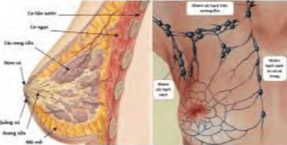
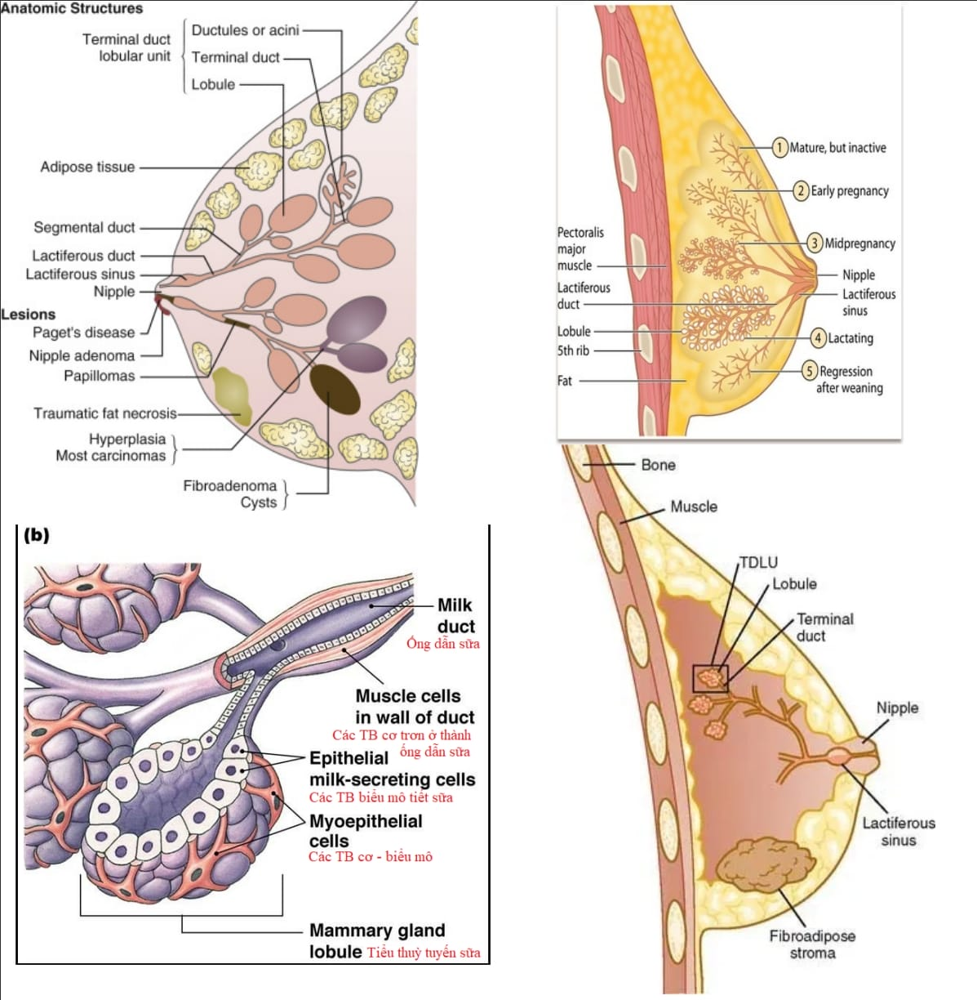
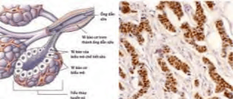

Vú được cấu tạo bởi 2 thành phần là mô tuyến vú và mô mỡ-liên kết.

## Giải phẫu

Tuyến vú được xem như phần phụ của da, có chức năng sản xuất sữa. Tuyến vú là tuyến lớn, nằm trên thành ngực, phía trên các cơ ngực lớn và bé. Tuyến vú được cố định bằng hệ thống cân mạc và dây chằng lỏng lẻo đi từ da đến thành ngực.

Tuyến vú có dạng hình bán cầu, với chóp bán cầu là núm vú và quầng vú. Núm vú là nơi đổ ra ngoài của hệ thống các ống tuyến sữa. Quầng vú là quầng sắc tố quanh núm vú. Bên dưới của quầng vú là vị trí mà các ống dẫn sữa dãn rộng ra, gọi là các xoang sữa. Bầu vú được cấu tạo bởi mô tuyến vú và mô mỡ-liên kết. Tỷ lệ mô tuyến:mô liên kết thay đổi theo tình trạng hoạt động nội tiết theo tuổi, thai và cho con bú.

_(Trái) Hình ảnh giải phẫu tuyến vú. (Phải) Dẫn lưu bạch dịch của tuyến vú đi theo các con đường nách, ức và hạ đòn. Xương đòn là mốc quan trọng đánh giá tình trạng di căn hạch của ung thư vú._

_Hình ảnh giải phẫu tuyến vú._

Tuyến vú được cấp máu bởi các mạch máu từ thành ngực. Hệ bạch dịch của tuyến vú đổ vào nách và hạch vú (cạnh ức), sau đó nối tiếp với hệ thống bạch dịch trên xương đòn. Xương đòn là mốc quan trọng để đánh giá mức độ di căn hạch của các ung thư vú. Khảo sát các hạch nách và hạch thượng đòn quan trọng khi hướng dẫn người phụ nữ tự khám vú và đánh giá giai đoạn qua phẫu thuật các khối u vú.

## Mô học

### Đặc điểm

Về mặt mô học, tuyến vú được cấu tạo bởi khoảng từ 10-20 đơn vị gọi là các tiểu thùy vú (breast lobe). Các tiểu thùy được phân cách với nhau bằng tổ chức mô liên kết và mô mỡ. Chúng đổ vào các lỗ tận cùng ở núm vú (nipple). Nếu xuất phát từ lỗ đổ vào núm vú, mỗi đơn vị bắt đầu bằng ống rộng, gọi là ống dẫn sữa (lactiferous duct). Khẩu kính của ống dẫn sữa gần nơi xuất phát vào khoảng 0.5mm. Ở gần núm vú, khẩu kính của ống rộng hơn, tạo xoang để chứa sữa (lactiferous sinus). Từ đó, các ống đi sâu vào bên trong và bắt đầu chia nhỏ dần. Cuối cùng, mỗi nhánh nhỏ của hệ thống ống dẫn sữa kết thúc bằng cách nối với các nang sữa (acinus) bằng đơn vị ống tuyến
tận (terminal duct lobular unit - TDLU). Thành ống dẫn sữa được cấu tạo bởi 2 lớp, 1 lớp biểu mô lót bên trong lòng ống là biểu mô trụ thấp hay trụ, bên ngoài là lớp cơ biểu mô. Tại núm vú, cấu trúc cơ được tăng cường bằng nhiều bó cơ trơn và mô collagen dầy, có nhiệm vụ tống xuất sữa từ các xoang sữa khi cho con bú. Cấu trúc các nang sữa cũng tương tự như cấu trúc ống dẫn sữa. Lòng nang cũng được lót bởi lớp biểu mô trụ thấp, tựa trên màng đáy. Bên ngoài của các nang là các cơ biểu mô.

Biểu mô là vị trí xuất phát thường gặp nhất của các u vú. Carcinoma ống tuyến vú thường gặp hơn là từ nang sữa.

### Thụ thể estrogen và progesterone

Các tế bào tuyến của tuyến vú được trang bị các thụ thể với estrogen (estrogen receptor) (ER) và progesterone (PR). ER và PR làm cho mô tuyến vú nhạy cảm với các steroid này, tạo ra biến đổi có tính chu kỳ, cũng như các biến đổi đặc biệt trong thai kỳ và khi cho con bú. Phát triển tuyến vú được đảm bảo bởi estrogen, trong khi đó phân tiết của các tế bào nang sữa được đảm bảo bởi progesterone.

Thay đổi có tính chu kỳ trên vú gây ra các triệu chứng mà người phụ nữ có thể nhận ra được như đau căng vú trong nửa sau chu kỳ kinh nguyệt. Các biến đổi đôi khi thái quá và gây ra khó chịu thật sự cho người phụ nữ (mastodynia).

| Estrogen                                       | Progesterone                                                                       |
| ---------------------------------------------- | ---------------------------------------------------------------------------------- |
| Phát triển tuyến vú. Phát triển mô mỡ ở vú. | Hỗ trợ phát triển các tiểu thùy. Phân chia các nang sữa. Phân tiết nang sữa. |

Các tế bào ung thư vú có thể có ER (ER dương) hoặc không có ER (ER âm). Tương tự, tế bào ung thư có thể có PR dương hay PR âm. Các tế bào ung thư có ER hay PR dương sẽ đáp ứng với hormone liệu pháp, và có tiến triển chậm hơn là các ung thư với receptor âm tính. Khảo sát ER và PR là bắt buộc cho mọi bệnh phẩm lấy ra từ tuyến vú. Đánh giá receptor cho phép quyết định điều trị và tiên lượng sau phẫu thuật các u ở vú.

_(Trái) Nang sữa được cấu tạo bởi lớp tế bào cơ biểu mô bên ngoài. Tế bào tuyến của nang sữa là các tế bào từ trụ thấp đến trụ, nằm trên màng đáy. (Phải) Cấu trúc ống tuyến vú trên hóa mô miễn nhiễm cho thấy các thụ thể với steroid (màu nâu) Trên ảnh là các thụ thể với estrogen._

## Nguồn tham khảo

- TEAM-BASED LEARNING - Trường Đại học Y Dược Thành phố Hồ Chí Minh 2020.
