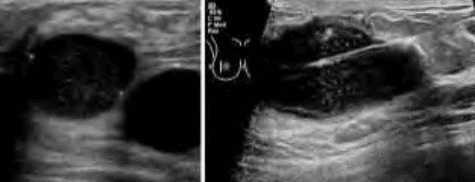

Tuyến vú có thể được khảo sát bằng nhiều phương tiện cận lâm sàng chuyên sâu. Mỗi phương pháp có ưu – nhược điểm riêng, cho phép:

1. Phát hiện sớm tổn thương (tầm soát ung thư).
2. Định hình bản chất tổn thương (lành tính – ác tính).
3. Lấy mẫu mô hoặc tế bào để chẩn đoán mô học/tế bào học.

Danh sách các xét nghiệm/phương tiện cận lâm sàng thường sử dụng:

1. Nhũ ảnh (Mammography – X-quang tuyến vú)
2. Siêu âm (Ultrasound)
3. Cộng hưởng từ (Breast MRI)
4. Chọc hút tế bào bằng kim nhỏ (Fine Needle Aspiration – FNA)
5. Sinh thiết lõi (Core Needle Biopsy)
6. Sinh thiết mở (Open Excisional Biopsy)

## Nhũ ảnh

Nhũ ảnh là phương pháp chụp X-quang tuyến vú với năng lượng thấp, được xem là tiêu chuẩn vàng trong tầm soát và chẩn đoán tổn thương vú.

- **Mục đích chính**:

  - Tầm soát ung thư vú (phát hiện giai đoạn sớm trước khi có triệu chứng).
  - Đánh giá tổn thương nghi ngờ (sau khi phát hiện khối trên lâm sàng hoặc hình ảnh học ban đầu).

- **Kỹ thuật**:

  - Nhũ ảnh kỹ thuật số toàn trường (Full Field Digital Mammography – FFDM) hiện là chuẩn mực, cho phép xử lý hình ảnh số, phóng to/thu nhỏ và cải thiện chất lượng quan sát.
  - Chụp hai tư thế tiêu chuẩn:
    1. **CC (Craniocaudal View)**: Tiếp xúc từ trên xuống dưới, phải bao quát toàn bộ mô vú, thấy rõ cơ ngực lớn phía sau (để đánh giá đủ độ sâu), thấy đủ phần bên ngoài và núm-quầng vú phía trước.
    2. **MLO (Mediolateral Oblique View)**: Tư thế chéo nghiêng 45°–60° so với sàn, cho phép quan sát phần lớn mô vú, cơ ngực lớn và 1/4 trên ngoài (vùng có tỉ lệ ung thư cao nhất).

- **Đánh giá chất lượng phim**:

  - Trên phim CC: Phải thấy được toàn bộ mô vú từ chân vú đến góc sườn-vú, cơ ngực lớn rõ.
  - Trên phim MLO: Cơ ngực phải hiện rõ, 1/4 trên ngoài không bị che lấp, góc xương mỏm cùng – thoát qua giữa lòng nách.

- **Hình ảnh đặc trưng**:

  1. **Khối đặc (mass)**: Có thể kèm bờ mờ, xù xì, nhô ra so với mô lân cận.
  2. **Hình ảnh đóng vôi (calcifications)**:
     - **Macrocalcification (đóng vôi lớn)**: Thường lành tính, hình tròn hoặc hình que, phân bố rải rác.
     - **Microcalcification (đóng vôi vi thể)**: Có thể lành tính hoặc gợi ý ung thư (nhất là khi tập trung thành chùm, có hình dạng bất thường, độ dày không đồng nhất).
     - Phân loại các nhóm đóng vôi theo BIRADS:
       1. Lành tính (nhẵn, to, rải rác).
       2. Khả năng lành tính (vòng, hình tản mát, tuyến Montgomery).
       3. Trung gian (hình đa giác, tập trung).
       4. Nghi ngờ ác tính (hình tam giác, đĩa bay, vân xen kẽ).

- **Chỉ định**:
  - Tầm soát định kỳ cho phụ nữ từ 45–50 tuổi trở lên, năm một lần (theo khuyến cáo quốc tế).
  - Phụ nữ 40–44 tuổi có nguy cơ trung bình: có thể khởi đầu nhũ ảnh nhưng cần cân nhắc cá nhân hóa.
  - Phụ nữ có nguy cơ cao (gia đình có người đột biến BRCA, tiền sử xạ trị ngực sớm): bắt đầu sớm hơn, phối hợp MRI.
  - Chẩn đoán khi phát hiện khối cục, tiết dịch, đau vú hoặc bất thường da quầng – núm.

_Nhũ ảnh: phim MLO (trái) cho thấy mô vú và cơ ngực rõ, đặc biệt 1/4 trên ngoài. Phim CC (phải) cho thấy toàn bộ mô vú từ chân vú đến núm, cơ ngực lớn và túi Chassaignac._

## Siêu âm

Siêu âm tuyến vú sử dụng sóng âm tần số cao (7–12 MHz) để khảo sát tổn thương mô mềm.

- **Ưu điểm**:

  - Quan sát mô vú ở phụ nữ có đậm độ mô dày (độ dày mô > 50%): nhất là phụ nữ dưới 45 tuổi hoặc phụ nữ trẻ.
  - Phân biệt nang – đặc (xác định đặc tính dịch bên trong khối).
  - Hướng dẫn sinh thiết nang hoặc u (FNA, core biopsy).
  - Không dùng tia X, an toàn cho phụ nữ mang thai hoặc cho con bú.

- **Hạn chế**:

  - Không thể thay thế nhũ ảnh trong tầm soát ung thư vú cho phụ nữ ≥ 45 tuổi.
  - Độ nhạy kém hơn nhũ ảnh trong phát hiện microcalcification.
  - Kết quả phụ thuộc nhiều vào kinh nghiệm người siêu âm.

- **Kỹ thuật thực hiện**:

  - Bệnh nhân nằm ngửa, hai tay đưa lên đầu để căng mô vú.
  - Thăm dò lần lượt theo các lát cắt:
    1. Lưới dọc – ngang (grid): để khảo sát toàn bộ vú theo từng hàng ngang.
    2. Lát cắt hình nan hoa (radial) và hình tiếp tuyến (antiradial): theo hướng tia phóng xạ tỏa ra từ núm-vú, giúp phát hiện khối lồi ra hoặc tổn thương đậm đặc.
    3. Khảo sát hạch nách: tìm hạch to, thay đổi cấu trúc, tăng sinh mạch máu (Doppler).

- **Đặc điểm mô tả khối**:
  - **Hình thái**: Tròn, bầu dục, tam giác, không đều.
  - **Bờ**: Trơn nhẵn (lành tính), hoặc không đều, xù xì (nghi ngờ ác tính).
  - **Phản âm**:
    - Tambống (cystic): áp âm, bóng lưng (posterior enhancement).
    - Đậm đặc (solid): giảm âm, thu hồi đáy.
    - Hỗn hợp (mixed).
  - **Doppler**: Tăng sinh mạch máu bất thường gợi ý ác tính.

_(Trái) Khối nang hỗn hợp và nang đơn thuần trên siêu âm vú. (Phải) Hướng dẫn sinh thiết nang vú qua siêu âm._

## Cộng hưởng từ (MRI)

MRI tuyến vú sử dụng nguyên tắc cộng hưởng hạt nhân, cho phép khảo sát mô vú ở không gian ba chiều với độ tương phản mô mềm rất cao. Thường tiêm thuốc tương phản gadolinium để tăng nét.

- **Ưu điểm**:

  - Độ nhạy cao (≈ 90–95%) trong phát hiện tổn thương vú, đặc biệt ở phụ nữ nguy cơ cao hoặc vú đậm đặc.
  - Phân biệt rõ tổn thương đa ổ (multifocal, multicentric).
  - Đánh giá chính xác kích thước thực của u trước khi phẫu thuật.
  - Phát hiện di căn hạch thượng đòn, cạnh ức.

- **Hạn chế**:

  - Chi phí cao, thời gian chụp lâu (30–45 phút).
  - Độ đặc hiệu thấp hơn nhũ ảnh (xấp xỉ 72–75%), dễ có dương tính giả (nang u lành tính, mô xơ tăng sinh).
  - Không thích hợp cho phụ nữ có máy tạo nhịp tim, thiết bị kim loại không tương thích.

- **Chỉ định (theo khuyến cáo Hội Ung thư Hoa Kỳ – ACS)**:

  1. Phụ nữ có đột biến BRCA1/BRCA2 hoặc có người thân thế hệ gần đột biến.
  2. Phụ nữ có tiền sử chiếu xạ ngực liều cao (10–30 tuổi).
  3. Phụ nữ ung thư vú trước đây muốn theo dõi tái phát (đặc biệt vú đậm đặc).
  4. Phụ nữ có vú rất đậm đặc (density > 75%), nhũ ảnh kém nhạy.
  5. Phụ nữ đã đặt túi ngực (implant) – đánh giá tình trạng vụn silicon, rò túi.

- **Đánh giá tổn thương**:
  - **Đặc tính bắt thuốc (enhancement kinetics)**:
    - **Wash-in nhanh – wash-out nhanh** (type III): nghi ngờ ác tính.
    - **Wash-in chậm – tăng dần** (type I): gợi ý lành tính.
    - **Wash-in nhanh – tăng dần** (type II): có thể là tổn thương giáp biên.
  - **Phân loại theo BIRADS-MRI**: Từ 1 (bình thường) đến 6 (đã xác định u ác tính), giúp quyết định can thiệp tiếp theo.

_MRI vú cung cấp hình ảnh động học và giải phẫu chi tiết, giúp đánh giá tổn thương và mức độ xâm lấn xung quanh._

## Chọc hút tế bào bằng kim nhỏ (FNA)

FNA (Fine Needle Aspiration) là kỹ thuật dùng kim mảnh (22–25G) để hút tế bào hoặc dịch từ khối tổn thương.

- **Ưu điểm**:

  - Nhanh, ít xâm lấn, chi phí thấp.
  - Kết quả tế bào học trong ngày (nhanh chóng).
  - Có thể giảm áp huyết (aspirate) khối nang lớn, giảm đau, cải thiện sinh thiết sau đó.

- **Nhược điểm**:

  - Không đánh giá được kiến trúc mô học (không phân biệt carcinoma in situ vs. invasive).
  - Tỷ lệ nghi ngờ hoặc âm tính giả cao (đặc biệt khối đặc, đậm đặc).
  - Phải kết hợp với lâm sàng, hình ảnh để đánh giá.

- **Chỉ định**:

  - BIRADS ≥ nhóm III (BIRADS 3: nghi ngờ thấp, có thể theo dõi; BIRADS ≥ 4: nghi ngờ ác tính).
  - Nang vú không điển hình (kích thước lớn, thành dày, có chồi nội dịch).
  - Tình huống cần chẩn đoán tế bào học để phân biệt lành – ác tính hoặc giảm áp nang (giảm đau).
  - Hạch nách to, nghi di căn trên siêu âm hoặc nhũ ảnh.

- **Quy trình**:
  1. Khám lâm sàng, định vị khối qua siêu âm hoặc bằng tay.
  2. Gây vô cảm tại chỗ, luồn kim 22–25G vào tổn thương, hút dịch hoặc tế bào.
  3. Truyền mẫu lên lam kính, nhuộm nhanh (Romanowsky, Giemsa, Wright).
  4. Giải phẫu tế bào: đánh giá tính chất tế bào, phân loại lành – ác, yêu cầu thêm sinh thiết lõi nếu nghi ngờ.

## Sinh thiết lõi (Core Needle Biopsy)

Sinh thiết lõi là kỹ thuật sử dụng kim rỗng (14–18G) để lấy khối mô xơ-nhân đủ lớn, duy trì kiến trúc mô học, phục vụ nhu cầu chẩn đoán mô bệnh học chính xác.

- **Ưu điểm**:

  - Đánh giá cấu trúc mô học, phân biệt carcinoma in situ và invasive.
  - Cho phép định typ (hình thái & molecular) ban đầu (ER/PR, HER2).
  - Tần suất lấy mẫu nhiều lần (≥ 4–6 lần) giúp giảm bỏ sót khu vực ác tính.

- **Nhược điểm**:

  - Xâm lấn hơn FNA, nguy cơ chảy máu, bầm, nhiễm trùng.
  - Cần kỹ thuật hướng dẫn hình ảnh (siêu âm hoặc nhũ ảnh) cho khối ẩn.
  - Có thể gây đau, cần gây tê tại chỗ.

- **Chỉ định**:

  - Tổn thương dạng đặc (solid mass) ≥ 15 mm – cần đánh giá mô học.
  - FNA có kết quả nghi ngờ hoặc không chính xác (cần khẳng định).
  - Tổn thương dạng đóng vôi không điển hình trên nhũ ảnh (hướng dẫn hẹn hò bằng nhũ ảnh).
  - Tình huống lâm sàng yêu cầu chẩn đoán mô học để quyết định hướng điều trị (trước phẫu thuật, trước điều trị neoadjuvant).

- **Quy trình**:
  1. Định vị tổn thương bằng siêu âm (u đặc, nang phức tạp) hoặc nhũ ảnh (microcalcification).
  2. Gây tê tại vùng lấy mẫu.
  3. Luồn kim core (14–18G) vào khối, lấy trung bình 4–6 mẫu, mỗi mẫu dài 10–15 mm.
  4. Đặt marker (clip) nếu cần theo dõi tái phát hoặc phẫu thuật sau đó.
  5. Gửi mẫu đến giải phẫu bệnh: nhuộm H&E, làm miễn dịch mô học (ER/PR/HER2) nếu ác tính.

## Sinh thiết mở (Open Biopsy)

Sinh thiết mở là phẫu thuật cắt bỏ hoàn toàn hoặc cắt mẫu tổn thương ra khỏi vú, dưới gây tê tại chỗ hoặc gây mê.

- **Ưu điểm**:

  - Lấy đủ tổn thương để chẩn đoán đối với các khối khó tiếp cận bằng kim (liền vững, mảnh mai hoặc nằm sát thành ngực).
  - Đánh giá toàn bộ khối: kích thước, rìa cắt, tính chất xâm lấn, phân độ giai đoạn.

- **Nhược điểm**:

  - Xâm lấn cao, cần gây tê/mê, có nguy cơ sẹo, ảnh hưởng thẩm mỹ.
  - Chi phí và thời gian phục hồi dài hơn.

- **Chỉ định**:
  - Khi core biopsy không thực hiện được (u quá nông hoặc quá sâu, chảy máu khó cầm).
  - Khi có sự không tương đồng giữa kết quả hình ảnh và lâm sàng (ví dụ khối nghi ngờ ác tính trên nhũ ảnh, nhưng FNA và core đều âm tính).
  - Khối quá lớn (> 3–4 cm) nhưng cần cắt mẫu để đánh giá mô lan rộng.
  - Để mở rộng điều trị: vừa chẩn đoán vừa cắt bỏ u (excisional biopsy).

## GENE BRCA

BRCA1 và BRCA2 (Breast Cancer genes 1 & 2) là các gene ức chế u (tumor suppressor genes) có vai trò sửa chữa DNA đứt gãy sợi kép. Đột biến (mutation) ở các gene này làm mất chức năng sửa chữa DNA, dẫn đến tăng nguy cơ ung thư vú, buồng trứng…

- **Protein BRCA1/BRCA2**: Tham gia con đường sửa chữa homologous recombination – quan trọng để bảo vệ tính toàn vẹn của bộ gen.

- **Chỉ định xét nghiệm đột biến BRCA**:

  1. Gia đình có ≥ 3 người ung thư vú hoặc buồng trứng (ít nhất một người < 50 tuổi).
  2. Hai người thân thế hệ thứ nhất hoặc hai thế hệ thứ hai có ung thư vú/buồng trứng.
  3. Có người thân nam bị ung thư vú.
  4. Bản thân ung thư vú trước 50 tuổi.
  5. Gia đình có bệnh nhân ung thư buồng trứng đồng thời hoặc trước ung thư vú.

- **Ý nghĩa lâm sàng**:

  - Phát hiện sớm, thực hiện tầm soát tích cực (nhũ ảnh + MRI) từ tuổi 25–30.
  - Cân nhắc phẫu thuật dự phòng (prophylactic mastectomy, oophorectomy).
  - Hỗ trợ lựa chọn liệu pháp: kháng thuốc PARP inhibitor cho ung thư kháng liệu.

- **Quy trình**:
  1. Tư vấn di truyền (genetic counseling) đánh giá lịch sử gia đình, nguy cơ cá nhân.
  2. Lấy mẫu máu/ni-tơ bạch cầu để phân tích đột biến BRCA1/BRCA2 (sequencing + MLPA).
  3. Nếu dương tính: lập kế hoạch tầm soát, dự phòng và điều trị dài hạn.

## Nguồn tham khảo

- Trường ĐH Y Dược TP. HCM (2020) – _Team-based learning: Cận lâm sàng tuyến vú_
- Bệnh viện Từ Dũ (2022) – _Phác đồ điều trị Sản Phụ khoa_
- Sardanelli F, Piana R (2021) – _Breast MRI: State of the Art, Challenges and Future Directions_
- ACR (2018) – _ACR Practice Parameter for the Performance of Screening and Diagnostic Mammography_
- NCCN (2023) – _Genetic/Familial High-Risk Assessment: Breast, Ovarian, and Pancreatic_
