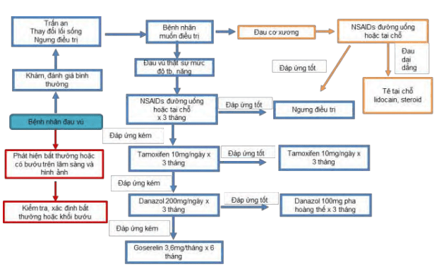
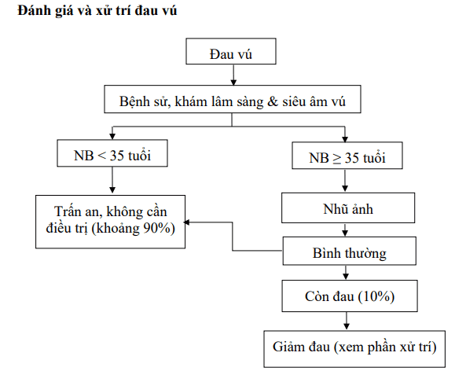

Đau vú (mastalgia) là triệu chứng thường gặp và là nguyên nhất chủ yếu khiến người phụ nữ đến khám vú.

Khoảng 50% phụ nữ đến khám vú là do đau vú. Có khoảng 60-70% phụ nữ từng bị ít nhất 1 lần bị đau vú ở mức độ nhẹ, 10-20% phụ nữ từng trải nghiệm qua đau vú trầm trọng. 2 vấn đề mà người phụ nữ bị đau vú lo lắng nhất là: (1) đau vú là triệu chứng của ung thư vú và (2) đau vú làm ảnh hưởng sinh hoạt, hoạt động tình dục.

## Phân loại đau vú

Đau vú có 3 hình thái khác nhau:

1. Đau vú theo chu kỳ.
2. Đau vú không theo chu kỳ.
3. Đau vú là biểu hiện của bệnh lý ngoài vú.

### Đau vú theo chu kỳ

#### Đặc điểm

Đau vú theo chu kỳ có liên quan đến chu kỳ kinh, thường xảy ra trước khi hành kinh 1-2 tuần, thường xảy ra quanh độ tuổi 30-40.

Đau thường là đau lan toả ở 2 bên, không xác định rõ vị trí. Có trường hợp có thể đau nhiều ở 1 bên vú hơn so với bên vú còn lại. Người phụ nữ than phiền về cảm giác nặng, sưng, đau lan ra nách hoặc cánh tay. Đau vú theo chu kỳ thường khỏi tự nhiên khi bắt đầu ra máu kinh. Đau vú theo chu kỳ có thể tự khỏi sau một số hoàn cảnh đặc biệt như: thai kỳ, mãn kinh. Tuy nhiên, một số trường hợp vẫn tồn tại đau vú sau mãn kinh.

#### Cơ chế

Đau vú theo chu kỳ có thể liên quan đến sự thay đổi nội tiết trong chu kỳ kinh nguyệt.

Có 3 giả thuyết giải thích cơ chế của đau vú theo chu kỳ:

1. Tăng nồng độ estrogen.
2. Thiếu progesterone.
3. Tăng prolactin.

Các nghiên cứu khảo sát nồng độ nội tiết tố không ủng hộ 2 giả thuyết đầu tiên, do người ta tìm thấy rằng nồng độ nội tiết tố là tương tự ở nhóm nghiên cứu và nhóm chứng. Theo chiều hướng khác, một số phụ nữ có triệu chứng đau vú theo chu kỳ thường có nồng độ progesterone thấp hơn nồng độ estrogen trong nửa sau của chu kỳ kinh nguyệt. Nghiên cứu tại cho thấy tình trạng giảm đáng kể nồng độ progesterone trong pha hoàng thể, do đó giả thuyết thiếu progesterone có vẻ phù hợp. Tuy nhiên, nếu cho rằng có đau vú theo chu kỳ có liên quan đến giảm progesterone thì việc đau vú sẽ phải có xu hướng đau như nhau ở cả 2 vú. Trên thực tế, một số trường hợp có đau vú thường nghiêm trọng hơn ở 1 bên ngực, nên việc thay đổi nội tiết tố có thể chưa phải là câu trả lời đầy đủ cho nguyên nhân của đau vú theo chu kỳ. Câu trả lời hợp lý có thể là do mối liên quan kết hợp của hoạt động nội tiết tố và điều gì đó trong vú đáp ứng với hoạt động này. Nồng độ prolactin cao bất thường có thể gây ra đau vú. Stress cũng có thể liên quan đến đau vú theo chu kỳ. Stress gây thay đổi nội tiết tố, có thể dẫn đến tăng đau vú hoặc thay đổi hình thái đau vú.

Một số yếu tố khác cũng có thể là giải thích cho đau vú theo chu kỳ giữ nước theo chu kỳ, chất kích thích. Giữ nước trong cơ thể trong chu kỳ kinh được cho là nguyên nhân gây đau vú. Tuy nhiên, khảo sát so sánh tổng lượng nước trong cơ thể ở phụ nữ bị đau ngực và phụ nữ không triệu chứng không tìm thấy khác biệt đáng kể về mức độ giữ nước giữa ngày kinh thứ 5 và ngày kinh thứ 25 của nhóm nghiên cứu so với nhóm chứng. Người ta cho rằng quá kích các mô tế bào vú có thể có do sự xuất hiện của triphosphate adenosine dưới sự xúc tác của methylxanthine. Tuy nhiên các thử nghiệm lâm sàng ngẫu nhiên về hiệu quả trên đau vú của các chế độ không caffein không cho thấy việc hạn chế caffeine có lợi ích trong giảm triệu chứng đau vú.

### Đau vú không theo chu kỳ

#### Đặc điểm

Đau vú không theo chu kỳ (noncyclical mastalgia) thường gặp nhất 40-50 tuổi, quanh tuổi mãn kinh. Đau vú không theo chu kỳ thường là 1 bên, khu trú ở 1/4 vú. Người phụ nữ thường mô tả cảm giác đau nóng bỏng trong vú.

#### Cơ chế

Đau vú không theo chu kỳ có thể liên quan đến tình trạng chu kỳ kinh nguyệt không đều, các stress tâm lí, hoại tử mô mỡ sau chấn thương, sẹo mổ cũ ở vú, tình trạng viêm ở vú, xoắn dây chằng Cooper, hội chứng Mondor, bệnh lý tuyến vú ở người tiểu đường. Đôi khi đau vú không theo chu kỳ là biểu hiện của bướu hay nang vú, thậm chí là ung thư.

### Đau vú ngoài tuyến vú

Đau vú có thể là biểu hiện của bệnh lý ngoài tuyến vú như viêm sụn sườn (hội chứng Teitze), chấn thương thành ngực, gãy xương sườn, đau thần kinh liên sườn, viêm rễ thần kinh, Herpes zoster, trào ngược dạ dày thực quản, hoặc do thai kỳ, thiếu máu cơ tim, viêm đường mật.

## Chụp nhũ ảnh và siêu âm

Nếu có đau vú, thì chụp nhũ ảnh nên được thực hiện cho phụ nữ từ 35 tuổi trở lên.

Kiểm tra siêu âm là hữu ích nếu khám lâm sàng ghi nhận khối bất thường hoặc nếu khách hàng cho biết đau vú khu trú và không theo chu kỳ kinh nguyệt. Siêu âm toàn bộ vú có thể được thực hiện tùy thuộc vào khả năng chuyên môn. Khách hàng nên được trấn an khi có các tổn thương lành tính trên phim nhũ ảnh và siêu âm mà hoàn toàn không khám thấy khối u trên lâm sàng.

Một số trường hợp có thể xem xét sinh thiết dưới hướng dẫn của siêu âm nếu các tổn thương nghi ngờ có dạng nang hoặc tiết dịch, máu bất thường từ núm vú.

## Điều trị đau vú

Chỉ thực hiện điều trị đau vú khi đau vú ảnh hưởng đến chất lượng sống của người phụ nữ.

Đối với đau vú do nguyên nhân ngoài vú cần điều trị dựa vào nguyên nhân.

Với đau vú không xác định rõ nguyên nhân, việc điều trị còn rất nhiều tranh cãi về tính hiệu quả của điều trị.

### Điều trị đau vú theo chu kỳ

Quyết định điều trị đau vú theo chu kỳ phụ thuộc vào các triệu chứng, mức độ trầm trọng của triệu chứng, tuổi tác và tổng trạng.

Liệu pháp không thuốc như chọn lựa loại áo ngực phù hợp, liệu pháp thư giãn, hoạt động thể dục, bổ sung vitamin E, thoa dầu thảo dược vào buổi tối, chế độ ăn ít chất béo, hạn chế caffein, hạn chế methylxanthine:

- Khắc phục thói quen xấu trong việc chọn kích cỡ áo ngực là biện pháp đầu tiên nên nghĩ đến. Ước tính có khoảng 70% phụ nữ mặc áo ngực không phù hợp với kích cỡ ngực. Việc này được thấy là rất có ý nghĩa trên các phụ nữ có kích cỡ ngực to. Áo ngực thể thao có thể làm giảm đau bằng cách giảm co kéo dây chằng Cooper.
- Liệu pháp thư giãn trong 4 tuần cho thấy giảm triệu chứng đau ngực ở 60% phụ nữ.
- Các thuốc kháng viêm không steroid (NSAIDs) có thể có hiệu quả tới 80% phụ nữ bị đau vú. Diclofenac dạng gel được dùng để thoa tại chỗ các vùng đau ngực bị đau. Diclofenac dạng gel có thể có hiệu quả hơn so với nhóm chứng và gel ibuprofen. Không có tác dụng phụ nào được báo cáo khi dùng NSAIDs tại chỗ.
- Không có bằng chứng thuyết phục cho thấy việc bổ sung các vitamin làm giảm triệu chứng đau ngực. Tuy nhiên, vitamin B1, B6 và E đều được sử dụng theo kinh nghiệm của các bác sĩ lâm sàng. Tuy nhiên khuyến cáo không nên lạm dụng vitamin, vì không phải là vô hại.
- Thử nghiệm cho thấy hiệu quả giảm đau của thoa dầu thảo dược lên vú vào buổi tối. Tuy nhiên, phân tích gộp cho thấy lợi ích giảm đau tương tự như lợi ích của giả dược. Một số bác sĩ vẫn thích sử dụng dầu thảo dược buổi tối để giảm đau ngực.
- Chế độ ăn ít béo được cho là có thể làm giảm nội tiết như prolactin, và do đó được thực hiện trong làm giảm đau vú. Ngoài ra, béo phì có liên quan đến nồng độ cao estrogens ở phụ nữ sau mãn kinh. Về mặt lý thuyết, việc giảm trọng lượng cơ thể ở những người béo phì có thể làm giảm khả năng bị đau vú. Tuy nhiên, thiếu bằng chứng trực tiếp để chứng minh cho giả thuyết này. Cần có thêm nghiên cứu để đánh giá vấn đề này.
- Caffeine thường được xem như là yếu tố có liên quan đến đau vú. Mặc dù mối liên quan giữa caffeine và đau vú đã được chứng minh, nhưng các tác giả tìm thấy việc loại bỏ chất methylxanthine (chất có trong trà, cà phê, Coca và chocolate) đưa đến các kết quả với các bằng chứng trái ngược nhau.
- Tập thể dục cũng làm giảm nồng độ estrogen và điều này cũng có thể là thay đổi lối sống. Tuy nhiên, chưa có đủ bằng chứng trực tiếp cho thấy việc tập thể dục như là điều trị cho đau vú.

### Điều trị đau vú bằng các nội tiết tố

Do nguy cơ tác dụng phụ, thuốc nội tiết tố chỉ nên được sử dụng trong khoảng thời gian từ 2 đến 6 tháng.

#### COCs

Đáp ứng đau vú với điều trị bằng COCs rất thay đổi ở những phụ nữ khác nhau. Một số phụ nữ có thể bị đau vú khi bắt đầu COCs. Một số khác có thể cảm thấy giảm triệu chứng đau vú với COCs. Các nghiên cứu về COCs liều thấp (20 μg EE) đã không phát hiện thấy triệu chứng đau vú tăng so với giả dược.

#### Progestogen

Progestogen dùng tại chỗ, uống và tiêm để điều trị đau vú cũng cho các kết quả khác nhau. Các progestogen uống, lynestrenol và promegestone được dùng trong giai đoạn hoàng thể đưa đến cải thiện đáng kể đau vú ở 66-80% phụ nữ.

#### Tamoxifen

Tamoxifen với liều 10mg mỗi ngày làm giảm từ 70-90% phụ nữ bị đau vú theo chu kỳ và 56% trường hợp đau vú không theo chu kỳ. Tái phát đau vú là 50% sau khi ngưng điều trị. Tamoxifen chưa được cấp phép là thuốc đều trị đau vú. Việc điều trị Tamoxifen liều thấp trong 3 tháng đi kèm một số tác dụng phụ, bao gồm rối loạn kinh nguyệt và nóng bừng mặt. Tamoxifen dùng trong trường hợp này nhằm điều trị đau vú, không phải là điều trị ung thư vú. Các nghiên cứu trên bệnh nhân ung thư vú điều trị bằng Tamoxifen cho thấy có tăng nguy cơ ung thư nội mạc tử cung sau đó 5 năm. Do vậy, việc điều trị đau vú bằng Tamoxifen không được kéo dài hơn 6 tháng.

#### Danazol

Danazol là dẫn xuất testosterone, có tính đối kháng gonadotropin, và có tác dụng androgenic nhẹ. Danazol gắn kết với các thụ thể progesterone và androgen. Cơ chế điều trị đau vú của Danazol chưa được rõ, nhưng Danazol làm giảm triệu chứng ở 70% phụ nữ đau vú theo chu kỳ và 31% trường hợp đau vú không theo chu kỳ. Tỷ lệ tái phát là 50% sau khi ngưng điều trị.

Danazol là liệu pháp với nhiều tác dụng phụ, đặc biệt liên quan đến nam hóa. Các tác dụng phụ thường gặp với Danazol là mọc tóc, rậm lông, mụn trứng cá, tăng cân và rối loạn kinh nguyệt. Thay đổi âm vực của giọng nói xảy ra sau Danazol có thể không hồi phục, nên cần phải rất cân nhắc khi quyết định sử dụng liệu pháp này cho đau vú. Danazol có thể gây trầm cảm, làm giảm hiệu quả của thuốc viên ngừa thai kết hợp. Người dùng cần phải được tư vấn dùng thêm bao cao su để tránh thai. Danazol có thể gây quái thai. Do tác dụng phụ, nên Danazol chỉ dùng cho các trường hợp đau vú nặng, thất bại sau 3-6 tháng điều trị với Tamoxifen.

Danazol với liều 200mg hàng ngày là thuốc duy nhất được FDA công nhận trong điều trị đau vú. Điều trị thường 3-6 tháng rồi giảm liều sau đó ngưng điều trị. Tuy nhiên, tại Ấn Độ, liều khởi đầu 50mg mỗi ngày 1 lần và sau đó tăng lên 50mg 2 lần mỗi ngày nếu không đáp ứng điều trị. Khi có đáp ứng, duy trì liều trong ít nhất 3 tháng; tại các nước phương tây, khuyến cáo liều duy trì là 100mg mỗi ngày. Các nghiên cứu gần đây, cho thấy Danazol có hiệu quả trong điều trị đau vú khi được dùng sử dụng trong pha hoàng thể (ngày 12 đến ngày 28 của chu kỳ kinh).

#### Bromocriptine

Bromocriptine là chất đồng vận dopamine. Bromocriptine và kích thích thụ thể dopaminergic ở thuỳ trước tuyến yên và ngăn chặn sự giải phóng prolactin.

Liều 5mg ngày giúp 47-88% phụ nữ giảm đau vú đáng kể. Bromocriptine làm giảm điểm số đau vú trung bình 16.31 so với nhóm dùng giả dược. Bromocriptine gây ra tác dụng phụ nghiêm trọng, phổ biến nhất là buồn nôn, nôn và chóng mặt. Chính các tác dụng phụ này thường khiến khách hàng ngưng sử dụng thuốc.

_Điều trị đau vú theo phác đồ Cardiff, 2009._

### Phẫu thuật

Phẫu thuật có thể có lợi ở những bệnh nhân điểm đau cụ thể. Ở những người này, triệu chứng đau có thể được giảm bớt bằng cách cắt bỏ các vùng bị đau.

Đối với chứng đau vú lan toả, không khuyến cáo phẫu thuật cắt bỏ vú4. Nếu bệnh nhân đề nghị phẫu thuật cắt bỏ vú để tái tạo, cần đánh giá tâm lý của khách hàng cẩn thận trước khi đồng ý phẫu thuật. Khách hàng cần được thông báo về các biến chứng có thể có của phẫu thuật tạo hình và cảnh báo rằng trong 50% trường hợp đau vú của họ sẽ không được cải thiện sau phẫu thuật.

## Phác đồ đánh giá và xử trí

_Đánh giá và xử trí đau vú Bệnh viện Từ Dũ._

## Nguồn tham khảo

- Trường Đại học Y Dược TP. HCM (2020) – _Team-based learning_
- Bệnh viện Từ Dũ (2022) – _Phác đồ điều trị Sản phụ khoa_
