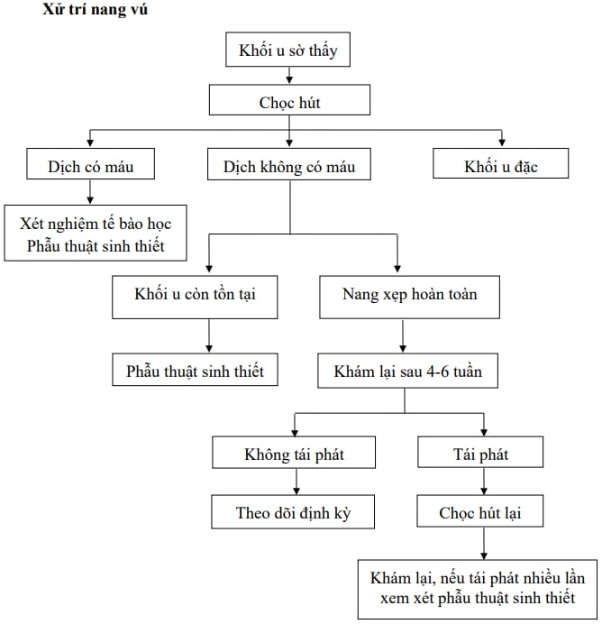
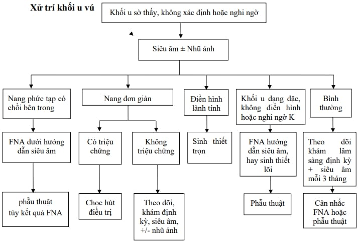

U vú có thể lành tính.

## Chẩn đoán

Ghi nhận các nguy cơ ung thư vú: Tuổi, tiền sử ung thư vú trong gia đình, tiền sử cá nhân bị ung thư vú, sinh thiết có tăng sản không điển hình; tiền căn phẫu thuật tuyến vú.

Lâm sàng: kích thước, vị trí (so với núm vú), di động, mật độ căng chắc, trơn láng, bờ rõ, dạng đặc hay dạng nang.

Cận lâm sàng: Siêu âm và nhũ ảnh: BIRADS II và III.

## Phác đồ xử trí

_Xử trí nang vú Bệnh viện Từ Dũ._

_Xử trí u vú Bệnh viện Từ Dũ._

## Nguồn tham khảo

- Trường Đại học Y Dược Thành phố Hồ Chí Minh (2020) - _TEAM-BASED LEARNING._
- Bệnh viện Từ Dũ (2022) - _PHÁC ĐỒ ĐIỀU TRỊ SẢN PHỤ KHOA._
