Ung thư vú là bệnh lý ác tính thường gặp nhất ở phụ nữ, chiếm 18% ung thư ở phụ nữ, và là nguyên nhân gây tử vong hàng đầu ở phụ nữ trong độ tuổi từ 40-50.

## Tầm soát ung thư vú

Khả năng sống còn sau 5 năm của ung thư vú tùy thuộc vào giai đoạn ung thư lúc phẫu thuật. Vì thế, tầm soát ung thư vú đóng vai trò quan trọng trong phát hiện và điều trị sớm ung thư vú. Khả năng này là 98% nếu ung thư vú được phát hiện ở giai đoạn sớm, còn khu trú ở vú và điều trị bằng phẫu thuật kèm nạo hạch. 89% trường hợp u ≤1cm điều trị bằng đoạn nhũ và nạo hạch không phát hiện di căn sau 18 năm.
Khả năng sống còn sau 5 năm của ung thư vú tùy thuộc vào giai đoạn ung thư lúc phẫu thuật. Vì thế, tầm soát ung thư vú đóng vai trò quan trọng trong phát hiện và điều trị sớm ung thư vú. Khả năng này là 98% nếu ung thư vú được phát hiện ở giai đoạn sớm, còn khu trú ở vú và điều trị bằng phẫu thuật kèm nạo hạch. 89% trường hợp u ≤1cm điều trị bằng đoạn nhũ và nạo hạch không phát hiện di căn sau 18 năm.

### Công cụ tầm soát

Công cụ tầm soát ung thư vú gồm 2 phương tiện:

1. Nhũ ảnh.
2. Cộng hưởng từ vú.

Tự khám vú không được Hiệp hội Ung thư Hoa Kỳ xem như biện pháp tầm soát ung thư, nhưng hội vẫn khuyến cáo mọi phụ nữ ≥20 tuổi nên thực hiện tự khám vú. Khoảng 1/2 số ung thư vú được phát hiện qua tự khám vú.
Tự khám vú không được Hiệp hội Ung thư Hoa Kỳ xem như biện pháp tầm soát ung thư, nhưng hội vẫn khuyến cáo mọi phụ nữ ≥20 tuổi nên thực hiện tự khám vú. Khoảng 1/2 số ung thư vú được phát hiện qua tự khám vú.

Siêu âm không được xem là biện pháp hình ảnh thích hợp cho tầm soát ung thư vú.

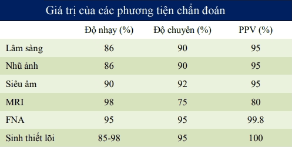
_Giá trị của các phương tiện chẩn đoán._

### Khám vú

Theo ACOG 2017, có khoảng 50% trường hợp ung thư vú ở phụ nữ từ 50 tuổi trở lên và 71% trường hợp ung thư vú ở phụ nữ dưới 50 tuổi được phát hiện bởi chính phụ nữ.

Phụ nữ nên được giáo dục về các dấu hiệu và triệu chứng của ung thư vú. Họ cần thông báo cho bác sĩ phụ khoa ngay khi họ nhận thấy sự thay đổi như đau vú, khối ở vú, thay đổi màu sắc (đỏ), tiết dịch bất thường.

Đơn vị phòng dịch ngừa dịch bệnh Hoa Kỳ vẫn khuyến cáo khám vú mỗi 1-3 năm cho các đối tượng nguy cơ bình quân từ 25-39 tuổi, và mỗi năm cho phụ nữ từ 40 tuổi trở lên.

Thời điểm thực hiện tự nhận thức về vú cũng như là khám vú tốt nhất là ngày thứ 8 của chu kỳ. Lúc này, mô vú ít bị ảnh hưởng của estrogen, kích thước vú là nhỏ nhất, mật độ vú không dầy nên dễ phân biệt.

Quan sát ở nhiều tư thế nhằm bộc lộ các bất thường:

- 2 tay để sau gáy.
- 2 tay chống trên hông.
- 2 tay buông xuôi theo thân.

Mục đích của quan sát là cảm nhận hình dạng, kích thước, sự cân đối của vú, cũng như các thay đổi trên da vú (ửng đỏ, co kéo, loét, thụt núm vú).

Nếu như tự quan sát, thì tốt nhất là đứng trước gương. Tự sờ nắn: được thực hiện lúc tắm, khi nằm thư giãn. Lần lượt khám mỗi 1/4 vú, hạch đòn và hạch nách.

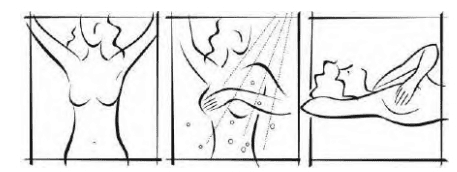
_Tự quan sát trước gương và tự sờ nắn khi tắm và khi nằm._

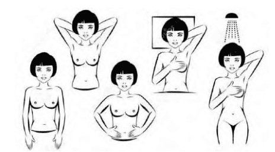
_Các tư thế tự quan sát trước gương và các tư thế để tự sờ nắn._

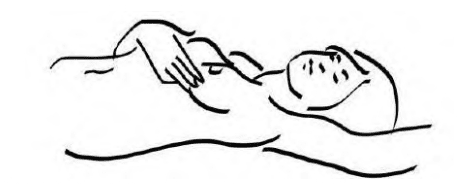
_Khám vú bằng cách dùng 3 ngón giữa của 2 bàn tay. Khi tự sờ nắn, bàn tay để sau gáy sẽ giúp cảm nhận được tốt hơn._

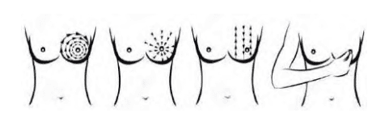
_Lộ trình của các ngón tay khi tự khám vú._

Các dấu hiệu bất thường có thể nhận thấy khi tự khám vú buộc người phụ nữ phải gặp bác sĩ gồm:

- Khối u: Khối u ở vú phát hiện được có thể là (1) khối u mới, đơn độc hoặc (2) khối u mới xuất hiện ở vùng mô lổn nhổn trước đó. Đôi khi, không hẳn là cảm nhận khối u mà là cảm nhận vùng mô lổn nhổn, không đối xứng ở phụ nữ tiền mãn kinh hay đã mãn kinh. Tình trạng viêm hay áp-xe vú không đáp ứng với điều trị cũng là triệu chứng buộc người phụ nữ phải đi khám để không bỏ sót ác tính ẩn mình phía sau biểu hiện bên ngoài là áp-xe hay viêm.
- Phì đại hạch nách hay hạch đòn: Mọi hạch nách phì đại mới phát hiện cần được đánh giá cẩn thận, vì có thể là hình ảnh của di căn đến từ vú.
- Đau: Cần mô tả tính chất đau, vị trí, mức độ đau, tính chu kỳ. Đau vú (1) có hay không kèm theo khối u, (2) các trường hợp đau vú nhiều, ảnh hưởng đến chức lượng cuộc sống của người bệnh, (3) đau vú liên tục không có tính chu kỳ, (4) đau vú không đáp ứng với giảm đau hay các progesterone điều trị đau căng vú (mastodynia), (5) đau chỉ khu trú ở 1 bên vú, (6) đau vú ở phụ nữ đã mãn kinh đều là triệu chứng cần chú ý.
- Tiết dịch núm vú: Nên ấn quầng vú và núm vú để tìm tiết dịch bất thường. Cần nhận định tiết dịch là 1 hay 2 bên, màu và độ quánh của dịch. Các tiết dịch có thể là nghiêm trọng gồm (1) tiết dịch ở phụ nữ ≥50 tuổi, (2) tiết dịch 1 bên ở phụ nữ <50 tuổi, (3) tiết dịch lẫn máu, (4) tiết dịch kèm co rút hay biến dạng núm vú...
- Tiết dịch núm vú: Nên ấn quầng vú và núm vú để tìm tiết dịch bất thường. Cần nhận định tiết dịch là 1 hay 2 bên, màu và độ quánh của dịch. Các tiết dịch có thể là nghiêm trọng gồm (1) tiết dịch ở phụ nữ ≥50 tuổi, (2) tiết dịch 1 bên ở phụ nữ <50 tuổi, (3) tiết dịch lẫn máu, (4) tiết dịch kèm co rút hay biến dạng núm vú...

### Hình ảnh học tầm soát ung thư vú

Nhũ ảnh là phương tiện tầm soát đầu tay cho mọi phụ nữ với nguy cơ bình quân (average risk) của ung thư vú.

Nhũ ảnh là phương tiện tầm soát có giá trị. Khi thực hiện tầm soát bằng nhũ ảnh cho đối tượng nguy cơ bình quân, nhũ ảnh thường quy sẽ:

- Làm giảm được 16-35% tử vong do ung thư vú ở phụ nữ ≥50 tuổi.
- Làm giảm được 15-20% tử vong do ung thư vú ở phụ nữ ≥40-49 tuổi. Lý do của hiện tượng nhũ ảnh có hiệu quả giảm tử suất do ung thư vú kém hơn ở tuổi trẻ so với tuổi lớn là do tần suất mắc thấp hơn của ung thư vú ở lứa tuổi này, do các khối u thường phát triển nhanh hơn và đậm độ mô vú dầy làm giảm giá trị của nhũ ảnh.
- Làm giảm được 16-35% tử vong do ung thư vú ở phụ nữ ≥50 tuổi.
- Làm giảm được 15-20% tử vong do ung thư vú ở phụ nữ ≥40-49 tuổi. Lý do của hiện tượng nhũ ảnh có hiệu quả giảm tử suất do ung thư vú kém hơn ở tuổi trẻ so với tuổi lớn là do tần suất mắc thấp hơn của ung thư vú ở lứa tuổi này, do các khối u thường phát triển nhanh hơn và đậm độ mô vú dầy làm giảm giá trị của nhũ ảnh.

Việc xử lý kết quả tầm soát có thể dựa trên gợi ý của hệ thống BI-RADS (Breast Imaging-Reporting and Data System):

- BI-RADS 0 thể hiện rằng đã có vài điểm bất thường được nhìn thấy trên nhũ ảnh, tuy nhiên không rõ ràng để cho kết luận. Cần phải thực hiện thêm các khảo sát chuyên biệt như ép điểm khi thực hiện nhũ ảnh (spot compression), phóng đại mạnh hơn, hay siêu âm... Cần phải xem lại các phim nhũ ảnh đã có trước đó và so sánh với hình ảnh hiện có, để phát hiện thay đổi của hình ảnh qua các phim.
- BI-RADS 1 thể hiện rằng không có hình ảnh bất thường phải báo cáo. Vú cân đối, không khối u, không bất thường về cấu trúc, không có đóng vôi bất thường. Thuật ngữ "kết quả âm tính" có nghĩa là âm tính với ung thư.
- BI-RADS 2 cũng là báo cáo kết quả âm tính với ung thư trên nhũ ảnh. Tuy nhiên, ở đây có các tổn thương lành tính như đóng vôi lành tính, hình ảnh các hạch không ung thư hay bướu sợi-tuyến tuyến vú.
- BI-RADS 3 thể hiện rằng đặc điểm hình ảnh trên nhũ ảnh rất có khả năng (98%) có liên quan đến tổn thương lành tính. Tuy nhiên, không có xác nhận lành tính. Các tổn thương BI-RADS 3 phải được xem xét theo thời gian. BI-RADS 3 phải được theo dõi mỗi 6 tháng, tập trung quan sát sự thay đổi của tổn thương. Việc theo dõi tổn thương BI-RADS 3 chỉ ngừng lại khi đã xác nhận rằng tổn thương là ổn định, không thay đổi sau khoảng thời gian theo dõi ít nhất là 2 năm. Ý nghĩa của việc theo dõi này là hạn chế các sinh thiết không thật sự cần thiết.
- BI-RADS 4 có thể là tổn thương ung thư, cũng có thể là không phải ung thư, nhưng lại nhìn giống ung thư. Trong trường hợp này, các biện pháp quyết liệt hơn như là sinh thiết là cần thiết.
- BI-RADS 5 là tổn thương có khả năng rất cao, lên đến trên 95% là ung thư. Bắt buộc phải sinh thiết.
- BI-RADS 6 là loại chỉ được dùng cho các nhũ ảnh đã được xác định là ung thư qua sinh thiết trước đó. Trong trường hợp này, nhũ ảnh là biện pháp theo dõi điều trị.

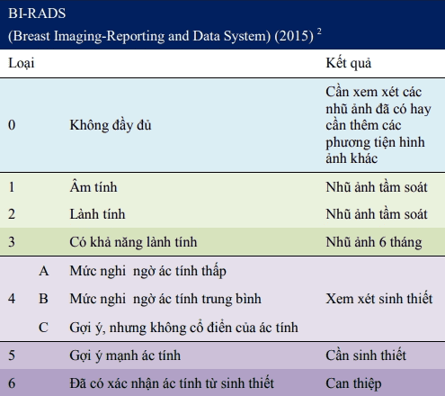
_BI-RADS được xây dựng bởi nhiều Hiệp hội khác nhau như ACS, ACOG và Hiệp hội Quang tuyến (Radiology) Hoa kỳ. Tuy nhiên, đứng tên bản quyền là của Hiệp hội Quang tuyến Hoa kỳ. $^2$ Các phiên bản trước đây của BI-RADS không chia loại 4 ra 3 mức A, B, C. Loại 6 cũng mới được đưa vào phiên bản BI-RADS 2015._

### Giải phẫu bệnh

#### Sinh thiết lõi

Sinh thiết lõi dưới hướng dẫn của khảo sát hình ảnh là tiêu chuẩn chẩn đoán mô học. Sinh thiết lõi dùng kim rỗng hút mô từ tổn thương vú, thực hiện dưới hướng dẫn nhũ ảnh hoặc siêu âm khi u không sờ thấy, hoặc trực tiếp khi u sờ thấy. So với FNA, sinh thiết lõi lấy được nhiều mô hơn. Sinh thiết lõi cho phép có được bằng chứng mô học và đồng thời đánh giá ER, PR, Her trước khi có quyết định điều trị. Có thể dùng kim Titanium đánh dấu vị trí sinh thiết để hướng dẫn phẫu thuật sau sinh thiết.

#### Chọc hút kim nhỏ (FNA)

Chọc hút kim nhỏ (FNA) dùng kim nhỏ 20G hoặc 22G lấy mẫu mô từ vùng vú bất thường. FNA có độ chính xác cao, âm tính giả 10-15%, dương tính giả dưới 1%. FNA được dùng để xác định chẩn đoán khi khám vú hoặc hình ảnh học dương tính, tuy nhiên nếu FNA âm tính không loại trừ được u ác tính, cần sinh thiết
lõi hoặc sinh thiết trọn khối u. FNA còn gặp hạn chế trong việc chọc hút hạch lympho nghi ngờ ác tính hoặc nang có triệu chứng.

#### Sinh thiết trọn khối u

Sinh thiết trọn khối u, cắt bỏ toàn bộ sang thương vú được thực hiện khi chọc hút bằng kim nhỏ hay sinh thiết lõi không thực hiện được hoặc kết quả âm tính, không rõ ràng hoặc trái ngược với dấu hiệu lâm sàng.

### Lịch tầm soát

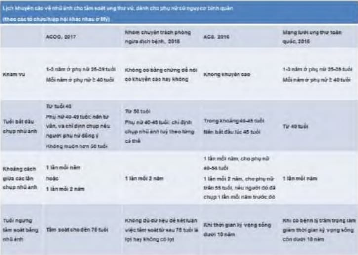
_Lịch tầm soát ung thư vú bằng nhũ ảnh cho phụ nữ với nguy cơ bình quân, theo các tổ chức/hiệp hội khác nhau tại Hoa Kỳ._

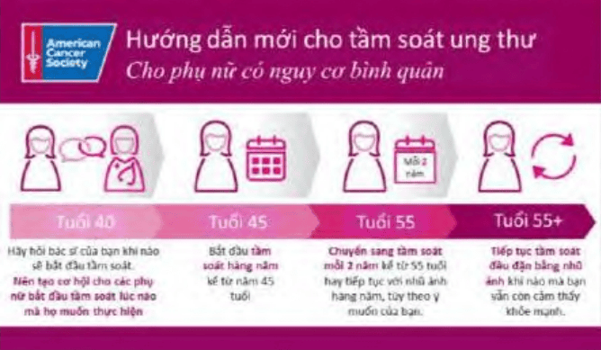
_Lịch tầm soát ung thư vú cho phụ nữ với nguy cơ trung bình, theo khuyến cáo của Hiệp hội Ung thư Hoa kỳ (2015). Tầm soát dựa trên nhũ ảnh. Ở tuổi 40, người phụ nữ với nguy cơ trung bình có thể bắt đầu chương trình tầm soát nếu như họ muốn. Tuổi 45 là lứa tuổi bắt buộc của tầm soát nhữ ảnh hàng năm, và kéo dài cho đến năm 55 tuổi. Sau 55 tuổi, việc tầm soát nhũ ảnh bắt buộc sẽ chuyển sang được thực hiện 1 lần cho mỗi 2 năm. Việc tầm soát được tiếp tục cho đến khi nào người phụ nữ còn cảm nhận rằng mình vẫn khỏe mạnh._

Khi thực hiện nhũ ảnh thường quy tầm soát ung thư vú ở mọi phụ nữ trong độ tuổi 40-49 tuổi, sẽ có ít nhất 1 lần dương tính giả. Nhũ ảnh thường quy đơn thuần không được chỉ định ở
những đối tượng có nguy cơ cao theo mô hình Claus, và các đối tượng có nguy cơ cao đặc biệt khác.

Dù rằng MRI có độ nhạy rất cao, nhưng vẫn có khả năng bỏ sót tổn thương. MRI phải được thực hiện kèm theo chứ không phải là thay cho nhũ ảnh ở các đối tượng có nguy cơ cao ung thư vú.

Đối với các đối tượng nguy cao đặc biệt của ung thư vú, không thực hiện tầm soát bằng nhũ ảnh đơn thuần. Ở các đối tượng này, việc tầm soát phải được thực hiện bằng cộng hưởng từ (MRI) và nhũ ảnh hàng năm.

_Lịch tầm soát ung thư vú bằng các phương tiện khác nhau cho phụ nữ với nguy cơ cao, theo các tổ chức/hiệp hội khác nhau tại Hoa Kỳ._

Các phụ nữ sau được xếp vào nhóm có nguy cơ cao của ung thư vú và cần được thực hiện tầm soát hàng năm bằng MRI phối hợp với nhũ ảnh:

- Có lifetime risk theo tiền sử bị ung thư vú 20-25% hoặc cao hơn.
- Có đột biến gene BRCA.
- Chưa được khảo sát đột biến BRCA nhưng có người thân trực hệ (cha mẹ, anh, chị, em hay con) có mang đột biến gene BRCA1 hay BRCA2.
- Từng bị chiếu xạ vùng ngực trong độ tuổi 10-30 tuổi.
- Mắc hội chứng Li-Fraumeni (1 ung thư hiếm, di truyền theo kiểu gen trội trên nhiễm sắc thể thường; đặc trưng bởi sarcoma, vú, bệnh bạch cầu và tuyến thượng thận; liên quan đến đột biến của gene p53 ức chế khối u), hội chứng Cowden (hội chứng đa hamartoma là bệnh hiếm, đặc trưng bởi các tình trạng giống khối u không ung thư gọi là hamartoma; là bệnh di truyền theo gene trội trên nhiễm sắc thể thường, liên quan đến gene PTEN, là gene ức chế khối u), hay hội chứng Bannayan-Riley-Ruvalcaba (1 bệnh di truyền gene trội trên nhiễm sắc thể thường và cũng có liên quan đến đột biến gene PTEN.), hay có người thân trực hệ có 1 trong các hội chứng này.

Do chưa đủ bằng chứng cho dân số có nguy cơ cao ung thư vú, nên ACS đề nghị thực hiện tầm soát phối hợp trên kể từ năm 30 tuổi, với sự đồng thuận của bệnh nhân, cho hầu hết các trường hợp nguy cơ cao. Phụ nữ có tiền căn chiếu xạ ngực lúc 10-30 tuổi cần được thực hiện tầm soát kép nhũ ảnh-MRI hàng năm, bắt đầu từ 8-10 năm kể từ khi bị chiếu xạ hoặc bắt đầu lúc 25 tuổi.

Không đủ bằng chứng về hiệu quả của việc thực hiện đơn thuần MRI hàng năm ở phụ nữ có tiền căn ung thư vú (cùng hay đối bên), sinh thiết vú với kết quả nguy cơ cao như tăng sinh ống không điển hình (atypical ductal hyperplasia) (ADH), carcinoma tại chỗ tiểu thùy (lobular carcinoma in situ) (LCIS), carcinoma ống tại chỗ (ductal carcinoma in situ) (DCIS). Các bệnh nhân có nguy cơ đặc biệt cao này phải được theo dõi bằng phối hợp nhũ ảnh-MRI, có hay không kèm theo các biện pháp hỗ trợ khác.

## Ung thư vú

### Yếu tố nguy cơ

Các yếu tố nguy cơ của ung thư vú:

- Tiền sử gia đình: ung thư vú, ung thư buồng trứng hoặc các loại ung thư có nguồn gốc từ tế bào mầm (ung thư tiền liệt tuyến, ung thư tụy). 20-30% số trường hợp ung thư vú được phát hiện có yếu tố tiền căn gia đình bị ung thư vú.
- Xác định có đột biến gen. Đột biến thường gặp nhất là đột biến ở gene BRCA1 và hoặc gene BRCA2. Người mang gene đột biến BRCA có nguy cơ ung thư vú tăng 4% mỗi năm, nguy cơ mắc ung thư vú 35-85% và nguy cơ mắc ung thư vú đối bên 65%. Đột biến gene BRCA1 còn liên quan đến ung thư buồng trứng và ung thư tiền liệt tuyến. Đột biến gene BRCA2 liên quan đến ung thư vú nam giới và ung thư tiền liệt tuyến. Các đối tượng rơi vào trong 1 trong các trường hợp sau nên được thực hiện khảo sát đột biến gene BRCA:
  - Bệnh nhân có ≥3 người thân được chẩn đoán ung thư vú hoặc ung thư buồng trứng, trong đó có người dưới<50 tuổi.
  - 2 người thân thế hệ 1 hoặc 2 bị ung thư vú hoặc ung thư buồng trứng.
  - Có người thân bị ung thư vú nam giới.
  - Bệnh nhân được chẩn đoán ung thư trước 50 tuổi.
  - Người thân bị ung thư vú và ung thư buồng trứng nên xét nghiệm BRCA.
- Kết quả giải phẫu bệnh bất thường.
  - Tăng sản không điển hình (tiểu thuỳ/ống dẫn sữa).
  - Ung thư tiểu thuỳ tại chỗ.
- Dậy thì sớm. Mãn kinh muộn. Dậy sớm và mãn kinh muộn làm tăng nguy cơ ung thư vú khi chúng kéo dài thời gian tiếp xúc với estrogen và progesterone. Phụ nữ dậy thì sớm trước 11 tuổi hoặc mãn kinh trễ sau 55 tuổi có nguy cơ ung thư vú tăng hơn 2-3 lần.
- Chưa từng sinh con. Phụ nữ chưa từng sinh con và phụ nữ có giai đoạn sinh sản dài có liên quan với tăng nguy cơ dương tính với thụ thể nội tiết.
- Lớn tuổi khi sinh con đầu tiên. Tuổi lúc mang thai đầu tiên ảnh hưởng đến nguy cơ tương đối của ung thư vú do tình trạng thai kỳ làm biến đổi các tế bào nhu mô vú sang trạng thái ổn định hơn, làm giảm tăng sinh trong nửa sau của chu kỳ kinh nguyệt. Kết quả là, thai kỳ đầu tiên mang lại 1 số bảo vệ. Phụ nữ có con đầu tiên sau 30 tuổi có nguy cơ cao gấp đôi phụ nữ sinh đứa con đầu lòng dưới 20 tuổi. sinh con muộn sau 35 tuổi có nguy cơ ung thư vú tăng hơn 3 lần.
- Điều trị nột tiết tố gồm estrogen phối hợp với progestin. Yếu tố nguy cơ của ung thư vú là nguy cơ dương tính với thụ thể nội tiết (hormone receptor-positive breast cancer). Điều trị liệu pháp nội tiết tố kết hợp lâu dài (hơn 5 năm) sau khi mãn kinh có liên quan với sự gia tăng đáng kể nguy cơ ung thư vú. Tuy nhiên, các phương pháp điều trị ngắn hạn hơn vẫn có thể liên quan với người có tiền sử gia đình. Nghiên cứu thử nghiệm lâm sàng có nhóm chứng, phụ nữ mãn kinh sử dụng phối hợp estrogen và progestin có nguy cơ bị ung thư vú cao hơn so với phụ nữ mãn kinh đã cắt tử cung và chỉ dùng estrogen đơn thuần. Có sự gia tăng 24% nguy cơ ung thư vú cả trong thời gian sử dụng thuốc ngừa thai dạng viên kết hợp và kéo dài đến 10 năm sau khi ngưng.
- Không cho con bú mẹ. Sinh con nhiều lần và cho con bú mẹ có liên quan đến việc giảm nguy cơ dương tính thụ thể nội tiết, đồng thời âm tính với 3 nhóm thụ thể estrogen, progesterone và ERBB2 (HER2/Neu).
- Phụ nữ lớn tuổi. Chỉ 1% ung thư vú xảy ra ở phụ nữ dưới 25 tuổi. Sau 30 tuổi, tỷ lệ ung thư vú tăng đột ngột. Nguy cơ ung thư vú tăng gấp đôi sau mỗi 10 năm tuổi.
- Chủng tộc (phụ nữ Do Thái Askenazi có nguy cơ cao bị đột biến BRCA).
- Chỉ số khối cơ thể lớn. Uống rượu. Thuốc lá.
- Mật độ mô vú dày trên nhũ ảnh. Phụ nữ có tiền căn bệnh lý vú có nguy cơ mắc ung thư vú ở vú đối bên dưới lâm sàng là 50% và là 20-30% với ung thư vú lâm sàng.
- Tiếp xúc với tia xạ cường độ cao lúc trẻ (10-30 tuổi). Phụ nữ được điều trị ung thư hạch Hodgkin bằng liệu pháp xạ trị ngực ở tuổi từ 10 đến 30 (và có thể là muộn nhất là 45 tuổi) có nguy cơ gia tăng ung thư vú. Các bé gái từ 10 – 14 tuổi được điều trị dường như có nhiều nguy cơ bị ung thư vú trong tương lai.

### Đặc điểm bệnh học

Tổn thương bệnh học của ung thư vú được xếp theo:

- Mức độ biệt hóa. Có 3 mức độ biệt hóa:
  - Độ 1 có mức biệt hóa tốt.
  - Độ 2 có mức biệt hóa trung bình.
  - Độ 3 có mức biệt hóa kém.
- Dạng ung thư vú. Có 2 dạng ung thư thường gặp là:
  - Ung thư ống xâm lấn.
  - Ung thư tiểu thùy xâm lấn.
- Các chỉ báo. Các chỉ báo thường dùng gồm:
  - Steroid receptor ER và PR. Được phân ra dương tính hay âm tính với thụ thể steroid.
  - Her/neu (HER2). HER2 (viết tắt của Her/neu) cũng được báo cáo theo kiểu dương tính hay âm tính. Ung thư với HER2 dương tính có nhiều HER2 hơn. Ung thư với HER2 dương tính có xu hướng phát triển nhanh.

Tốc độ phát triển của ung thư vú thay đổi tùy cá nhân, đặc điểm và giai đoạn. Tốc độ nhân đôi thay đổi từ vài tuần đến vài tháng. Thời gian tiềm ẩn dưới lâm sàng của ung thư vú thường dài, tạo cơ hội cho tầm soát phát hiện và được điều trị sớm, trước khi có biểu hiện lâm sàng.

Ung thư vú có khuynh hướng xâm lấn và di căn sớm. Ung thư vú có thể cho di căn đến tất cả các cơ quan, thường nhất là di căn xương, phổi, gan.

### Phân chia giai đoạn

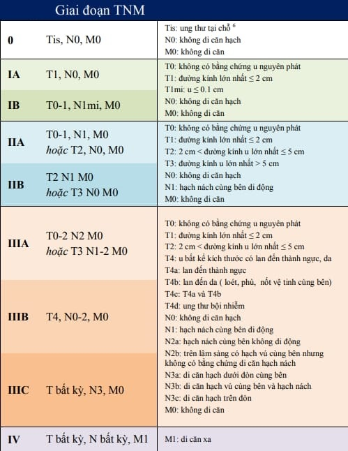

### Điều trị

#### Đánh giá trước phẫu thuật

Đánh giá trước phẫu thuật được căn cứ trên kết quả của nhũ ảnh 2 bên, kết quả sinh thiết lõi (hay sinh thiết), X-quang ngực, huyết đồ, sinh hóa máu.

Kết quả sinh thiết lõi có ý nghĩa xác nhận ung thư, đồng thời cho biết định hướng điều trị trước phẫu thuật nếu cần. CT scan, MRI, xạ hình xương không cần thiết trừ khi có triệu chứng hoặc bất thường sinh hóa máu.

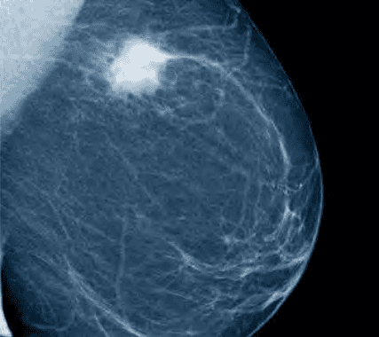
_Hình ảnh ung thư vú trên nhũ ảnh._

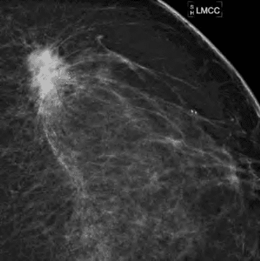
_Hình ảnh ung thư vú trên nhũ ảnh, kèm đóng vôi vi thể._

Phẫu thuật trước tiên nếu thỏa các yếu tố:

1. U nhỏ.
2. Lâm sàng không phát hiện hạch.
3. Không có bằng chứng di căn xa.

Nếu lâm sàng nghi ngờ là ung thư giai đoạn II hay có hạch, thì cần chuẩn bị thêm xạ hình xương, CT scan bụng. PET scan được chỉ định thêm nếu lâm sàng nghi ngờ ở giai đoạn III hoặc IV.

Các phẫu thuật gồm có:

- Phẫu thuật bảo tồn vú.
- Phẫu thuật đoạn nhũ.

#### Phẫu thuật bảo tồn vú

Phẫu thuật bảo tồn vú cắt bỏ khối u và thêm 1cm mô vú bình thường xung quanh.

Phẫu thuật bảo tồn vú được chỉ định trong sang thương đơn độc trên nhũ ảnh và lâm sàng, u ≤4cm hoặc >4cm trên vú lớn, không di căn hạch và di căn xa.
Phẫu thuật bảo tồn vú được chỉ định trong sang thương đơn độc trên nhũ ảnh và lâm sàng, u ≤4cm hoặc >4cm trên vú lớn, không di căn hạch và di căn xa.

Sau phẫu thuật bảo tồn vú, các yếu tố tiên lượng tái phát tại chỗ gồm:

- Dương tính ở bờ phẫu thuật.
- Tuổi trẻ hơn 35 tuổi.
- Xâm lấn mạch máu và bạch huyết.
- Mô học grade II và III.
- Thành phần dư thừa tại chỗ.

Không có sự khác biệt đáng kể về tiên lượng sống còn sau 20 năm và tái phát tại chỗ giữa 2 phương pháp phẫu thuật đoạn nhũ và phẫu thuật bảo tồn vú.

#### Phẫu thuật đoạn nhũ

Phẫu thuật đoạn nhũ tận gốc (phẫu thuật Halsted) căt bỏ toàn bộ vú, cơ ngực bên dưới và nạo hạch nách toàn bộ. Do tử suất của phẫu thuật Halsted rất cao, nhiều di chứng nặng nề nên ngày nay, người ta không còn thực hiện phẫu thuật đoạn nhũ tận gốc nữa, ngoại trừ trường hợp khối u đã xâm lấn rộng vào cơ ngực.

Hiện nay, người ta thực hiện các biến thể của phẫu thuật
đoạn nhũ gồm:

- Phẫu thuật đoạn nhũ (simple mastectomy) cắt bỏ mô vú, núm vú, quầng vú, không cắt cơ ngực. Nạo hạch 1/4 trên ngoài vú và hạch nách dưới.
- Phẫu thuật đoạn nhũ tận gốc cải tiến bảo tồn cơ ngực. Phẫu thuật đoạn nhũ tiết kiệm da và núm vú thường chỉ định trên những bệnh nhân ung thư vú nhỏ giai đoạn sớm hoặc cắt vú dự phòng do đột biến gene hoặc sang thương nguy cơ cao.

Chỉ định đoạn nhũ được căn cứ trên tính chất của sang thương trung tâm, u >4cm, đa sang thương trên nhũ ảnh và lâm sàng và có chú ý đến yêu cầu của bệnh nhân.
Chỉ định đoạn nhũ được căn cứ trên tính chất của sang thương trung tâm, u >4cm, đa sang thương trên nhũ ảnh và lâm sàng và có chú ý đến yêu cầu của bệnh nhân.

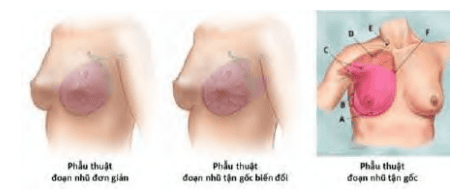
_Đoạn nhũ đơn giản (Simple mastectomy) đòi hỏi phải cắt bỏ mô vú, núm vú, quầng vú, không cắt cơ ngực. Nạo hạch 1/4 trên ngoài vú và hạch nách dưới. Đoạn nhũ tận gốc biến đổi (Modified radical mastectomy) cho phép bảo tồn cả 2 cơ ngực lớn và ngực bé, nhưng đòi hỏi nạo hạch mức I và II. Không nạo hạch nách trên. Đoạn nhũ tận gốc (Radical mastectomy: Halsted) lấy bỏ toàn bộ vú, các cơ ngực và nạo hạch nách toàn bộ. Tử suất cao. Ngày nay không còn được thực hiện._

#### Theo dõi sau phẫu thuật

Biến chứng sau mổ thường gặp là tụ dịch, nhiễm trùng, hoại tử vạt da.

Sau mổ, việc theo dõi được thực hiện chủ yếu bằng nhũ ảnh. Nhũ ảnh được thực hiện hàng năm.

Không đủ chứng cứ để khuyến cáo rằng sau phẫu thuật ung thư vú, việc theo dõi bằng MRI phối hợp với nhũ ảnh sẽ tốt hơn bằng nhũ ảnh đơn thuần. Vì thế MRI không được xem là nội dung theo dõi thường quy sau phẫu thuật ung thư vú để theo dõi vú đối bên.

Nhũ ảnh gặp khó khăn trong trường hợp sẹo lớn sau phẫu thuật hay sau phẫu thuật bảo tồn. Lúc này MRI và siêu âm có thể giúp ích cho chẩn đoán.

Khám lâm sàng hàng năm trong 5 năm đầu đối với đoạn nhũ và 5-10 năm đối với phẫu thuật bảo tồn vú.

### Tiên lượng tái phát và xạ trị

Yếu tố tiên lượng tái phát tại chỗ sau đoạn nhũ gồm:

- Di căn hạch nách.
- Ung thư xâm lấn mạch máu và mạch bạch huyết.
- Ung thư grade III.
- Khối u ≥4cm.
- Khối u ≥4cm.
- Các thụ thể ER, PR.
- Các biomarker như HER2.

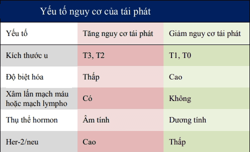
_Yếu tố nguy cơ tái phát._

ACS khuyến cáo xạ trị sau đoạn nhũ trên những bệnh nhân có u nguyên phát >5cm, và có ≥4 hạch nách. Biến chứng thường gặp của xạ trị gồm có phản ứng da, dãn mao mạch, viêm phổi phóng xạ, hoại tử da-xương do phóng xạ...
ACS khuyến cáo xạ trị sau đoạn nhũ trên những bệnh nhân có u nguyên phát >5cm, và có ≥4 hạch nách. Biến chứng thường gặp của xạ trị gồm có phản ứng da, dãn mao mạch, viêm phổi phóng xạ, hoại tử da-xương do phóng xạ...

### Liệu pháp hỗ trợ

Liệu pháp hỗ trợ toàn thân nhằm loại bỏ những di căn nằm sâu trong giai đoạn hậu phẫu sớm và giảm nguy cơ tái phát tại chỗ và tái phát xa ở bệnh nhân:

- Bệnh nhân có nguy cơ cao.
- Hạch dương tính.
- Dấu ấn sinh học không thuận lợi như Her-2/neu dương tính.

Liệu pháp hỗ trợ toàn thân gồm:

1. Hóa trị. Hóa trị có nguy cơ sụt giảm nhận thức thần kinh. Liệu pháp nội tiết với Tamoxifen làm tăng nguy cơ ung thư tử cung, khô âm đạo và bốc hỏa. Liệu pháp nội tiết với aromatase inhibitors liên quan với loãng xương và triệu chứng cơ xương.
2. Liệu pháp nội tiết.

Do có nhiều tác dụng phụ, nên lựa chọn liệu pháp hỗ trợ trên những bệnh nhân có nguy cơ tái phát 10% trong vòng 10 năm.

## Ung thư vú và thai kỳ

Ung thư vú thai kỳ là ung thư vú xảy ra trong thời kỳ mang thai và trong 1 năm sau sinh.

Ung thư vú thai kỳ chiếm khoảng 1-2% tổng số ung thư vú. 25% ung thư vú ở phụ nữ dưới 35 tuổi có liên quan đến thai kỳ, con số này là 15% ở phụ nữ tuổi trên 40. Không có bằng chứng chứng minh ung thư vú thai kỳ xâm lấn hơn ung thư vú, tuy nhiên ung thư vú thai kỳ thường phát hiện trễ do tuyến vú phát triển to trong thai kỳ. 65% ung thư vú và thai kỳ có xâm lấn hạch nách.

Ung thư vú thai kỳ phát hiện ở tam cá nguyệt I và II của thai kỳ được chỉ định đoạn nhũ.

Ung thư vú thai kỳ phát hiện ở tam cá nguyệt III có thể phẫu thuật ngay hoặc theo dõi khối u.

Xạ trị bị chống chỉ định do tình trạng mang thai. Hóa trị có thể được chỉ định nhưng có nguy cơ gây tổn thương thai, đặc biệt là khi hóa được thực hiện ở tam cá nguyệt I.

Việc chấm dứt thai kỳ được đặt ra nếu tuổi thai đạt mức đủ sống (tức 30-32 tuần).

Chấm dứt thai kỳ theo sau bằng tiếp tục điều trị ung thư vú
sau sinh.

Trong thời gian theo dõi, nếu u tăng kích thước có thể phải phẫu thuật hoặc hóa trị trước sinh.

Khuyến cáo thực hiện tránh thai sau điều trị ung thư vú. Thời gian tránh thai được khuyến nghị là 2-3 năm. Lý do của khuyến cáo này là do 80% các ung thư tái phát đều xảy ra trong 2 năm đầu tiên sau mổ.

Phụ nữ có tiền căn phẫu thuật bảo tồn ung thư vú vẫn có thể cho con bú.

## Bệnh Paget núm vú

Bệnh Paget vú là ung thư ở da vùng núm vú và quầng vú. Hầu hết các bệnh nhân có Paget vú đều có kèm theo 1 hay nhiều ung thư của mô vú bên dưới, tức tuyến vú cùng bên, có thể là DCIS hay LCIS hay ung thư xâm lấn. Bệnh Paget chiếm 1-2 % ung thư vú.

Bệnh Paget có biểu hiện đầu tiên bên ngoài như là thay đổi dạng chàm ở núm vú. Cảm giác ngứa và nóng khó chịu kèm theo biến đổi dạng chàm. Khi tiến triển hơn, sẽ kèm chảy dịch và thay đổi ở núm vú, như tụt núm vú vào trong. Do biểu hiện không điển hình, rất giống như chàm, nên thường được chẩn đoán trễ. Chẩn đoán được xác nhận qua sinh thiết với hiện diện của các tế bào Paget.

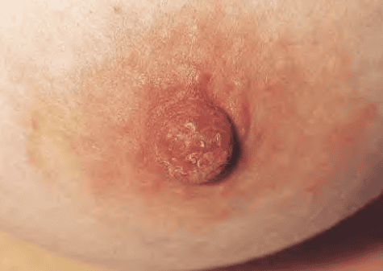
_Bệnh Paget thường bị chẩn đoán trễ do biểu hiện bên ngoài hết sức "hiền lành" như tổn thương chàm, cảm giác ngứa và nóng khó chịu._

Việc điều trị tùy thuộc trước tiên vào sự hiện diện hay vắng mặt của ung thư ở mô bên dưới. Nếu có ung thư của mô bên dưới, việc điều trị được thực hiện giống như cho ung thư ở mô bên dưới. Tuy nhiên, nếu bệnh Paget không kèm theo khối u ở mô bên dưới xác nhận qua nhũ ảnh thì phẫu thuật cắt u bảo tồn, kèm theo lấy bỏ bắt buộc núm vú và quầng vú và kèm theo bắt buộc điều trị chiếu xạ toàn vú sau phẫu thuật cũng được xem là lựa chọn an toàn.

## Nguồn tham khảo

- TEAM-BASED LEARNING - Trường Đại học Y Dược Thành phố Hồ Chí Minh 2020.
