Bệnh nguyên bào nuôi thai kỳ (gestational trophoblastic disease - GTD) là nhóm bệnh có sự tăng sinh bất thường của các nguyên bào nuôi kết hợp với thai kỳ, gồm 2 dạng thai trứng và u nguyên bào nuôi.

## Phân loại

Phân loại theo FIGO 2002:

- Thai trứng:
  - Thai trứng toàn phần.
  - Thai trứng bán phần.
- U nguyên bào nuôi:
  - Thai trứng xâm lấn.
  - Ưng thư nguyên bào nuôi.
  - U nguyên bào nuôi nơi rau bám.
  - U nguyên bào nuôi dạng biểu mô.

## Thai trứng (Hydatiform mole)

Thai trứng (hydatiform moles) là dùng để chỉ tình trạng thai nghén đặc trưng bởi sự tăng sinh bất thường của các nguyên bào nuôi.

Thai trứng toàn phần (complete mole) không chứa mô của thai nhi, toàn bộ gai rau đều thoái hóa thành các bọc (túi) trứng.

Thai trứng bán phần (partial mole) mô của thai nhi (mô thai hoặc phôi hoặc thai nhi thường chết, teo đét) cùng tồn tại với mô rau thoái hóa nước.

Tần suất của thai trứng thay đổi tùy chủng tộc. Ở người Âu, tần suất của thai trứng khá thấp, chỉ vào khoảng 1:1000 trường hợp sinh sống. Với người Việt Nam, tần suất này khoảng 1:200 trường hợp sinh sống. Tuy tần suất không cao lắm, nhưng nhận biết được thai trứng đóng vai trò quan trọng, do khả năng diễn tiến thành choriocarcinoma. Ở Việt Nam, có khoảng 5% số trường hợp thai trứng sẽ tiến triển thành choriocarcinoma.

### Nguồn gốc

Thai trứng là kết quả của thụ tinh bất thường. Bất chấp dạng thai trứng, bất thường luôn có nguồn gốc tinh trùng (paternal).

Trong thai trứng toàn phần, cấu trúc bộ nhiễm sắc thể là 46 nhiễm sắc thể. Trứng thụ tinh là trứng không nhân. Vật chất di truyền đến từ 2 tinh trùng khác nhau. Trong trường hợp trứng không nhân bị xâm nhập bởi 1 tinh trùng, thì tinh trùng sẽ nhân đôi.

Trong thai trứng bán phần, cấu trúc bộ nhiễm sắc thể là 69 hoặc 92 nhiễm sắc thể, với trứng thụ tinh là 1 trứng có nhân. Vật chất di truyền sẽ đến từ 2 tinh trùng khác nhau. Trong trường hợp trứng có nhân bị xâm nhập bởi 1 tinh trùng, thì tinh trùng sẽ nhân đôi.

### Mô bệnh học

Đại thể của thai trứng là mô rau bị thoái hóa thành các túi nước nhỏ hình chùm nho. Về mặt vi thể, các túi nước này được bọc bởi các nguyên bào nuôi tăng sinh.

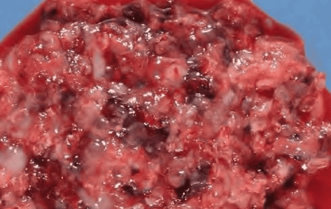
_Hình ảnh đại thể của thai trứng.  Đại thể của thai trứng là mô rau bị thoái hóa thành các túi nước nhỏ hình chùm nho._

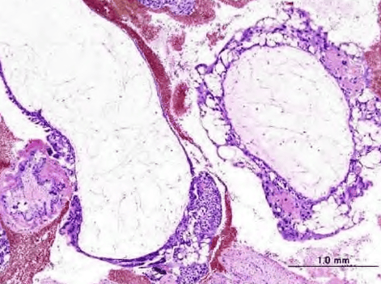
_Hình ảnh vi thể của thai trứng.  Về mặt vi thể, các túi nước này là những lông rau thoái hóa nước, bên ngoài được bọc bởi các nguyên bào nuôi tăng sinh._

### Diễn biến

Sau hút nạo thai trứng, hơn 80% bệnh nhân sẽ trở về bình thường, 15% diễn biến thành thai trứng xâm lấn, và có khoảng 5% sẽ diễn biến thành ung thư nguyên bào nuôi. Khả năng diễn biến thành thai trứng xâm lấn hay choriocarcinoma thay đổi tùy kiểu thai trứng.

Thai trứng toàn phần có nhiều khuynh hướng diễn biến ác tính hơn. Thai trứng bán phần ít có khuynh hướng diễn biến ác tính, nhưng khả năng này là không thể bỏ qua.

### Chẩn đoán

Dấu hiệu nhận diện thai trứng gồm có thai kèm nghén nặng, xuất huyết tử cung bất thường và tử cung to so với tuổi thai:

- Hoạt động của nguyên bào nuôi tăng sinh sản xuất lượng lớn hCG đã gây nên các triệu chứng của nghén nặng. hCG cao cũng gây ra các hệ quả là cường giáp và tiền sản giật. Tuy nhiên, cường giáp, tăng huyết áp thai kỳ xuất hiện sớm, là những dấu hiệu không thường gặp trong thai trứng.
- hCG tăng cao cũng kích thích buồng trứng, làm các nang bị hoàng thể hóa và tạo thành nang hoàng tuyến, gây căng tức bụng dưới kèm khối u buồng trứng to. Các triệu chứng thần kinh rất hiếm gặp, và thường gợi ý tình trạng đã có di căn.
- Trong thai trứng tử cung to nhanh là do tổng khối nguyên bào nuôi quá lớn và bị thoái hóa nước.

Trong trường hợp có các triệu chứng gợi ý nêu trên, cần nghĩ đến việc khảo sát thai kỳ bằng siêu âm, đồng thời định lượng hCG:

1. Siêu âm là khảo sát đầu tay cho phép nhận diện thai trứng do hình ảnh điển hình của nó trên siêu âm.
2. hCG là phương tiện theo dõi.
3. Giải phẫu bệnh xác nhận chẩn đoán.

#### Siêu âm

Hình ảnh điển hình của thai trứng toàn phần trên siêu âm là hình ảnh tổ ong, bão tuyết, hình chùm nho hoặc hình echo trống

_Hình ảnh siêu âm của thai trứng toàn phần.  Hình ảnh điển hình của thai trứng trên siêu âm là hình ảnh tổ ong. Trong thai trứng toàn phần, hình ảnh này là điển hình._

Hình ảnh của thai trứng bán phần không đặc trưng. Chẩn đoán sẽ khó khăn hơn do hình ảnh không còn điển hình lại kèm với hình ảnh của thai, có thể là thai sống và tiến triển. Thai lưu với rau thoái hóa có thể cho hình ảnh tương tự thai trứng.

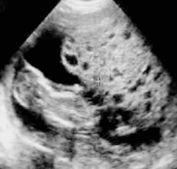
_Hình ảnh siêu âm của thai trứng bán phần.  Chẩn đoán sẽ khó khăn hơn trong trường hợp thai trứng bán phần, do hình ảnh không còn điển hình lại kèm với hình ảnh của 1 thai, có thể là thai sống và tiến triển._

#### hCG

hCG tăng rất cao trong thai trứng >1000 mIU/mL với thai trứng toàn phần và >100 mIU/mL với thai trứng bán phần. Nhưng giá trị thật sự của định lượng hCG lại là trong theo dõi diễn biến sau hút nạo.

#### Giải phẫu bệnh

Chỉ có giải phẫu bệnh mới cho phép xác nhận chẩn đoán thai trứng.

Do 5% thai trứng có thể diễn biến thành choriocarcinoma, nên việc có bằng chứng giải phẫu bệnh là bắt buộc. Do choriocarcinoma có thể phát triển từ thai thường ngưng phát triển, nên đối với các trường hợp thai nghén thất bại sớm, việc khảo sát giải phẫu bệnh là cần thiết.

Khi nghĩ đến thai trứng cần có đầy đủ các xét nghiệm như tổng phần tích tế bào máu, nhóm máu, tổng phân tích nước tiểu, chức năng gan (AST, ALT), thận (ure, creatinine), tuyến giáp (FT3, FT4, TSH), điện tâm đồ, điện giải đồ, X-quang ngực thẳng… Cùng với đó là khám chuyên khoa nội tiết, tim mạch… để chẩn đoán và phục vụ điều trị.

### Điều trị

Cần xử trí ngay khi có chẩn đoán bệnh.

#### Nạo hút buồng tử cung

Mọi thai trứng, dù bán phần hay toàn phần cũng đều phải được hút nạo. Hút nạo thai trứng, vừa là phương pháp điều trị bệnh, vừa để có bằng chứng giải phẫu bệnh.

Cần chuẩn bị:

- Kháng sinh dự phòng.
- Tiền mê hoặc gây tê cho người bệnh.
- Truyền tĩnh mạch Glucose 5% hoặc Lactated Ringer's hoặc Natri clorid 0.9%.
- Misoprostol để mở cổ tử cung hoặc nong cổ tử cung bằng que nong số 8-12 nếu cổ tử cung đóng.
- Sử dụng Oxytocin tăng co hồi tử cung.

Nếu sau 3 ngày khám thấy tử cung còn to do ứ dịch lòng nhiều hay còn mô trứng cần nạo kiểm tra lại.

#### Cắt tử cung

Người bệnh ≥40 tuổi, đủ con, có chẩn đoán thai trứng nguy cơ cao.

Băng huyết hay không kiểm soát được tình trạng chảy máu nặng từ tử cung.

#### Hóa trị

Với hậu thai trứng nguy cơ cao, hoá dự phòng làm giảm nguy cơ GTD ác tính, nhưng làm tăng nguy cơ GTD kháng thuốc.

Cần nhấn mạnh rằng việc thực hiện hoá dự phòng không làm thay đổi các phác đồ theo dõi hậu thai trứng. Đối với nhóm hậu thai trứng nguy cơ cao, hoá dự phòng với methotrexate làm giảm có ý nghĩa nguy cơ xảy ra bệnh nguyên bào nuôi hậu thai trứng, từ 47.4% xuống còn 14.3%.

Ngược lại, với nhóm nguy cơ thấp thì không có hiệu quả. Tuy nhiên, cần phải lưu ý rằng trong số bệnh nhân đã được dùng hoá dự phòng nhưng vẫn bị nguyên bào nuôi hậu thai trứng thì nguy cơ kháng thuốc nhiều hơn nhóm không điều trị hoá dự phòng.

Do nguy cơ xảy ra kháng thuốc, đối với bệnh nhân có khả năng hợp tác tốt và có khả năng tuân thủ điều trị, đồng thời với việc sở hữu phác đồ hoá điều trị hiệu quả trong trường hợp bệnh nhân chuyển sang bệnh nguyên bào nuôi tồn tại, nên việc theo dõi đơn thuần β-hCG có vẻ sẽ tốt hơn so với thực hiện thường quy hoá dự phòng.

Hóa trị dự phòng với Methotrexate (MTX) hoặc Dacticin:

- MTX 5 ngày: MTX 0.4mmg/kg/ngày tĩnh mạch hoặc tiêm bắp x 5 ngày, không quá 25mg/ngày. Lặp lại chu kỳ mỗi 14 ngày.
- MTX 8 ngày (MTX/FA): MTX 1mg/kg hoặc MTX 50mg/ngày tiêm bắp ngày 1, 3, 5, 7 + Folinic acid 0.1mg/kg tiêm bắp hoặc uống 15mg sau liều MTX 24-30h vào ngày 2, 4, 6, 8. Lặp lại chu kỳ mỗi 14 ngày.
- Dacticin: 12 mcg/kg (10-13 mcg/kg) hoặc 0.5mg/ngày tĩnh mạch x 5 ngày liên tục. Thay thế cho MTX 5 ngày ở người bệnh có men gan cao. Lặp lại chu kỳ mỗi 14 ngày.

:::caution[Lưu ý]
Không sử dụng hóa trị khi:

- Bạch cầu <3000/mm³, bạch cầu đa nhân trung tính <1500/mm³, tiểu cầu <100000/mm³.
- Men gan AST, ALT >100IU/L.

:::

Tác dụng phụ gồm có:

- Nhiễm độc về huyết học và tủy xương như giảm bạch cầu, giảm 3 dòng tế bào, thiếu máu:
  - Giảm bạch cầu dùng thuốc nâng bạch cầu (Filgrastim).
  - Truyền máu hồng cầu lắng, tiểu cầu.
- Nhiễm độc đường tiêu hóa: viêm niêm mạc miệng, viêm dạ dày, viêm ruột hoại tử:
  - Nuôi bằng đường tĩnh mạch, ăn thức ăn lỏng, chia nhiều bữa nhỏ.
  - Kháng sinh, vitamin.
  - Truyền dịch và bù điện giải.
- Nhiễm độc da: rụng tóc, tăng dị ứng mẫn cảm.
- Sử dụng kháng histamin và corticoid nếu có dị ứng:
  - Ngưng hóa trị nếu men gan >100IU/L.
  - Thuốc bảo vệ tế bào gan: Biphenyl dimethyl dicarrboxylat.

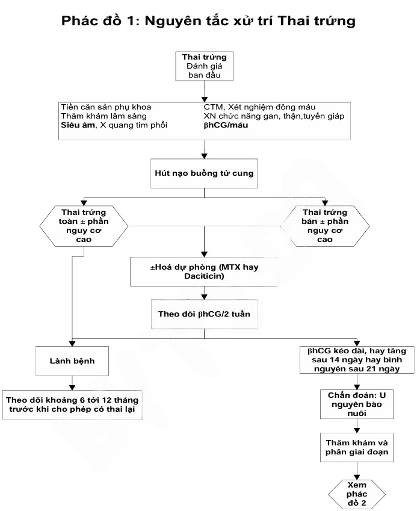
_Phác đồ 1 nguyên tắc xử trí thai trứng Bệnh viện Từ Dũ._

#### Tránh thai

Trong quá trình theo dõi hậu thai trứng, bệnh nhân bị buộc phải áp dụng phương pháp ngừa thai hiệu quả. Lý do là không để xuất hiện những triệu chứng lâm sàng, những thông tin về hCG và hình ảnh học của thai kỳ mới làm nhiễu loạn việc theo dõi thai trứng:

1. Bao cao su (condom) là lựa chọn tốt, do phương pháp này hoàn toàn không có ảnh hưởng trên diễn biến tự nhiên của hậu thai trứng hay các triệu chứng theo dõi như rong huyết, nhức đầu… Nhược điểm lớn nhất của condom là hiệu quả tránh thai không thật sự cao.
2. Dụng cụ tử cung tránh thai (Intra Uterine Devices) (IUD) là lựa chọn tốt vì có hiệu quả tránh thai rất cao. Tuy nhiên, các tác dụng phụ của IUD lại là những thông tin gây nhiễu. Quan trọng nhất là rong huyết. Rong huyết dưới IUD làm cho chẩn đoán phân biệt với các thể GTD không kèm tăng cao của hCG như trong trường hợp của bệnh nguyên bào nuôi tồn tại (Persistent Trophoblastic Disease) (PTD) hay PSTT.
3. Thuốc nội tiết estrogen-progestogen phối hợp (Combined Oral Contraceptive pills - COCs) là lựa chọn tốt, do hiệu quả tránh thai rất cao. Trước đây, có các nghi ngờ rằng COCs hàm lượng thấp có thể ảnh hưởng đến nhịp điệu trở về bình thường của β-hCG, làm tăng nguy cơ phải thực hiện không cần thiết hóa trị liệu vì diễn biến bất thường của β-hCG. Hiện nay, các bằng chứng phủ nhận liên quan của COCs đối với sự diễn biến của β-hCG. COCs cũng không làm tăng tỉ lệ PSTT.
4. Triệt sản.

### Theo dõi

Sau hút nạo, bệnh nhân cần được theo dõi diễn tiến của β-hCG 1 lần/tuần, cho đến khi kết quả β-hCG định lượng trở về âm tính và duy trì âm tính trong 3 lần liên tiếp. Khi đó, nhịp độ theo dõi β-hCG sẽ giãn ra thưa hơn, còn 1 lần/tháng cho đến khi kết quả duy trì âm tính 3 tháng liên tiếp. Khi thỏa những điều kiện, có thể an tâm về diễn biến trở về bình thường của thai trứng.

Định lượng hCG có thể là hCG hay β-hCG. Tuy nhiên, khuyến cáo nên định lượng β-hCG, do các kỹ thuật định lượng hiện nay cho phép nhận diện và đo lường được những nồng độ rất thấp của β-hCG.

Nhận diện được các nồng độ rất thấp của β-hCG là điều kiện quyết định cho phép rút ngắn đáng kể thời gian theo dõi hậu thai trứng. Nếu β-hCG trở về âm tính trong vòng 56 ngày sau hút nạo, thì thời gian theo dõi chỉ còn là 6 tháng. Do thời gian bán hủy của hCG là khoảng 36h nên bình thường thì logarithm thập phân của nồng độ β-hCG giảm đi 1 bậc mỗi tuần. Ví dụ như nồng độ β-hCG của hôm nay là $10^5$IU/L (lg $10^5$ = 5) thì sau 1 tuần nồng độ β-hCG phải là $10^4$IU/L (lg $10^4$ = 4).

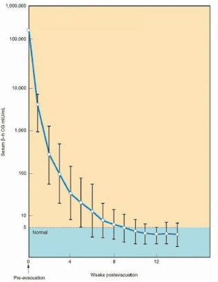
_Diễn biến hCG bình thường. Giá trị thật sự của định lượng hCG lại là trong theo dõi diễn biến sau hút nạo. Bình thường thì logarithm thập phân của nồng độ hCG giảm đi 1 bậc mỗi tuần._

_Diễn biến hCG bất thường. Sự chững lại, ở dạng bình nguyên, hay tăng lại của nồng độ hCG gợi ý diễn biến bất lợi của GTD._

Theo dõi sự co hồi tử cung, kích thước nang hoàng tuyến. Tình trạng xuất huyết âm đạo, kinh nguyệt.

Theo dõi tối thiểu thai trứng nguy cơ thấp là 6 tháng và thai trứng nguy cơ cao là 12 tháng.

Sau thời gian theo dõi, người bệnh có thể có thai trở lại. Khi có dấu hiệu mang thai, cần khám thai ngay, chú ý siêu âm và định lượng hCG để đề phòng thai trứng lặp lại.

### Thai trứng khi có thai

Ở thai trứng tồn tại đồng thời với thai trong tử cung sống, có sự gia tăng nguy cơ diễn biến thành bệnh nguyên bào nuôi tồn tại. Những thai kỳ này dễ có những biến chứng như xuất huyết âm đạo, sinh non, cao huyết áp. Nếu bệnh nhân muốn giữ thai, và không có bằng chứng của di căn, thì có thể theo dõi đến khi sinh, với điều kiện khẳng định nhiễm sắc thể của thai sống là bình thường và loại trừ những dị tật.

## U nguyên bào nuôi

U nguyên bào nuôi xuất hiện sau thai trứng (60%), thai lưu/sảy thai (30%), thai đủ tháng hay thai ngoài tử cung (10%). Thường có triệu chứng xuất huyết âm đạo kéo dài.

Thai trứng xâm lấn (invasive mole) thể hiện tình trạng các tổ chức nguyên bào nuôi tăng sinh xâm lấn tại chỗ, tức xâm nhập vào thành cơ tử cung, gây ra các biến chứng đặc trưng của sự xâm nhập nguyên bào nuôi là vỡ và chảy máu. Xuất độ thai trứng diễn biến thành thai trứng xâm lấn là khoảng 15% trường hợp. Thai trứng xâm lấn có thể gây xuất huyết nặng do việc xâm thực vào trong cơ tử cung, làm vỡ các mạch máu, xuất huyết nghiêm trọng, và có thể gây thủng tử cung. Chẩn đoán dựa vào β-hCG thường cao 20000-30000 mIU/mL, siêu khối tăng sinh mạch máu trong cơ tử cung, sau cắt tử cung làm giải phẫu bệnh có nhiều nang trứng trong cơ tử cung.

U nguyên bào nuôi tại vị trí rau bám (Placental Site Trophoblastic Tumour - PSTT) thể hiện sự hiện diện khối u của các tổ chức nguyên bào nuôi tại vị trí rau bám trước đây(thường xảy ra sau sinh). PSTT không phải lúc nào cũng có nguồn gốc là sau thai trứng. PSTT có thể xảy ra cả sau thai thường sống, hoặc sau thai ngưng phát triển. Dù không mang các đặc trưng của ác tính điển hình, nhưng PSTT không phải lúc nào cũng lành tính. Không ít trường hợp bệnh nguyên bào nuôi tồn tại có thể dẫn đến tử vong do di căn. β-hCG thường thấp 16-400 mIU/mL.

Ung thư nguyên bào nuôi (choriocarcinoma) dùng mô tả tân lập ác tính từ mô rau. Ung thư nguyên bào nuôi có thể có xuất phát điểm là thai trứng, hoặc là thai thường (sinh sống hay ngưng phát triển). Ngoài ra, ung thư nguyên bào nuôi có thể có nguồn gốc không liên quan đến thai kỳ, mà có bản chất là u tế bào dòng sinh dục của buồng trứng, trong đó tế bào dòng sinh dục phân chia bất thường, không theo con đường giảm nhiễm, mà theo con đường nguyên nhiễm, rồi phân bào nguyên nhiễm tiếp tục để thành ung thư. Trong trường hợp này ta có bệnh nguyên bào nuôi không liên quan đến thai kỳ (non-gestational choriocarcinoma). Choriocarcinoma có thể cho di căn nhiều nơi như âm đạo, phổi, não… hoặc bị vỡ.

### Chẩn đoán

:::note[Tiêu chuẩn chẩn đoán theo FIGO 2002]
Có ít nhất 1 trong những tiêu chuẩn sau (U nguyên bào nuôi nơi rau bám không xếp vào trong nhóm này):

- β-hCG bình nguyên (± 10%) sau 4 lần đo trong ≥3 tuần (ngày 1, 7, 14, 21).
- β-hCG tăng (> 10%) sau 3 lần đo liên tiếp trong ≥2 tuần (ngày 1, 7, 14).
- Có giải phẫu bệnh là choriocarcinoma.
- β-hCG tồn tại sau 6 tháng theo dõi.
:::

### Phân loại

Khi có GTD ác tính, việc phân loại là quan trọng. Phân loại giúp định hướng theo dõi, tiên lượng và điều trị. Có 2 hệ thống phân loại bệnh GTD ác tính:

1. Phân loại của FIGO.
2. Phân loại của National Institutes of Health - NIH (Mỹ).

| Giai đoạn     | Hệ thống đánh giá nguy cơ theo FIGO 2002                            |
| ------------- | ------------------------------------------------------------------- |
| Giai đoạn I   | Bệnh lý còn khu trú ở tử cung.                                      |
| Giai đoạn II  | Bệnh lý đã lan khỏi tử cung nhưng vẫn còn khu trú ở đường sinh dục. |
| Giai đoạn III | Bệnh lý đã cho di căn phổi.                                         |
| Giai đoạn IV  | Bệnh lý đã cho di căn nơi khác.                                     |

_Hệ thống đánh giá nguy cơ theo FIGO._

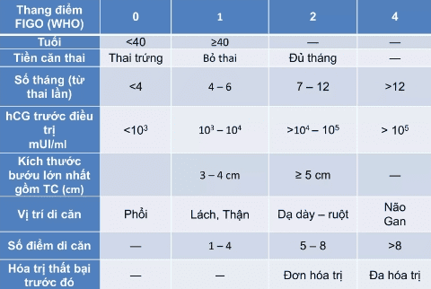
_Bảng điểm tiên lượng của u nguyên bào nuôi theo FIGO và WHO 2006. Nguy cơ thấp ≤6 điểm: - Giai đoạn I (không di căn). - Giai đoạn II và III <7 điểm. Nguy cơ cao ≥7 điểm: - Giai đoạn II và III ≥7 điểm. - Giai đoạn IV._

_Phân giai đoạn theo NIH._

Khi so sánh 2 hệ thống phân loại của FIGO và NIH, ta có thể thấy hệ thống phân loại của NIH đơn giản hơn, lại có tính thực hành. Các nhận định chính là:

1. Hầu hết những bệnh nhân chưa có di căn đều có thể điều trị khỏi bệnh bằng đơn hoá trị, mà không cần quan tâm đến những yếu tố nguy cơ của WHO.
2. Những bệnh nhân có di căn thì đều có tiên lượng xấu, cần thực hiện đa hoá trị.

### Điều trị

Hóa điều trị bệnh nguyên bào nuôi ác tính dựa trên bảng phân loại theo NIH:

1. Hóa trị liệu cho GTD ác tính ở bệnh nhân không có di căn có tỉ lệ khỏi bệnh lên đến gần 100%, có hay không kèm phẫu thuật cắt tử cung. Tuy nhiên, nếu bệnh nhân đã đủ con, phẫu thuật cắt tử cung sẽ làm giảm tổng khối tế bào ung thư, rút ngắn thời gian trở về bình thường của β-hCG.
2. Ở bệnh nhân có di căn và có tiên lượng tốt: có thể khởi đầu bằng đơn hoá trị, kèm phẫu thuật cắt tử cung. Tỉ lệ tái phát <5%.
3. Ở bệnh nhân có di căn và có tiên lượng xấu: cần đa hoá trị với MAC hoặc EMA/CO. Tỉ lệ sống còn có thể lên đến 84%. Ở các bệnh nhân này, phẫu thuật cắt tử cung có vẻ như không giúp cải thiện tiên lượng.

#### U nguyên bào nuôi nguy cơ thấp

Hóa trị dự phòng với Methotrexate (MTX):

- MTX 5 ngày: MTX 0.4mmg/kg/ngày tĩnh mạch hoặc tiêm bắp x 5 ngày, không quá 25mg/ngày. Lặp lại chu kỳ mỗi 14 ngày.
- MTX 8 ngày (MTX/FA): MTX 1mg/kg hoặc MTX 50mg/ngày tiêm bắp ngày 1, 3, 5, 7 + Folinic acid 0.1mg/kg tiêm bắp hoặc uống 15mg sau liều MTX 24-30h vào ngày 2, 4, 6, 8. Lặp lại chu kỳ mỗi 14 ngày.
- MTX tuần: MTX 30-50mg/m² da tĩnh mạch/tuần.
- MTX 100mg/m² da tĩnh mạch, sau đó 200mg/m² da pha trong Glucose 5% 500mL truyền tĩnh mạch trong 12h. 24h sau, Folinic acid 15mg tĩnh mạch/uống x 4 lần/12h. Lặp lại chu kỳ mỗi 18 ngày hoặc khi cần.

hoặc Dacticin:

- Dacticin: 1.25mg/m² da tĩnh mạch mỗi 2 tuần. Thay thế cho MTX 5 ngày ở người bệnh có men gan cao. Lặp lại chu kỳ mỗi 14 ngày.
- Dacticin: 12 mcg/kg (10-13 mcg/kg) hoặc 0.5mg/ngày tĩnh mạch x 5 ngày liên tục. Thay thế cho MTX 5 ngày ở người bệnh có men gan cao. Lặp lại chu kỳ mỗi 14 ngày.
- Lặp lại thêm 2-3 chu kỳ sau khi β-hCG về âm tính.

#### U nguyên bào nuôi thất bại hoặc kháng trị

β-hCG bình nguyên hoặc tăng khi đang dùng hóa trị (có hoặc không có thêm di căn mới).

Yếu tố liên quan:

- Tuổi >35.
- β-hCG trước điều trị >100000 mIU/mL.
- FIGO >4 điểm.
- Không có tiền căn thai trứng.
- Có di căn âm đạo lớn.
- Giải phẫu bệnh choriocarcinoma.
- Số điểm FIGO tăng.

Xử trí:

- MTX 50mg/m² da thất bại → MTX 0.4mg/kg tiêm bắp 5 ngày hoặc Dacticin 12 mcg/kg tiêm bắp 5 ngày.
- β-hCG <100IU/L → Dacticin 5 ngày (87%).
- β-hCG >100IU/L → EMA-CO (99%).
- Kháng MTX → Dacticin.

#### U nguyên bào nuôi nguy cơ cao

Phác đồ EMA-CO:

- Ngày 1:
  - Etoposide 100mg/m² da tĩnh mạch trong 30 phút.
  - Dacticin 0.5mg tĩnh mạch.
  - MTX 100mg/m² da tĩnh mạch.
  - MTX 200mg/m² da tĩnh mạch trong 12h.
- Ngày 2:
  - Etoposide 100mg/m² da tĩnh mạch trong 30 phút.
  - Dacticin 0.5mg tĩnh mạch.
  - Folinic acid 15mg tiêm bắp 2 lần/ngày x 2 ngày sau MTX 24h.
- Ngày 8:
  - Oncovin (Vincristin) 1mg/m² da tĩnh mạch, tối đa 2mg.
  - Cyclophosphamid 600mg/m² da truyền tĩnh mạch trong 30 phút.

Phác đồ lặp lại mỗi 2 tuần. Lặp lại thêm 3-4 chu kỳ sau khi β-hCG âm tính.

:::caution[Lưu ý]
Tiêu chuẩn để hóa trị:

- Ngày 1 và 2: Bạch cầu ≥3000/mm³, bạch cầu đa nhân trung tính ≥1500/mm³.
- Ngày 8. Bạch cầu ≥2000/mm³, bạch cầu đa nhân trung tính ≥1000/mm³.

:::

Nếu kháng EMA-CO:

- Sử dụng phác đồ EMA-EP hoặc EP-EMA: ngày điều trị CO được thay bằng EP:
  - Cisplatin 70-80mg pha 1L truyền tĩnh mạch hơn 12h.
  - Etoposide 100mg/m² da (150mg/m² da) được truyền tĩnh mạch hơn 1h.
- Phác đồ BEP:
  - Cisplatin 20mg/m² da truyền tĩnh mạch.
  - Etoposide 100mg/m² da truyền tĩnh mạch vào ngày 1-4.
  - Bleomycin 30 đơn vị tiêm tĩnh mạch hằng tuần.
- Phác đồ TP/TE:
  - Ngày 1:
    - Dexamethasone 20mg uống trước liều Paclitaxel 12h.
    - Dexamethasone 20mg uống trước liều Paclitaxel 6h.
    - Cimetidine 30mg + 100mL NaCl 0.9% truyền trong 30 phút.
    - Chlorphenamine 100mg tĩnh mạch.
    - Paclitaxel 135mg/m² da + 250mL NaCl 0.9% truyền trong 3h.
    - Mannitol 10% truyền trong 1h.
    - Cisplatin 60mg/m² da pha 1000mL NaCl 0.9% truyền trong 3h.
    - Sau khi truyền thuốc, truyền tĩnh mạch 1000mL NaCl 0.9% + KCl 20mmol + 1g $MgSO_4$ truyền trong 2h.
  - Ngày 15:
    - Dexamethasone 20mg uống trước liều Paclitaxel 12h.
    - Dexamethasone 20mg uống trước liều Paclitaxel 6h.
    - Cimetidine 30mg + 100mL NaCl 0.9% truyền trong 30 phút.
    - Chlorphenamine 100mg tĩnh mạch.
    - Paclitaxel 135mg/m² da + 250mL NaCl 0.9% truyền trong 3h.
    - Etoposide 150mg/m² da pha 1000mL NaCl 0.9% truyền trong 1h.

#### U nguyên bào nuôi di căn não

- Ngày 1:
  - Etoposide 100mg/m² da tĩnh mạch trong 30 phút.
  - Dacticin 0.5mg tĩnh mạch.
  - MTX 100mg/m² da tĩnh mạch.
  - MTX 200mg/m² da tĩnh mạch trong 12h.
- Ngày 2:
  - Etoposide 100mg/m² da tĩnh mạch trong 30 phút.
  - Dacticin 0.5mg tĩnh mạch.
  - Folinic acid 15mg tiêm bắp 2 lần/ngày x 2 ngày sau MTX 24h.
- Ngày 8:
  - Oncovin (Vincristin) 1mg/m² da tĩnh mạch, tối đa 2mg.
  - Cyclophosphamid 600mg/m² da truyền tĩnh mạch trong 30 phút.
- Kết hợp xạ trị 3000 cGy.

#### U nguyên bào nuôi tái phát

Hóa trị với phác đồ EMA-CO, EMA-EP hoặc EP-EMA.

#### Choriocarcinoma di căn âm đạo

Mổ lấy khối di căn âm đạo nếu vỡ hoặc dọa vỡ nhân choriocarcinoma hoặc kháng thuốc.

Chèn gạc cầm máu khi xuất huyết âm đạo nhiều và không thể mổ lấy khối di căn.

#### Điều trị cấp cứu tại giường

3 ngày liên tục lặp lại mỗi tuần:

- Etoposide 100mg/m² da truyền tĩnh mạch trong 1h.
- Cisplatin 20mg/m² da truyền tĩnh mạch trong 2h.

#### Thai trứng xâm lấn

Mổ bóc nhân choriocarcinoma hoặc lấy khối thai trứng xâm lấn với người bệnh trẻ, muốn sinh thêm con, kháng hóa trị hoặc khối choriocarcinoma dọa vỡ.

Cắt tử cung toàn phần nếu lớn tuổi, đủ con.

#### U nguyên bào nuôi nơi rau bám

Phẫu thuật cắt tử cung toàn phần. Nạo hạch (chủ-chậu) nếu có hạch di căn. Thường không nhạy cảm với hóa trị. Hóa trị phác đồ EP-EMA.

#### Phẫu thuật

Chỉ định cắt tử cung toàn phần:

- Chủ yếu cho người bệnh không muốn thêm con.
- Tuổi ≥40.
- Tuổi <40 mà có ≥3 con, hay không muốn có con.
- Băng huyết.
- Vỡ nhân chorio.
- Cầm máu khó khăn khi bóc nhân chorio.
- Không đáp ứng hóa trị.

Phẫu thuật bào tồn cắt khối chorio ở tử cung hoặc khối thai trứng xâm lấn cho bệnh nhân trẻ, mong có thêm con.

#### Điều trị bằng xạ trị

Khi có di căn xa như não, gan và di căn sâu vòng chậu.

### Theo dõi

Tương tự như thai trứng, việc theo dõi thai trứng xâm lấn và choriocarcinoma được dựa vào diễn biến của β-hCG và các triệu chứng lâm sàng cận lâm sàng của xâm lấn và di căn như ra huyết âm đạo, kích thước tử cung, nang hoàng tuyến…

Trong chiến lược theo dõi này, theo dõi diễn biến của β-hCG được xem như phương tiện tầm soát và theo dõi chủ lực, còn lâm sàng và các phương tiện khác sẽ được thực hiện nếu có diễn biến bất thường của β-hCG, ngoại trừ khi đã có triệu chứng lâm sàng gợi ý.

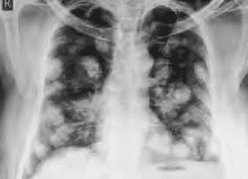
_Di căn phổi. Di căn phổi được phát hiện bằng X-quang với hình ảnh bóng bay._

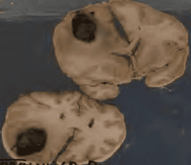
_Di căn não. Di căn não được phát hiện bằng nhức đầu, xuất huyết não hay bằng MRI. Bệnh phẩm tử thiết cho thấy nhân di căn gây xuất huyết ở bán cầu trái._

Xét nghiệm huyết đồ, chức năng gan, thận, điện giải… phát hiện nhiễm độc hóa chất.

Thời gian theo dõi tối thiểu là 5 năm.

Sau thời gian theo dõi, người bệnh được có thai trở lại, tùy trường hợp. Yêu cầu ít nhấ 2 năm sau điều trị khỏi mới có thai lại. Khi có dấu hiệu mang thai cần đi khám thai ngày, chú ý siêu âm và hCG để phòng bệnh tái phát.

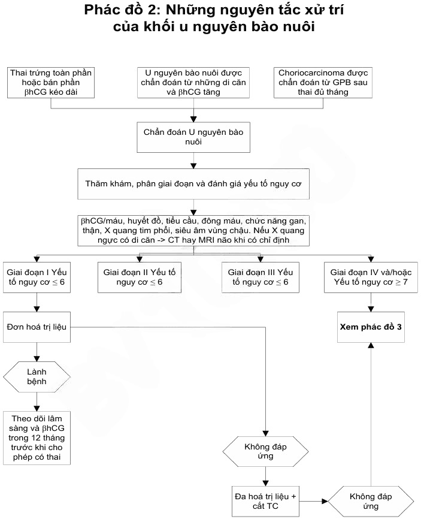
_Phác đồ 2 nguyên xử trí của khối u nguyên bào nuôi Bệnh viện Từ Dũ._

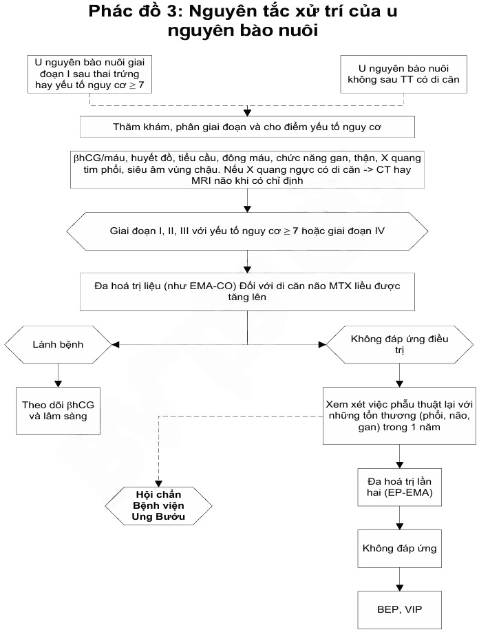
_Phác đồ 3 nguyên tắc xử trí u nguyên bào nuôi Bệnh viện Từ Dũ._

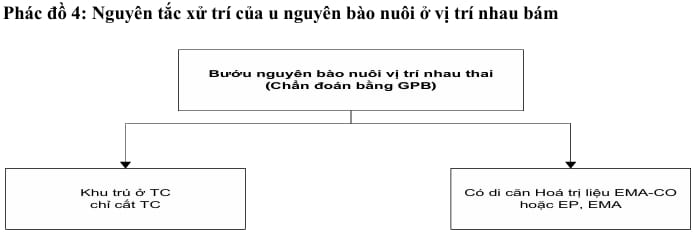
_Phác đồ 4 nguyên tắc xử trí của u nguyên bào nuôi tại vị trí rau bám Bệnh viện Từ Dũ._

## Nguồn tham khảo

- Trường Đại học Y Dược TP. HCM (2020) – _TEAM-BASED LEARNING_
- Bệnh viện Từ Dũ (2022) - _PHÁC ĐỒ ĐIỀU TRỊ SẢN PHỤ KHOA_
