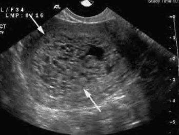
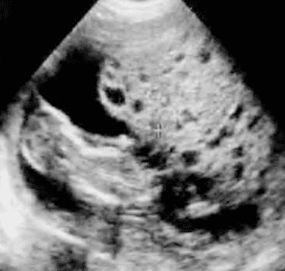
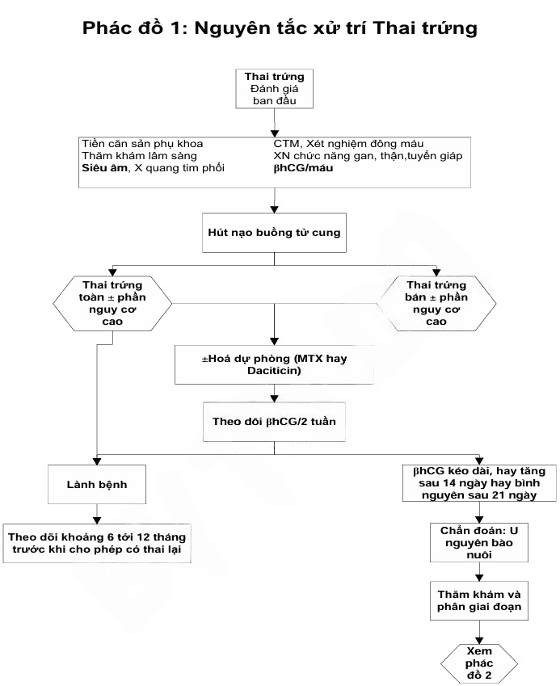

Thai trứng là tình trạng gặp trong 1/200–1/1000 ca thai nghén, do bất thường thụ tinh dẫn đến tăng sinh quá mức tế bào nguyên bào nuôi, hình thành các túi nang nước hình chùm nho. Mặc dù phần lớn là lành tính, thai trứng toàn phần có nguy cơ cao tiến triển thành u nguyên bào nuôi (khoảng 5–15%), trong khi thai trứng bán phần tiến triển ít hơn (1–5%).

## Yếu tố nguy cơ

- **Độ tuổi**: Cao ở < 20 tuổi và > 40 tuổi.
- **Yếu tố nguy cơ**:

  - Mang thai lần đầu.
  - Tiền sử thai trứng trước đó.
  - Thiếu dinh dưỡng (thiếu β-carotene, kẽm).

## Nguyên nhân

- Thai trứng là kết quả của thụ tinh bất thường.
- **Thai trứng toàn phần**:

  - Bộ NST 46,XX hoặc 46,XY, toàn bộ nguồn gốc từ bố.
  - Thụ tinh trứng không có nhân với 1 tinh trùng (sau đó tinh trùng nhân đôi) hoặc 2 tinh trùng.

- **Thai trứng bán phần**:

  - Bộ NST tam bội 69,XXY (thường), 69,XXX hoặc 69,XYY.
  - Thụ tinh trứng bình thường (có nhân) với 2 tinh trùng hoặc 1 tinh trùng rồi nhân đôi.

## Mô học

- **Đại thể**: Tử cung to hơn tuổi thai, mô rau biến thành túi nang nước nhỏ như chùm nho.
- **Vi thể**: Gai rau phồng to chứa dịch, hóa nang, phủ bởi lớp nguyên bào nuôi tăng sinh.
- **Phân biệt**:

  - Toàn phần: Không có mô phôi, gai rau đồng đều phồng nang.
  - Bán phần: Có mô phôi/phôi thai, gai rau chỉ thoái hóa một phần, có cấu trúc nhung mao hỗn hợp.

## Diễn biến

- Sau hút nạo:

  - 80% tự hồi phục.
  - 10–15% tiến triển thành thai trứng xâm lấn (invasive mole).
  - 5% tiến triển thành choriocarcinoma (u nguyên bào nuôi ác tính).

- Thai trứng toàn phần có nguy cơ ác tính cao hơn Thai trứng bán phần.

## Chẩn đoán

Dựa vào lâm sàng, siêu âm, định lượng β-hCG và giải phẫu bệnh.

### Lâm sàng

- **Chảy máu âm đạo**: Rong huyết, thường xuất hiện 6–16 tuần.
- **Tử cung to nhanh**: Kích thước > tuổi thai.
- **Nghén nặng**: Buồn nôn, nôn ói do β-hCG rất cao.
- **Triệu chứng hiếm**: Cường giáp, tiền sản giật sớm, nang buồng trứng dạng luteoma.

### Cận lâm sàng

#### Siêu âm

- **Thai trứng toàn phần**: "tổ ong"/"bão tuyết" không thấy phôi, hình ảnh nhiều nang nước.

  

  _Hình ảnh siêu âm thai trứng toàn phần._

- **Thai trứng bán phần**: Hình ảnh nang nước không đồng nhất, có thể kèm túi thai hoặc phôi thoái hóa.

  

  _Hình ảnh siêu âm thai trứng bán phần._

#### β-hCG

- Mức độ tăng rất cao ở Thai trứng toàn phần (> 100,000 mIU/mL).
- Thai trứng bán phần thường thấp hơn nhưng vẫn vượt quá giới hạn thai bình thường.
- Giá trị quan trọng nhất là theo dõi đồ thị giảm sau hút nạo.

#### Giải phẫu bệnh

- **Tiêu chuẩn vàng** bắt buộc để khẳng định chẩn đoán và loại trừ choriocarcinoma.

#### Xét nghiệm cơ bản

- Công thức máu, nhóm máu Rh.
- Chức năng gan (AST, ALT), thận (ure, creatinine).
- Tuyến giáp (TSH, FT₃, FT₄).
- Điện giải đồ, ECG.
- X-quang ngực (đánh giá di căn phổi trước điều trị).

## Điều trị

### Nạo hút buồng tử cung

- **Mọi trường hợp** thai trứng toàn phần hoặc thai trứng bán phần đều cần hút nạo kết hợp hút chân không.
- Chuẩn bị: Kháng sinh dự phòng, mê tĩnh mạch, truyền dịch, misoprostol/nong cổ tử cung, oxytocin.
- Nếu còn mô trứng sau 48–72 giờ, cần nạo lại.

### Cắt tử cung

- Chỉ định ở người ≥ 40 tuổi đã đủ con hoặc khi có băng huyết nghiêm trọng.

### Hóa trị dự phòng

- **Chỉ cân nhắc cho nhóm nguy cơ cao** (Thai trứng toàn phần lớn, β-hCG > 100,000, siêu âm nghi ngờ xâm lấn).
- Phác đồ thường dùng:

  - MTX 5 ngày: MTX 0.4 mg/kg/ngày tĩnh mạch hoặc tiêm bắp x 5 ngày, không quá 25 mg/ngày. Lặp lại chu kỳ mỗi 14 ngày.
  - MTX 8 ngày (MTX/FA): MTX 1 mg/kg hoặc MTX 50 mg/ngày tiêm bắp ngày 1, 3, 5, 7 + Folinic acid 0.1 mg/kg tiêm bắp hoặc uống 15mg sau liều MTX 24-30 giờ vào ngày 2, 4, 6, 8. Lặp lại chu kỳ mỗi 14 ngày.
  - Dacticin: 12 µg/kg (10-13 µg/kg) hoặc 0.5 mg/ngày tĩnh mạch x 5 ngày liên tục. Thay thế cho MTX 5 ngày ở người bệnh có men gan cao. Lặp lại chu kỳ mỗi 14 ngày.

:::caution
Không sử dụng hóa trị khi:

- Bạch cầu < 3000/mm³, bạch cầu đa nhân trung tính < 1500/mm³, tiểu cầu < 100,000/mm³.
- Men gan AST, ALT > 100IU/L.

:::

- **Tác dụng phụ gồm có**:

  - Nhiễm độc về huyết học và tủy xương như giảm bạch cầu, giảm 3 dòng tế bào, thiếu máu:

    - Giảm bạch cầu dùng thuốc nâng bạch cầu (Filgrastim).
    - Truyền máu hồng cầu lắng, tiểu cầu.

  - Nhiễm độc đường tiêu hóa như viêm niêm mạc miệng, viêm dạ dày, viêm ruột hoại tử:

    - Nuôi bằng đường TM, ăn thức ăn lỏng, chia nhiều bữa nhỏ.
    - Kháng sinh, vitamin.
    - Truyền dịch và bù điện giải.

  - Nhiễm độc da: Rụng tóc, tăng dị ứng mẫn cảm.
  - Sử dụng kháng histamin và corticoid nếu có dị ứng:

    - Ngưng hóa trị nếu men gan > 100IU/L.
    - Thuốc bảo vệ tế bào gan: Biphenyl dimethyl dicarrboxylat.

- Theo dõi chặt: Không hóa dự phòng nếu bệnh nhân có thể tuân thủ theo dõi β-hCG nghiêm ngặt.

_Phác đồ 1 nguyên tắc xử trí thai trứng – Bệnh viện Từ Dũ._

### Tránh thai

- Ít nhất trong suốt thời gian theo dõi β-hCG:
  - Ưu tiên COC hoặc bao cao su.
  - Tránh IUD do rong huyết gây nhiễu theo dõi.

### Theo dõi sau điều trị

1. Định lượng β-hCG mỗi tuần sau hút nạo đến khi âm tính 3 lần liên tiếp.
2. Sau đó mỗi tháng trong 6 tháng (bán phần) hoặc 12 tháng (toàn phần).
3. Giảm theo dõi nếu β-hCG về âm tính trong vòng 56 ngày.
4. Theo dõi lâm sàng: Siêu âm, khám phụ khoa, khảo sát di căn khi nghi.

## Trong thai kỳ

- Hiếm, chẩn đoán khi siêu âm thấy nang nước kèm túi thai bình thường.
- Nếu không có di căn và NST thai bình thường, có thể tiếp tục theo dõi đến khi sinh.
- Cần siêu âm thường xuyên và định lượng β-hCG để phát hiện biến chứng sớm.

## Nguồn tham khảo

- Trường ĐH Y Dược TP. HCM (2020) – _Team-based learning: Bệnh nguyên bào nuôi_
- Bệnh viện Từ Dũ (2022) – _Phác đồ điều trị Sản Phụ khoa: Thai trứng_
- FIGO Oncology Committee (2002) – _FIGO staging for gestational trophoblastic tumors_
- Lurain JR (2010) – _Gestational trophoblastic disease II: Classification and management_
