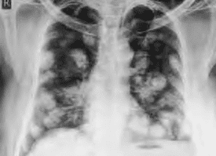
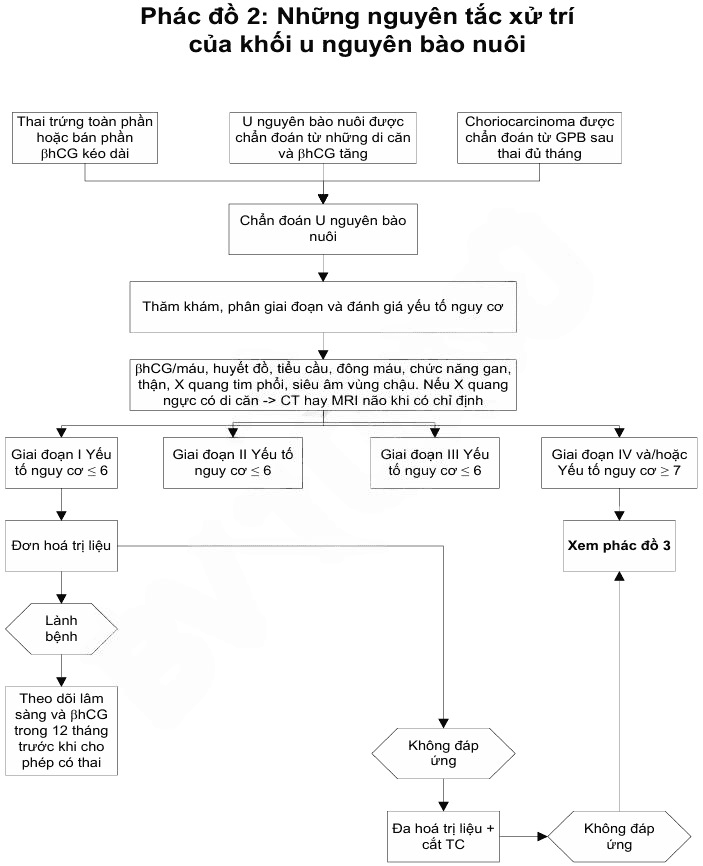
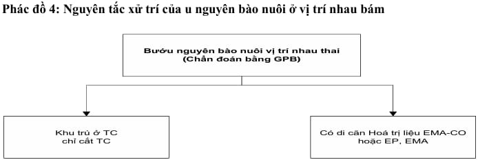

## U nguyên bào nuôi

U nguyên bào nuôi xuất hiện sau thai trứng (60%), thai lưu/sảy thai (30%), thai đủ tháng hay thai ngoài tử cung (10%). Thường có triệu chứng xuất huyết âm đạo kéo dài.

Thai trứng xâm lấn (invasive mole) thể hiện tình trạng các tổ chức nguyên bào nuôi tăng sinh xâm lấn tại chỗ, tức xâm nhập vào thành cơ tử cung, gây ra các biến chứng đặc trưng của sự xâm nhập nguyên bào nuôi là vỡ và chảy máu. Xuất độ thai trứng diễn biến thành thai trứng xâm lấn là khoảng 15% trường hợp. Thai trứng xâm lấn có thể gây xuất huyết nặng do việc xâm thực vào trong cơ tử cung, làm vỡ các mạch máu, xuất huyết nghiêm trọng, và có thể gây thủng tử cung. Chẩn đoán dựa vào β-hCG thường cao 20000-30000 mIU/mL, siêu khối tăng sinh mạch máu trong cơ tử cung, sau cắt tử cung làm giải phẫu bệnh có nhiều nang trứng trong cơ tử cung.

U nguyên bào nuôi tại vị trí rau bám (Placental Site Trophoblastic Tumour - PSTT) thể hiện sự hiện diện khối u của các tổ chức nguyên bào nuôi tại vị trí rau bám trước đây(thường xảy ra sau sinh). PSTT không phải lúc nào cũng có nguồn gốc là sau thai trứng. PSTT có thể xảy ra cả sau thai thường sống, hoặc sau thai ngưng phát triển. Dù không mang các đặc trưng của ác tính điển hình, nhưng PSTT không phải lúc nào cũng lành tính. Không ít trường hợp bệnh nguyên bào nuôi tồn tại có thể dẫn đến tử vong do di căn. β-hCG thường thấp 16-400 mIU/mL.

Ung thư nguyên bào nuôi (choriocarcinoma) dùng mô tả tân lập ác tính từ mô rau. Ung thư nguyên bào nuôi có thể có xuất phát điểm là thai trứng, hoặc là thai thường (sinh sống hay ngưng phát triển). Ngoài ra, ung thư nguyên bào nuôi có thể có nguồn gốc không liên quan đến thai kỳ, mà có bản chất là u tế bào dòng sinh dục của buồng trứng, trong đó tế bào dòng sinh dục phân chia bất thường, không theo con đường giảm nhiễm, mà theo con đường nguyên nhiễm, rồi phân bào nguyên nhiễm tiếp tục để thành ung thư. Trong trường hợp này ta có bệnh nguyên bào nuôi không liên quan đến thai kỳ (non-gestational choriocarcinoma). Choriocarcinoma có thể cho di căn nhiều nơi như âm đạo, phổi, não… hoặc bị vỡ.

### Chẩn đoán

:::note[Tiêu chuẩn chẩn đoán theo FIGO 2002]
Có ít nhất 1 trong những tiêu chuẩn sau (U nguyên bào nuôi nơi rau bám không xếp vào trong nhóm này):

- β-hCG bình nguyên (± 10%) sau 4 lần đo trong ≥ 3 tuần (ngày 1, 7, 14, 21).
- β-hCG tăng (> 10%) sau 3 lần đo liên tiếp trong ≥ 2 tuần (ngày 1, 7, 14).
- Có giải phẫu bệnh là choriocarcinoma.
- β-hCG tồn tại sau 6 tháng theo dõi.

:::

### Phân loại

Khi có GTD ác tính, việc phân loại là quan trọng. Phân loại giúp định hướng theo dõi, tiên lượng và điều trị. Có 2 hệ thống phân loại bệnh GTD ác tính:

1. Phân loại của FIGO.
2. Phân loại của National Institutes of Health - NIH (Mỹ).

| Giai đoạn     | Hệ thống đánh giá nguy cơ theo FIGO 2002                            |
| ------------- | ------------------------------------------------------------------- |
| Giai đoạn I   | Bệnh lý còn khu trú ở tử cung.                                      |
| Giai đoạn II  | Bệnh lý đã lan khỏi tử cung nhưng vẫn còn khu trú ở đường sinh dục. |
| Giai đoạn III | Bệnh lý đã cho di căn phổi.                                         |
| Giai đoạn IV  | Bệnh lý đã cho di căn nơi khác.                                     |

_Hệ thống đánh giá nguy cơ theo FIGO._

_Bảng điểm tiên lượng của u nguyên bào nuôi theo FIGO và WHO 2006. Nguy cơ thấp ≤ 6 điểm: - Giai đoạn I (không di căn). - Giai đoạn II và III < 7 điểm. Nguy cơ cao ≥ 7 điểm: - Giai đoạn II và III ≥ 7 điểm. - Giai đoạn IV._

_Phân giai đoạn theo NIH._

Khi so sánh 2 hệ thống phân loại của FIGO và NIH, ta có thể thấy hệ thống phân loại của NIH đơn giản hơn, lại có tính thực hành. Các nhận định chính là:

1. Hầu hết những bệnh nhân chưa có di căn đều có thể điều trị khỏi bệnh bằng đơn hoá trị, mà không cần quan tâm đến những yếu tố nguy cơ của WHO.
2. Những bệnh nhân có di căn thì đều có tiên lượng xấu, cần thực hiện đa hoá trị.

### Điều trị

Hóa điều trị bệnh nguyên bào nuôi ác tính dựa trên bảng phân loại theo NIH:

1. Hóa trị liệu cho GTD ác tính ở bệnh nhân không có di căn có tỉ lệ khỏi bệnh lên đến gần 100%, có hay không kèm phẫu thuật cắt tử cung. Tuy nhiên, nếu bệnh nhân đã đủ con, phẫu thuật cắt tử cung sẽ làm giảm tổng khối tế bào ung thư, rút ngắn thời gian trở về bình thường của β-hCG.
2. Ở bệnh nhân có di căn và có tiên lượng tốt: có thể khởi đầu bằng đơn hoá trị, kèm phẫu thuật cắt tử cung. Tỉ lệ tái phát < 5%.
3. Ở bệnh nhân có di căn và có tiên lượng xấu: cần đa hoá trị với MAC hoặc EMA/CO. Tỉ lệ sống còn có thể lên đến 84%. Ở các bệnh nhân này, phẫu thuật cắt tử cung có vẻ như không giúp cải thiện tiên lượng.

#### U nguyên bào nuôi nguy cơ thấp

Hóa trị dự phòng với Methotrexate (MTX):

- MTX 5 ngày: MTX 0.4m mg/kg/ngày tĩnh mạch hoặc tiêm bắp x 5 ngày, không quá 25 mg/ngày. Lặp lại chu kỳ mỗi 14 ngày.
- MTX 8 ngày (MTX/FA): MTX 1 mg/kg hoặc MTX 50 mg/ngày tiêm bắp ngày 1, 3, 5, 7 + Folinic acid 0.1 mg/kg tiêm bắp hoặc uống 15mg sau liều MTX 24-30h vào ngày 2, 4, 6, 8. Lặp lại chu kỳ mỗi 14 ngày.
- MTX tuần: MTX 30-50 mg/m² da tĩnh mạch/tuần.
- MTX 100 mg/m² da tĩnh mạch, sau đó 200 mg/m² da pha trong Glucose 5% 500mL truyền tĩnh mạch trong 12 giờ. 24 giờ sau, Folinic acid 15mg tĩnh mạch/uống x 4 lần/12 giờ. Lặp lại chu kỳ mỗi 18 ngày hoặc khi cần.

hoặc Dacticin:

- Dacticin: 1.25 mg/m² da tĩnh mạch mỗi 2 tuần. Thay thế cho MTX 5 ngày ở người bệnh có men gan cao. Lặp lại chu kỳ mỗi 14 ngày.
- Dacticin: 12 mcg/kg (10-13 mcg/kg) hoặc 0.5 mg/ngày tĩnh mạch x 5 ngày liên tục. Thay thế cho MTX 5 ngày ở người bệnh có men gan cao. Lặp lại chu kỳ mỗi 14 ngày.
- Lặp lại thêm 2-3 chu kỳ sau khi β-hCG về âm tính.

#### U nguyên bào nuôi thất bại hoặc kháng trị

β-hCG bình nguyên hoặc tăng khi đang dùng hóa trị (có hoặc không có thêm di căn mới).

Yếu tố liên quan:

- Tuổi > 35.
- β-hCG trước điều trị > 100000 mIU/mL.
- FIGO > 4 điểm.
- Không có tiền căn thai trứng.
- Có di căn âm đạo lớn.
- Giải phẫu bệnh choriocarcinoma.
- Số điểm FIGO tăng.

Xử trí:

- MTX 50 mg/m² da thất bại → MTX 0.4 mg/kg tiêm bắp 5 ngày hoặc Dacticin 12 mcg/kg tiêm bắp 5 ngày.
- β-hCG < 100IU/L → Dacticin 5 ngày (87%).
- β-hCG > 100IU/L → EMA-CO (99%).
- Kháng MTX → Dacticin.

#### U nguyên bào nuôi nguy cơ cao

Phác đồ EMA-CO:

- Ngày 1:
  - Etoposide 100 mg/m² da tĩnh mạch trong 30 phút.
  - Dacticin 0.5mg tĩnh mạch.
  - MTX 100 mg/m² da tĩnh mạch.
  - MTX 200 mg/m² da tĩnh mạch trong 12 giờ.
- Ngày 2:
  - Etoposide 100 mg/m² da tĩnh mạch trong 30 phút.
  - Dacticin 0.5mg tĩnh mạch.
  - Folinic acid 15mg tiêm bắp 2 lần/ngày x 2 ngày sau MTX 24 giờ.
- Ngày 8:
  - Oncovin (Vincristin) 1 mg/m² da tĩnh mạch, tối đa 2mg.
  - Cyclophosphamid 600 mg/m² da truyền tĩnh mạch trong 30 phút.

Phác đồ lặp lại mỗi 2 tuần. Lặp lại thêm 3-4 chu kỳ sau khi β-hCG âm tính.

:::caution[Lưu ý]
Tiêu chuẩn để hóa trị:

- Ngày 1 và 2: Bạch cầu ≥ 3000/mm³, bạch cầu đa nhân trung tính ≥ 1500/mm³.
- Ngày 8. Bạch cầu ≥ 2000/mm³, bạch cầu đa nhân trung tính ≥ 1000/mm³.

:::

Nếu kháng EMA-CO:

- Sử dụng phác đồ EMA-EP hoặc EP-EMA: ngày điều trị CO được thay bằng EP:
  - Cisplatin 70-80mg pha 1L truyền tĩnh mạch hơn 12 giờ.
  - Etoposide 100 mg/m² da (150 mg/m² da) được truyền tĩnh mạch hơn 1h.
- Phác đồ BEP:
  - Cisplatin 20 mg/m² da truyền tĩnh mạch.
  - Etoposide 100 mg/m² da truyền tĩnh mạch vào ngày 1-4.
  - Bleomycin 30 đơn vị tiêm tĩnh mạch hằng tuần.
- Phác đồ TP/TE:
  - Ngày 1:
    - Dexamethasone 20mg uống trước liều Paclitaxel 12 giờ.
    - Dexamethasone 20mg uống trước liều Paclitaxel 6h.
    - Cimetidine 30mg + 100mL NaCl 0.9% truyền trong 30 phút.
    - Chlorphenamine 100mg tĩnh mạch.
    - Paclitaxel 135 mg/m² da + 250mL NaCl 0.9% truyền trong 3h.
    - Mannitol 10% truyền trong 1h.
    - Cisplatin 60 mg/m² da pha 1000mL NaCl 0.9% truyền trong 3h.
    - Sau khi truyền thuốc, truyền tĩnh mạch 1000mL NaCl 0.9% + KCl 20mmol + 1g MgSO₄ truyền trong 2h.
  - Ngày 15:
    - Dexamethasone 20mg uống trước liều Paclitaxel 12 giờ.
    - Dexamethasone 20mg uống trước liều Paclitaxel 6h.
    - Cimetidine 30mg + 100mL NaCl 0.9% truyền trong 30 phút.
    - Chlorphenamine 100mg tĩnh mạch.
    - Paclitaxel 135 mg/m² da + 250mL NaCl 0.9% truyền trong 3h.
    - Etoposide 150 mg/m² da pha 1000mL NaCl 0.9% truyền trong 1h.

#### U nguyên bào nuôi di căn não

- Ngày 1:
  - Etoposide 100 mg/m² da tĩnh mạch trong 30 phút.
  - Dacticin 0.5mg tĩnh mạch.
  - MTX 100 mg/m² da tĩnh mạch.
  - MTX 200 mg/m² da tĩnh mạch trong 12 giờ.
- Ngày 2:
  - Etoposide 100 mg/m² da tĩnh mạch trong 30 phút.
  - Dacticin 0.5mg tĩnh mạch.
  - Folinic acid 15mg tiêm bắp 2 lần/ngày x 2 ngày sau MTX 24 giờ.
- Ngày 8:
  - Oncovin (Vincristin) 1 mg/m² da tĩnh mạch, tối đa 2mg.
  - Cyclophosphamid 600 mg/m² da truyền tĩnh mạch trong 30 phút.
- Kết hợp xạ trị 3000 cGy.

#### U nguyên bào nuôi tái phát

Hóa trị với phác đồ EMA-CO, EMA-EP hoặc EP-EMA.

#### Choriocarcinoma di căn âm đạo

Mổ lấy khối di căn âm đạo nếu vỡ hoặc dọa vỡ nhân choriocarcinoma hoặc kháng thuốc.

Chèn gạc cầm máu khi xuất huyết âm đạo nhiều và không thể mổ lấy khối di căn.

#### Điều trị cấp cứu tại giường

3 ngày liên tục lặp lại mỗi tuần:

- Etoposide 100 mg/m² da truyền tĩnh mạch trong 1h.
- Cisplatin 20 mg/m² da truyền tĩnh mạch trong 2h.

#### Thai trứng xâm lấn

Mổ bóc nhân choriocarcinoma hoặc lấy khối thai trứng xâm lấn với người bệnh trẻ, muốn sinh thêm con, kháng hóa trị hoặc khối choriocarcinoma dọa vỡ.

Cắt tử cung toàn phần nếu lớn tuổi, đủ con.

#### U nguyên bào nuôi nơi rau bám

Phẫu thuật cắt tử cung toàn phần. Nạo hạch (chủ-chậu) nếu có hạch di căn. Thường không nhạy cảm với hóa trị. Hóa trị phác đồ EP-EMA.

#### Phẫu thuật

Chỉ định cắt tử cung toàn phần:

- Chủ yếu cho người bệnh không muốn thêm con.
- Tuổi ≥ 40.
- Tuổi < 40 mà có ≥ 3 con, hay không muốn có con.
- Băng huyết.
- Vỡ nhân chorio.
- Cầm máu khó khăn khi bóc nhân chorio.
- Không đáp ứng hóa trị.

Phẫu thuật bào tồn cắt khối chorio ở tử cung hoặc khối thai trứng xâm lấn cho bệnh nhân trẻ, mong có thêm con.

#### Điều trị bằng xạ trị

Khi có di căn xa như não, gan và di căn sâu vòng chậu.

### Theo dõi

Tương tự như thai trứng, việc theo dõi thai trứng xâm lấn và choriocarcinoma được dựa vào diễn biến của β-hCG và các triệu chứng lâm sàng cận lâm sàng của xâm lấn và di căn như ra huyết âm đạo, kích thước tử cung, nang hoàng tuyến…

Trong chiến lược theo dõi này, theo dõi diễn biến của β-hCG được xem như phương tiện tầm soát và theo dõi chủ lực, còn lâm sàng và các phương tiện khác sẽ được thực hiện nếu có diễn biến bất thường của β-hCG, ngoại trừ khi đã có triệu chứng lâm sàng gợi ý.

_Di căn phổi. Di căn phổi được phát hiện bằng X-quang với hình ảnh bóng bay._

_Di căn não. Di căn não được phát hiện bằng nhức đầu, xuất huyết não hay bằng MRI. Bệnh phẩm tử thiết cho thấy nhân di căn gây xuất huyết ở bán cầu trái._

Xét nghiệm huyết đồ, chức năng gan, thận, điện giải… phát hiện nhiễm độc hóa chất.

Thời gian theo dõi tối thiểu là 5 năm.

Sau thời gian theo dõi, người bệnh được có thai trở lại, tùy trường hợp. Yêu cầu ít nhấ 2 năm sau điều trị khỏi mới có thai lại. Khi có dấu hiệu mang thai cần đi khám thai ngày, chú ý siêu âm và hCG để phòng bệnh tái phát.

_Phác đồ 2 nguyên xử trí của khối u nguyên bào nuôi Bệnh viện Từ Dũ._

_Phác đồ 3 nguyên tắc xử trí u nguyên bào nuôi Bệnh viện Từ Dũ._

_Phác đồ 4 nguyên tắc xử trí của u nguyên bào nuôi tại vị trí rau bám Bệnh viện Từ Dũ._

## Nguồn tham khảo

- Trường Đại học Y Dược TP. HCM (2020) – _Team-based learning_
- Bệnh viện Từ Dũ (2022) – _Phác đồ điều trị Sản Phụ khoa_
