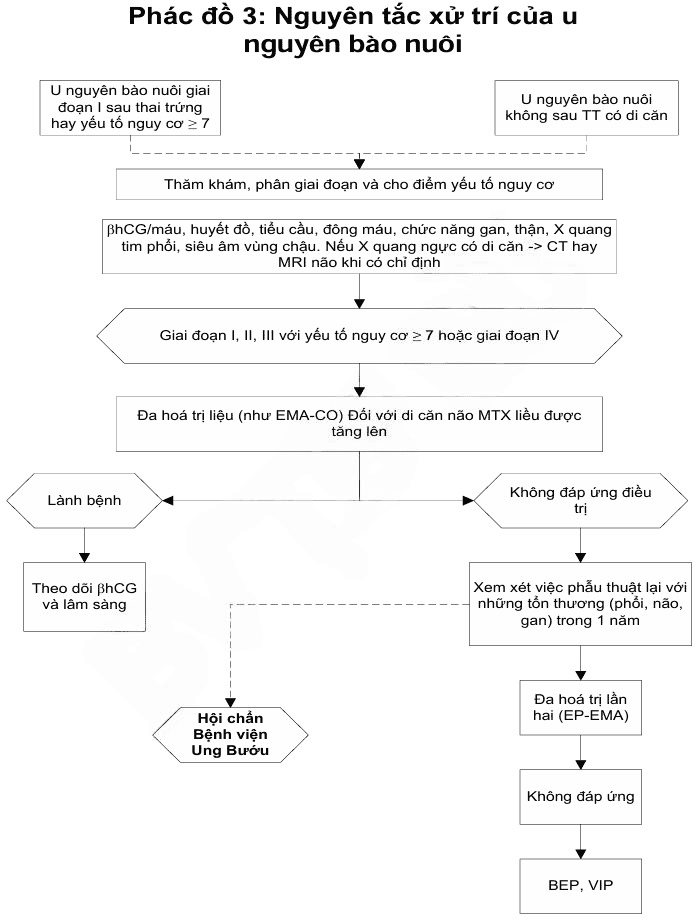

Xuất hiện sau thai trứng ( 60%); thai lưu/sảy thai ( 30%); thai đủ tháng hoặc thai ngoài tử cung ( 10%). Thường khởi đầu bằng xuất huyết âm đạo kéo dài, có thể kèm đau vùng hạ vị hoặc dấu hiệu di căn.

## Các thể lâm sàng

- **Thai trứng xâm lấn (Invasive mole).** Tổ chức nguyên bào nuôi phồng nước xâm nhập vào cơ tử cung, gây chảy máu nặng và có thể thủng tử cung. Tiến triển từ  15 % thai trứng. β-hCG thường 20 000–30 000 mIU/mL. Siêu âm Doppler thấy khối tăng sinh mạch trong cơ. Giải phẫu bệnh sau cắt tử cung ghi nhận gai rau thoái hóa nước trong cơ tử cung.
- **U nguyên bào nuôi tại vị trí rau bám (Placental Site Trophoblastic Tumour – PSTT).** Khối u phát sinh từ tế bào nuôi nơi bám rau, β-hCG thường thấp (16–400 mIU/mL). Ít đáp ứng hóa chất, cần phẫu thuật triệt căn.
- **Ung thư nguyên bào nuôi (Choriocarcinoma).** Tân lập ác tính toàn tế bào nuôi, không còn gai rau; khởi phát sau thai trứng, thai bình thường hoặc tự phát không liên quan thai kỳ (non-gestational). Di căn xa sớm (phổi, não, gan…).
- **U nguyên bào nuôi dạng biểu mô (Epithelioid Trophoblastic Tumour – ETT).** Hiếm, tế bào giống biểu mô nhau thai, diễn tiến chậm, kháng hóa chất, ưu tiên phẫu thuật.

## Chẩn đoán

:::note[Tiêu chuẩn chẩn đoán theo FIGO 2002]

Có ≥ 1 tiêu chí sau (không bao gồm PSTT/ETT)

1. β-hCG không giảm (± 10%) qua 4 lần đo trong ≥ 3 tuần (ngày 1, 7, 14, 21).
2. β-hCG tăng (> 10%) qua 3 lần đo liên tiếp trong ≥ 2 tuần (ngày 1, 7, 14).
3. Có giải phẫu bệnh xác định choriocarcinoma.
4. β-hCG tồn tại sau 6 tháng theo dõi.

:::

## Phân giai đoạn và đánh giá nguy cơ

### Phân loại

**Phân loại FIGO (2002)**

- I: Khu trú tử cung.
- II: Lan tới đường sinh dục nhưng chưa ra ngoài.
- III: Di căn phổi.
- IV: Di căn xa khác.

### Đánh giá nguy cơ

| Thang điểm FIGO (WHO)                | 0          | 1          | 2             | 4          |
| ------------------------------------ | ---------- | ---------- | ------------- | ---------- |
| Tuổi                                 | < 40       | ≥ 40       | —             | —          |
| Tiền cân thai                        | Thai trứng | Bố thai    | Đủ tháng      | —          |
| Số tháng (từ thai lần)               | < 4        | 4 – 6      | 7 – 12        | > 12       |
| hCG trước điều trị mũl/ml            | < 10³      | 10³ - 10⁴  | 10⁴ - 10⁵     | > 10⁵      |
| Kích thước bướu lớn nhất gồm TC (cm) |            | 3 – 4 cm   | ≥ 5 cm        | —          |
| Vị trí di căn                        | Phổi       | Lách, Thận | Dạ dày – ruột | Não Gan    |
| Số điểm di căn                       | —          | 1 – 4      | 5 – 8         | >8         |
| Hóa trị thất bại trước đó            | —          | —          | Đơn hóa trị   | Đa hóa trị |

_Bảng điểm tiên lượng FIGO/WHO 2006_

### Đánh giá di căn

| Phân loại                   | Tiêu chuẩn chẩn đoán                                     |
| --------------------------- | -------------------------------------------------------- |
| **Không di căn**            | Không có bất cứ bằng chứng nào của di căn                |
| **Di căn - Tiên lượng tốt** | Không có bất kỳ yếu tố nguy cơ nào sau:                  |
|                             | - Thời gian từ có thai trước đến phát hiện bệnh <4 tháng |
|                             | - Beta hCG trước điều trị < 40000 UI/ml                  |
|                             | - Thai kỳ trước không phải thai đủ tháng                 |
|                             | - Chưa từng hóa trị trước                                |
|                             | - Không có di căn não hay gan (có thể di căn phổi)       |
| **Di căn - Tiên lượng xấu** | Có ít nhất một yếu tố nguy cơ kể trên                    |

_Phân loại NIH (Mỹ)_

## Điều trị

### Nhóm nguy cơ thấp (FIGO ≤ 6 điểm; NIH không di căn)

- **Đơn hóa chất** (khả năng khỏi  98%) hoặc kèm cắt tử cung nếu đã đủ con.
- **Phác đồ Methotrexate (MTX)**:
  - MTX 5 ngày: 0.4 mg/kg/ngày × 5 ngày (≤ 25 mg/ngày), lặp lại mỗi 14 ngày.
  - MTX/FA 8 ngày: MTX 1 mg/kg (hoặc 50 mg) ngày 1, 3, 5, 7 + Folinic acid 0.1 mg/kg (hoặc 15 mg) ngày 2, 4, 6, 8, lặp lại mỗi 14 ngày.
  - MTX liều cao tuần: 30–50 mg/m² tĩnh mạch/tuần.
- **Dactinomycin (Act-D)**:
  - 1.25 mg/m² tĩnh mạch mỗi 2 tuần, hoặc 12 µg/kg/ngày × 5 ngày, lặp lại mỗi 14 ngày.
- Tiếp tục 2–3 chu kỳ sau khi β-hCG âm tính.

### Nhóm nguy cơ cao (FIGO ≥ 7 điểm hoặc di căn; NIH di căn)

- **Đa hóa chất** (EMA-CO, MAC)
  - **EMA-CO**: Etoposide, MTX, Act-D / Cyclophosphamide, Vincristine theo phác đồ 2 tuần:
    - Ngày 1:
      - Etoposide 100 mg/m² da tĩnh mạch trong 30 phút.
      - Dacticin 0.5mg tĩnh mạch.
      - MTX 100 mg/m² da tĩnh mạch.
      - MTX 200 mg/m² da tĩnh mạch trong 12 giờ.
    - Ngày 2:
      - Etoposide 100 mg/m² da tĩnh mạch trong 30 phút.
      - Dacticin 0.5mg tĩnh mạch.
      - Folinic acid 15mg tiêm bắp 2 lần/ngày x 2 ngày sau MTX 24 giờ.
    - Ngày 8:
      - Oncovin (Vincristin) 1 mg/m² da tĩnh mạch, tối đa 2mg.
      - Cyclophosphamid 600 mg/m² da truyền tĩnh mạch trong 30 phút.
  - Lặp lại thêm 3–4 chu kỳ sau khi β-hCG âm tính.

:::caution[Lưu ý]

Tiêu chuẩn để hóa trị:

- Ngày 1 và 2: Bạch cầu ≥ 3000/mm³, bạch cầu đa nhân trung tính ≥ 1500/mm³.
- Ngày 8. Bạch cầu ≥ 2000/mm³, bạch cầu đa nhân trung tính ≥ 1000/mm³.

:::

- **Nếu kháng EMA-CO**: chuyển sang EP-EMA, BEP hoặc TP/TE:
  - Sử dụng phác đồ EMA-EP hoặc EP-EMA: ngày điều trị CO được thay bằng EP:
    - Cisplatin 70-80 mg pha 1L truyền tĩnh mạch hơn 12 giờ.
    - Etoposide 100 mg/m² da (150 mg/m² da) được truyền tĩnh mạch hơn 1h.
  - Phác đồ BEP:
    - Cisplatin 20 mg/m² da truyền tĩnh mạch.
    - Etoposide 100 mg/m² da truyền tĩnh mạch vào ngày 1-4.
    - Bleomycin 30 đơn vị tiêm tĩnh mạch hằng tuần.
  - Phác đồ TP/TE:
    - Ngày 1:
      - Dexamethasone 20 mg uống trước liều Paclitaxel 12 giờ.
      - Dexamethasone 20 mg uống trước liều Paclitaxel 6h.
      - Cimetidine 30 mg + 100 mL NaCl 0.9% truyền trong 30 phút.
      - Chlorphenamine 100mg tĩnh mạch.
      - Paclitaxel 135 mg/m² da + 250mL NaCl 0.9% truyền trong 3h.
      - Mannitol 10% truyền trong 1h.
      - Cisplatin 60 mg/m² da pha 1000mL NaCl 0.9% truyền trong 3h.
      - Sau khi truyền thuốc, truyền tĩnh mạch 1000mL NaCl 0.9% + KCl 20 mmol + 1 g MgSO₄ truyền trong 2 giờ.
    - Ngày 15:
      - Dexamethasone 20 mg uống trước liều Paclitaxel 12 giờ.
      - Dexamethasone 20 mg uống trước liều Paclitaxel 6 giờ.
      - Cimetidine 30 mg + 100 mL NaCl 0.9% truyền trong 30 phút.
      - Chlorphenamine 100 mg tĩnh mạch.
      - Paclitaxel 135 mg/m² da + 250 mL NaCl 0.9% truyền trong 3 giờ.
      - Etoposide 150 mg/m² da pha 1000 mL NaCl 0.9% truyền trong 1 giờ.
- **Phẫu thuật**:
  - Cắt tử cung toàn phần ở người đã đủ con, băng huyết nặng hoặc khối kháng thuốc.
  - Bảo tồn khối u/khối chorio ở người trẻ mong con.
- **Xạ trị**: cho di căn não, gan sâu.

### U nguyên bào nuôi thất bại hoặc kháng trị

- β-hCG bình nguyên hoặc tăng khi đang dùng hóa trị (có hoặc không có thêm di căn mới).

- **Xử trí**:
  - MTX 50 mg/m² da thất bại → MTX 0.4 mg/kg tiêm bắp 5 ngày hoặc Dacticin 12 µg/kg tiêm bắp 5 ngày.
  - β-hCG < 100IU/L → Dacticin 5 ngày (87%).
  - β-hCG > 100IU/L → EMA-CO (99%).
  - Kháng MTX → Dacticin.

### U nguyên bào nuôi di căn âm đạo

- Mổ lấy khối di căn âm đạo nếu vỡ hoặc dọa vỡ nhân choriocarcinoma hoặc kháng thuốc.
- Chèn gạc cầm máu khi xuất huyết âm đạo nhiều và không thể mổ lấy khối di căn.

### U nguyên bào nuôi di căn não

- Ngày 1:
  - Etoposide 100 mg/m² da tĩnh mạch trong 30 phút.
  - Dacticin 0.5 mg tĩnh mạch.
  - MTX 100 mg/m² da tĩnh mạch.
  - MTX 200 mg/m² da tĩnh mạch trong 12 giờ.
- Ngày 2:
  - Etoposide 100 mg/m² da tĩnh mạch trong 30 phút.
  - Dacticin 0.5 mg tĩnh mạch.
  - Folinic acid 15 mg tiêm bắp 2 lần/ngày x 2 ngày sau MTX 24 giờ.
- Ngày 8:
  - Oncovin (Vincristin) 1 mg/m² da tĩnh mạch, tối đa 2 mg.
  - Cyclophosphamid 600 mg/m² da truyền tĩnh mạch trong 30 phút.
- Kết hợp xạ trị 3000 cGy.

### U nguyên bào nuôi tái phát

- Hóa trị với phác đồ EMA-CO, EMA-EP hoặc EP-EMA.

### Điều trị cấp cứu

- Etoposide 100 mg/m² truyền TM trong 1 giờ + Cisplatin 20 mg/m² truyền TM trong 2 giờ mỗi ngày × 3 ngày, lặp lại hàng tuần cho tới ổn định.

### Thai trứng xâm lấn

- Mổ bóc nhân choriocarcinoma hoặc lấy khối thai trứng xâm lấn với người bệnh trẻ, muốn sinh thêm con, kháng hóa trị hoặc khối choriocarcinoma dọa vỡ.

- Cắt tử cung toàn phần nếu lớn tuổi, đủ con.

#### U nguyên bào nuôi nơi rau bám

- Phẫu thuật cắt tử cung toàn phần. Nạo hạch (chủ-chậu) nếu có hạch di căn. Thường không nhạy cảm với hóa trị. Hóa trị phác đồ EP-EMA.

#### Phẫu thuật

- **Chỉ định cắt tử cung toàn phần**:

  - Chủ yếu cho người bệnh không muốn thêm con.
  - Tuổi ≥ 40.
  - Tuổi < 40 mà có ≥ 3 con, hay không muốn có con.
  - Băng huyết.
  - Vỡ nhân chorio.
  - Cầm máu khó khăn khi bóc nhân chorio.
  - Không đáp ứng hóa trị.

- Phẫu thuật bào tồn cắt khối chorio ở tử cung hoặc khối thai trứng xâm lấn cho bệnh nhân trẻ, mong có thêm con.

#### Điều trị bằng xạ trị

- Khi có di căn xa như não, gan và di căn sâu vòng chậu.

_Phác đồ 2 nguyên xử trí của khối u nguyên bào nuôi – Bệnh viện Từ Dũ._

_Phác đồ 3 nguyên tắc xử trí u nguyên bào nuôi – Bệnh viện Từ Dũ._

_Phác đồ 4 nguyên tắc xử trí của u nguyên bào nuôi tại vị trí rau bám – Bệnh viện Từ Dũ._

## Theo dõi

- **β-hCG** hàng tuần đến âm tính 3 lần liên tiếp, sau đó hàng tháng 6–12 tháng tùy nhóm.
- **Khám lâm sàng, siêu âm, X-quang ngực, cận lâm sàng** khi β-hCG bất thường hoặc có triệu chứng lâm sàng.
- **Thời gian theo dõi tối thiểu**: 5 năm.
- **Thai kì trở lại**: ít nhất 2 năm sau khỏi; siêu âm + β-hCG sớm khi có thai.

  

  _Di căn phổi: hình ảnh bóng bay trên X-quang._

- Xét nghiệm huyết đồ, chức năng gan, thận, điện giải… phát hiện nhiễm độc hóa chất.

- Thời gian theo dõi tối thiểu là 5 năm.

- Sau thời gian theo dõi, người bệnh được có thai trở lại, tùy trường hợp. Yêu cầu ít nhấ 2 năm sau điều trị khỏi mới có thai lại. Khi có dấu hiệu mang thai cần đi khám thai ngày, chú ý siêu âm và β-hCG để phòng bệnh tái phát.

## Nguồn tham khảo

- Trường ĐH Y Dược TP. HCM (2020) – _Team-based learning_
- Bệnh viện Từ Dũ (2022) – _Phác đồ điều trị Sản Phụ khoa_
