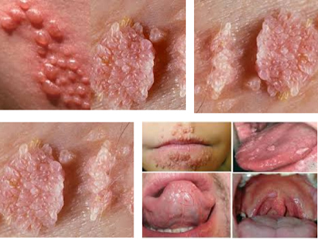

**Bệnh sùi mào gà (Condyloma acuminata)** là một bệnh lý lây truyền qua đường tình dục do virus HPV (Human Papillomavirus) gây ra, đặc biệt là các chủng nguy cơ thấp như HPV týp 6 và 11. Đây là loại virus DNA không vỏ, có ái tính mạnh với biểu mô lát tầng. Virus HPV còn được chia thành hai nhóm chính: nhóm nguy cơ thấp (gây sùi mào gà, mụn cóc) và nhóm nguy cơ cao (gây ung thư cổ tử cung, dương vật, hậu môn...).

_Hình ảnh “Sùi mào gà vùng sinh dục”_.

## Chẩn đoán

### Lâm sàng

**Thời gian ủ bệnh** trung bình từ 2-8 tháng (có thể kéo dài tới 1 năm). Trong thời gian này, bệnh nhân có thể không có triệu chứng nhưng vẫn có khả năng lây lan cho bạn tình.

**Đặc điểm tổn thương**:

- Tổn thương dạng **u nhú, mềm, màu hồng nhạt hoặc trắng**, bề mặt sần sùi, mọc riêng lẻ hoặc kết lại thành đám giống mào gà, súp lơ.
- Không đau, không ngứa, nhưng đôi khi dễ chảy máu khi cọ xát hoặc quan hệ.
- Vị trí thường gặp: Vùng sinh dục ngoài, quanh hậu môn, âm hộ, âm đạo, cổ tử cung (nữ); quy đầu, rãnh quy đầu, thân dương vật, bìu (nam); vùng bẹn, quanh hậu môn, niêm mạc miệng, họng nếu có quan hệ miệng - sinh dục.

**Phụ nữ mang thai**:

- **Tăng nguy cơ bùng phát sùi mào gà** trong thai kỳ do thay đổi nội tiết và suy giảm miễn dịch sinh lý.
- Tổn thương có thể phát triển nhanh, lan rộng hơn bình thường.
- Nguy cơ **lây truyền cho trẻ sơ sinh khi sinh thường** nếu tổn thương nhiều ở âm hộ - âm đạo - cổ tử cung.
- **Biến chứng có thể gặp**: Tăng kích thước sùi → chảy máu, nhiễm trùng, tắc đường sinh dục, cản trở sinh thường; Hiếm gặp lây truyền HPV từ mẹ sang con, dẫn đến u nhú thanh quản tái phát (Recurrent Respiratory Papillomatosis - RRP) ở trẻ nhỏ là một bệnh lý hiếm nhưng nghiêm trọng, thường xuất hiện trong vài năm đầu đời.

**Biến thể**:

- **Sùi mào gà khổng lồ (Buschke-Löwenstein)**: Tổn thương lan rộng, phát triển chậm nhưng xâm lấn tại chỗ, dễ chảy máu, hôi thối. Nguy cơ chuyển dạng ác tính.
- **Tổn thương trong ống hậu môn hoặc cổ tử cung**: Có thể không nhìn thấy ngoài, cần nội soi hậu môn hoặc khám phụ khoa.
- **Sùi ở miệng/họng**: Mụn cóc ở môi, niêm mạc má, hầu họng nếu quan hệ bằng miệng.

### Cận lâm sàng

**Soi cổ tử cung**:

- Dùng **acid acetic 3-5%** bôi lên vùng nghi ngờ → vùng nhiễm HPV sẽ chuyển sang màu trắng đục.
- Sinh thiết tổn thương nghi ngờ ác tính hoặc kéo dài không cải thiện.

**Sinh thiết**:

- Chỉ định khi tổn thương tăng sinh mạnh, nghi ngờ ung thư hóa hoặc điều trị không đáp ứng.
- Mẫu mô có thể thấy biểu mô tăng sản, giãn mạch, koilocytosis (tế bào bị nhiễm HPV điển hình).

**Xét nghiệm HPV DNA**:

- Dùng trong trường hợp nghi ngờ nhiễm HPV nguy cơ cao (typ 16, 18...), đặc biệt khi có tổn thương cổ tử cung hoặc sàng lọc ung thư cổ tử cung.
- Có thể thực hiện trên bệnh phẩm phết cổ tử cung, phết hậu môn, dịch miệng...

### Chẩn đoán phân biệt

- **U mềm lây** (_Molluscum contagiosum_): Mụn nhỏ, tròn, lõm giữa, có chất bã trắng.
- **Mụn rộp sinh dục** (_Herpes simplex virus_): Đám mụn nước nhỏ, vỡ gây loét đau.
- **Chuỗi ngọc dương vật** (pearly penile papules): Dạng sinh lý bình thường, không tăng kích thước, không lan rộng.
- **Gai sinh dục**: Nhỏ, mọc đều, mềm, không tiến triển.
- **U xơ, polyp, ung thư biểu mô**: Khi tổn thương loét, xâm lấn, tăng sinh bất thường cần sinh thiết.

## Điều trị

### Nguyên tắc

- **Không có phương pháp điều trị diệt HPV hoàn toàn**, mục tiêu là loại bỏ tổn thương sùi và giảm lây nhiễm.
- **Điều trị bạn tình** không bắt buộc nếu không có tổn thương, nhưng cần tư vấn theo dõi và tầm soát.
- **Không quan hệ tình dục** cho đến khi tổn thương lành hoàn toàn.
- Điều trị không ngăn ngừa tái phát do HPV còn tồn tại tiềm ẩn trong mô lành.

### Tại chỗ

Áp dụng với tổn thương nhỏ, khu trú.

**Podophyllotoxin 0.5% (dung dịch hoặc gel)**:

- Bôi lên tổn thương 2 lần/ngày trong 3 ngày, nghỉ 4 ngày; lặp lại tối đa 4 chu kỳ.
- **Chống chỉ định cho phụ nữ có thai**.

**Imiquimod 5% (kem bôi miễn dịch tại chỗ)**:

- Bôi 3 lần/tuần, rửa sạch sau 6-10 giờ; điều trị đến khi tổn thương biến mất (tối đa 16 tuần).
- Dùng được cho phụ nữ mang thai (dưới chỉ định bác sĩ).

**Trichloroacetic acid (TCA) 80-90%**:

- Do bác sĩ bôi tại chỗ tổn thương 1-2 lần/tuần.
- Gây hoại tử mô tại chỗ, không ảnh hưởng mô lành nếu dùng đúng cách.

### Phương pháp vật lý

- **Đốt điện (electrocautery)**: Hiệu quả cao với tổn thương lớn.
- **Áp lạnh (liquid nitrogen)**: Dễ thực hiện, chi phí thấp.
- **Laser CO₂**: Dành cho tổn thương sâu, tái phát, khó điều trị.
- **Phẫu thuật cắt bỏ**: Với sùi khổng lồ hoặc nghi ngờ ung thư hóa.

:::caution

- Điều trị cần **theo dõi tái khám định kỳ**, vì nguy cơ tái phát cao trong 3 tháng đầu.
- Không sử dụng podophyllin dạng thô do độc tính cao.

:::

### Phụ nữ mang thai

**Chỉ định**:

- **Chỉ định điều trị khi tổn thương lớn, gây chảy máu, vướng víu hoặc nguy cơ tắc đường sinh dục**.
- **Trì hoãn điều trị nếu tổn thương nhỏ, không triệu chứng**, vì nhiều trường hợp có thể thoái lui sau sinh.

_Bảng "Điều trị sù mào gà"_.

| Phương pháp điều trị                  | Ghi chú                                                                                                                          |
| ------------------------------------- | -------------------------------------------------------------------------------------------------------------------------------- |
| **Trichloroacetic acid (TCA) 80-90%** | Bôi tại chỗ bởi bác sĩ. An toàn cho thai kỳ.                                                                                     |
| **Đốt điện - Laser - Phẫu thuật**     | Áp dụng cho sùi lớn, tắc âm đạo. Nên thực hiện ở tam cá nguyệt 2-3.                                                              |
| **Imiquimod 5%**                      | Chưa khuyến cáo dùng do thiếu dữ liệu an toàn hoàn toàn. Chỉ cân nhắc nếu lợi ích vượt trội nguy cơ, có chỉ định của chuyên gia. |
| **Podophyllotoxin/Podophyllin**       | **Chống chỉ định tuyệt đối** trong thai kỳ. Gây độc cho thai.                                                                    |

**Xử trí khi chuyển dạ**:

- **Không phải tất cả các trường hợp sùi mào gà đều cần mổ lấy thai**.
- **Chỉ định mổ lấy thai** khi: Tổn thương lớn, gây tắc âm đạo; Lo sợ chảy máu sùi trong khi sinh; Lo ngại nguy cơ lây HPV cho trẻ (hiếm, nhưng có thể cân nhắc với tổn thương lan rộng, nhiều).

**Sau sinh**:

- Nhiều trường hợp **tổn thương sùi thoái lui tự nhiên sau sinh**.
- Nếu không tự khỏi, nên **điều trị triệt để sau 6-8 tuần hậu sản**.
- Nên **tiêm vaccine HPV sau sinh** (nếu chưa tiêm trước đó), không chống chỉ định với cho con bú.

### Theo dõi sau điều trị

- **Tái khám định kỳ sau 2-4 tuần** để đánh giá đáp ứng.
- **Khám lại sau 3-6 tháng**, vì trên 30% bệnh nhân có thể tái phát.
- Nếu tổn thương tái đi tái lại, cần **làm xét nghiệm HPV type** và sàng lọc ung thư cổ tử cung (ở nữ).

## Phòng bệnh

**Tiêm vaccine HPV** hiệu quả cao trong phòng ngừa HPV týp 6, 11, 16, 18:

- **Gardasil (tứ giá)**: Dành cho cả nam và nữ từ 9 tuổi trở lên.
- **Cervarix (nhị giá)**: Chống HPV týp 16, 18 (ưu tiên phòng ung thư).

**Sử dụng bao cao su** đúng cách trong mọi hình thức quan hệ tình dục.

**Tầm soát định kỳ** ở người có nguy cơ cao, đặc biệt MSM, người sống chung với HIV.

**Giáo dục sức khỏe tình dục**, tư vấn bạn tình và điều trị kịp thời tổn thương.

## Tài liệu tham khảo

- Bộ Y tế (2021) - _Hướng dẫn chẩn đoán và điều trị sùi mào gà_
- CDC (2021) - _Sexually Transmitted Infections Treatment Guidelines_
- WHO - _Human papillomavirus (HPV) and cervical cancer fact sheet_
