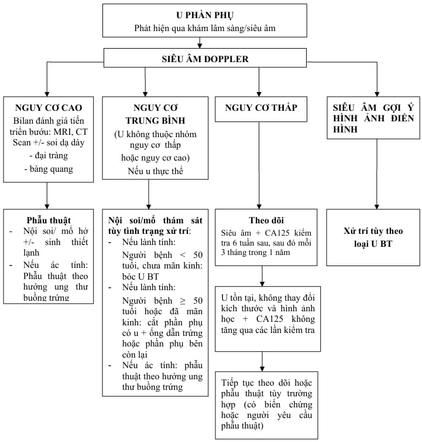

Phần phụ (adnexa) chỉ tất cả các cấu trúc nằm trong khoang giữa thành chậu và thân tử cung, bao gồm:

- Buồng trứng (ovary).
- Vòi trứng (fallopian tube).
- Mạc treo vòi trứng (mesosalpinx).
- Phần trên của dây chằng rộng (mesometrium).
- Các di tích ống Müller (paratubal/parovarian structures).

Khi xuất hiện khối ở vùng này, người ta thường gọi chung là **u phần phụ**. Trong số đó, **u nang buồng trứng** là loại hay gặp nhất (chiếm khoảng 90% các trường hợp), đặc biệt ở độ tuổi sinh sản.

## Chẩn đoán

### Lâm sàng

- **Tiền sử**:

  - Tiền sử cá nhân: có tiền căn ung thư vú, ung thư tử cung hoặc ung thư buồng trứng; đang điều trị các bệnh lý ác tính liên quan đến phần phụ.
  - Tiền sử gia đình: mẹ, chị/em gái bị ung thư vú, ung thư đại tràng, ung thư nội mạc tử cung hoặc ung thư buồng trứng.

- **Bệnh sử**:

  - Tình trạng kinh nguyệt: thống kinh (đau bụng kinh) hay rong kinh, rong huyết.
  - Thời điểm phát hiện khối u (tình cờ hay triệu chứng rõ ràng).
  - Triệu chứng toàn thân và tại chỗ:

    - Cảm giác bụng ngày càng to, nặng bụng, căng tức hạ vị.
    - Triệu chứng chèn ép: rối loạn tiêu hóa (đầy hơi, táo bón) hoặc rối loạn tiết niệu (tiểu khó, tiểu gấp).

- Khám tổng quát: kiểm tra các dấu hiệu nhiễm trùng, thiếu máu, dấu hiệu toàn thân khác.
- Khám vùng chậu (qua thành bụng và thăm âm đạo – thăm trực tràng nếu cần):

  - Xác định vị trí, kích thước, mật độ, di động của khối u.
  - Đánh giá các dấu hiệu phản ứng viêm (đau điểm), phản ứng phúc mạc, phản ứng màng bụng.
  - Phối hợp thăm khám trực tràng để phân biệt với các khối tiêu hóa nếu cần.

- Do vị trí giải phẫu gần kề, khối u phần phụ có thể bị nhầm với:

  - Nhiễm trùng đường tiết niệu (cystitis, pyelonephritis).
  - Sỏi thận/niệu quản.
  - Thận dị dạng hoặc di chuyển thấp.
  - Viêm ruột thừa.
  - Viêm ruột (viêm đại tràng, viêm túi thừa).
  - Ung thư đại – trực tràng.
  - Các khối vùng cùng-cụt (ví dụ u mạc nối, u giả dính).

### Cận lâm sàng

#### Siêu âm

- **Siêu âm đầu dò bụng/đầu dò âm đạo (2D, 3D)**: bước đầu để phát hiện và mô tả kích thước, hình thái khối (đặc, nang, hỗn hợp).
- **Siêu âm Doppler màu**: đánh giá độ tưới máu bên trong khối, giúp ước lượng nguy cơ ác tính theo khuyến cáo của ISUOG (Tổ chức Siêu âm Sản Phụ khoa Thế giới).
- Tiêu chí đánh giá (ví dụ: độ phân thùy, thành khối, vách ngăn, hiện tượng lưu thông mạch, dịch tự do trong ổ bụng...)

#### MRI

- Khi cần đánh giá xâm lấn vào các cơ quan lân cận (bàng quang, trực tràng, đại tràng)
- Phân tích thành phần mô (mỡ, máu, mô cơ trơn) để hỗ trợ chẩn đoán phân biệt u lành – u ác.

#### CT scan

- Chỉ định khi nghi ngờ di căn xa (phổi, gan, hạch) hoặc khi bệnh nhân có chống chỉ định với MRI (ví dụ có máy tạo nhịp tim).
- Đánh giá hạch chậu, hố thắt lưng-chậu, gan, phổi.

#### Xét nghiệm cơ bản

- Tổng phân tích tế bào máu ngoại vi, chức năng thận – gan cơ bản.
- **Dấu ấn sinh học (tumor markers)**:

  - CA125: thường tăng ở ung thư biểu mô buồng trứng, nhưng cũng tăng trong lạc nội mạc tử cung, viêm vùng chậu, thai kỳ...
  - AFP (alpha-fetoprotein), beta-hCG: đánh giá u quái sinh dục (germ cell tumors) ở nữ trẻ.
  - CEA (carcinoembryonic antigen): đôi khi dùng phân biệt với ung thư đại – trực tràng di căn.
  - HE4 (Human epididymis protein 4): kết hợp với CA125 để tính chỉ số ROMA (Risk of Ovarian Malignancy Algorithm).
  - AMH (anti-Müllerian hormone): đánh giá dự trữ buồng trứng, thường không trực tiếp chẩn đoán u nhưng cần để đánh giá chức năng sinh sản.

- **Thuật toán ước tính nguy cơ ác tính**

  - **ROMA (Risk of Ovarian Malignancy Algorithm)**: Dựa vào mức độ CA125 và HE4, cùng tuổi và tình trạng mãn kinh.
  - **RMI (Risk of Malignancy Index)** công thức: RMI = U × M × CA125

    - U: Chỉ số siêu âm (nhiều tiêu chí về thành, vách, dịch tự do...)
    - M: Tình trạng tiền mãn kinh (M = 1 nếu chưa mãn kinh, M = 3 nếu đã mãn kinh)
    - CA125: Giá trị thực nghiệm.

_Tiếp cận u phần~ phụ – Bệnh viện Từ Dũ._

## Nguồn tham khảo

- Trường ĐH Y Dược TP. HCM (2020) – _Team-based learning_
- Bệnh viện Từ Dũ (2022) – _Phác đồ điều trị Sản Phụ khoa_
