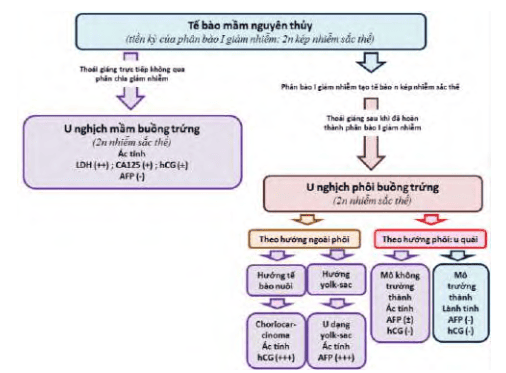

Phân loại các khối u buồng trứng của Tổ chức Y tế Thế giới (2014) được dựa trên cơ sở mô và phôi học của các tân sinh gồm:

1. Các cấu trúc cơ năng của buồng trứng.
2. Các cấu trúc không tân lập tại phần phụ.
3. Các cấu trúc tân lập tại phần phụ.

## Các cấu trúc cơ năng

Các nang cơ năng của buồng trứng hình thành do hoạt động chức năng của buồng trứng. Các cấu trúc cơ năng này gồm:

1. Nang noãn nang (follicle cyst).
2. Nang hoàng thể (corpus luteum cyst).
3. Nang hoàng tuyến.

### Nang noãn

Nang noãn nang hình thành khi nang noãn không vỡ trong quá trình trưởng thành nang, sự phóng noãn không xảy ra.

Các dấu hiệu có thể đi kèm gồm kéo dài giai đoạn phát triển nang noãn của chu kỳ kinh nguyệt, vô kinh thứ phát thoáng qua. Dịch trong nang giàu estrogen. Đa số các nang noãn nang tự biến mất trong vòng 6 tuần. Ức chế phóng thích gonadotropin bằng viên tránh thai chứa estrogen-progestogen phối hợp không làm mất hay làm giảm kích thước của nang noãn nang tuy nhiên sẽ làm giảm hình thành nang noãn mới.

Nếu khối u đã được chẩn đoán là nang noãn nang mà vẫn tồn tại dù đã trải qua các liệu pháp điều trị, thì chẩn đoán về một loại nang hay một cấu trúc khối tân lập khác nên được nghĩ đến và phải được đánh giá chuyên sâu hơn qua hình ảnh.

### Nang hoàng thể

Khi đường kính hoàng thể vượt quá 3 cm, nó được nhận dạng như là loại nang chứ không còn là hoàng thể đơn thuần:

- Nang hoàng thể tồn lưu là nang hoàng thể phì đại nhẹ, có thể vẫn tiếp tục sản xuất progesterone dài ngày hơn so với thông thường, kỳ kinh nguyệt bị trì hoãn từ vài ngày đến vài tuần, thông thường là trong vòng 2 tuần so với chu kỳ đã lỡ.
- Nang hoàng thể xuất huyết là nang hoàng thể to nhanh do xuất huyết trong nang vào giai đoạn hoàng thể của chu kỳ kinh nguyệt, có thể diễn tiến tới vỡ muộn trong giai đoạn hoàng thể.

### Nang hoàng tuyến

Nang hoàng tuyến là loại nang hiếm gặp nhất và liên quan đến thai kỳ. Nang thường xuất hiện ở cả hai bên, thường gặp ở bệnh nhân đa thai, bệnh lý tế bào nuôi hoặc được kích thích buồng trứng. Có nhiều nang phì đại cùng lúc, tuy nhiên loại nang này thường tự thoái triển trong đa số trường hợp mà không cần bất cứ can thiệp y khoa nào.

## Các cấu trúc không tân lập

Các cấu trúc không tân lập tại phần phụ làm phần phụ to lên và được nhận diện như một khối:

1. Cấu trúc hình thành do viêm.
2. Buồng trứng đa nang.
3. Nang lạc nội mạc tử cung (endometrioma).

### Cấu trúc do viêm

Mọi cấu trúc hình thành do viêm đều có thể tạo ra các khối ở phần phụ.

Ứ máu, viêm mủ, viêm lao ống dẫn trứng hay buồng trứng và các cấu trúc của phần phụ là các nguyên nhân thường nhất.

### Buồng trứng đa nang

Đa nang buồng trứng là hội chứng phổ biến, xuất hiện ở trên 20% phụ nữ tuổi sinh đẻ. Tình trạng mà trong đó các nang noãn không phát triển đến trưởng thành được, hình thành các cấu trúc nang thứ cấp muộn có kích thước nhỏ tại lớp vỏ buồng trứng. Các nang này không hoàn thành được tiến trình phát triển, tiết ra chủ yếu là androgen. Đa nang buồng trứng là nguyên nhân gây cường androgen, rối loạn kinh nguyệt với hình ảnh điển hình của buồng trứng với các nang nhỏ xếp thành chuỗi ở ngoại vi trên siêu âm. Cường androgen có thể rất nặng đến mức gây rậm lông (hirsutism).

### Nang lạc nội mạc tử cung

Lạc tuyến nội mạc tử cung tại buồng trứng là cấu trúc không tân lập lành tính, gây đau vùng chậu và hiếm muộn.

Nang lạc nội mạc tử cung được hình thành do sự cấy ghép lên bề mặt buồng trứng của mô nội mạc tử cung bình thường có nguồn gốc từ máu kinh trào ngược. Khi có bất thường về khả năng đáp ứng miễn dịch (có thể do liên quan đến các đột biến gene), cấy ghép bất thường sẽ thành công dẫn đến hình thành các tuyến nội mạc tử cung lạc vị, vẫn còn hoạt động chức năng trên bề mặt buồng trứng. Xuất huyết kinh làm cho các nang bịt này lớn dần lên do chứa đầy máu "kinh" không có đường thoát, gây ra cấu trúc nang, với đặc trưng là viêm, với tân mạch và tàn phá cấu trúc vùng chậu.

Khả năng ác tính của nang lạc nội mạc tử cung tại buồng trứng là rất thấp, nhưng không thể loại trừ. Chẩn đoán phân biệt quan trọng nhất của nang lạc nội mạc tử cung tại buồng trứng là u dạng nội mạc tử cung (endometrioid tumor), tân lập, với tế bào giống tế bào nội mạc, nhưng không có mô đệm tùy hành và liên quan mạnh đến ác tính.

## Các cấu trúc tân lập

### Phân loại

Phân loại dựa trên nguồn gốc mô học và phôi học giúp hiểu rõ tính đa dạng về hình thái, tiên lượng và hệ thống hóa các tân sinh buồng trứng:

1. U xuất phát từ thượng mô (epithelial tumors).
2. U xuất phát từ tế bào mầm (germ cell tumors).
3. U xuất phát từ dây giới bào-mô đệm (sex cord-stromal tumors).
4. U xuất phát từ trung mô (mesenchymal tumors).
5. U tân sinh có nguồn gốc ở nơi khác di căn đến buồng trứng (secondary tumors).
6. Những tổn thương giống u (tumor-like lesions).

#### U xuất phát từ thượng mô

Tân sinh của tế bào biểu mô cổ ống Muller tại buồng trứng, chiếm 50-60% các u buồng trứng, 85% ung thư biểu mô buồng trứng:

1. Biểu mô trụ thấp có lông chuyển: U tuyến thanh dịch.
2. Biểu mô trụ tiết nhầy: U tuyến dịch nhầy.
3. Biểu mô trụ tuyến nội mạc: U dạng nội mạc tử cung.
4. Biểu mô dạng ống: U tế bào sáng.
5. Biểu mô kiểu chuyển tiếp: U Brenner.
6. U tế bào ống Muller hỗn hợp ác tính.

**U tuyến thanh dịch (serous cystadenoma):**

- Lót bởi tế bào trụ thấp, giống biểu mô vòi trứng.
- Có thể lành tính, giáp biên, ác tính.
- Thường ở độ tuổi sinh đẻ, chiếm 30% u buồng trứng, trong đó 70% là lành tính.
- Đặc điểm: Bề mặt trơn láng, vỏ mỏng, đơn hoặc đa thùy, chứa dịch trong, 15% thấy ở hai bên.
- U giáp biên: Không xâm lấn, không di căn nhưng có khả năng tái phát, chiếm 10% u tuyến thanh dịch giáp biên ác, tuổi trung bình 40, 30% hai bên, kích thước có thể đến 25 cm. Vi thể: cấu trúc u nhú, tế bào xếp tầng, tăng phân bào nhưng không xâm lấn.
- U tuyến thanh dịch ác tính chiếm 20% u tuyến thanh dịch.

**U tuyến dịch nhầy (mucinous cystadenoma):**

- Lót bởi tế bào trụ tiết nhầy, giống biểu mô cổ tử cung.
- Có thể lành tính, giáp biên, ác tính.
- Chiếm 60% u buồng trứng, thường rất lớn, nhiều vách, phân thùy.
- 15% là ác tính.
- U giáp biên ác có thể gây pseudomyxoma peritonei.

**U dạng nội mạc tử cung (endometrioid tumor):**

- Lót bởi tế bào giống tuyến nội mạc tử cung.
- Khác với nang endometrioma (lạc nội mạc không tân lập có vỏ và mô đệm), u dạng nội mạc chỉ gồm tế bào nội mạc, không kèm mô đệm.
- Hầu hết ác tính, mô học giống ung thư nội mạc tử cung, 15% kèm lạc nội mạc tử cung.
- Phân biệt với nang endometrioma rất quan trọng.

**U tế bào sáng (clear cell tumour):**

- Hầu hết ác tính, liên quan chặt chẽ với lạc nội mạc tử cung vùng chậu.
- Liên quan đột biến PIK3CA, PTEN; Không liên quan BRCA; Liên quan hội chứng Lynch.

**U Brenner (Brenner tumour):**

- Dạng đặc, nhiều mô đệm và mô xơ bao quanh biểu mô.
- Hiếm ác tính; U biểu mô lành tính hiếm, thường ở phụ nữ lớn tuổi; Có thể liên quan u dịch nhầy.
- Thường nhỏ khi phát hiện.

#### U xuất phát từ tế bào mầm

_Hình ảnh "Sơ đồ cổ điển và giản lược về các khối u tế bào mầm"_.

Khối u từ tế bào nguồn dòng sinh dục đã trải qua một phần giảm phân I:

- Thoái giáng trực tiếp từ 2n kép → 2n (ung thư nghịch mầm, ác tính cao).
- Qua phân bào I giảm nhiễm → tế bào n kép → thoái giáng thành u (ung thư nghịch phôi, đa số lành tính).

**U nghịch phôi theo hướng cấu trúc phôi:**

- Từ tế bào đã qua giảm phân I, thoái giáng trực tiếp từ n kép → 2n, không qua giảm phân II.
- U chứa thành phần của 3 lá phôi, tiềm năng ác tính thấp.
- **U quái trưởng thành (teratoma):** Lành tính 95%, đơn mô hoặc đa mô, thường gặp 10-30 tuổi, khối u trơn láng, chứa mô ngoại bì, trung bì, nội bì (răng, da, tóc, nang, tuyến mồ hôi, tuyến bã). Vi thể: mô trưởng thành.
- **U quái không trưởng thành:** Luôn ác tính, chiếm 15% u tế bào mầm, tuổi trung bình 19, trung bình 18 cm, bề mặt trơn láng, cấu trúc hỗn hợp nang-đặc, vi thể: mô phôi chưa biệt hóa.
- **U quái giáp đơn mô:** ác tính cao, có thể gây cường giáp "không bướu giáp," chụp xạ hình giáp bình thường nhưng tập trung iod ở vùng chậu.

**U nghịch phôi theo hướng cấu trúc ngoài phôi:**

- Tế bào sau giảm phân I thoái giáng thành cấu trúc ngoài phôi (lá nuôi hoặc túi noãn hoàng).
- Thường ác tính: **U yolk-sac** là u tế bào mầm có tỉ lệ tử vong cao nhất, chiếm 20% u tế bào mầm, độ tuổi trung bình 19, thường một bên; **Choriocarcinoma không thai kỳ** là tế bào nuôi ngoại bào thai, hCG tăng nhẹ, gây cường nội tiết, dậy thì sớm, chảy máu tử cung, vô kinh; Vi thể gồm nguyên bào nuôi, nguyên bào nuôi trung gian, hợp bào nuôi; Độ ác tính cao.

**U nghịch mầm (dysgerminoma):**

- Tạo từ tế bào giảm phân dở, thoái giáng trực tiếp từ n kép → 2n.
- Tuổi trung bình 22, 50% phát hiện tình cờ trong thai kỳ, 20% hai bên.
- Chỉ báo: LDH huyết tương, dùng theo dõi tái phát.
- Là khối ác tính, chiếm 45% u tế bào mầm ác tính, 2/3 chẩn đoán giai đoạn I, tiên lượng tốt.
- Vấn đề: Bảo tồn sinh sản. Đáp ứng tốt với xạ trị (không muốn sinh thêm) và hóa trị (muốn sinh thêm).

#### U xuất phát từ dây giới bào-mô đệm

U mô đệm hoặc từ dây giới bào, đơn thuần hoặc hỗn hợp, chiếm 5-8% tân sinh buồng trứng, 2% u ác tính.

**U mô đệm đơn thuần Fibroma (u sợi) & hội chứng Meigs:**

- Hội chứng Meigs gồm: U sợi buồng trứng, báng bụng, tràn dịch màng phổi.
- U sợi buồng trứng trong hội chứng Meigs lành tính một bên, bệnh nhân thường khám do báng bụng/tràn dịch, không do u.
- Cơ chế: VEGF tăng tính thấm mạch máu → báng bụng, tràn dịch. Bệnh thoái lui sau cắt u.

**U mô đệm đơn thuần: Thecoma (u tế bào vỏ):**

- Hầu hết lành tính, thường ở tuổi mãn kinh.
- Chế tiết estrogen, hiếm khi tiết androgen.
- Đại thể: Khối đặc, màu vàng do steroid, dạng sợi.
- Triệu chứng: Xuất huyết tử cung, tăng sinh nội mạc do cường estrogen.

**U dây giới bào đơn thuần:** Xuất phát từ dây giới bào, thường chế tiết steroid hướng nữ tiết estrogen và hướng nam tiết androgen.

**U tế bào hạt (Granulosa cell tumour):**

- Ác tính thấp, đặc trưng vi thể tế bào hạt, tiết estrogen.
- Thường đơn bên, kích thước 15 cm, dạng nang, mô mềm/chắc, mặt cắt chứa dịch máu. Vi thể: Thể Call-Exner.
- 80-90% chẩn đoán giai đoạn I, 95% dạng mô học trưởng thành (adult granulosa tumour, sau mãn kinh), 5% dạng thiếu niên (juvenile granulosa tumour, tuổi dậy thì-sinh sản).
- Triệu chứng: Cường estrogen → tăng sinh nội mạc, xuất huyết bất thường, dậy thì sớm, đôi khi đau do vỡ u.

**U tế bào Sertoli:**

- Xuất phát từ dây giới bào, biệt hóa theo hướng nam, ác tính thấp.
- Thường < 30 tuổi, > 95% tiết estrogen.
- Gây nam hóa, dễ phát hiện sớm (giai đoạn I).

**U hỗn hợp Sertoli-Leydig (Sertoli-Leydig cell tumour, androblastoma):**

- Hiếm, ác tính thấp, phụ thuộc độ biệt hóa.
- Tiết androgen ở 40-60% bệnh nhân → rậm lông, vú teo, phì đại âm vật, dậy thì sớm, rong huyết.
- Cận lâm sàng: Testosterone, androstenedione, 17-hydroxy progesterone.

#### U tân sinh di căn đến buồng trứng

Ung thư đại tràng, dạ dày thường di căn buồng trứng (u Krukenberg). Khi thấy u Krukenberg, cần tìm khối nguyên phát (dạ dày, đại tràng ngang, ngoài ổ bụng). Mô học: Tế bào hình nhẫn (signet ring cell).

### Đặc điểm

Triệu chứng đa dạng, ít liên quan chức năng buồng trứng, không gây rối loạn nội tiết/kinh nguyệt (ngoại trừ u tiết steroid). Thường phát hiện muộn qua khám lâm sàng, siêu âm, chẩn đoán khi u đã lan rộng. Bệnh nhân đến với di căn/chèn ép (báng bụng, di căn phúc mạc). Dấu hiệu gợi ý:

- U lớn hoặc giáp biên ác, grade thấp.
- U nhầy kích thước rất lớn.
- U ác tính có hoại tử, xuất huyết.
- Báng bụng gợi ý ác tính.

### Biến chứng

**Tiến triển ác tính:**

- U buồng trứng không chuyển dạng ác tính từ u lành; Chỉ bỏ sót u ác tính.
- Ung thư buồng trứng khó phân biệt lành-ác lâm sàng, hình ảnh, giải phẫu bệnh do tiến triển âm thầm, diễn biến khu trú vài vùng ác tính.

**Xoắn khối u buồng trứng:**

- U di động, tỷ trọng lớn dễ xoắn.
- Buồng trứng chỉ cố định bằng mạc treo, dây chằng thắt lưng và dây chằng tử cung-buồng trứng, rất lỏng lẻo.
- Triệu chứng: Đau đột ngột, dữ dội vùng bụng, có thể sốc, thăm khám thấy khối cạnh tử cung rất đau, phúc mạc kích thích gây nôn. Bụng vẫn mềm nếu u không vỡ.
- Điều trị ngoại khoa khẩn: Bảo tồn buồng trứng nếu tưới máu hồi phục, qua nội soi hoặc mở bụng. Nếu không chắc lành, cắt bỏ trọn phần phụ bị xoắn.

**Khác:** Xuất huyết trong nang, vỡ u, chèn ép, nhiễm trùng hiếm gặp.

## Tài liệu tham khảo

- Trường ĐH Y Dược TP. HCM (2020) - _Team-based learning_
