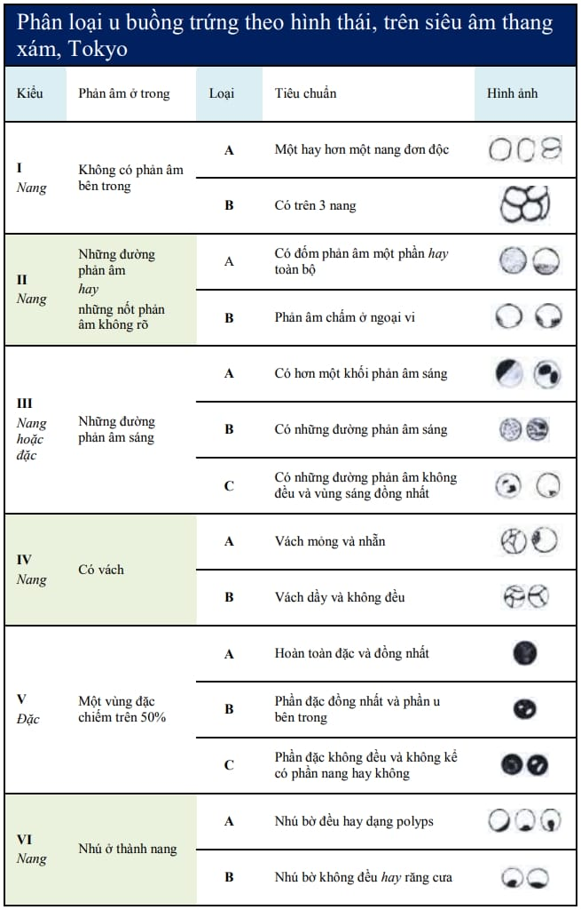
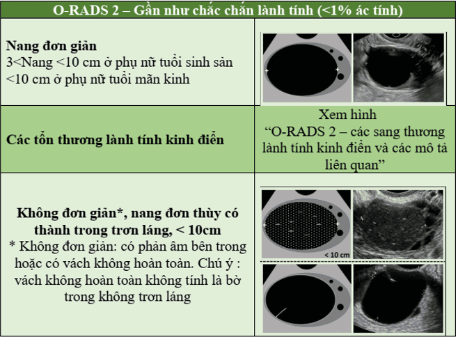
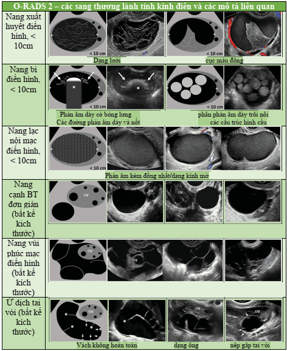
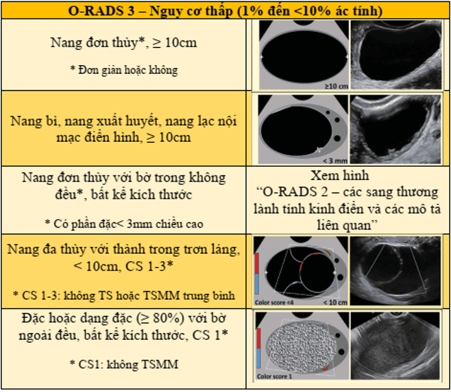
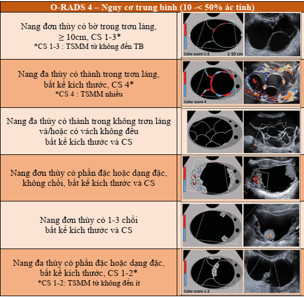
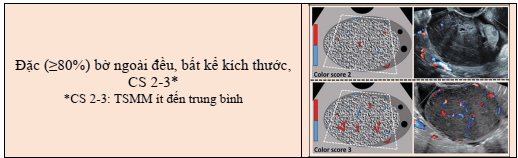
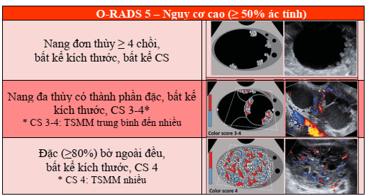
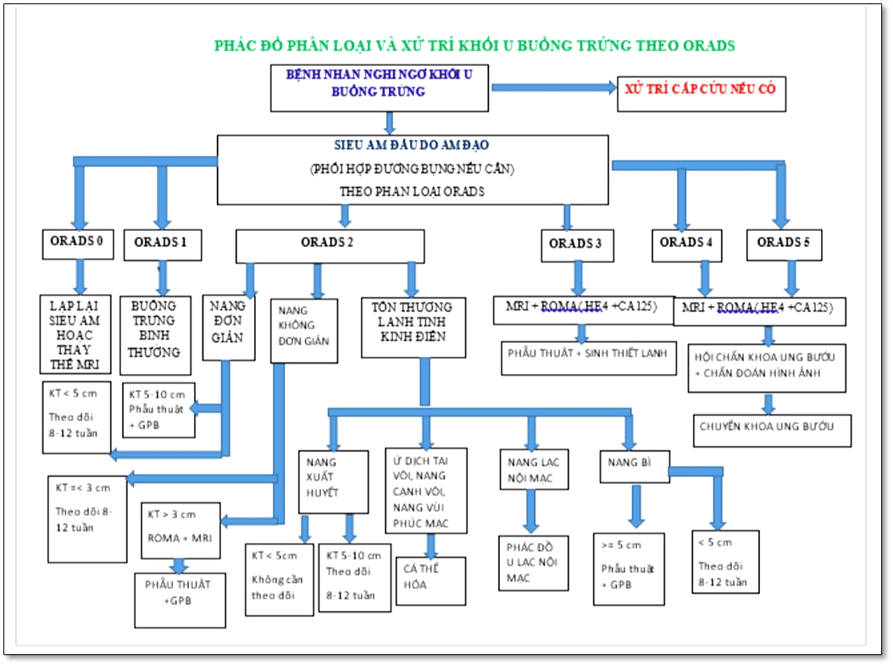
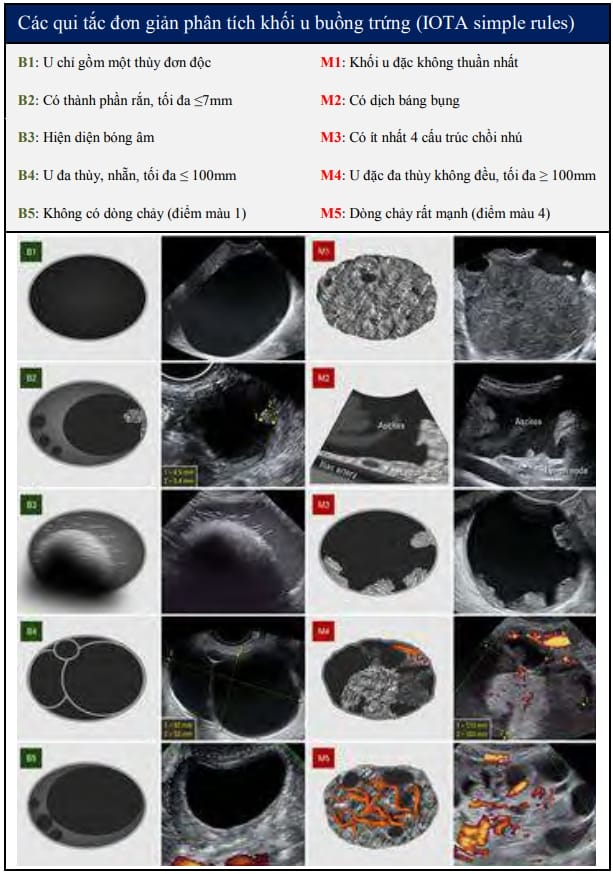

Tiếp cận khối u buồng trứng dựa trên siêu âm, MRI, CT và chỉ báo sinh học.

## Chẩn đoán hình ảnh

Các phương pháp hình ảnh chính:

- **Siêu âm grey-scale** (qua bụng hoặc âm đạo).
- **Siêu âm Doppler**.
- **MRI**.
- **CT scan**.

### Siêu âm

- **Qua bụng**: Sóng tần số thấp → tầm quan sát rộng, đánh giá u lớn, di căn phúc mạc; độ phân giải thấp.
- **Qua đường âm đạo**: Sóng tần số cao → hình ảnh chi tiết, phân biệt lành/ác tốt; tầm quan sát hạn chế, phù hợp u nhỏ-vừa.
- Các đặc điểm quan trọng để đánh giá:
  1. Nang hay đặc.
  2. Phản âm bên trong.
  3. Vách/chồi.
- Siêu âm qua âm đạo (NPV 91–100%, PPV 35–75%) giúp loại trừ hầu hết ác tính.

#### Phân loại u buồng trứng theo hình thái siêu âm Tokyo

_Hình ảnh "Phân loại u buồng trứng theo hình thái siêu âm Tokyo"._

- **Kiểu I**: đa số u nang thanh dịch hoặc nang cơ năng.
- **Kiểu II**: Thường endometrioma, u nang thanh dịch hoặc dịch nhầy.
- **Kiểu III**: Phản âm sáng/đường sáng bên trong → u nang bì.
- **Kiểu I–III**: PPV ung thư gần 0.
- **Kiểu IV–V**: Liên quan ung thư nhưng PPV thấp.
- **Kiểu VI**: PPV ung thư > 90%.

#### O-RADS (ACR Ovarian-Adnexal Reporting và Data System)

Phân tầng nguy cơ dựa trên siêu âm, gồm 6 nhóm:

- **O-RADS 0**: Khó đánh giá (hơi ruột, sang thương lớn, vị trí khó...).
- **O-RADS 1**: Sang thương sinh lý (nang noãn, nang hoàng thể). 
  _Hình ảnh "O-RADS 1"._
  
- **O-RADS 2** (< 1% ác): Nang đơn thùy < 10 cm (đơn giản hoặc "lành kinh điển" như nang xuất huyết điển hình, nang bì, endometrioma, nang cạnh buồng trứng, nang vùi phúc mạc, ứ dịch tai vòi). 
  _Hình ảnh "O-RADS 2A"._
  
  _Hình ảnh "O-RADS 2B"._
  
- **O-RADS 3** (1–< 10% ác):
  - Nang đơn giản/đơn thùy trơn láng ≥ 10 cm.
  - Nang đơn thùy với thành không đều.
  - Nang đa thùy < 10 cm không thành phần đặc, điểm < 4.
  - Sang thương đặc không tăng sinh mạch, bờ trơn láng. Có thể cần Doppler để xác định thành phần đặc. 
    _Hình ảnh "O-RADS 3"._
    
- **O-RADS 4** (10–< 50% ác):
  - Nang đa thùy ≥ 10 cm hoặc có vách/ thành không đều (< 3 mm).
  - Nang đơn/đa thùy có thành phần đặc hoặc CS 4.
  - Sang thương đặc bờ trơn láng (> 80% đặc) với CS 2–3.  
    "Nhú" = thành phần đặc ≥ 3 mm. 
    _Hình ảnh "O-RADS 4A"._
    
    _Hình ảnh "O-RADS 4B"._
    
- **O-RADS 5** (≥ 50% ác): Sang thương đặc bờ không đều, nang đa thùy có thành phần đặc với CS cao; hoặc kèm báng bụng/nốt phúc mạc (ngoại trừ báng do nang chức năng hoặc nang chắc chắn lành). 
  _Hình ảnh "O-RADS 5"._
  

_Hình ảnh "Phác đồ xử trí và phân loại O-RADS"._

### Siêu âm Doppler

- **Tân tạo mạch** trong u ác làm giảm trở kháng dòng chảy → đặc điểm bổ sung quan trọng.
- Kết hợp siêu âm Doppler với thang xám giúp tăng độ chuyên biệt (pooled specificity 0.78).
- **Phân loại IOTA (2010)**: Độ nhạy 91%, độ chuyên biệt 95%. Phân theo quy tắc:
  - **B-rules (lành tính)**:
    - B1: U đơn thuần 1 thùy.
    - B2: Thành phần rắn ≤ 7 mm.
    - B3: Tồn tại bóng âm.
    - B4: U đa thùy trơn láng ≤ 100 mm.
    - B5: Không có dòng chảy (điểm màu 1).
  - **M-rules (ác tính)**:
    - M1: U đặc không đồng nhất.
    - M2: Kèm dịch báng bụng.
    - M3: ≥ 4 chồi nhú.
    - M4: U đặc đa thùy không đồng nhất > 100 mm.
    - M5: Dòng chảy rất mạnh (điểm màu 4).

_Hình ảnh "Phân loại u buồng trứng theo IOTA"._

### CT-scan

- Giá trị dự báo ung thư thấp hơn siêu âm.
- Chỉ định khi cần đánh giá:
  - Tổn thương trong bối cảnh lan tràn vùng chậu.
  - Cấu trúc u & mối liên hệ với cơ quan xung quanh.
- Hữu ích hơn nếu có thuốc cản quang.

### MRI

- Chỉ định khi cần:
  - Tổn thương trong bối cảnh bệnh lý vùng chậu đã lan tràn.
  - Cấu trúc u & mối liên hệ với cơ quan xung quanh.
- Hiệu quả để:
  - Mô tả u rất nhỏ vùng bụng.
  - Xác định vị trí u và dính vào cơ quan xung quanh.
  - Phát hiện di căn hoặc chèn ép.

## Các chỉ báo sinh học

- **Chủ yếu dùng để theo dõi sau mổ**; giá trị chẩn đoán trước mổ chưa rõ ràng.

### CA125

- Là glycoprotein (MUC16) do thượng mô phúc mạc và mô Müllerian tiết.
- Tăng trong: Ung thư buồng trứng, vú, phổi, tụy, đại tràng... và nhiều tình trạng lành: thai kỳ, lạc nội mạc tử cung, hành kinh, tràn dịch màng bụng/ phổi (lao, suy tim...).
- Giá trị ngưỡng chung: 35 IU/mL; sau mãn kinh hoặc đã cắt TC + 2 buồng trứng nên dùng ngưỡng 20–26 IU/mL.
- Trong u biểu mô buồng trứng: CA125 tăng chủ yếu ở u thanh dịch, ít ở u nhầy, tế bào sáng hoặc giáp biên.
- **Không dùng để sàng lọc u sớm** (độ nhạy 10–50%, độ đặc hiệu 30%).
- **Độ nhạy CA125** cho ung thư tiến triển xa 85%.
- **Theo dõi tái phát**: độ nhạy 60%, độ đặc hiệu 20%.

### HE4

- Chỉ báo tái phát & tiến triển ung thư biểu mô buồng trứng.
- Tăng ở 93% u tuyến thanh dịch, 100% u dạng nội mạc, 50% u tế bào sáng. Ít tăng ở u nhầy.
- Độ nhạy 67%, độ đặc hiệu có thể > 90% → FDA công nhận HE4 để theo dõi tái phát/tiến triển.
- Thường đo cùng CA125, kết hợp trong **ROMA test**.

### ROMA test

- Toán đồ kết hợp CA125, HE4 và đặc điểm cá nhân (tiền sử, tuổi, mãn kinh).
- Phân tầng nguy cơ:
  - **Nguy cơ cao** nếu điểm ROMA ≥ cut-off (lưu ý khác nhau ở nhóm trước/sau mãn kinh).
  - **Nguy cơ thấp** nếu < cut-off.
- NPV rất cao ( 99%); ROMA phát hiện 94% ung thư biểu mô buồng trứng vào nhóm nguy cơ cao.

:::caution
ROMA test không dùng sàng lọc ung thư giai đoạn sớm.
:::

### AFP

- AFP < 5.4 ng/mL bình thường.
- Tăng ở u tế bào mầm, carcinoma tế bào gan, ung thư dạ dày, đường mật, tụy...

### β-hCG

- Sản xuất bởi hợp bào nuôi rau thai.
- Tăng khi có thai, u nguyên bào nuôi hoặc một số u tế bào mầm.

### Các dấu ấn khác

- **LDH**, **steroid** (testosterone, androstenedione...) được thực hiện chọn lọc.

## Khảo sát đột biến gene

- 95% ung thư buồng trứng không di truyền; 5% còn lại liên quan đột biến gene.

### Đột biến BRCA1/BRCA2

- Khiếm khuyết sửa DNA, tăng nguy cơ ung thư vú và buồng trứng.
- Xét nghiệm khi có tiền căn gia đình:
  - ≥ 3 người cùng huyết thống 1 hoặc 2 bị ung thư vú/buồng trứng (ít nhất một dưới 50 tuổi).
  - 2 người trong cùng thế hệ (1 hoặc 2) bị ung thư vú/buồng trứng.
  - Ung thư vú ở nam giới.
  - Bệnh nhân < 50 tuổi.
  - Người thân cùng lúc mắc ung thư vú và buồng trứng.

### Các đột biến khác

- **TP53**: Liên quan ung thư biểu mô buồng trứng thanh dịch grade cao; cũng gặp nhiều ung thư khác, là chỉ báo tiên lượng xấu.
- **PIK3CA**: Liên quan u tế bào sáng, u nhầy, u dạng nội mạc.
- **CTNNB1 exon 3**: Gặp u dạng nội mạc ác tính grade thấp, giai đoạn sớm.
- **KRAS**, **BRAF**: Thường gặp ở ung thư grade thấp.

## Tài liệu tham khảo

- Trường ĐH Y Dược TP. HCM (2020) – _Team-based learning_
