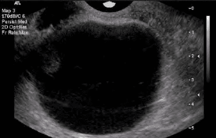
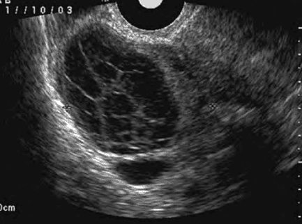

Các cấu trúc cơ năng của buồng trứng hình thành từ hoạt động chức năng. Chu kỳ bình thường:

- Một đoàn noãn được chiêu mộ và phát triển.
- Một nang noãn trưởng thành đủ sản xuất estradiol.
- Trục hạ đồi-yên hoạt động bình thường, đảm bảo feedback steroid, gây phóng noãn, thành lập và ly giải hoàng thể.
- Hoặc hoàng thể chu kỳ chuyển sang hoàng thể thai kỳ dưới tác động β-hCG.

Khi stress, thuốc hay yếu tố khác làm rối loạn chức năng, xuất hiện:

- Khối ở buồng trứng.
- Triệu chứng liên quan chu kỳ hoặc thai kỳ.

Các cấu trúc này tự thoái lui khi yếu tố kích thích biến mất. Gồm:

1. Nang noãn nang (follicle cyst).
2. Nang hoàng thể (corpus luteum cyst).
3. Nang hoàng tuyến thai kỳ (pregnancy luteoma).

## Nang noãn nang

_Hình ảnh "Nang đơn trên siêu âm, 5-8 cm, thành mỏng, không chồi, không vách. Nang noãn nang thường tự mất sau vài chu kỳ"_.

Là nang noãn không trưởng thành và không phóng noãn. Nang tiếp tục tăng kích thước, sản xuất steroid bất thường. **Nguyên nhân** do phản hồi steroid bị triệt tiêu (ví dụ dậy thì, quanh mãn kinh, steroid ngoại sinh, stress). **Cấu trúc** gồm thành lót tế bào hạt xung quanh tế bào vỏ, lòng nang chứa estrogen; Đôi khi chỉ còn tế bào vỏ nếu tế bào hạt tróc rời; Nang có thể đạt 5-8 cm, tồn tại xuyên chu kỳ.

**Triệu chứng**:

- Rối loạn kinh (vắng progesterone).
- Đau bụng nhẹ-vừa, lệch một bên, kèm rối loạn kinh.
- Thăm khám thấy nang di động.
- Nang có thể vỡ gây đau cấp, nhưng thường tự lành, chỉ cần giảm đau.

**Điều trị**:

- Hầu hết tự mất trong 6 tuần, không cần can thiệp.
- COC không tiêu nang mà chỉ ngăn nang mới hình thành, chờ nang cũ thoái triển.
- Nếu nang tồn tại nhiều chu kỳ, cần chẩn đoán hình ảnh để loại trừ nang tân sinh.

## Nang hoàng thể

_Hình ảnh "Hoàng thể xuất huyết trên siêu âm"_.

Hoàng thể hình thành sau phóng noãn, từ tế bào vỏ-hạt dưới tác dụng LH. **Chức năng** tiết estrogen và progesterone, chuẩn bị làm tổ và duy trì thai. Progesterone gây feedback giảm GnRH/LH, dẫn đến ly giai hoàng thể.

**Hoàng thể tồn lưu**:

- Progesterone không ức chế LH đủ, hoàng thể phì đại, sản xuất progesterone không ổn định dẫn đến trễ kinh, đau hạ vị âm ỉ, rong huyết, thăm khám thấy khối phần phụ mềm. Triệu chứng giống thai ngoài tử cung nhưng β-hCG âm tính.
- **Nguyên nhân**: Rối loạn feedback progesterone lên hạ đồi (có thể tạm thời hoặc kéo dài).
- **Điều trị**: COC giữ cho trục hạ đồi-yên nghỉ ngơi.

**Hoàng thể xuất huyết**:

- Khi hình thành hoàng thể, mạch máu xâm nhập lòng nang, xuất huyết thường tự cầm. Nếu xuất huyết không giới hạn, hoàng thể to > 3 cm.
- Nếu vỡ nang, có thể chảy máu ổ bụng, cần phẫu thuật cầm máu. Nếu chỉ căng nang, gây đau, xử trí giảm đau và theo dõi.
- Bệnh nhân không dùng COC, có kinh đều, đau cấp hạ vị ở pha hoàng thể. Một số hiếm chảy máu nhiều cần mổ.
- **Nhóm nguy cơ**: Người dùng thuốc chống đông hoặc rối loạn đông máu.

## Nang hoàng tuyến

Hình thành khi tất cả noãn nang (kể cả nang chưa phóng noãn) bị kích thích bởi β-hCG rất cao. Thường gặp trong thai trứng hoặc đa thai; β-hCG ngoại sinh (hỗ trợ sinh sản) có thể gây hội chứng quá kích buồng trứng (hyperreactio luteinalis). Do kích thích mọi nang, thường xảy ra hai bên, tạo khối hỗn hợp lớn. Nang hoàng tuyến tự thoái triển khi β-hCG giảm (kết thúch thai kỳ hoặc hết liệu pháp β-hCG).

## Tài liệu tham khảo

- Trường ĐH Y Dược TP. HCM (2020) - _Team-based learning_
