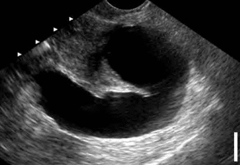

Các khối thực thể không tân lập tại phần phụ là tất cả các khối bất thường ở phần phụ, không mang đặc điểm tân sinh. Thường gặp nhất:

- **Nang lạc tuyến nội mạc tử cung** (endometrioma) ở buồng trứng.
- **Ứ dịch vòi Fallope** do di chứng nhiễm **Chlamydia trachomatis** hoặc viêm dính vùng chậu.
- **Khối dính do lao**.
- **Giả nang phúc mạc** do nhiễm trùng kinh niên vùng chậu hoặc sau phẫu thuật.

Đặc trưng chung: Triệu chứng thường rõ (đau, rối loạn kinh, hiếm muộn...), khác với khối tân lập (thường âm thầm).

## Nang lạc tuyến nội mạc tử cung

### Bệnh sinh

_Hình ảnh "Thuyết cấy ghép, quá trình viêm và cường estrogen"._

Là **"giả nang"** không vỏ, phát triển trên bề mặt buồng trứng, bao gồm biểu mô nội mạc tử cung và mô đệm tùy hành. Trong chu kỳ, lớp nội mạc bên trong nang cũng hành kinh—máu bị giữ lại, cô đặc thành dịch nâu **"chocolate"** giàu hemosiderin.

**Giả thuyết cấy ghép**: Máu kinh trào ngược qua vòi Fallope, "gieo" tế bào nội mạc lên buồng trứng. Tế bào nguyên thủy (progenitor) phát triển khi đáp ứng miễn dịch cho phép. Đột biến HMGA1/HMGA2 liên quan.

**Cơ chế viêm**: Arachidonic acid → COX-2 → prostaglandin PGE₂ → kích hoạt aromatase/STAR → tăng estrogen, duy trì mô lạc vị.

### Phân loại

_Hình ảnh "Phân giai đoạn lạc tuyến nội mạc tử cung vùng chậu (AFS-ASRM)"._

### Cận lâm sàng

_Hình ảnh "Nang lạc tuyến nội mạc tử cung ở buồng trứng"._

**Siêu âm thang xám**: Nang đơn/multiple phản âm kém đều, giới hạn rõ, không chồi/vách, không tăng dòng mạch. IOTA M-rules âm tính. Siêu âm đủ để chẩn đoán; MRI chỉ khi nghi ngờ lạc nội mạc sâu hay đau dữ dội.

**CA125**: Thường tăng cao nhưng không đặc hiệu (tăng ở cả endometrioma và u biểu mô dạng nội mạc tử cung).

### Quản lý

**Nang đơn thuần, không triệu chứng**:

- Lành tính, tiềm năng ác tính rất thấp. Phát hiện tình cờ, không cần điều trị nếu không đau, không hiếm muộn.
- **Không có điều trị nội khoa** làm mất nang; Nếu không muốn có thai, có thể dùng COC để ngăn nang mới.
- **Chỉ định phẫu thuật** khi: Nghi ngờ ác tính (IOTA M-rules, CA125 tăng hoặc nang > 5-6 cm), nang to nhanh, diễn biến bất thường. Cân nhắc yếu tố cá nhân (tình trạng hôn nhân, kế hoạch sinh con, triệu chứng).

**Nang kèm đau**:

- Đau thường do lạc nội mạc tử cung phúc mạc hoặc lạc nội mạc thâm nhiễm sâu.
- **Điều trị hàng đầu**: NSAID (ưu tiên ức chế COX-2).
- **Điều trị hàng hai**: COC hoặc progestogen (IUS-LNG hiệu quả nhất, ít tác dụng phụ). Dùng liên tục không nghỉ kinh không tăng hiệu quả thêm. Danazol gây nhiều tác dụng phụ (nam hóa, trầm giọng), không khuyến cáo.
- **Điều trị hàng ba**: GnRH đồng vận (ức chế estrogen) — chỉ dùng ngắn hạn do nguy cơ loãng xương.
- **Phẫu thuật** chỉ khi có tổn thương gây đau rõ (lạc nội mạc sâu, dính phúc mạc) nhằm chẩn đoán giai đoạn và xử lý.

**Nang kèm hiếm muộn**:

- Nang endometrioma không ảnh hưởng trực tiếp đến chất lượng noãn hay kết quả IVF.
- Phẫu thuật chỉ để **đánh giá giai đoạn** (AFS-ASRM), giúp lên kế hoạch điều trị hiếm muộn.
- Nếu bóc nang, chắc chắn xảy ra: Tái phát (đúng); Giảm dự trữ buồng trứng (đúng); Hiệu quả trên kết quả hiếm muộn không chắc chắn.

## Ứ dịch vòi Fallope

**Các tình trạng ưu tiên ngoại khoa**: Ứ dịch vòi, áp-xe vòi-buồng trứng không đáp ứng kháng sinh, lao vòi trứng.

**Siêu âm**: ứ dịch vòi hình ảnh dãn, chứa dịch - thường hai bên.

_Hình ảnh "Vòi Fallope ứ dịch trên siêu âm"._

**Bệnh học**: Viêm mạn tính khiến vòi xơ hóa, bít tắc, dễ tạo ổ viêm thứ phát đa vi khuẩn (kể cả kỵ khí). Nội độc tố, cytokine, gốc tự do từ ổ viêm lan vào buồng tử cung. Môi trường dịch vòi nghèo dinh dưỡng, đặc biệt ít glucose. Ứ dịch vòi sau _Chlamydia_ có thể giảm hiệu quả làm tổ trong IVF. **Cắt bỏ vòi ứ dịch** trước IVF cải thiện tỉ lệ làm tổ. Dịch vòi tổn thương chứa độc tố, ảnh hưởng sản xuất cytokine (IL-1, LIF, CSF-1, integrin αvβ3) làm tổ.

Nếu không thể cắt toàn bộ vòi do dính chặt, có thể **đứt vòi** gần buồng tử cung (salpingostomy), hiệu quả tương tự cắt vòi, nhưng ổ dịch tái ứ còn tồn tại, nguy cơ viêm lâu dài.

## Tài liệu tham khảo

- Trường ĐH Y Dược TP. HCM (2020) - _Team-based learning_
