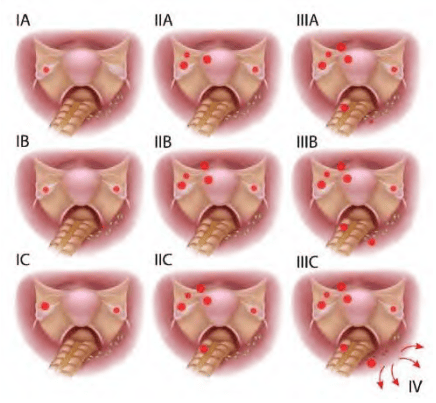

Chẩn đoán **khối tân lập ở buồng trứng luôn phải đi kèm dự đoán khả năng lành/ác tính**.

## Nguyên tắc

**Mục tiêu**: Ước đoán chính xác nhất khả năng lành/ác tính dựa vào tiền sử, lâm sàng, hình ảnh, chỉ báo khối u.

**Tất cả khối tân lập** buồng trứng được điều trị ngoại khoa.

**Khối nghi lành tính** (dân số nguy cơ thấp, thỏa IOTA lành, ROMA thấp...):

- Phẫu thuật nội soi bảo tồn: Đánh giá đại thể, bóc u, bảo tồn mô lành (trẻ) hoặc cắt phần phụ (người lớn tuổi).
- Hạn chế sang chấn để tránh giảm dự trữ buồng trứng.

**Khối nghi ác tính** (IOTA ác, ROMA cao...):

- Mổ mở: Đầu tiên: Xét nghiệm tế bào học dịch báng/dịch rửa ổ bụng. Khảo sát các tạng bụng (dạy dày, đại trực tràng, ruột thừa...) để phát hiện di căn. Cắt trọn khối, không vỡ u; Cắt ruột thừa, mạc nối lớn khi cần.
- Ghi chép đầy đủ TNM để xác định giai đoạn FIGO.
- Điều trị bổ sung (hóa/trị xạ) tùy loại ung thư, giai đoạn, grade.
- Nội soi "second look" để đánh giá đáp ứng và tái phát.

## Phòng ngừa

**Mang thai đủ tháng**, **cho con bú**, **dùng COC** làm giảm nguy cơ ung thư biểu mô buồng trứng.

**Cắt buồng trứng dự phòng** là biện pháp duy nhất ngăn ngừa hoàn toàn.

:::caution
Theo ACOG, giữ lại buồng trứng nếu chưa mãn kinh. Tuy nhiên, xét nguy cơ tuổi mãn kinh, có thể cân nhắc cắt bỏ buồng trứng.
:::

## Các giai đoạn

_Hình ảnh "Các giai đoạn ung thư buồng trứng theo FIGO"._

**Giai đoạn I** (chỉ ở buồng trứng):

- Ia: 1 buồng trứng.
- Ib: 2 buồng trứng.
- Ic: 1 hoặc 2 buồng trứng + vỏ vỡ hoặc dịch ổ bụng/ dịch rửa có TB ác tính.

**Giai đoạn II** (buồng trứng + di căn vùng chậu):

- IIa: Di căn tử cung/vòi trứng.
- IIb: Di căn vùng chậu khác.
- IIc: IIa hoặc IIb + vỏ vỡ hoặc dịch ổ bụng/ dịch rửa có TB ác tính.

**Giai đoạn III** (ngoài vùng chậu và/hoặc hạch & di căn bề mặt gan/ mạc nối):

- IIIa: Di căn phúc mạc vi thể, không hạch.
- IIIb: Di căn phúc mạc đại thể > 2 cm, không hạch.
- IIIc: IIIb và/hoặc di căn hạch sau phúc mạc hoặc hạch bẹn.

**Giai đoạn IV** (di căn xa): Tràn dịch màng phổi hoặc di căn nhu mô gan.

## Tài liệu tham khảo

- Trường ĐH Y Dược TP. HCM (2020) - _Team-based learning_
