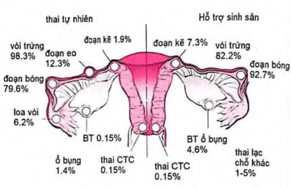

**Chửa ngoài tử cung (CNTC)** là hiện tượng trứng đã thụ tinh không làm tổ trong buồng tử cung mà phát triển ở vị trí bất thường, phổ biến nhất là ở ống dẫn trứng. Đây là một cấp cứu sản khoa cần được phát hiện sớm để tránh nguy cơ vỡ khối thai, xuất huyết trong ổ bụng và ảnh hưởng đến khả năng sinh sản.

_Hình ảnh "Các vị trí chửa ngoài tử cung"_.

## Yếu tố nguy cơ

- Viêm nhiễm sinh dục, đặc biệt do **Chlamydia trachomatis** hoặc các bệnh lây qua đường tình dục khác.
- Tiền sử phẫu thuật ống dẫn trứng: Tái tạo, nối lại sau triệt sản hoặc can thiệp khác gây sẹo, hẹp lòng ống.
- Tiền sử chửa ngoài tử cung.
- Hỗ trợ sinh sản: Kích thích rụng trứng, thụ tinh trong ống nghiệm (IVF), chuyển phôi.
- Bất thường giải phẫu tử cung hoặc phần phụ như polyp, dính buồng tử cung, túi thừa ống dẫn trứng.
- Đặt dụng cụ tử cung (IUD), đặc biệt nếu xảy ra có thai trong khi đang đặt vòng.
- Một số yếu tố khác: Hút thuốc lá, tuổi mẹ lớn, tiền sử vô sinh.
- Các biện pháp tránh thai nội tiết (thuốc tránh thai hằng ngày, tránh thai khẩn cấp) hoặc tiền sử sảy thai, phá thai, mổ lấy thai **không làm tăng nguy cơ chửa ngoài tử cung.**

## Chẩn đoán

### Tại ống dẫn trứng chưa vỡ

#### Lâm sàng

**Cơ năng:** Tam chứng điển hình trễ kinh, ra huyết âm đạo bất thường (thường ít, kéo dài), đau bụng vùng hạ vị.

**Thực thể:**

- Sinh hiệu bình thường.
- Bụng không căng, có thể có cảm ứng phúc mạc nhẹ.
- Tử cung to nhẹ và mềm.
- Có thể sờ thấy khối cạnh tử cung đau, nề.
- Cổ tử cung mềm, tím.
- Âm đạo có thể ra huyết hoặc không.

#### Cận lâm sàng

**β-hCG huyết thanh:**

- Định lượng cách nhau 48 giờ.
- Nếu β-hCG tăng ≥ 60% sau 48h → theo dõi thai trong tử cung.
- Nếu tăng không đạt chuẩn hoặc giảm → nghi CNTC.

**Siêu âm:**

- Chẩn đoán xác định khi túi thai có yolk sac hoặc phôi nằm ở phần phụ, và tử cung không có túi thai.
- β-hCG > 1500 mIU/mL: Nên thấy túi thai qua siêu âm ngả âm đạo.
- β-hCG > 6500 mIU/mL: Siêu âm ngả bụng thường thấy túi thai.
- **Dấu hiệu vòng nhẫn (vòng lửa - "ring of fire")** trên siêu âm Doppler có giá trị gợi ý.
- Cần phân biệt với túi thai giả: Không có yolk sac, màng rụng viền mỏng, không có hai vòng đồng tâm.

**Nội soi ổ bụng:** Là tiêu chuẩn vàng nhưng có thể bỏ sót nếu khối thai còn nhỏ.

**Hút/nạo buồng tử cung:**

- Thực hiện nếu không thấy vị trí thai rõ ràng.
- Mô bệnh học thấy gai nhau → sảy thai sớm.
- Không thấy gai nhau và β-hCG không giảm → nghi CNTC.

### Tại ống dẫn trứng đã vỡ

#### Lâm sàng

**Cơ năng:** Tam chứng điển hình trễ kinh, ra huyết âm đạo, đau bụng dữ dội vùng hạ vị (có thể lan vai), dấu hiệu kích thích phúc mạc.

**Thực thể:**

- Sinh hiệu thay đổi: Huyết áp tụt, mạch nhanh.
- Bụng co cứng, đau dữ dội.
- Khám âm đạo thấy tử cung và phần phụ rất đau, khó xác định do phản ứng.
- Cùng đồ sau đau, có thể phồng.

#### Cận lâm sàng

Chọc dò cùng đồ: Máu sẫm, không đông (cân nhắc chỉ định do xâm lấn).

### Huyết tụ thành nang

Khối chửa ngoài chảy máu ít một, được ruột và mạc nối lớn bao bọc lại thành khối huyết tụ.

**Cơ năng:** Trễ kinh, ra huyết kéo dài, đau bụng vùng chậu kéo dài.

**Thực thể:**

- Có thể thấy khối cạnh tử cung giới hạn không rõ, căng đau.
- Thiếu máu mạn tính nhẹ.

### Trong ổ bụng

- Hiếm gặp: Khoảng 1/10 000-1/25 000 trường hợp.
- Thai nằm ngoài tử cung, trong ổ bụng, thường do thai thoát khỏi vòi trứng sau vỡ.
- Sờ bụng thấy thai sát thành bụng, có thể có ngôi bất thường.
- Siêu âm: Thai nằm xen giữa quai ruột, không nằm trong tử cung.
- X-quang bụng không chuẩn bị: Không thấy bóng tử cung quanh thai, bóng hơi ruột chồng lên thai.
- MRI/CT: Hỗ trợ chẩn đoán rõ vị trí thai.

### Tại cổ tử cung

- Rất hiếm: Khoảng 1/9000-1/12 000.
- Siêu âm thấy túi thai nằm ở cổ tử cung, lòng tử cung trống.
- Hình ảnh "đồng hồ cát", mạch máu quanh túi thai phát triển mạnh, không có dấu hiệu trượt.

### Tại buồng trứng

- Rất hiếm: Khoảng 1/7000-1/12 000.
- Lâm sàng tương tự các vị trí khác, siêu âm thấy túi thai nằm trong buồng trứng.

## Điều trị

### Không can thiệp

- β-hCG < 200 mIU/mL: 88% tự thoái triển.
- β-hCG < 1000 mIU/mL + huyết động ổn định + khối chửa < 2 cm: 77% tự thoái triển.
- Cần tư vấn nguy cơ vỡ và chuyển phẫu thuật nếu cần.

### Nội khoa

Tiêm Methotrexate (MTX) để điều trị chửa ngoài tử cung là một phương pháp điều trị nội khoa khá phổ biến và hiệu quả trong nhiều trường hợp.

#### Chỉ định

**Methotrexate (MTX) đơn liều:**

- Huyết động ổn định.
- β-hCG ≤ 5000 mIU/mL.
- Khối thai < 4 cm.
- Không có tim thai.

**MTX liều đôi:**

- β-hCG từ 3500-5000 mIU/mL.
- Khối thai < 5 cm, đoạn kẽ < 3 cm.
- Không có tim thai.

**MTX đa liều:**

- β-hCG 5000-10 000 mIU/mL.
- Khối thai < 5 cm, đoạn kẽ < 3 cm.

#### Chống chỉ định

- Huyết động không ổn định, dấu hiệu choáng.
- Có dấu hiệu vỡ khối thai.
- Có thai trong tử cung đồng thời.
- Cho con bú.
- Dị ứng MTX.
- Bệnh lý nội khoa nặng: Suy gan, suy thận, viêm loét dạ dày, suy tủy, suy giảm miễn dịch...
- Không thể theo dõi hoặc từ chối điều trị.

#### Phác đồ cụ thể

Tỷ lệ thành công đường toàn thân 70-95%.

**MTX đơn liều:**

- Tiêm bắp MTX 50 mg/m² hoặc 1 mg/kg ngày 1.
- β-hCG ngày 4 và 7: Giảm ≥ 15% → theo dõi hàng tuần; Giảm < 15% → tiêm lại (tối đa 3 liều); Sau 3 liều mà β-hCG giảm < 15% → chuyển phẫu thuật.

**MTX liều đôi:**

- MTX ngày 1 và 4.
- Theo dõi tương tự đơn liều, nhưng thêm liều 3-4 nếu cần.

**MTX đa liều:**

- MTX tiêm ngày 1, 3, 5, 7.
- Acid folic 0.1 mg/kg ngày 2, 4, 6, 8.
- Theo dõi β-hCG liên tục, ngưng khi giảm ≥ 15%.

#### Tác dụng phụ

- Buồn nôn, nôn, viêm miệng.
- Xuất huyết âm đạo nhẹ.
- Đau bụng 2-3 ngày sau tiêm (cần phân biệt với vỡ).
- Tăng men gan tạm thời.
- Rụng tóc (hiếm).
- Viêm phổi (rất hiếm).

:::caution
Khi điều trị MTX cần lưu ý:

- Tránh vận động mạnh, quan hệ tình dục.
- Không dùng acid folic, NSAIDs.
- Tránh tiếp xúc ánh nắng mạnh.
- Hoãn mang thai ít nhất 3 tháng sau điều trị.
- Không chỉ định siêu âm thường quy sau tiêm.
- Xét nghiệm tiền hóa trị: Công thức máu, nhóm máu, đông máu; Chức năng gan, thận; X-quang phổi, ECG.

:::

### Ngoại khoa

#### Bảo tồn ống dẫn trứng

Chỉ định giống với điều trị nội khoa:

- β-hCG < 5000 mIU/mL.
- Khối thai < 4 cm.
- Không có tim thai.
- Không tiền sử phẫu thuật ống dẫn trứng.

#### Cắt ống dẫn trứng

Chỉ định:

- Vỡ khối thai, huyết động không ổn định.
- Thất bại hoặc chống chỉ định MTX.
- Có tổn thương không phục hồi ống dẫn trứng.

#### Phẫu thuật đoạn kẽ

Chỉ định thai ở đoạn kẽ tử cung → xẻ/cắt xén góc tử cung, nội soi hoặc mổ mở.

#### Phẫu thuật mở bụng

Chỉ định bệnh nhân sốc, mất máu nặng, không thể nội soi.

### Theo dõi sau điều trị

**Lâm sàng và cận lâm sàng:**

- Theo dõi dấu hiệu đau bụng, ra huyết, choáng mất máu (phòng vỡ khối thai muộn).
- Kiêng quan hệ tình dục, tránh vận động mạnh.
- Tái khám định kỳ cho đến khi β-hCG âm tính hoàn toàn.

**Mong có thai lại:**

- **Tỷ lệ có thai lại:** Khoảng 60-70% phụ nữ có thể mang thai lại bình thường.
- **Thời gian trung bình có thai lại:** Thường sau 6-12 tháng (nên chờ tối thiểu 3 tháng nếu điều trị MTX để tránh ảnh hưởng đến phôi thai).
- **Tỷ lệ chửa ngoài tử cung tái phát:** 10-20% (cao hơn nếu đã có tiền sử chửa ngoài tử cung nhiều lần, hoặc còn tổn thương ống dẫn trứng đối bên).
- **Tỷ lệ vô sinh sau mổ:** 15-30% tùy mức độ tổn thương vòi trứng và bệnh lý kèm theo (viêm dính, lạc nội mạc tử cung...).

## Tài liệu tham khảo

- Bệnh viện Từ Dũ (2022) - _Phác đồ điều trị Sản Phụ khoa_
