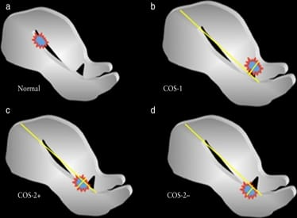
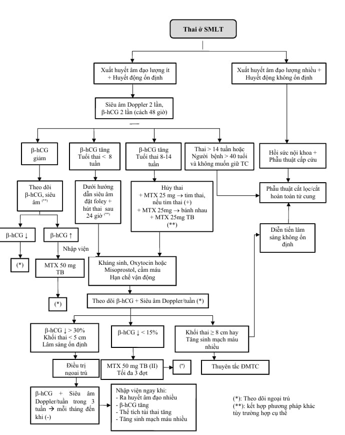

**Chửa ở vết mổ lấy thai** là một dạng thai ngoài tử cung hiếm gặp, trong đó túi thai làm tổ tại vị trí sẹo mổ cũ trên cơ tử cung (thường là sẹo do mổ lấy thai trước đó):

- Tỷ lệ mắc: 1/1800 - 1/2500 ca sinh.
- Chiếm < 1% các trường hợp thai ngoài tử cung.

## Yếu tố nguy cơ

- Tiền căn mổ lấy thai.
- Tiền căn rau bám chặt.
- Phẫu thuật cơ tử cung: Bóc u xơ, khâu tái tạo cơ tử cung, xử trí rau cài răng lược.
- Tiền sử thai ngoài tử cung.
- Thụ tinh trong ống nghiệm (IVF).
- Tiền sử nạo phá thai nhiều lần.

## Chẩn đoán

### Lâm sàng

- **Triệu chứng không đặc hiệu**, khoảng 50% trường hợp không có biểu hiện rõ, phát hiện qua siêu âm.
- **Tam chứng kinh điển**: Trễ kinh. Ra máu âm đạo bất thường (33-44%). Đau bụng (25%).

### Cận lâm sàng

#### Siêu âm

- Siêu âm qua đường âm đạo kết hợp Doppler.
- Túi thai nằm giữa bàng quang và phần trước đoạn eo tử cung.
- Lớp cơ giữa túi thai và bàng quang mỏng (1-3 mm) hoặc không thấy.
- Không thấy túi thai trong buồng tử cung hay cổ tử cung.
- Siêu âm Doppler 3D: Hình ảnh phình mạch máu quanh túi thai, mất liên tục vách trước cơ tử cung.

#### Xét nghiệm khác

- β-hCG dương tính.
- MRI khi khó xác định.

### Chẩn đoán phân biệt

- Thai trong buồng tử cung.
- Sảy thai không hoàn toàn (thai tụt qua sẹo).
- Thai ở cổ tử cung (phân biệt bằng siêu âm màu - không có mạch máu quanh khối).
- U nguyên bào nuôi.

## Phân loại

_Hình ảnh "Mối liên hệ thai và sẹo mổ lấy thai"_.

**COS-1**: Túi thai nằm > 2/3 phía trên đường nối nội mạc tử cung → bám sâu vào cơ tử cung, nguy cơ vỡ tử cung cao. Thai cắm sâu vào sẹo, nguy cơ vỡ tử cung sớm, đe dọa tính mạng.

**COS-2**: Túi thai < 2/3 nằm trên đường nối nội mạc. Thai có thể phát triển về buồng tử cung nhưng nguy cơ xuất huyết rau bám. Gồm:

- **COS-2-**: Có giao nhau với đường nối nội mạc tử cung.
- **COS-2+**: Không giao nhau với đường nối nội mạc tử cung.

## Điều trị

### Nguyên tắc

- Kết thúc thai kỳ sớm.
- Ưu tiên bảo tồn tử cung và khả năng sinh sản nếu điều kiện cho phép.
- Không nong nạo đầu tiên vì nguy cơ xuất huyết lớn.
- Tùy tình trạng huyết động và triệu chứng để chọn phương pháp.

### Nội khoa

#### Methotrexate (MTX)

**Chỉ định**: Thai < 14 tuần, chưa vỡ, huyết động ổn định, không chống chỉ định MTX.

**Phác đồ**:

- Thai lưu ≤ 8 tuần, β-hCG tăng → MTX 50mg tiêm bắp.
- Thai chưa có tim: Hút phôi dưới siêu âm, tiêm MTX tại chỗ và bắp (25mg + 25mg).
- Thai có tim: Hút mô tim thai (nếu > 9 tuần). Tiêm MTX hoặc KCl vào tim + tiêm MTX quanh bánh rau → kiểm tra sau 60-90 phút. Tổng liều MTX: 75mg.

**Theo dõi sau điều trị**:

- β-hCG giảm > 15%/tuần trong 3 tuần, sau đó mỗi tháng đến khi âm tính.
- Nếu giảm < 15% → tiêm MTX liều 2.
- Siêu âm mỗi tuần để theo dõi khối thai và mạch máu quanh.

**Kháng sinh và hỗ trợ**:

- Ceftriaxone 1 g x 2 lần/ngày x 2 ngày, sau đó uống Cephalosporin + Metronidazole.
- Oxytocin, Tranexamic, nghỉ ngơi, không giao hợp.

#### HIFU (siêu âm hội tụ cường độ cao)

- Là phương pháp điều trị không xâm lấn mới, hiệu quả cần nghiên cứu thêm.

### Ngoại khoa

#### Nong nạo

**Chỉ định** hạn chế:

- β-hCG < 2000 sau MTX, khối thai nhỏ, không đáp ứng điều trị thuốc.
- Phân loại COS-2-.

**Thực hiện**:

- Dùng ống hút nhỏ (Karman 6-8), hút nhẹ vùng trên vết mổ.
- Tránh hút vùng mỏng vết mổ để hạn chế thủng tử cung.
- Nếu chảy máu: Đặt bóng chèn 12-24 giờ.

#### Đặt foley & hút thai

**Chỉ định**: Thai ≤ 8 tuần.

**Thực hiện**:

- Đặt foley 14-16 dưới siêu âm, bơm 20-25mL để đẩy túi thai.
- Rút sau 24 giờ → hút thai bằng Karman 6.
- Dùng oxytocin, misoprostol hậu môn, kháng sinh sau thủ thuật.

Theo dõi tương tự điều trị MTX.

#### Phẫu thuật

**Chỉ định**:

- Thai ≥ 14 tuần.
- Người bệnh > 40 tuổi không còn nhu cầu sinh sản.
- Huyết động không ổn định, xuất huyết nhiều.

**Thực hiện**:

- Mở bụng cắt khối thai và bảo tồn tử cung nếu có thể, hoặc cắt tử cung hoàn toàn.
- Chuẩn bị máu, dịch, tư vấn nguy cơ tổn thương bàng quang, niệu quản.

### Phối hợp nhiều kỹ thuật

- MTX + nong nạo.
- MTX + thuyên tắc động mạch tử cung (UAE).
- MTX trong lúc UAE.
- UAE trước mổ.
- Theo dõi không can thiệp nếu thai lưu < 8 tuần, β-hCG < 1000 và giảm dần.

### Tỷ lệ tai biến

_Bảng "Tỷ lệ tai biến các phương pháp điều trị chửa vết mổ lấy thai"._

| Phương pháp điều trị             | Tỷ lệ tai biến (%) |
| -------------------------------- | ------------------ |
| **MTX tiêm bắp**                 | 62.1               |
| **Nong và nạo**                  | 61.9               |
| **Thuyên tắc động mạch tử cung** | 46.9               |
| **Soi buồng tử cung**            | 18.4               |
| **MTX tại chỗ/toàn thân**        | 9.7                |

_Hình ảnh "Phác đồ điều trị thai ở sẹo mổ lấy thai - Bệnh viện Từ Dũ"_.

## Thai kỳ sau

- Tránh thai ít nhất 12-24 tháng.
- Không sử dụng dụng cụ tử cung.
- Thai kỳ sau: Chủ động mổ lấy thai khi đủ tháng.

## Tài liệu tham khảo

- Bệnh viện Từ Dũ (2022) - _Phác đồ điều trị Sản Phụ khoa_
