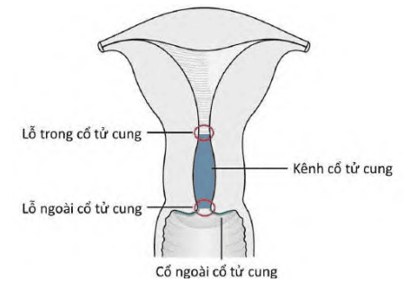
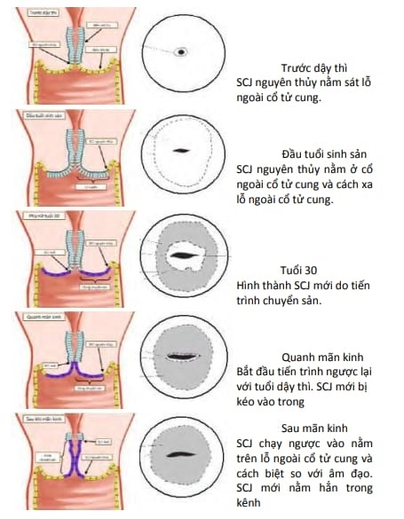
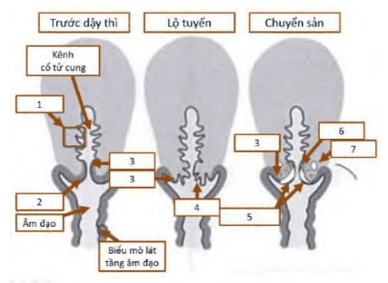
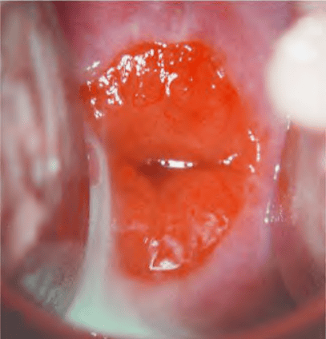
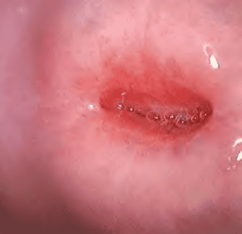
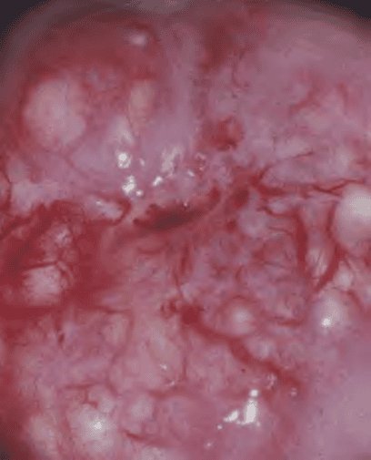
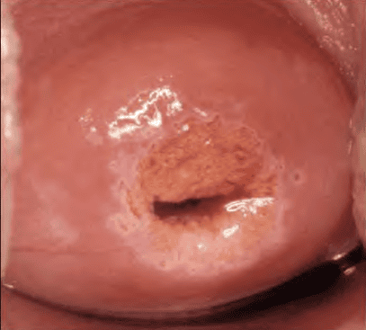
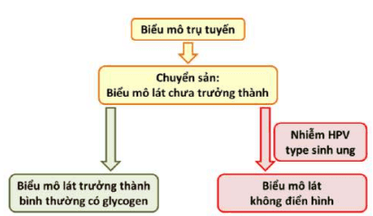

Lộ tuyến cổ tử cung (endocervical ectropion) là hiện tượng biểu mô trụ nằm ở trong kênh cổ tử cung bị lộn ra trên cổ ngoài cổ tử cung. Biểu mô trụ này có khả năng tiết nhầy mạnh, màu đỏ, dễ chảy máu khi chạm vào và dễ bội nhiễm, do đó khi có viêm nhiễm sẽ hình thành viêm lộ tuyến với triệu chứng khí hư bất thường, có mùi hôi, đau rát khi quan hệ và chảy máu sau giao hợp.

## Giải phẫu

Tử cung được chia làm hai phần chính phần trên là thân tử cung và phần dưới là cổ tử cung, nối với âm đạo qua eo tử cung. Cổ tử cung dài khoảng 2.5–3 cm và được chia thành hai phần:

- **Cổ ngoài cổ tử cung (ectocervix/exocervix)** phần thấp nhất tiếp xúc trực tiếp với âm đạo, có hình dạng elíp hoặc hình chóp nón, chia thành mép trước và mép sau cổ tử cung. Phần này bình thường được phủ bởi biểu mô lát tầng không sừng hóa.

- **Cổ trong cổ tử cung (endocervix)** nằm phía trên cổ ngoài, hướng về buồng tử cung, tạo thành kênh cổ tử cung (cervical canal) nối từ lỗ ngoài đến lỗ trong cổ tử cung. Kênh cổ tử cung có nhiều nếp gấp dạng "cây cọ" (arbor vitae) giúp giữ kín sinh lý.

- **Lỗ ngoài cổ tử cung (external os)** là vị trí mở của kênh cổ tử cung ra âm đạo. Hình dạng lỗ ngoài thường tròn ở phụ nữ chưa sinh và hơi dẹt ở phụ nữ đã sinh con.

- **Lỗ trong cổ tử cung (internal os)** là vị trí mở của kênh cổ tử cung vào buồng tử cung.

  

  _Từ ngoài vào trong: Cổ ngoài (ectocervix), lỗ ngoài, kênh cổ tử cung, lỗ trong._

## Mô học

Cổ tử cung được cấu tạo bởi biểu mô phủ và mô đệm dưới biểu mô. Mô đệm gồm mô cơ trơn, mô sợi và cân đàn hồi, giúp cổ tử cung co giãn và đàn hồi.

- **Cổ ngoài (Ectocervix)** được phủ bởi **biểu mô lát tầng không sừng hóa**, gồm bốn lớp từ đáy lên bề mặt:

  - **Lớp tế bào đáy**: Chồng lên màng đáy, nơi tế bào phân chia mạnh nhất.
  - **Lớp tế bào cận đáy** và **lớp tế bào trung gian** (cùng gọi là lớp gai/prickle cell layer).
  - **Lớp tế bào bề mặt**: Tùy theo nồng độ estrogen, dày mỏng khác nhau; chứa nhiều glycogen, bắt màu Lugol dương tính khi nhuộm.

- **Cổ trong (Endocervix)** được phủ bởi **biểu mô trụ đơn tiết nhầy**, gồm các tế bào hình trụ cao, nhân tròn hoặc bầu dục nằm sát đáy, bào tương chứa nhiều hạt nhầy. Mô trụ này không tạo thành các tuyến hoàn chỉnh, nhưng có chức năng tiết chất nhầy bảo vệ kênh cổ tử cung.

- **Ranh giới lát-trụ (Squamocolumnar Junction – SCJ)**

  - SCJ là vùng tiếp giáp giữa biểu mô lát (cổ ngoài) và biểu mô trụ (cổ trong).
  - Vị trí SCJ biến đổi suốt cuộc đời phụ nữ dưới ảnh hưởng nội tiết (tuổi dậy thì, chu kỳ kinh nguyệt, mang thai, dùng thuốc tránh thai, mãn kinh).
  - SCJ ban đầu (nguyên thủy) nằm sát lỗ ngoài cổ tử cung. Khi estrogen tăng, kênh cổ tử cung kéo dài, biểu mô trụ bị lộn ra ngoài tạo lộ tuyến, kéo SCJ nguyên thủy lên phía ngoài cổ tử cung.
  - Trong giai đoạn mãn kinh, estrogen giảm, cổ tử cung teo nhỏ, SCJ di chuyển vào trong kênh cổ tử cung.

## Bệnh sinh

### Chuyển sản lát

_Dịch chuyển SCJ nguyên thủy và SCJ mới._

1. Biểu mô trụ cổ trong.
2. Biểu mô lát nguyên thủy.
3. SCJ nguyên thủy (ban đầu sát lỗ ngoài).
4. Biểu mô trụ lộ tuyến (màu đỏ).
5. Vùng chuyển sản (TZ).
6. SCJ mới (functional SCJ).
7. Nang Naboth.

_Trên hình: (1) biểu mô trụ ban đầu, (2) biểu mô lát nguyên thủy, (3) SCJ nguyên thủy, (4) biểu mô trụ lộ tuyến, (5) vùng chuyển sản, (6) SCJ mới, (7) nang Naboth._

1. **Tiếp xúc với pH acid**:

   - Môi trường âm đạo có pH acid (khoảng 3.8–4.5) do lactobacilli sản xuất acid lactic.
   - Biểu mô trụ không chịu được môi trường acid, tế bào trụ dễ tổn thương và hoại tử.

2. **Kích thích tế bào dự trữ (reserve cells)**:

   - Biểu mô trụ bị phá hủy, tế bào dự trữ cận trụ (sub-columnar cells) xuất hiện và tăng sinh.
   - Các tế bào này có nhân to, bào tương ít, tương tự tế bào đáy của biểu mô lát.

3. **Hình thành biểu mô lát chuyển sản**:

   - Tế bào dự trữ biệt hóa thành biểu mô lát không sừng hóa, gọi là **biểu mô lát chuyển sản non** (immature squamous metaplasia).
   - Biểu mô lát non không chứa glycogen, không bắt màu Lugol, dễ phân tầng.

4. **Biểu mô lát chuyển sản hoàn thiện**:

   - Các tế bào lát chuyển sản non tiếp tục trưởng thành, có chứa glycogen, bắt màu Lugol dương tính, trở thành biểu mô lát trưởng thành (mature squamous epithelium).
   - Quá trình chuyển sản thường bắt đầu từ SCJ nguyên thủy, từ từ mở rộng vào trung tâm về phía lỗ ngoài cổ tử cung.

5. **Vùng chuyển sản (Transformation Zone – TZ)**:
   - Là vùng nằm giữa SCJ nguyên thủy và SCJ mới (functional SCJ).
   - TZ là nơi xuất hiện các tổn thương loạn sản (neoplasia) và là vị trí dễ bị HPV xâm nhập, do tế bào lát mới non chưa đầy đủ khả năng bảo vệ.

### Lộ tuyến

- **Lộ tuyến cổ tử cung (endocervical ectropion)** biểu mô trụ của cổ trong lộn ra bề mặt cổ ngoài (ectocervix), tiếp xúc với môi trường acid âm đạo.

  

  _Soi cổ tử cung thấy vùng lộ tuyến (màu đỏ) khởi đầu ở phía ngoài cổ tử cung._

  

  _Phía ngay lỗ ngoài cổ tử cung giải phẫu là vùng SCJ mới._

- **Sinh lý**:

  - Thường gặp ở phụ nữ tuổi sinh sản, mang thai, hoặc dùng estrogen ngoại sinh (thuốc tránh thai).
  - Thường không có triệu chứng, chỉ phát hiện khi soi cổ tử cung thấy vùng đỏ rạng rỡ.

- **Bệnh lý (viêm lộ tuyến)**:

  - Khi lộ tuyến tiếp xúc lâu với môi trường âm đạo, vi khuẩn (E. coli, Gardnerella vaginalis), nấm (Candida spp.), trùng roi (Trichomonas vaginalis) dễ xâm nhập.
  - Triệu chứng:

    - **Khí hư**: Nhiều, màu vàng/ xanh, mùi hôi.
    - **Ngứa hoặc rát vùng âm hộ, âm đạo**.
    - **Đau rát khi giao hợp** (dyspareunia).
    - **Chảy máu sau quan hệ** (postcoital bleeding).

  - **Dễ nhầm lẫn với**: Viêm cổ tử cung do loét, chấn thương cơ học, hoặc các tổn thương ác tính.

### Nang Naboth

_Nang Naboth trên bề mặt cổ tử cung, trông giống túi dịch nhỏ màu vàng._

- Khi biểu mô lát chuyển sản phát triển, có thể bít tắc cổ nang tuyến, tạo ra **nang Naboth** (Nabothian cyst).
- Nang Naboth chứa dịch nhầy, nằm bên dưới bề mặt biểu mô lát, thường không triệu chứng, chỉ phát hiện khi soi hoặc siêu âm.

## Điều trị

Lộ tuyến bản thân là tiến trình sinh lý, thường không cần can thiệp nếu không có triệu chứng viêm. Khi phát triển thành **viêm lộ tuyến**, cần điều trị nhằm giảm triệu chứng và ngăn ngừa biến chứng.

### Nội khoa

- **Kháng sinh/ kháng nấm/ kháng ký sinh** tùy tác nhân:

  - Ví dụ: Metronidazole hoặc Clindamycin đặt âm đạo (Trichomonas, viêm khí hư do vi khuẩn).
  - Fluconazole đường uống hoặc đặt âm đạo (Candida).

- **Thuốc chống viêm tại chỗ**:

  - Gel hoặc đặt âm đạo chứa corticosteroid nhẹ hoặc các chế phẩm có thành phần kháng viêm, làm lành biểu mô.

- **Điều chỉnh nội tiết**:

  - Ngưng hoặc thay đổi loại thuốc tránh thai nếu nghi ngờ estrogen ngoại sinh là nguyên nhân làm nặng lộ tuyến.
  - Với phụ nữ tiền mãn kinh/ mãn kinh bị giảm estrogen, có thể cân nhắc liệu pháp bổ sung estrogen tại chỗ (nhưng chỉ khi cần thiết và thận trọng).

### Tại chỗ

Chỉ thực hiện khi viêm đã được kiểm soát hoặc sau điều trị nội khoa không đáp ứng:

1. **Đốt điện (Electrocautery/LEEP)**

   - Sử dụng dòng điện để phá hủy vùng mô lộ tuyến.
   - Ưu điểm: Nhanh, chi phí thấp.
   - Nhược điểm: đau nhẹ, có thể chảy máu sau thủ thuật, cần xem xét kỹ trước sinh nở.

2. **Áp lạnh (Cryotherapy)**

   - Dùng nitơ lỏng để gây hoại tử đông lạnh vùng lộ tuyến.
   - Ít đau hơn đốt điện, hồi phục nhanh, ít sẹo.
   - Nhược điểm: đôi khi vết thương lâu lành, mất nhiều buổi điều trị nếu diện lộ tuyến rộng.

3. **Laser CO₂**

   - Sử dụng chùm tia laser để bốc hơi mô lộ tuyến.
   - Ít chảy máu hơn đốt điện, vết thương nhỏ, lành nhanh.
   - Nhược điểm: Chi phí cao, cần máy chuyên dụng.

4. **Điều trị bằng sóng cao tần (Radiofrequency ablation)**

   - Xâm nhập tối thiểu, hủy mô bằng nhiệt, ít đau, hồi phục nhanh.

### Theo dõi sau điều trị

_Sau đốt hoặc áp lạnh, vùng chuyển sản dần hồi phục biểu mô lát trưởng thành._

- Tái khám sau 4–6 tuần để kiểm tra vết thương, đảm bảo không còn viêm.
- Làm xét nghiệm Pap smear (tế bào cổ tử cung) định kỳ 6–12 tháng nếu có yếu tố nguy cơ (tiền căn viêm lộ tuyến nặng, nhiễm HPV).
- Khuyến khích khám phụ khoa định kỳ (6–12 tháng/lần) để phát hiện sớm bất thường.

_Quá trình chuyển sản và sự lành của lộ tuyến cổ tử cung và nguy cơ bị tấn công bởi HPV._

## Nguồn tham khảo

- Trường ĐH Y Dược TP. HCM (2020) – _Team-based learning_
- Hội Y học TP. HCM (2019) – _Hướng dẫn chẩn đoán và điều trị các bệnh phụ khoa thường gặp_
- World Health Organization (2021) – _Cervical Intraepithelial Neoplasia and HPV: Guidelines for Screening and Treatment_
- Muñoz N., Kjaer S.K., Sigurdsson K. et al. (2016) – _The Lancet Oncology_
