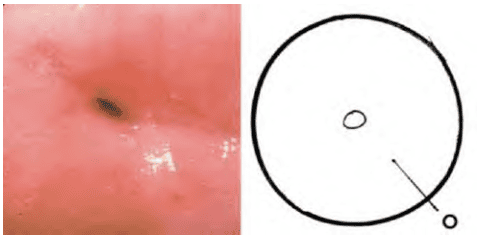

**Pap's test** và **soi cổ tử cung** là hai phương pháp sàng lọc bất thường cổ tử cung.

## Pap's test

Pap's test hay phết mỏng tế bào cổ tử cung là công cụ tầm soát sơ cấp ung thư cổ tử cung. Việc lấy mẫu Pap’s test gồm:

- Xét nghiệm tế bào học quy ước (conventional method).
- Xét nghiệm tế bào học nhúng dịch (liquid-based method).

Pap’s test quy ước rẻ hơn nhưng độ nhạy và đặc hiệu thấp hơn. Pap’s test nhúng dịch tốn kém hơn nhưng giữ được tế bào tốt hơn, nên độ nhạy và đặc hiệu cao hơn.

_Bảng "So sánh 2 kỹ thuật thực hiện Pap's test"_.

| So sánh 2 kỹ thuật thực hiện Pap's test | PAP quy ước                                                          | PAP nhúng dịch                                                    |
| --------------------------------------- | -------------------------------------------------------------------- | ----------------------------------------------------------------- |
| **Lấy mẫu**                             | Tương đương                                                          |                                                                   |
| **Mất tế bào khi làm lam**              | Mất đến 80% số tế bào thu thập được                                  | Không bị mất tế bào                                               |
| **Chất lượng lam**                      | Khó đọc do mật độ tế bào không đều. Buộc phải đọc hoàn toàn thủ công | Tế bào dàn trải đều. Có thể đọc sơ cấp bằng máy                   |
| **Sensitivity (%)**                     | 68                                                                   | 76                                                                |
| **Specificity (%)**                     | 79                                                                   | 89                                                                |
| **Khảo sát vi sinh bổ túc**             | Ngẫu nhiên: _Candida sp_. _Trichomonas vaginalis_                    | Có thể thực hiện được các khảo sát vi sinh bổ sung khi có yêu cầu |

### Điều kiện thực hiện

Để đảm bảo chất lượng mẫu, Pap’s test phải thực hiện khi:

- Không đang ra huyết âm đạo.
- Không có viêm âm đạo-cổ tử cung cấp tính.
- Không đặt thuốc ở âm đạo trong vòng 3 ngày gần đây.
- Không giao hợp, không thụt rửa âm đạo trong vòng 48 giờ trước.
- Không khám âm đạo bằng tay hoặc dùng dầu bôi trơn trước đó.

Phụ nữ mãn kinh nên dùng estrogen tại chỗ vài ngày trước khi lấy mẫu.

### Quy trình

**Pap’s test quy ước:** Lấy hai lam phết tế bào từ cổ ngoài và cổ trong. Ghi bằng bút chì tên, tuổi và vị trí lấy trên lam. Mẫu cố định bằng cồn 95° hoặc keo phun.

**Pap’s test Thin Prep:** Lấy mẫu tương tự nhưng cho vào lọ chứa dung dịch nhúng dịch.

_Hình ảnh "Dụng cụ làm Pap’s test (từ trái sang):  1. Cytobrush cho kênh cổ tử cung.  2. Que Ayre cho Pap’s test quy ước.  3. Chổi lớn cho Thin Prep"_.

_Hình ảnh "Cách lấy mẫu (từ trái sang):  1. Cytobrush: Lấy ở kênh tử cung, áp vào SCJ, không đưa quá sâu.  2. Que Ayre: Lấy hai lần, đầu to và đầu nhọn, áp vào vùng chuyển sản để lấy SCJ.  3. Chổi lớn: Áp vào SCJ và vùng chuyển sản"_.

_Hình ảnh "Cách trải lam:  1. Chổi lớn: Kéo để trải.  2. Cytobrush: Lăn tròn để trải.  3. Que Ayre: Kéo để trải"_.

### HPV testing

HPV testing thường thực hiện đồng thời với Pap’s test (co-testing). Xét nghiệm cần xác định các type nguy cơ cao. Thăm dò type nguy cơ thấp không có giá trị trong tầm soát ung thư.

### Phân loại

Theo Bethesda 2014, kết quả phân thành ba nhóm chính:

1. Âm tính với tổn thương trong biểu mô hay ác tính.
2. Khác (tế bào nội mạc ở phụ nữ ≥ 45 tuổi).
3. Bất thường tế bào biểu mô (vảy hoặc tuyến).

#### Âm tính với tổn thương trong biểu mô

Các biểu hiện không tân sinh (Non-neoplastic findings): Chuyển sản gai, thay đổi sừng, thay đổi thai kỳ, teo...

Các thay đổi tế bào do phản ứng (Reactive cellular changes): Viêm, tổn thương do tia xạ, sau cắt tử cung...

Thay đổi do vi sinh vật: Trichomonas vaginalis, Candida sp., Gardnerella, Chlamydia trachomatis, HSV, HPV...

#### Khác

Ở phụ nữ ≥ 45 tuổi, báo cáo hình thái tế bào nội mạc tử cung lành tính.

#### Bất thường tế bào biểu mô

**Tế bào gai (Squamous cell):**

- Tế bào gai không điển hình (Atypical squamous cells - ASC). ASC-US: Không xác định được tổn thương mức cao; ASC-H: Không thể loại trừ tổn thương trong biểu mô vảy mức độ cao.
- LSIL (Low-grade squamous intraepithelial lesions): Dị sản nhẹ/CIN 1/HPV.
- HSIL (High-grade squamous intraepithelial lesions): Dị sản vừa/nặng, CIN 2/3, carcinoma in situ.
- Với tính chất nghi ngờ xâm lấn: Có đặc trưng nghi ngờ xâm lấn.
- Ung thư tế bào gai (Squamous cell carcinoma).

**Tế bào tuyến (Glandular cell):**

- Atypical: Endocervical cells, no otherwise specified (N/O); Endometrial cells, N/O; Glandular cells, N/O.
- Atypical favor neoplastic: Endocervical cells, favor neoplastic; Glandular cells, favor neoplastic.
- Endocervical adenocarcinoma in situ.
- Adenocarcinoma (có thể ở kênh cổ tử cung, nội mạc tử cung, ngoài tử cung hoặc N/O).

**Các tổn thương tiền xâm lấn của ung thư cổ tử cung:**

- ASC (ASC-US, ASC-H).
- LSIL (CIN 1, koilocytotic atypia).
- HSIL (CIN 2, CIN 3, carcinoma in situ).

### Quản lý

_Bảng "Tầm soát ung thư cổ tử cung"_.

| Phương pháp tầm soát     | Kết quả                                                              | Xử trí                                                                                                                                                                         |
| ------------------------ | -------------------------------------------------------------------- | ------------------------------------------------------------------------------------------------------------------------------------------------------------------------------ |
| **Tế bào học đơn thuần** | Tế bào học âm tính _hoặc_ ASC-US và HPV âm tính                      | Tầm soát lại sau 3 năm                                                                                                                                                         |
|                          | Các kết quả khác                                                     | Xử trí theo khuyến cáo ASCCP                                                                                                                                                   |
| **Co-testing**           | Tế bào học âm tính, HPV testing âm tính _hoặc_ ASC-US và HPV âm tính | Tầm soát lại sau 5 năm                                                                                                                                                         |
|                          | Tế bào học âm tính và HPV testing dương tính                         | **Lựa chọn 1:** Lặp lại co-testing sau 12 tháng (B)_ **Lựa chọn 2:** Genotypes HPV 16 hoặc HPV 16/18 (B)_ Nếu dương → soi cổ tử cung Nếu âm → co-testing sau 12 tháng |
|                          | Tất cả các kết quả khác                                              | Xử trí theo khuyến cáo ASCCP                                                                                                                                                   |

_"Các khuyến cáo dựa theo American Cancer Society, ASCCP, và ASCP. A: Mạnh, chứng cứ rõ ràng. B: Trung bình, chứng cứ không hằng định. C: Theo kinh nghiệm"_.

## Soi cổ tử cung

Soi cổ tử cung là kỹ thuật quan sát cổ tử cung qua kính lúp (máy soi), đánh giá vị trí, kích thước, đặc điểm tổn thương, đồng thời hướng dẫn sinh thiết hoặc nạo kênh cổ tử cung (ECC) để chẩn đoán mô học.

### Điều kiện thực hiện

Thực hiện sau khi có kết quả Pap’s test, vào ngày N8-N12 của chu kỳ kinh, tốt nhất sau sạch kinh 3 ngày.

Dụng cụ:

- Dung dịch NaCl 0.9%, Acid Acetic 3%, Lugol 1%.
- Mỏ vịt, bông gòn, kẹp hình tim.
- Kềm bấm sinh thiết, muỗng nạo kênh, lọ chứa formaldehyde 4%.

### Quy trình

Tiến trình soi gồm ba bước:

1. Soi cổ tử cung không chuẩn bị.
2. Soi cổ tử cung sau bôi acid acetic 5%.
3. Soi cổ tử cung sau bôi Lugol 1%.

**Soi cổ tử cung không chuẩn bị:**

- Dưới ánh sáng trắng: Quan sát bạch sản (leukoplasia), nang Naboth (NF).
- Dưới ánh sáng xanh: Quan sát mạch máu bất thường.

**Soi cổ tử cung bằng acid acetic:**

- Bôi acid acetic 5%, chờ 5 phút.
- Quan sát: Ranh giới lát trụ (J), vùng chuyển tiếp (TZ), biểu mô tuyến, cửa tuyến (OG), các hình ảnh bất thường: Acetowhite (AW), Mosaic (M), Punctation (P).

**Soi cổ tử cung bằng Lugol:**

- Bôi Lugol 1%.
- Lugol (+): Toàn bộ biểu mô lát bắt màu vàng sậm.
- Lugol (-): Biểu mô lát hoặc vùng chuyển sản không bắt màu.

**Đọc kết quả:**

- Mô tả chi tiết quá trình soi, hình ảnh theo từng bước và lập sơ đồ tổn thương (cervicography).
- Nếu cần sinh thiết, ghi rõ số mẫu, vị trí và kết quả mô học.

### Phân loại

Phân loại dựa theo ASCCP.

_Hình ảnh "Cổ tử cung bình thường qua soi"_.

_Hình ảnh "Cổ tử cung chuyển sản với ranh giới lát trụ, biểu mô lát non"_.

_Hình ảnh "Cổ tử cung chuyển sản với cửa tuyến, đảo tuyến"_.

_Hình ảnh "Cổ tử cung tái tạo với lưỡi biểu mô chuyển sản lát non"_.

**Nhóm hình ảnh bình thường:**

- Biểu mô lát nguyên thủy (Original Squamous Epithelium - OSE).
- Biểu mô trụ.
- Vùng chuyển tiếp.

**Nhóm hình ảnh bất thường** (trong hoặc ngoài TZ):

- Acetowhite (AW).
- Punctation (P).
- Mosaic (M).
- Leukoplasia (L).
- Vùng không bắt màu Iodine.
- Mạch máu bất thường.

**Nghi ngờ ung thư xâm lấn.**

**Nhóm hình ảnh không đầy đủ:** Không thấy vùng chuyển tiếp, nhiễm trùng nặng, teo sau mãn kinh, hẹp âm đạo.

**Nhóm dấu hiệu khác:**

- Viêm cổ tử cung-âm đạo.
- Loét cổ tử cung.
- Teo biểu mô.
- Condyloma và papilloma.
- Polyp kênh cổ tử cung, u nhú, nang Naboth...

## Tài liệu tham khảo

- Trường ĐH Y Dược TP. HCM (2020) - _Team-based learning_
