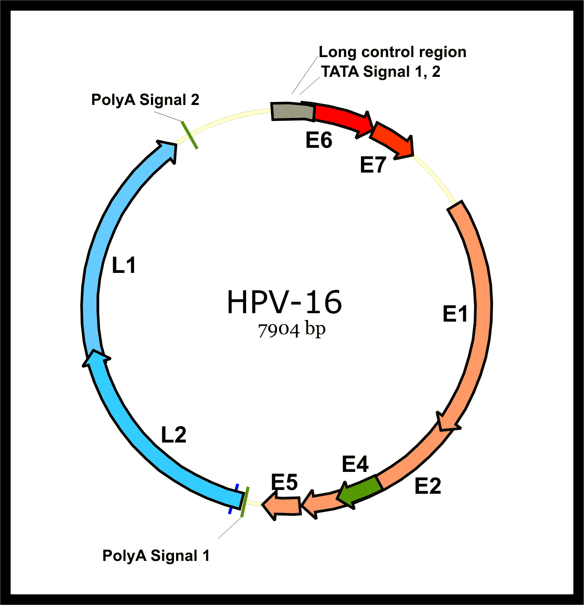
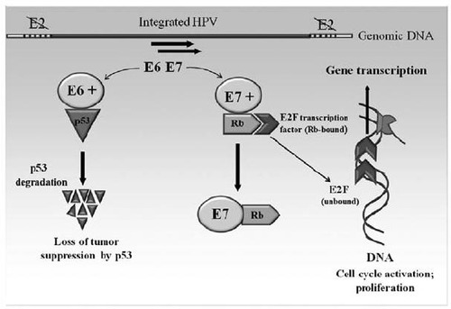
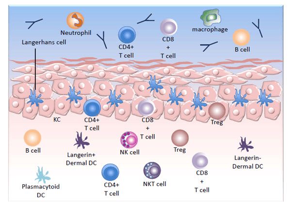

Human Papilloma Virus (HPV) là virus gây u nhú ở người, nguyên nhân hàng đầu gây ung thư cổ tử cung và nhiều bệnh lý đường sinh dục ở cả nam và nữ.

## Human Papillomavirus (HPV)

### Cấu tạo

HPV thuộc họ Papovaviridae, đường kính 55 nm, không có màng lipid. Capsid gồm 72 capsom hình sao 5 cánh, chính bởi protein L1; protein L2 ít hơn, giữ vai trò nâng đỡ.

Bên trong là DNA kép vòng, dài 7904 bp, gồm các gen:

- **E1, E2**: Nhân bản.
- **E4, E5**: Tái tổ hợp.
- **L1, L2**: Protein vỏ capsid.
- **E6, E7**: đa chức năng, tương tác với p53 và pRb, quyết định khả năng sinh ung thư.

_Sơ đồ DNA 7904 bp của HPV type 16._

### Các type

- Hơn 200 type HPV đã được định danh, trong đó 85 type đã mô tả đầy đủ gene; > 40 type lây qua quan hệ tình dục. Do chỉ có capsid, HPV bền ngoài môi trường, có thể lây gián tiếp qua tiếp xúc đồ dùng.

  - **Nhóm da**: Tổn thương ở da tay, chân.
  - **Nhóm niêm mạc**: Xâm nhiễm tế bào đáy niêm mạc môi, miệng, hô hấp, cơ quan sinh dục.

- **Nguy cơ thấp**: 6, 11, 42, 43, 44.
- **Nguy cơ cao**: 16, 18, 31, 33, 34, 35, 39, 45, 51, 52, 56, 58, 59, 66, 68, 70.

### Yếu tố nguy cơ

- Quan hệ tình dục sớm, có nhiều bạn tình, tiền sử các bệnh lây truyền qua đường tình dục.
- Sử dụng bao cao su không hoàn toàn ngăn chặn được HPV.
- Tỷ lệ nhiễm cao ở độ tuổi 18–30, giảm sau 30 do tế bào cổ tử cung biệt hóa hoàn chỉnh, giảm tính cảm nhiễm với virus.

### Bệnh sinh

- Đa số lành tính, có thể tự khỏi nếu miễn dịch tốt.
- Nhiễm tồn tại (> 2 năm) tăng nguy cơ tái phát và sinh ung thư.
- Biểu hiện: Mụn cóc da, mụn cóc miệng (Heck’s), u nhú thanh quản.
- Tại cổ tử cung: HPV type thấp gây mụn cóc sinh dục; type cao (16, 18, 31, 45...) liên quan đến tổn thương tiền ung thư và ung thư.
- **Cơ chế sinh ung thư**:

  - E6 liên kết p53 → thoái giáng p53 → mất kiểm soát chu kỳ tế bào.
  - E7 bất hoạt pRb → giải phóng E2F1 → kích hoạt phân bào không kiểm soát.

  Miễn dịch qua trung gian tế bào quyết định khả năng thanh thải HPV.

  

  _Cơ chế hình thành tế bào bất tử khi nhiễm HPV._

  

  _Miễn dịch bẩm sinh và thích nghi qua trung gian tế bào bảo vệ chống HPV._

## Vaccine HPV

### Tác động

- Dùng virus-like particles (VLP) từ protein L1, không chứa DNA, không gây nhiễm.
- Kích thích B-cell và T-cell tạo kháng thể IgG đặc hiệu.
- Không tạo miễn dịch chéo giữa các type khác nhau.

### Phân loại

| Loại vaccine | Type bảo vệ                       | Phổ bảo vệ                                               |
| ------------ | --------------------------------- | -------------------------------------------------------- |
| **2vHPV**    | 16, 18                            | Ngừa ung thư cổ tử cung (66% trường hợp)                 |
| **4vHPV**    | 6, 11, 16, 18                     | Ngừa ung thư cổ tử cung và mụn cóc sinh dục (type 6, 11) |
| **9vHPV**    | 6, 11, 16, 18, 31, 33, 45, 52, 58 | Bổ sung 5 type nguy cơ cao khác, tăng bảo vệ lên 81–90%  |

_Phổ bảo vệ của vaccine 2vHPV, 4vHPV và 9vHPV_

| Thông số                                  | Vaccine HPV tứ giá  | Vaccine HPV nhị giá    |
| ----------------------------------------- | ------------------- | ---------------------- |
| **Thời gian theo dõi**                    | 36 tháng (nâng cao) | 15 tháng (tạm thời)    |
| **Type bảo vệ**                           | 6, 11, 16, 18       | 16, 18                 |
| **Hiệu quả trên CIN 2 do 16 hay 18**      | Đã được chứng minh  | Đã được chứng minh     |
| **Hiệu quả trên CIN 2 do 16**             | Đã được chứng minh  | Đã được chứng minh     |
| **Hiệu quả trên CIN 2 do 18**             | Đã được chứng minh  | Chưa chứng minh        |
| **Hiệu quả trên CIN 2 do 16 hay 18**      | Đã được chứng minh  | Đã được chứng minh     |
| **Hiệu quả trên CIN 3 do 16 hay 18**      | Đã được chứng minh  | Chưa chứng minh        |
| **Hiệu quả điều trị**                     | Không               | Không                  |
| **Hiệu quả trên tân sinh biểu mô âm hộ**  | Đã được chứng minh  | Chưa được báo cáo      |
| **Hiệu quả trên tân sinh biểu mô âm đạo** | Đã được chứng minh  | Chưa được báo cáo      |
| **Hiệu quả trên mụn cóc sinh dục**        | Đã được chứng minh  | Không phải là mục tiêu |
| **An toàn sau 6 năm theo dõi**            | An toàn             | An toàn                |
| **Tính chấp nhận (dung nạp)**             | Chấp nhận           | Chấp nhận              |
| **Thời gian bảo vệ**                      | 5–6 năm             | 5–6 năm                |
| **Tạo miễn dịch ở vị thành niên**         | Đã được chứng minh  | Đã được chứng minh     |
| **Tạo miễn dịch ở nữ lớn tuổi hơn**       | Đã được chứng minh  | Đã được chứng minh     |
| **Ký ức miễn dịch sau 6 năm**             | Đã được chứng minh  | Chưa báo cáo           |

_So sánh vaccine HPV nhị giá và tứ giá._

### Sử dụng

- **Đối tượng**

  - Trẻ gái và trai 9–12 tuổi (khuyến cáo mạnh 11–12 tuổi).
  - Trẻ trai ưu tiên 4vHPV.
  - Người chưa tiêm: Nữ đến 26 tuổi; nam đến 21 tuổi (mở rộng đến 26 tuổi cho đồng tính và người chuyển giới).
  - Trẻ em bị lạm dụng tình dục: Bắt đầu từ 9 tuổi.

- **Phác đồ**

  - Trước 15 tuổi: 2 liều, cách 6–12 tháng.
  - Từ 15 tuổi: 3 liều (0, 1–2 tháng, 6 tháng).

:::caution

- Không cần tầm soát Pap, HPV DNA hay kháng thể trước tiêm.
- Tuân thủ khoảng cách tối thiểu: Liều 1–2 ≥ 4 tuần; liều 2–3 ≥ 12 tuần; liều 1–3 ≥ 40 tuần.
- Trễ hẹn: Tiếp tục liệu trình, không phải bắt đầu lại.
- Chống chỉ định: Dị ứng nấm men (4v/9vHPV), không tiêm khi mang thai.
- Có thể tiêm đồng thời với vaccine khác, nhưng không trộn chung ống tiêm.
- Theo dõi 15 phút sau tiêm do nguy cơ phản ứng ngất sinh lý.
- Phụ nữ đã phơi nhiễm HPV hoặc có tổn thương cổ tử cung bất thường vẫn được khuyến khích tiêm để phòng các type chưa nhiễm.
- **FDA** chỉ dán nhãn 4vHPV và 9vHPV cho bé trai; 9vHPV được khuyến nghị vì hiệu quả rộng và chi phí quản lý ít hơn 2 loại trước đó.
- Dù tiêm đầy đủ, vẫn cần tầm soát ung thư cổ tử cung định kỳ (Pap smear và/hoặc HPV DNA) do vaccine không phòng được hết tất cả các loại virus HPV.
  :::

## HPV testing

- Thường thực hiện cùng Pap smear (co-testing).
- Âm tính HPV → độ tin cậy cao, có thể tầm soát 3 năm/lần.

- **Chỉ định**

  1. Reflex testing khi ASC-US.
  2. Co-testing cho phụ nữ 30–65 tuổi.
  3. Sau điều trị HSIL.
  4. Có xu hướng làm test đầu tay từ 25 tuổi.

- **Quy trình quản lý (ACOG/ASCCP)**

  - HPV (−): Xét nghiệm lại sau 3 năm.
  - HPV (+) type 16/18: Soi cổ tử cung.
  - HPV (+) type cao khác: Làm tế bào học; nếu bình thường → theo dõi 1 năm; nếu bất thường → soi cổ tử cung.

## Nguồn tham khảo

- Trường ĐH Y Dược TP. HCM (2020) – _Team-based learning_
