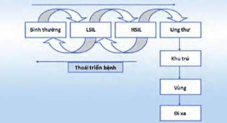
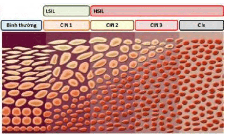
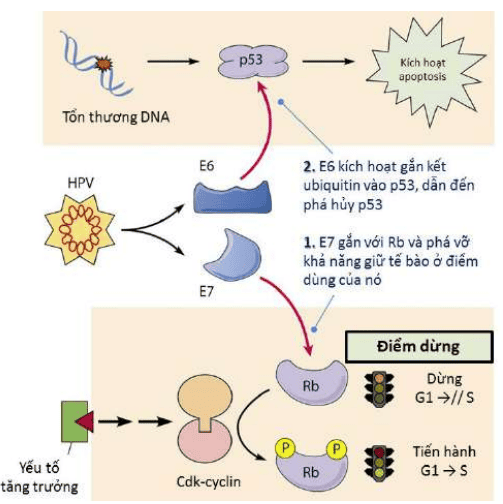
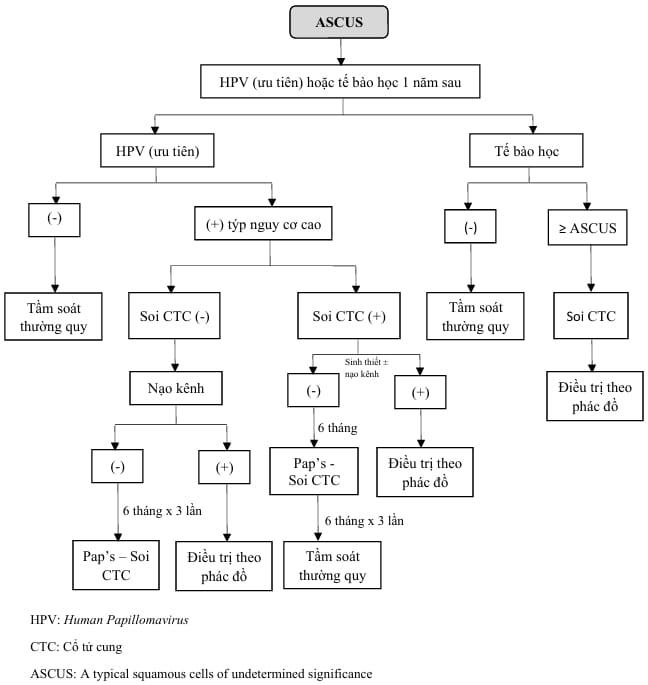
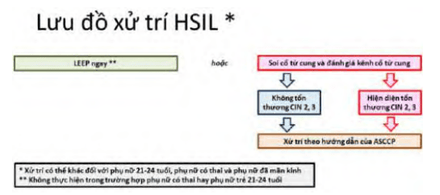
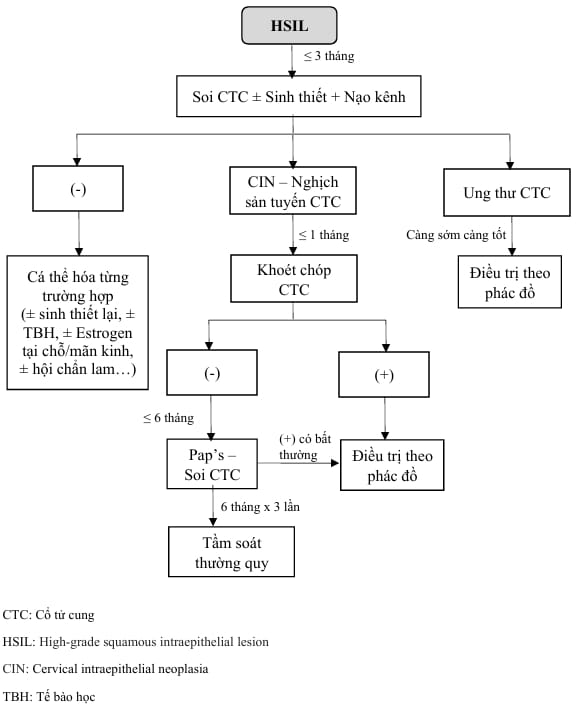
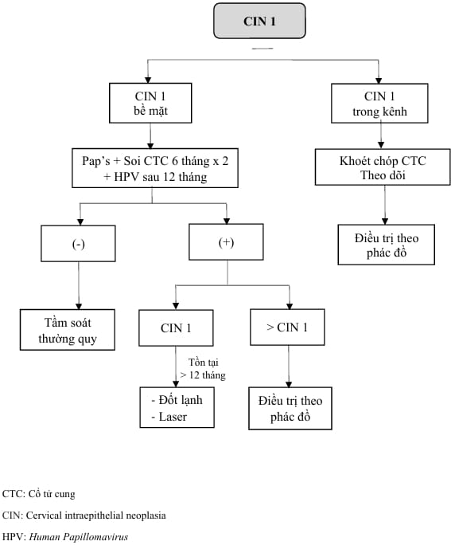
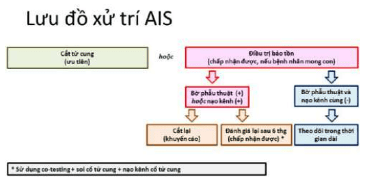
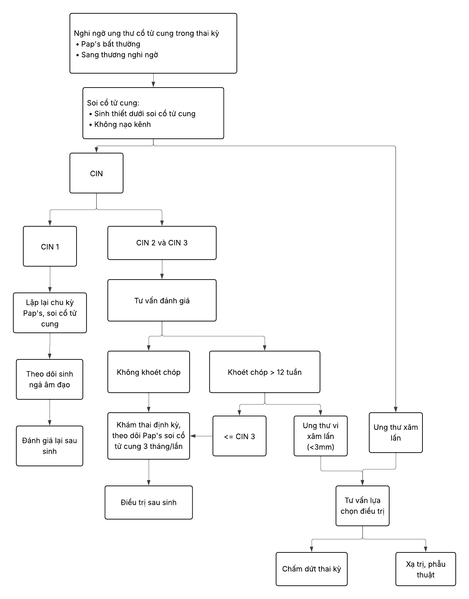

Cổ tử cung có thể tổn thương ở nhiều mức độ khác nhau, từ những biến đổi nhẹ đến ung thư xâm lấn.

## Các luận điểm về diễn biến của tân sinh biểu mô cổ tử cung

### Luận điểm cổ điển

Theo mô học, tổn thương tân sinh trong biểu mô cổ tử cung (CIN) được chia thành ba mức:

- **CIN 1**: Tế bào bất thường giới hạn 1/3 dưới biểu mô lát.
- **CIN 2**: Tế bào bất thường lan tới 2/3 độ dày biểu mô lát.
- **CIN 3**: Toàn bộ độ dày biểu mô lát bị thay thế bởi tế bào bất thường.

Dựa trên mức độ tế bào bề mặt, phân loại tế bào học cũng tách thành:

- **LSIL** (Low-grade): tương ứng CIN 1.
- **HSIL** (High-grade): tương ứng CIN 2–3.

_Luận điểm cổ điển về tiến triển tự nhiên của tổn thương biểu mô cổ tử cung._

_Phân chia cổ điển: CIN theo mô học, tế bào học quan sát tế bào bề mặt._

### Luận điểm hiện đại

Hiện nay, biết rằng CIN không nhất thiết phải trải qua tuần tự từ thấp lên cao; một số CIN 2–3 xuất hiện "nhảy bậc" mà không qua CIN 1. Yếu tố then chốt bao gồm:

1. **Genotype HPV**: HPV type 16 chịu trách nhiệm khoảng 55–60% ca ung thư cổ tử cung, type 18 chiếm 10–15%. Có khoảng 12 type HPV nguy cơ cao khác.
2. **Khả năng thanh thải HPV**: Đa số nhiễm HPV ở phụ nữ trẻ (≤ 21 tuổi) tự khỏi trong 8–24 tháng do đáp ứng miễn dịch.
3. **Tích hợp gene HPV**: Khi virus tích hợp vào genome tế bào—đặc biệt ở CIN 2–3—nguy cơ tiến triển cao hơn.
4. **Yếu tố thuận lợi**: Hút thuốc, suy giảm miễn dịch, nhiễm HIV làm giảm khả năng thanh thải HPV.

Hầu hết nhiễm HPV cấp (CIN 1) thoái triển; khoảng 10% CIN 1 tiến triển lên CIN 2–3 sau 2 năm. CIN 3 hiếm khi thoái triển, có khoảng 30% nguy cơ thành ung thư xâm lấn sau 30 năm.

_Các trường hợp nhiễm HPV có thể thoái triển hoặc tiến triển trực tiếp lên HSIL/ung thư mà không qua giai đoạn trung gian._

## Dị sản cổ tử cung

### Quá trình dị sản

- **Chuyển sản lát**: Biểu mô trụ lộ tuyến (lộ tuyến) bị thay thế bởi biểu mô lát tầng không sừng hóa.
- **Dị sản** (dysplasia): Khi tế bào chuyển sản bị tổn thương bởi HPV, hóa chất, tia xạ..., dẫn đến CIN.
- HPV thể hiện chức năng sinh ung qua hai protein E6 (bất hoạt p53, ngăn apoptosis) và E7 (bất hoạt pRb, kích hoạt E2F → tăng sinh không kiểm soát).

Dị sản còn phụ thuộc vào đáp ứng miễn dịch: khoảng 80% có thể tự cải thiện, nhưng 10% tiến triển thành ung thư.

_E6 và E7 bất hoạt p53 và pRb, khiến tế bào dị sản tăng sinh không kiểm soát._

_Sinh học tế bào CIN 1 thoái triển dễ, CIN 3 gần như không tự xoá và dễ tiến triển._

### Các yếu tố nguy cơ

- Quan hệ tình dục sớm (< 18 tuổi) hoặc nhiều bạn tình.
- Bạn tình nam có quan hệ với người bị ung thư cổ tử cung.
- Hút thuốc lá.
- Nhiễm HIV hoặc suy giảm miễn dịch.
- Tiếp xúc DES (diethylstilbestrol).
- Tiền căn CIN 2–3, ung thư cổ tử cung.
- Pap’s test không định kỳ hoặc chưa từng làm.
- Nhiễm các STD khác.

## Quản lý bất thường tế bào cổ tử cung

### ASC-US

#### Định nghĩa và tiến triển

- **ASC-US** (Atypical Squamous Cells of Undetermined Significance): Tế bào vảy có nhân to, đôi khi nhân đôi, không đủ tiêu chuẩn HSIL hay LSIL.
- Phần lớn do phản ứng viêm, ít khi tiến triển: nguy cơ HSIL 7%, ung thư xâm lấn 0.25%. Sau 24 tháng:
  - 65% thoái lui về bình thường.
  - 7% tiến triển HSIL.
  - 0.25% tiến triển ung thư xâm lấn.

#### Quản lý ASC-US

- Làm **HPV testing** để phân tầng nguy cơ:

  - Nếu **HPV (-)**: Thực hiện co-testing sau 3 năm.
  - Nếu **HPV (+)**: Soi cổ tử cung ngay hoặc lặp lại Pap’s test sau 1 năm.

- **Phụ nữ < 24 tuổi**: Do nguy cơ thấp, có thể theo dõi Pap’s test lại sau 1 năm:

  - Nếu kết quả ≥ ASC-H hoặc HSIL → soi cổ tử cung.
  - Nếu bình thường → lặp lại Pap’s test sau 1 năm, nếu vẫn bình thường → tầm soát định kỳ.
  - Có thể làm HPV ngay, nếu HPV (-) → tầm soát định kỳ; nếu HPV (+) → theo dõi như trên.

- **Phụ nữ có thai**: Không nạo kênh cổ tử cung, có thể hoãn soi đến 6 tuần sau sinh.

  

  _Quản lý ASC-US - Hướng dẫn của ASCCP 2012._

  

  _Quản lý ASC-US – Bệnh viện Từ Dũ._

### LSIL

#### Định nghĩa và tiến triển

- **LSIL**: Biểu hiện CIN 1 hoặc nhiễm HPV type nguy cơ cao.
- Tế bào LSIL có nhân ≥ 3 lần nhân trung gian, tỷ lệ nhân:bào tương ≤ 1/3; hầu hết HPV (+).
- Sau 24 tháng:
  - 47% thoái triển về bình thường.
  - 20% tiến triển HSIL.
  - 0.15% thành ung thư xâm lấn.

#### Quản lý LSIL

- Soi cổ tử cung và sinh thiết theo tổn thương qua soi.
- Nếu **HPV (-)** sau co-testing → co-testing lại sau 1 năm.

- **Phụ nữ 21–24 tuổi**: Do tỷ lệ thoái triển cao, lặp lại Pap’s test sau 12 và 24 tháng.
- **Phụ nữ ≤ 20 tuổi**: Theo dõi giống 21–24 tuổi.
- **Phụ nữ có thai**: Như người không có thai, không nạo kênh cổ tử cung và hoãn soi đến 6 tuần sau sinh.
- **Phụ nữ mãn kinh**: Chọn một trong các cách: làm HPV hoặc lặp lại Pap’s test sau 6 và 12 tháng, hoặc soi ngay:

  - Nếu HPV (-) hoặc không có CIN khi soi → Pap’s test sau 12 tháng.
  - Nếu HPV (+) hoặc Pap’s test ≥ ASC → soi cổ tử cung ngay.
  - Nếu Pap’s test âm tính hai lần liên tiếp → trở lại tầm soát định kỳ.

  

  _Quản lý LSIL – Hướng dẫn của ASCCP 2012._

  

  _Quản lý LSIL – Bệnh viện Từ Dũ._

### HSIL

#### Định nghĩa và tiến triển

- **HSIL**: Dị sản vừa–nặng (CIN 2–3, carcinoma in situ).
- **CIN 2**: Tế bào bất thường lan tới 2/3 dày biểu mô, nhân chiếm 1/2 kích thước tế bào, tỷ lệ nhân:bào tương giảm.
- **CIN 3**: Tế bào bất thường thay thế toàn bộ dày biểu mô, nhân lớn so với bào tương.

- Sau 24 tháng:

  - 35% thoái lui về bình thường.
  - 23% tiếp tục HSIL.
  - 1.44% tiến triển thành ung thư xâm lấn.

- 70% HSIL qua tế bào phẩm tương ứng với CIN 2–3, 1–2% có ung thư xâm lấn.

#### Quản lý HSIL

- Soi cổ tử cung ngay ở mọi lứa tuổi và sinh thiết tổn thương.
- Nạo kênh cổ tử cung nếu không mang thai.
- **Hoặc** khoét chóp ngay (trừ phụ nữ < 25 tuổi hoặc đang có thai).

- LEEP (cắt vòng điện) có thể thực hiện cùng lúc với soi, bỏ qua sinh thiết và đánh giá kênh sau khi cắt.

  

  _Quản lý HSIL – Hướng dẫn của ASCCP 2012._

  

  _Quản lý HSIL – Bệnh viện Từ Dũ._

### ASC-H

#### Đặc điểm

- **ASC-H** (Atypical Squamous Cells, cannot exclude HSIL): Tế bào vảy không điển hình, không thể loại trừ tổn thương HSIL.

#### Quản lý ASC-H

- Soi cổ tử cung và sinh thiết tổn thương.

  

  _Quản lý ASC-H – Bệnh viện Từ Dũ._

### AGC / AGUS

#### Đặc điểm

- **AGC** (Atypical Glandular Cells): Tế bào tuyến không điển hình.
- **AGUS** (Atypical Glandular Cells of Undetermined Significance): Tương tự AGC nhưng ý nghĩa chưa rõ.

#### Quản lý AGC / AGUS

- Soi cổ tử cung, nạo kênh, và sinh thiết tổn thương tuyến nếu có.
- Tùy theo kết quả, có thể khoét chóp bằng dao lạnh.

  

  _Quản lý AGC / AGUS – Bệnh viện Từ Dũ._

  

  _Quản lý AGC hướng về tăng sản tuyến – Bệnh viện Từ Dũ._

### CIN 1

#### Đặc điểm

- Đại đa số CIN 1 thoái triển tự nhiên.
- Chỉ khoảng 13% tiến triển thành CIN 2–3 sau 2 năm.

#### Quản lý CIN 1

- Theo dõi Pap’s test hoặc co-testing định kỳ, tránh can thiệp quá mức.

  

  _Quản lý CIN 1 – Bệnh viện Từ Dũ._

### CIN 2 và CIN 3

#### Đặc điểm

- Đều là tổn thương tiền ung thư.
- Khoảng 40% CIN 2 thoái triển sau 2 năm, trong khi CIN 3 hầu như không thoái triển.

#### Quản lý CIN 2, CIN 3

- Khoét chóp (cold knife conization) hoặc LEEP/LLETZ để cắt bỏ mô xét nghiệm và điều trị, trừ khi có chỉ định đặc biệt ở phụ nữ trẻ hoặc đang mang thai.

  

  _Quản lý CIN 2, 3 – Bệnh viện Từ Dũ._

### AIS

#### Đặc điểm

- **AIS** (Adenocarcinoma in situ): Tổn thương tuyến tại chỗ, HPV (+) > 95%.
- Thường lan sâu vào kênh, đa ổ, khó xác định giới hạn.

#### Quản lý AIS

- **Cắt tử cung toàn phần**: Lựa chọn nếu không còn nhu cầu sinh con.
- **Điều trị bảo tồn**: Có thể với phụ nữ muốn giữ khả năng sinh con, cần theo dõi chặt chẽ.
- Khoét chóp bằng dao lạnh được ưu tiên hơn LEEP để đánh giá bờ phẫu thuật chính xác. Nếu bờ còn bất thường hoặc kênh có CIN/AIS, cần cắt lại hoặc đánh giá sau 6 tháng.

  

  _Quản lý AIS – ASCCP 2012._

### Nghi ngờ ung thư cổ tử cung trong thai kỳ

- Xử trí tương tự người không mang thai, nhưng hoãn một số can thiệp (nạo kênh) đến sau sinh hoặc lựa chọn kỹ thuật ít xâm lấn.

  

  _Quản lý nghi ngờ ung thư cổ tử cung ở phụ nữ có thai – Bệnh viện Từ Dũ._

## Điều trị trong tân sinh biểu mô cổ tử cung

### Hủy mô bằng áp lạnh (Cryotherapy)

- Sử dụng nitrogen hoặc CO₂ lỏng làm lạnh mô bất thường.
- Đơn giản, ít đau, thực hiện ngoại trú.
- Không điều chỉnh chính xác độ sâu và rìa điều trị.

_Áp lạnh cổ tử cung: đầu áp nối với nitrogen lỏng hoặc CO₂ lỏng._

### Hủy mô bằng đốt laser (Laser Vaporization)

- Sử dụng chùm tia laser để phá hủy tế bào.
- Chính xác về độ sâu và biên giới tổn thương, có thể xử lý đồng thời nhiều ổ.
- Chi phí cao, có thể chảy máu, gây khó chịu hơn.

### Nạo kênh cổ tử cung (Endocervical Curettage)

- Dùng thìa nạo niêm mạc ống cổ tử cung.
- Thực hiện tại phòng khám, không gây mê.
- Có thể gây đau bụng và chảy máu nhẹ.

### Khoét chóp bằng dao lạnh (Cold Knife Conization)

- Lấy mô hình nón bao gồm tổn thương và rìa bình thường.
- Mẫu mô rõ ràng, không bị cháy, giúp đánh giá bờ phẫu thuật và xâm lấn.
- Khó cầm máu và có thể gây hẹp kênh cổ tử cung.

_Khoét chóp cổ tử cung bằng dao lạnh._

### Cắt bỏ mô tổn thương bằng vòng điện (LEEP / LLETZ)

- Lấy vùng chuyển tiếp bằng vòng điện, thuận tiện và nhanh chóng.
- Mẫu mô dễ bị cháy, khó đánh giá bờ cắt.
- Dần thay thế đốt laser do chi phí và tính đơn giản.

_LEEP và các loại vòng cắt phổ biến._

## Nguồn tham khảo

- Trường ĐH Y Dược TP. HCM (2020) – _Team-based learning_
- Bệnh viện Từ Dũ (2022) – _Phác đồ điều trị Sản Phụ khoa_
