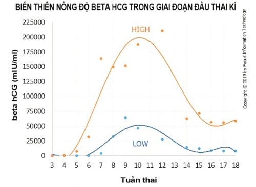

human Chorionic Gonadotropin (hCG) là glycoprotein có trọng lượng phân tử 36000-40000 Da. Đây là hormone có chứa nhiều liên kết carbohydrate nhất trong các hormone ở loài người.

## Nguồn gốc

hCG là hormone hướng tuyến sinh dục (gonadotropin), được sản xuất chủ yếu bởi các hội bào nuôi và thường là dấu hiệu có thai sinh hóa.

Khi thai dưới 5 tuần tuổi, hCG được sản xuất ở cả nguyên bào nuôi và hội bào nuôi. Đến khi nồng độ hCG trong huyết tương mẹ đạt đỉnh, hCG chỉ còn được sản xuất bởi các hội bào nuôi.

Ngoài bánh rau, thận, tuyến yên và một số mô khác của thai cũng có thể sản xuất ra hCG. Điều này giải thích trong bệnh lý tăng sản tuyến thượng thận, tuyến yên có thể xét nghiệm hCG tăng cao.

Tìm thấy với nồng độ rất nhỏ ở đàn ông và phụ nữ không có thai, có lẽ chủ yếu sản sinh ở tuyến yên trước. hCG cũng được tìm thấy trong bệnh lý tân sinh nguyên bào nuôi hoặc trong các bệnh lý ác tính không liên quan đến nguyên bào nuôi.

## Cấu trúc và sinh tổng hợp

hCG được tạo thành từ 2 tiểu đơn vị α và β. Chúng được tổng hợp từ 2 nhóm gene khác nhau, nằm trên 2 nhiễm sắc thể khác nhau, với biểu hiện gene độc lập:

- Tiểu đơn vị α của hCG được mã hóa bằng gene duy nhất trên nhiễm sắc thể 6, là tiểu đơn vị chung cho nhiều hormone glycoprotein khác của tuyến yên gồm FSH, LH và TSH. Tiểu đơn vị này được tổng hợp tại tuyến yên và hội bào nuôi. Tiểu đơn vị β của hCG được mã hóa bằng nhiều gene khác nhau trên nhiễm sắc thể 19.
- Tiểu đơn vị β của hCG có cấu tạo gần giống như tiểu đơn vị β của LH. Người ta tin rằng LH và hCG cùng có chung thụ thể (LH-Chorionic Gonadotropin receptor) (LHCGR), và do đó có thể là cùng có chung tác dụng. Tuy nhiên, tiểu đơn vị β của hCG vẫn có đặc thù là thêm phần kéo dài C-tận (C-terminal extension). Phần C-tận giúp cho thời gian bán hủy của hCG trở nên rất dài so với LH. Phần kéo dài C-tận so với LH cũng có thể là nguyên nhân dẫn đến tác dụng khác nhau của LH và của hCG trên LHCGR.

hCG chỉ thể hiện hoạt tính sinh học khi ở trạng thái kết hợp đầy đủ. Khi tồn tại 1 mình, chuỗi β-hCG không thể gây được các hoạt tính sinh học của hCG. Khi tồn tại 1 mình, các chuỗi α và β sẽ bị thoái giáng, tạo thành các mảnh đứt gãy.

Sau khi được tổng hợp riêng rẽ, các tiểu đơn vị α và β sẽ được tập trung về bộ Golgi để lắp ghép thành hCG hoàn chỉnh. Tùy theo mức độ biểu hiện khác biệt của gene α và các gene β mà chúng ta có thể có các thành phần dôi ra (α hay β), không được sử dụng, sẽ lưu hành ở dạng đơn lẽ bất hoạt trong máu ngoại vi. Có thể tìm thấy cả hCG toàn phần, chuỗi α-hCG tự do (free α) cũng như chuỗi β-hCG tự do (free β). Sự chênh lệch trong biểu hiện các gene thành phần của hCG tùy thuộc vào tình trạng cụ thể. Trong một số điều kiện (bệnh lý) nhất định, khảo sát sự mất cân đối trong các thành phần có thể giúp có thêm thông tin cho chẩn đoán.

## Thụ thể

Tương tự với thụ thể của các gonadotropin khác, thụ thể của hCG là thụ thể màng, kiểu G protein-coupled receptors (GPCR).

GPCR là kiểu thụ thể protein, với phần đầu N-tận nằm ngoài tế bào, phần thân có cấu tạo dạng rắn bò, xuyên màng nhiều lần, và phần cuối C-tận nằm bên trong màng tế bào. GPCR tác động bằng cách bắt cặp với G protein. G protein là protein nằm lân cận khu vực C-tận của GPCR. Khi ligand đến gắn vào cấu trúc N-tận, nó gây ra các biến đổi tại vùng xuyên màng, dẫn đến kích hoạt cấu trúc C-tận. Cấu trúc C-tận bị kích hoạt chiêu mộ G protein. G protein bị kích hoạt sẽ gây loạt phản ứng bên trong bào tương.

hCG và LH chia nhau cùng thụ thể GPCR, gọi là thụ thể LH/chorionic gonadotropin (LHCGR). Cấu tạo của vùng N-tận của LHCGR tương hợp cho cả gắn kết với cả LH lẫn hCG. LHCGR là GPCR rất khác với các GPCR khác. Phần N-tận ngoài tế bào lớn (340 amino acid) cho phép thụ thể này gắn với ligand lớn như glycoprotein. Phần N-tận gắn với hormone tương ứng với exon 10 của LHCGR. Exon 10 bình thường tạo ra cấu trúc 4 bậc của đầu N-tận tương hợp cho gắn kết GPCR với cả LH lẫn hCG. Tuy nhiên, các khảo sát giải trình tự của LHCGR được thực hiện gần đây gợi ý rằng tồn tại các biến thể khác nhau của LHCGR, cũng như gợi ý rằng các hormone LH và hCG không có tác dụng như nhau trên LHCGR.

GPCR tiếp nhận cả 2 ligand là LH và hCG. Tuy nhiên, cấu trúc không gian 4 bậc khác nhau của hCG và LH làm cho gắn kết của 2 hormone này với ligand không hoàn toàn như nhau. Hệ quả là chúng tạo ra những đáp ứng khác nhau:

- Khi ligand là LH, tế bào đáp ứng chủ yếu qua con đường PIP3/AKT hay Protein Kinase C/ERK.
- Khi ligand là hCG, tế bào đáp ứng chủ yếu bằng con đường AMP vòng và Protein Kinase A.

## Chuyển hóa

T½ của hCG khoảng 36h, rất dài so với LH (20 phút). T½ dài đảm bảo hCG duy trì được hoạt tính LH hiệu quả trong thời gian dài.

Chuyển hóa hCG bao gồm sự thải trừ trực tiếp hCG nguyên vẹn, hiện tượng tách rời các chuỗi, hiện tượng thoái giáng và hiện tượng đứt gãy. Các hiện tượng này dẫn đến sự hiện diện trong máu và trong nước tiểu của mọi thành phần khác nhau của tiến trình chuyển hóa và thoái giáng hCG.

## Chức năng

### Bằng chứng thai sinh hóa

Ngày thứ 10 sau thụ tinh, hội bào nuôi đã phá vỡ được các mạch máu xoắn ốc của nội mạc, tiếp xúc trực tiếp với máu mẹ. Từ hồ máu sơ khai, những phân tử hCG đầu tiên sẽ đi vào máu mẹ.

hCG là bằng chứng của hiện diện của nguyên bào nuôi, là bằng chứng của hoạt động làm tổ của trứng thụ tinh. hCG là bằng chứng sinh hóa của thai kỳ.

### Chuyển hoàng thể chu kỳ thành hoàng thể thai kỳ

Cấu tạo giống LH giúp hCG có thể thay thế hoàn toàn LH và đảm trách nhiệm vụ của LH giúp biến hoàng thể chu kỳ thành hoàng thể thai kỳ, duy trì hoàng thể thai kỳ trong tam cá nguyệt I và thúc đẩy hoàng thể sản xuất hormone steroid.

Trong chu kỳ không có thai, sự ly giải hoàng thể sẽ bắt đầu xảy ra từ ngày thứ 11 sau phóng noãn. Trong chu kỳ có thai, sự có mặt đúng lúc của hCG vào thời điểm LH tuyến yên bị sút giảm sẽ giúp hoàng thể tiếp tục tồn tại và phát triển thành hoàng thể thai kỳ. Hoàng thể thai kỳ tiếp tục hoạt động sản xuất steroid sinh dục để duy trì thai kỳ.

### Phản ánh hoạt động của lá nuôi

Lá nuôi có nguồn gốc từ khối tế bào ngoại bì lá nuôi sản xuất hCG. Phôi thai có nguồn gốc từ khối tế bào trong (ICM). Hoạt động của lá nuôi tương đối độc lập với sinh tồn và phát triển của phôi thai. Vì thế, diễn biến của hCG phản ánh hoạt động của lá nuôi hơn là phản ánh tình trạng của phôi thai.

Trong khảo sát hoạt năng của lá nuôi, tức là diễn biến của làm tổ (thai ngoài tử cung có hoạt năng lá nuôi suy giảm do vị trí làm tổ bất thường), lá nuôi có hoạt năng bất thường (thai kỳ với thai lệch bội, lá nuôi kém phát triển với mất cân đối trong điều hòa gene α-hCG và các gene β-hCG), hay các bệnh lý của lá nuôi (thai trứng, ung thư nguyên bào nuôi với hoạt động sản xuất hCG tăng mạnh) thì diễn biến hCG (và các thành phần) là chỉ báo quan trọng.

Trong khi đó, để khảo sát phát triển bào thai, thì chính khảo sát phôi thai bằng hình ảnh học mới là chỉ báo quan trọng.

### Dùng thay thế hoạt tính LH

Do cấu tạo tương tự LH, nên có thể dùng hCG cho một số trường hợp cần phải gây ra hoạt tính LH ngoại sinh. Ví dụ rõ ràng nhất của ứng dụng này là gây trưởng thành cuối cùng của noãn bào bằng hCG thay vì bằng LH.

### Thúc đẩy quá trình phát triển bào thai

hCG được sản xuất từ khối hội bào nuôi còn có thể tác động theo con đường cận tiết để thúc đầy sự phát triển chất nền nội mạc tử cung, tăng tạo mạch để hỗ trợ cho quá trình làm tổ của phôi, tác động trên các tế bào trực tiếp tiếp xúc với nguyên bào nuôi tạo ra thay đổi trong cấu trúc thành mạch các
mạch máu xoắn ốc, đảm bảo màng rụng hóa… là các biến đổi quan trọng giúp cho tiến trình phát triển của bào thai.

hCG là kích thích tinh hoàn thai nhi sản xuất ra testosterone.

hCG cũng kích thích hoàng thể sản xuất ra relaxin giúp giảm co thắt cơ trơn tử cung.

## Động học β-hCG

Động học β-hCG là sự diễn biến của β-hCG theo thời gian.

Đối với phụ nữ không mang thai, nồng độ β-hCG dưới 5 mUI/ml, phụ nữ có thai nồng độ β-hCG là trên 25 mUI/ml. Que thử thai thường có độ nhạy từ 20-25 mUI/ml.

hCG có thể tìm thấy trước khi trễ kinh, tăng dần đến đỉnh ở tuần thứ 8-10 của thai kỳ sau đó giảm dần.

Ở thai kỳ bình thường có thể phát hiện hCG sau đỉnh LH 9-11 ngày tức là khoảng 8 ngày sau phóng noãn, và chỉ 1 ngày sau khi phôi làm tổ.

Trước 6 tuần, nồng độ hCG tăng gấp đôi mỗi 2 ngày và đạt đỉnh ở tuần 8-10, có thể vào khoảng 100.000 mUI/mL. Sau đó, nồng độ hCG sẽ giảm dần và đạt cực tiểu tại thời điểm 16-20 tuần rồi giữ ổn định ở mức này đển cuối thai kỳ.

Động học β-hCG có ích lợi trong 6 tuần đầu thai kỳ khi siêu âm chưa phát hiện vị trí túi thai và chưa xác nhận phôi và hoạt động tim thai:

- β-hCG tăng phù hợp cho biết thai sống trong tử cung. 99.9% thai sống trong tử cung có β-hCG tăng trên 35% mỗi 48 giờ. Tuy nhiên, vẫn có khoảng 21% thai ngoài tử cung có kiểu tăng β-hCG như trên.
- β-hCG bình nguyên hay tăng ít, dưới 35% mỗi 48 giờ gợi ý đi tìm tình trạng thai ngoài tử cung hay thai trong tử cung có diễn biến bất thường.
- β-hCG giảm gợi ý khả năng là thai trong tử cung nhưng có thể là thai lưu, túi thai trống. β-hCG không cho phép loại trừ khả năng có thai ngoài tử cung.
- Sau khi sẩy thai tự nhiên, β-hCG huyết thanh sẽ giảm ít nhất 21-35% mỗi 2 ngày. Nếu β-hCG huyết thanh giảm chậm, dưới 20% mỗi 2 ngày thì có nhiều khả năng là 1 trong 2 tình trạng còn tồn tại sản phẩm thụ thai hoặc có thai ngoài tử cung.

## Ngưỡng phân định β-hCG

Thai trong tử cung bình thường, khi nồng độ β-hCG huyết thanh ở trên ngưỡng cắt này thì phải thấy được hình ảnh của thai trong tử cung. β-hCG đạt mức 1500 mIU/mL có thể thấy được hình ảnh túi thai trong buồng tử cung qua siêu âm đầu dò âm đạo và 3000 mIU/mL đối với song thai. Nếu không thấy được hình ảnh túi thai cần nghĩ đến thai ngoài tử cung, thai ngưng tiến triển hoặc đã sẩy hay giai đoạn sớm của trường hợp đa thai.

β-hCG trên 4000 mIU/mL trên siêu âm có thể thấy được hình ảnh phôi thai với hoạt động tim phôi. β-hCG đạt mức 5000-6000 mIU/mL có thể thấy hình ảnh túi thai qua siêu âm đầu dò bụng.

| Tuổi thai               | Nồng độ HCG theo tuổi thai |
| ----------------------- | -------------------------- |
| 3 tuần                  | 5-50 mIU/ml                |
| 4 tuần                  | 5-426 mIU/ml               |
| 5 tuần                  | 18-7.340 mIU/ml            |
| 6 tuần                  | 1.080-56.500 mIU/ml        |
| 7-8 tuần                | 7.650-229.000 mIU/ml       |
| 9-12 tuần               | 25.700-288.000 mIU/ml      |
| 13-16 tuần              | 13.300-254.000 mIU/ml      |
| 17-24 tuần              | 4.060-165.400 mIU/ml       |
| Từ 25 tuần đến lúc sinh | 3.640-117.000 mIU/ml       |
| Sau sinh 4-6 tuần       | dưới 5 mIU/ml              |

hCG phải được kết hợp với siêu âm để chẩn đoán. Trong trường hợp tử cung rỗng, khả năng mang thai khả thi giảm khi mức hCG tăng. Ví dụ, ước tính ở mức hCG từ 2000 đến 3000 mIU/ml, 2% có thai, 65% thai kỳ thất bại và 33% sẽ là thai ngoài tử cung. Ở mức hCG > 3000 mIU/ml, 0.5% có thai, 66,3% thai kỳ thất bại và 33,2% sẽ là thai ngoài tử cung. Tuy nhiên, vẫn có thể sinh thai nhi sống ngay cả khi mức hCG > 4000 mIU/mL và không phát hiện thấy dấu hiệu siêu âm khi khám ban đầu. Mức hCG phân biệt có sự thay đổi lớn do các kỹ thuật xét nghiệm hCG, chất lượng siêu âm và kinh nghiệm của người thực hiện. Ngoài ra, thai đôi sẽ có mức hCG cao hơn đáng kể so với thai đơn trước khi phát hiện thấy dấu hiệu siêu âm. Mặc dù nhiều mức độ phân biệt hCG đã được sử dụng để đánh giá nguy cơ mang thai ngoài tử cung, nhưng không có mức độ hCG nào được xác định là có thể chẩn đoán được thai ngoài tử cung.

## Nguồn tham khảo

- Trường Đại học Y Dược TP. HCM (2020) – _Team-based learning_
- [Early Fetal Development](https://americanpregnancy.org/healthy-pregnancy/pregnancy-health-wellness/early-fetal-development) - American Pregnancy Association.
