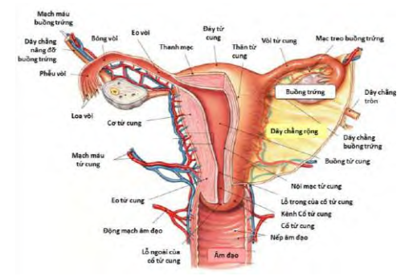
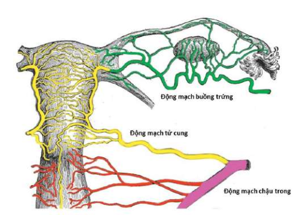

**Buồng trứng là tuyến kép** đảm nhận đồng thời hai vai trò:

- **Ngoại tiết:** Tổng hợp và giải phóng noãn bào trưởng thành mỗi chu kỳ kinh.
- **Nội tiết:** Sản xuất steroid sinh dục (estrogen, progesterone) điều hòa chu kỳ kinh và duy trì thai kỳ.

## Giải phẫu

**Vị trí buồng trứng:**

- Nằm trong ổ chậu, không được thanh mạc bao phủ hoàn toàn.
- Mỗi bên một buồng trứng, kích thước trung bình 2 x 3 x 3 cm, trọng lượng 4-8 g.
- Bề mặt phẳng mịn ở trẻ em, trở nên sần do tạo vết sẹo phóng noãn sau tuổi dậy thì.

**Hình thái và liên quan:**

_Hình ảnh "Giải phẫu tử cung - buồng trứng"_.

- **Mặt trong** (mặt tự do): Lồi, hướng về phễu vòi tử cung và quai ruột.
- **Mặt ngoài** (áp phúc mạc thành bên chậu) nằm trong hố buồng trứng, giới hạn bởi: Trước - dưới là dây chằng rộng; Trên là động mạch chậu ngoài; Sau là động mạch chậu trong và niệu quản.
- **Bờ tự do:** Tiếp xúc quai ruột.
- **Bờ mạc treo:** Gắn vào mặt sau dây chằng rộng qua mạc treo buồng trứng.
- **Đầu vòi:** Hướng lên trên, nơi vào của hệ mạch buồng trứng (trong dây chằng treo).
- **Đầu tử cung:** Hướng xuống dưới, bám vào dây chằng buồng trứng riêng (ovarian ligament) tới góc tử cung.

**Mạch máu và bạch huyết:**

_Hình ảnh "Giải phẫu mạch máu tử cung buồng trứng"_.

- **Động mạch buồng trứng:** Tách từ động mạch chủ bụng ngang mức L2. Chạy trong dây chằng treo, vào buồng trứng tại đầu vòi.
- **Nhánh nối từ động mạch tử cung:** Chảy dọc dây chằng buồng trứng riêng, góp phần cấp máu cho cực dưới.
- **Tĩnh mạch:** Đám rối quanh rốn buồng trứng nên phải đổ vào tĩnh mạch chủ dưới. Bên trái đổ vào tĩnh mạch thận trái.
- **Bạch huyết:** Theo mạch máu buồng trứng, đổ vào hạch thắt lưng (para-aortic).
- **Thần kinh:** Sợi giao cảm từ đám rối mạc treo (renal-aortic plexus). Sợi cảm giác theo mạch máu đến tủy sống T10-T12.

**Hệ thống dây chằng và mạc treo:**

- **Mạc treo buồng trứng** (mesovarium): Gồm mạch máu, thần kinh, bạch huyết.
- **Dây chằng buồng trứng riêng** (ligamentum ovarii proprium): Nối đầu tử cung buồng trứng đến góc tử cung.
- **Dây chằng rộng tử cung** (ligamentum latum): Phúc mạc phủ, tạo túi sau vòi trứng.
- **Dây chằng treo buồng trứng** (suspensory ligament): Chứa động - tĩnh mạch buồng trứng, thần kinh, bạch huyết.

## Mô học

- **Vỏ ngoài** (tunica albuginea): Lớp mô liên kết dày, phủ bề mặt buồng trứng.
- **Vùng vỏ** (cortex): Chứa nang noãn ở các giai đoạn (nguyên thủy → Graaf).
- **Vùng tuỷ** (medulla): Mô liên kết lỏng lẻo, chứa mạch máu, thần kinh, bạch huyết.
- **Biểu mô phủ** (germinal epithelium): Tế bào vuông hoặc hình trụ thấp trên màng trắng (tunica albuginea).

## Ứng dụng

- **Thoát vị buồng trứng:** Hiếm do cấu trúc dây chằng.
- **Tính mỏng vỏ:** Dễ vỡ nang trong hội chứng buồng trứng đa nang.
- **Mạch máu dài:** Can thiệp mạch (embolization) cần lưu ý vị trí động mạch buồng trứng.

## Tài liệu tham khảo

- Trường ĐH Y Dược TP. HCM (2020) - _Team-based learning_
