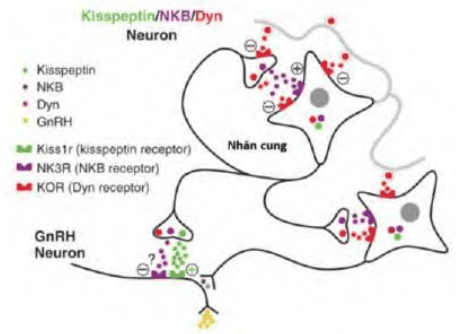
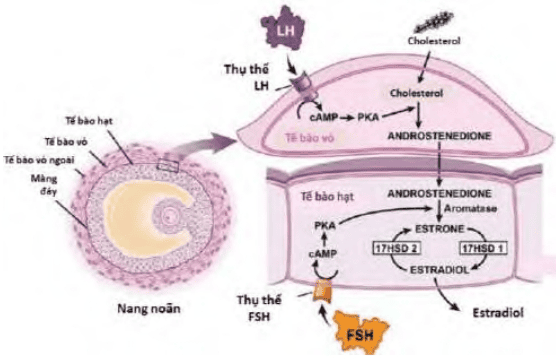
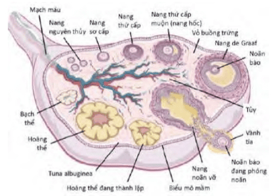

Sinh lý phát triển nang noãn từ bào thai đến mãn kinh, cơ chế chiêu mộ nang, điều hòa qua AMH/PTEN-PI3K-Akt và hoạt động trục hạ đồi-yên-buồng trứng trong chu kỳ buồng trứng.

## Buồng trứng và kho nang nguyên thủy

**Tuần 7 thai kỳ:** Noãn nguyên bào (germ cell) từ túi noãn hoàng di chuyển vào ụ sinh dục, phân chia nguyên nhiễm nhanh chóng.

**Nang noãn nguyên thủy:** Mỗi noãn nguyên bào được bọc quanh bởi lớp tế bào tùy hành (từ trung mô/phúc mạc). Vào giữa thai kỳ, toàn bộ noãn nguyên bào đồng loạt ngưng phân chia → nằm im trong nang nguyên thủy cho đến tuổi dậy thì.

## Chiêu mộ nang noãn nguyên thủy

**Chiêu mộ nguyên khởi (Primordial Recruitment):** Mỗi đợt 400 nang nguyên thủy được đánh thức, độc lập với FSH/LH. **Cơ chế cận tiết:**

- **PTEN-PI3K-Akt:** Cân bằng PTEN (ức chế) và PI3K (kích hoạt) quyết định nang nào "thức giấc".
- **AMH** (từ tế bào hạt nang tiền hốc → nang hốc nhỏ) ức chế quá mức chiêu mộ, như "người gác cổng". 

_Hình ảnh "Con đường PTEN/PI3K/AKT"_.

## Phát triển nang trước khi lệ thuộc gonadotropin

Nang đã chiêu mộ → noãn sơ cấp → noãn thứ cấp sớm → noãn thứ cấp muộn.

**AMH** tiếp tục kìm hãm tăng tốc phát triển, bảo vệ chỉ còn 10 nang/noãn trên 60-90 ngày vào giai đoạn "lệ thuộc gonadotropin".

_Hình ảnh "Điều hòa chiêu mộ noãn nang"_.

## Trục hạ đồi-tuyến yên-buồng trứng

### Hạ đồi

**KNDy neuron** (kisspeptin, neurokinin B, dynorphin): Điều khiển GnRH neuron. Kisspeptin → kích thích GnRH → phóng thích theo xung vào máu cửa tuyến yên.

_Hình ảnh "KNDy và GnRH neuron"_.

### Tuyến yên

**Xung GnRH** → tiết FSH (xung thưa) và LH (xung dày).

**FSH & LH** → hoạt hóa nang thứ cấp đã có thụ thể tương ứng.

### Buồng trứng

_Hình ảnh "Thuyết 2 tế bào, 2 hormone"_.

_Bảng "Các giai đoạn phát triển nang trứng"_.

| Giai đoạn nang           | Nguồn androgen              | Nguồn estrogen                                                | Phát triển                                                                               |
| ------------------------ | --------------------------- | ------------------------------------------------------------- | ---------------------------------------------------------------------------------------- |
| **Nang thứ cấp sớm**     | Tế bào vỏ (theca)           | Tế bào hạt: Aromatase hóa androstenedione → estrone/estradiol | Nang nào nhiều tế bào hạt & thụ thể FSH hơn sẽ sinh estrogen nhiều hơn → cạnh tranh FSH  |
| **Nang de Graaf (chín)** | LH ↑ → tế bào vỏ → androgen | FSH ↑ → tế bào hạt → estradiol mạnh                           | Estradiol đạt ngưỡng & duy trì đủ lâu → phản hồi dương lên hạ đồi → đỉnh LH → phóng noãn |

## Phóng noãn và hoàng thể hóa

_Hình ảnh "Tiến trình phát triển noãn nang"_.

**Đỉnh LH** (phản hồi dương estradiol) → hoàn thành giảm nhiễm I, bắt đầu giảm nhiễm II → phóng noãn sau 36 giờ.

**Hoàng thể:** Tế bào vỏ + tế bào hạt chuyển sang hoàng thể → tiết **progesterone** & estradiol (đỉnh 7 ngày sau phóng noãn).

**Progesterone** → pha tiết nội mạc tử cung, ức chế GnRH/FSH/LH (phản hồi âm) → hoàng thể thoái triển → mức steroid giảm đột ngột → khởi động chu kỳ mới.

## Biến động hormone trong chu kỳ

_Hình ảnh "Biến động hormone"_.

- **FSH** tăng nhẹ giai đoạn nang → giảm do estradiol & inhibin B.
- **LH** đỉnh trước phóng noãn.
- **Estradiol** tăng dần, đỉnh giữa chu kỳ.
- **Progesterone** tăng cao trong pha hoàng thể.

## Chu kỳ nối tiếp

_Hình ảnh "Chu kỳ nối tiếp"_.

- Mỗi chu kỳ kéo dài 90-120 ngày từ chiêu mộ nguyên thủy đến thoái triển bạch thể.
- Chỉ 4 tuần cuối chịu ảnh hưởng trực tiếp của trục HĐ-Y-BT, phần còn lại phát triển độc lập.

## Tài liệu tham khảo

- Trường ĐH Y Dược TP. HCM (2020) - _Team-based learning_
