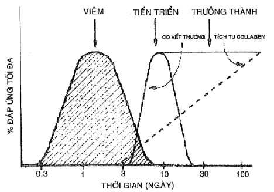

Sự lành vết thương là quá trình sửa chữa và phục hồi mô tại vị trí tổn thương, bao gồm hai hiện tượng liên tục là viêm và phục hồi mô. Các tế bào biểu mô, nội mạc, viêm, tiểu cầu và nguyên bào sợi tập trung để khôi phục hình thái và chức năng bình thường của mô.

## Các giai đoạn lành thương

Mặc dù các mô khác nhau có cơ chế khác nhau, quá trình lành thương chung trải qua ba giai đoạn nối tiếp: viêm, tiến triển và trưởng thành.

  
_Các giai đoạn của sự lành thương._

## Giai đoạn viêm (ngày 0–5)

Khởi đầu ngay khi mô bị tổn thương, máu lấp đầy vết thương trước khi co mạch để cầm máu. Tiểu cầu kết tập và kích hoạt yếu tố Hageman dẫn đến chuỗi phản ứng bổ thể, kinin, hình thành cục máu đông và plasmin để khuếch đại tín hiệu tổn thương và khởi động phản ứng sinh hóa tại vết thương.

Các sản phẩm kinin và prostaglandin giãn mạch và tăng tính thấm thành mạch, gây sưng nề và đau. Trong 6 giờ đầu, bạch cầu đa nhân xuất hiện, đạt đỉnh 24–48 giờ rồi giảm nếu không có nhiễm trùng. Đại thực bào từ ngày 2–4 thay thế bạch cầu đa nhân và tồn tại cho đến khi vết thương lành. Lympho T tăng mạnh từ ngày 5–7 để hỗ trợ đại thực bào.

Đại thực bào tiêu thụ vi khuẩn và mô tổn thương, đồng thời phóng thích TGF-α, bFGF, MDGF, IL-1, FAF, PDGF, TNF-α, IFN… để thu hút tế bào viêm và kích thích hình thành mô hạt. Nếu có nhiễm trùng, giai đoạn viêm kéo dài và làm chậm lành sẹo.

## Giai đoạn tiến triển (ngày 3–14)

Khi vết thương đã được làm sạch, nguyên bào sợi và mạch máu mới hình thành mô hạt từ ngày 3, đạt đỉnh ngày 7 với mạng lưới collagen lỏng lẻo, fibronectin và acid hyaluronic. Collagen bắt đầu tích tụ từ ngày 3 và tăng đến 3 tuần, tiếp tục tích lũy trong 3 tháng.

Tái tạo mạch máu diễn ra đồng thời dưới tác động của bFGF, aFGF, TGF-α/β, EGF và các yếu tố sinh hóa do tiểu cầu, đại thực bào tiết ra. Biểu mô hóa bắt đầu ngay sau tổn thương khi tế bào biểu mô đáy phân chia và di chuyển từ bờ vết thương để phủ mặt vết thương trong 24 giờ.

Sợi collagen do nguyên bào sợi tạo ra giúp co vết thương từ ngày 5, giảm diện tích cần tái biểu mô và mô hạt, làm giảm kích thước sẹo.

## Giai đoạn trưởng thành (ngày 7 đến 1 năm)

Mạng lưới collagen dày đặc hình thành sẹo, proteoglycan và acid hyaluronic giảm dần. Vết thương đạt 20 % độ bền sau 3 tuần và tối đa khoảng 70 % của mô bình thường.

Trong nhiều tháng, collagen được tái định hướng và tái cấu trúc, mạch máu và tế bào giảm số lượng. Sẹo chuyển từ đỏ hồng sang nhạt và mỏng dần. Tốc độ tổng hợp collagen cao nhất 6–12 tháng sau khi tổn thương, sau đó vết sẹo ổn định với độ bền lâu dài.

Co kéo sẹo lành tính nhưng có thể gây mất thẩm mỹ hoặc hạn chế vận động nếu ở vị trí căng da.

## Nguồn tham khảo

- PGS.TS. Trần Thị Lợi & GS.TS. Nguyễn Duy Tài – _Thực hành sản phụ khoa_
