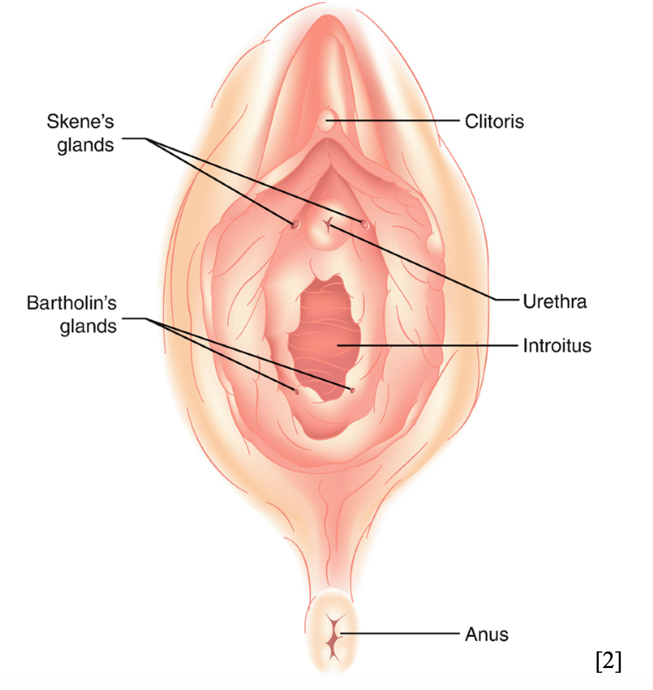
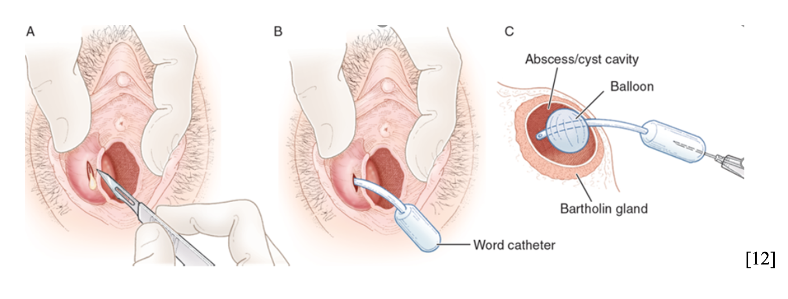
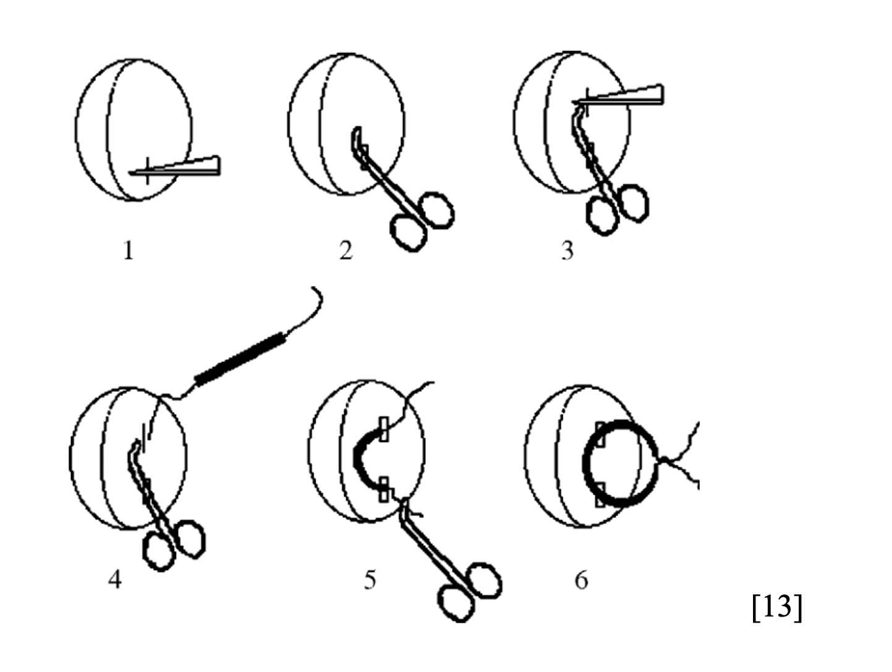
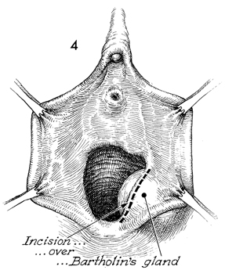
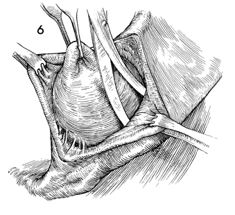
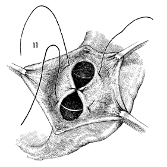

Tuyến Bartholin là cấu trúc dạng đôi nằm ở vị trí góc **4 giờ** và **8 giờ** của âm hộ, ngay dưới môi lớn và mặt trong môi nhỏ. Đường kính của tuyến bình thường khoảng **0.5 cm**, đổ dịch vào âm đạo qua một ống tuyến dài khoảng **2 cm**. Khi ống tuyến này bị tắc nghẽn, dịch tiết không thể thoát ra ngoài, ứ đọng lại và tạo thành nang. Nang có thể có kích thước từ một hạt đậu cho đến một quả bóng bàn. Khi nang bị vi khuẩn xâm nhập sẽ gây phản ứng viêm cấp tính, tụ mủ và hình thành ổ áp-xe.

## Nguyên nhân

Sự hình thành nang và áp-xe tuyến Bartholin xuất phát từ hai cơ chế chính:

- Tắc nghẽn ống tuyến Bartholin: Do viêm nhiễm âm hộ, chấn thương tại chỗ, hoặc các chất tiết dày đặc tích tụ bít kín miệng ống.
- Nhiễm khuẩn dẫn đến áp-xe: Thường do các vi khuẩn thường gặp ở vùng âm hộ-hậu môn hoặc các tác nhân lây truyền qua đường tình dục (STIs), bao gồm:
  - _Escherichia coli_.
  - _Peptostreptococcus_.
  - _Bacteroides_.
  - _Neisseria gonorrhoeae (lậu cầu)_.
  - _Chlamydia trachomatis_.

## Yếu tố nguy cơ

Các yếu tố làm tăng nguy cơ tắc nghẽn và nhiễm trùng tuyến Bartholin bao gồm:

- Hoạt động tình dục không an toàn hoặc có nhiều bạn tình.
- Tiền sử viêm nhiễm âm đạo, âm hộ tái phát nhiều lần.
- Vệ sinh vùng kín không đúng cách hoặc thụt rửa sâu.
- Chấn thương nhẹ vùng âm hộ (do đạp xe, cọ xát).
- Tiền sử có nang hoặc áp-xe tuyến Bartholin trước đó.

## Chẩn đoán

### Lâm sàng

- **Nang tuyến Bartholin chưa nhiễm trùng:**
  - Thường không đau, chỉ phát hiện tình cờ khi sờ thấy một khối phồng ở mặt trong của môi nhỏ (thường lệch về một bên).
  - Khối mềm, không sưng đỏ, dao động nhẹ.
  - Nếu kích thước ** > 2 cm**, nang có thể gây cảm giác vướng víu khi đi lại, ngồi, hoặc đau nhẹ khi giao hợp.
- **Áp-xe tuyến Bartholin (nang bị nhiễm trùng):**
  - Triệu chứng xuất hiện nhanh chóng, rầm rộ trong vòng **2 - 3 ngày**.
  - Đau nhức dữ dội, liên tục ở vùng âm hộ khiến người bệnh không thể đi lại hoặc ngồi.
  - Khối sưng to, căng đỏ, nóng, rất đau khi sờ nắn.
  - Có thể có biểu hiện sốt, mệt mỏi, hạch bẹn sưng đau cùng bên.

### Cận lâm sàng

- **Siêu âm vùng âm hộ:** Xác định chính xác kích thước nang, cấu trúc bên trong (dịch thuần nhất hay có vách, cặn mủ), phân biệt với các loại u lành tính hoặc ác tính khác vùng âm hộ.
- **Nuôi cấy dịch/mủ:** Lấy dịch mủ khi thực hiện thủ thuật rạch để cấy vi khuẩn và làm kháng sinh đồ nhằm chọn loại kháng sinh phù hợp.
- **Xét nghiệm STIs:** Thực hiện xét nghiệm PCR hoặc test nhanh tìm _Chlamydia trachomatis_ và _Neisseria gonorrhoeae_.
- **Sinh thiết vỏ nang:** Thực hiện ở phụ nữ ** > 40 tuổi** khi bóc nang để loại trừ ung thư tuyến Bartholin (bệnh lý hiếm gặp nhưng tiên lượng nặng).

## Điều trị

### Nguyên tắc

- Giải phóng nhanh dịch/mủ ứ đọng để giảm triệu chứng đau nhức và sưng nề cho bệnh nhân.
- Chống nhiễm trùng bằng kháng sinh thích hợp nếu có áp-xe.
- Hạn chế tối đa tỷ lệ tái phát bằng cách tạo đường dẫn lưu ổn định hoặc bóc trọn vỏ nang khi có chỉ định phù hợp.

### Chích rạch và dẫn lưu

Khác với bóc nang (cắt bỏ hoàn toàn cả phần vỏ tuyến), **chích rạch nang tuyến Bartholin** (Incision and Drainage - I&D) là một thủ thuật nhanh chóng, đơn giản hơn. Nó thường được áp dụng khẩn cấp khi nang bị nhiễm trùng tiến triển thành **áp-xe** (tích mủ, sưng đỏ, đau nhức dữ dội khiến người bệnh không thể đi lại hoặc ngồi).

Mục tiêu chính của thủ thuật này là giải phóng ngay lập tức lượng mủ/dịch ứ đọng bên trong để giảm áp lực và giảm đau cho bệnh nhân.

#### Chỉ định thực hiện

- Áp-xe tuyến Bartholin (nang bị nhiễm trùng, hóa mủ).
- Nang tuyến Bartholin kích thước lớn gây đau nhiều, nhưng chưa có chỉ định bóc toàn bộ hoặc bệnh nhân chưa muốn phẫu thuật triệt để.

#### Quy trình kỹ thuật chích rạch dẫn lưu

Thao tác này thường được thực hiện ngay tại phòng thủ thuật sản phụ khoa dưới điều kiện vô trùng.

1. **Vô cảm tại chỗ:**
   Bệnh nhân nằm tư thế phụ khoa. Bác sĩ sát trùng vùng âm hộ. Tiến hành gây tê tại chỗ bằng _lidocain_ tại điểm dự định rạch (thường là vùng niêm mạc mỏng nhất, căng nhất ở mặt trong môi nhỏ).
2. **Rạch thoát dịch mủ:**
   Bác sĩ dùng dao mổ vô trùng rạch một đường nhỏ khoảng **0.5 - 1 cm** trực tiếp vào ổ áp-xe. Dịch mủ hoặc dịch nang sẽ thoát ra ngoài ngay lập tức. Bác sĩ có thể dùng kẹp kelly để nong nhẹ bên trong khoang nang, phá vỡ các vách xơ giúp dịch thoát sạch.
3. **Bơm rửa khoang nang:**
   Sử dụng dung dịch nước muối sinh lý vô khuẩn (hoặc kết hợp dung dịch sát khuẩn pha loãng) bơm rửa sạch sẽ khoang trống vừa thoát mủ.
4. **Đặt dẫn lưu (Rất quan trọng):**
   Nếu chỉ rạch và để đó, mép da sẽ dính lại rất nhanh trong **24 giờ**, khiến dịch tiếp tục bị kẹt và tái phát. Bác sĩ sẽ chọn một trong hai cách:
   - **Đặt ống thông Word (_Word Catheter_):** Đút một ống cao su nhỏ có bong bóng vào khoang nang, bơm nước cất làm phồng bong bóng để giữ ống cố định. Ống này được giữ từ **4 - 6 tuần** để tạo ra một biểu mô hóa đường rò mới, ngăn ngừa tái phát rất hiệu quả.
   - **Đặt mét (gạc nhỏ)/ống dẫn lưu cao su:** Nếu không có ống Word, bác sĩ sẽ chèn một dải gạc nhỏ hờ vào trong vết rạch để giữ vết mổ luôn mở, gạc này sẽ được rút ra sau **24-48 giờ**.

#### Hình ảnh trực quan về kỹ thuật rạch và đặt ống Word

Kỹ thuật đặt ống Word (_Word Catheter_) hiện là tiêu chuẩn vàng trong chích dẫn lưu vì nó giúp tạo ra một biểu mô hóa đường rò mới, ngăn ngừa tái phát rất hiệu quả mà không cần phải phẫu thuật cắt bỏ tuyến. Dưới đây là các bước thao tác chi tiết:

_Hình "Xác định điểm rạch trên thành nang căng phồng". Nguồn: emDocs_.

_Hình "Bơm nước cất làm phồng bong bóng để giữ ống cố định". Nguồn: emDocs_.

_Hình "Giấu đầu ngoài của ống thông cao su vào trong âm đạo của bệnh nhân". Nguồn: emDocs_.

#### Chăm sóc sau khi chích rạch

- **Sử dụng thuốc:** Uống đầy đủ kháng sinh, kháng viêm và giảm đau theo chỉ định của bác sĩ (thường kéo dài **5 - 7 ngày** sau chích áp-xe).
- **Vệ sinh đúng cách:** Rửa nhẹ nhàng vùng kín bằng nước ấm sạch sau mỗi lần đi tiêu tiểu.
- **Tắm ngồi (_Sitz bath_):** Bắt đầu từ ngày thứ hai sau thủ thuật, bệnh nhân nên ngâm vùng mông trong chậu nước ấm khoảng **10 - 15 phút**, mỗi ngày **2 - 3 lần**. Việc này giúp giảm ê nhức, kích thích tuần hoàn máu và hỗ trợ dịch viêm tiếp tục thoát ra ngoài.
- **Kiêng quan hệ tình dục:** Tuyệt đối không quan hệ cho đến khi vết rạch lành hẳn (và cho đến khi rút ống Word nếu có đặt ống).

:::caution
Phương pháp chích rạch thông thường có tỷ lệ tái phát khá cao (lên tới **10 - 20%**) nếu không được đặt dẫn lưu tốt hoặc không mở thông nang (_marsupialization_). Nếu nang liên tục bị lại sau khi chích, bạn nên trao đổi với bác sĩ về phương án bóc nang triệt để.
:::

### Bóc tách nang

**Bóc nang tuyến Bartholin** (_Bartholin cystectomy_) là một thủ thuật ngoại khoa nhằm loại bỏ hoàn toàn khối nang (hoặc toàn bộ tuyến Bartholin bị xơ hóa/nhiễm trùng tái phát nhiều lần).

Khác với phương pháp rạch dẫn lưu thông thường hoặc mở thông nang (_marsupialization_) – vốn chỉ giải phóng dịch bên trong – kỹ thuật bóc nang giúp giải quyết triệt để phần vỏ nang, từ đó giảm tối đa nguy cơ tái phát.

Để giúp bạn hình dung rõ hơn, dưới đây là vị trí giải phẫu của tuyến Bartholin cùng quy trình kỹ thuật chuẩn y khoa.

#### Chỉ định thực hiện

Phương pháp này thường không phải là lựa chọn đầu tay cho các ca nang tuyến mới xuất hiện lần đầu. Bác sĩ thường chỉ định bóc nang trong các trường hợp:

- Nang tuyến Bartholin bị tái phát nhiều lần sau khi đã áp dụng các phương pháp khác (như đặt ống catheter Word hoặc mở thông nang).
- Nang có kích thước lớn, gây đau đớn, cản trở việc đi lại hoặc sinh hoạt tình dục.
- Nghi ngờ có tổn thương ác tính (đặc biệt ở phụ nữ ** > 40 tuổi**).

#### Quy trình kỹ thuật bóc nang tuyến Bartholin

Đây là một phẫu thuật đòi hỏi sự khéo léo để tránh làm vỡ nang trong quá trình bóc tách và hạn chế chảy máu (do vùng này có hệ thống mạch máu rất phong phú).

1. **Chuẩn bị và vô cảm:**
   Thời gian chuẩn bị khoảng **10 - 15 phút**. Bệnh nhân được nằm ở tư thế phụ khoa. Bác sĩ tiến hành sát khuẩn kỹ vùng âm hộ-âm đạo. Phương pháp vô cảm thường là gây tê tại chỗ, gây tê tủy sống hoặc gây mê toàn thân tùy thuộc vào kích thước nang và trạng thái của bệnh nhân.
2. **Rạch da và bộc lộ nang:**
   Bác sĩ thực hiện một đường rạch dọc ở mặt trong của môi nhỏ (ngay trên phần phồng nhất của nang). Đường rạch này giúp tiếp cận trực tiếp vỏ nang mà ít để lại sẹo xấu bên ngoài.
3. **Bóc tách khối nang:**
   Sử dụng kéo phẫu thuật tù hoặc ngón tay để bóc tách nhẹ nhàng các mô liên kết xung quanh vỏ nang. Mục tiêu là tách toàn bộ khối nang nguyên vẹn ra khỏi các tổ chức xung quanh mà không làm rách hay vỡ mủ/dịch bên trong.
4. **Cầm máu và khâu phục hồi:**
   Sau khi lấy trọn vẹn nang, bác sĩ sẽ kiểm tra kỹ đáy vết mổ và tiến hành khâu thắt các mạch máu để tránh chảy máu trong. Tiếp theo, khoang trống sinh ra sau khi mất nang (khoảng chết) sẽ được khâu khép lại bằng các mũi khâu tiêu dạng chữ X hoặc cuốn. Cuối cùng là khâu đóng niêm mạc da bằng chỉ tự tiêu.

#### Hình ảnh mô phỏng thao tác bóc nang

Khi thực hiện bóc tách, phẫu thuật viên phải giữ cho khối nang căng tròn để dễ xác định ranh giới giữa vỏ nang và các mô cơ, mạch máu xung quanh:

_Hình "Đường rạch dọc niêm mạc âm hộ để bộc lộ rõ vùng tuyến Bartholin". Nguồn: Atlas of Pelvic Surgery_.

_Hình "Sử dụng kéo tù phẫu thuật bóc tách tỉ mỉ vỏ nang ra khỏi các mô cơ liên kết". Nguồn: Atlas of Pelvic Surgery_.

_Hình "Tiến hành khâu đóng các lớp cơ đáy vết mổ để xóa bỏ khoảng chết". Nguồn: Atlas of Pelvic Surgery_.

#### Chăm sóc và theo dõi sau phẫu thuật

Vùng âm hộ có nguồn cung cấp máu rất lớn, do đó nguy cơ **tụ máu** hoặc **nhiễm trùng** sau mổ là điều cần được lưu ý sát sao:

- **Giảm đau và kháng sinh:** Sử dụng thuốc theo đúng đơn của bác sĩ để chống nhiễm khuẩn và giảm sưng nề.
- **Vệ sinh tại chỗ:** Rửa vùng kín nhẹ nhàng bằng nước ấm hoặc dung dịch sát khuẩn dịu nhẹ sau mỗi lần đi vệ sinh. Luôn giữ vết mổ khô ráo.
- **Ngâm mông (_Sitz bath_):** Sau khoảng **24 - 48 giờ**, bác sĩ có thể hướng dẫn ngâm mông trong chậu nước ấm để tăng tuần hoàn, giảm đau và làm sạch vết thương.
- **Kiêng cữ:** Tránh quan hệ tình dục, đạp xe hoặc vận động mạnh trong vòng **4 - 6 tuần** cho đến khi vết thương lành hẳn.

:::caution
Nếu nhận thấy vùng mổ sưng to nhanh chóng, đau dữ dội (dấu hiệu tụ máu), vết thương chảy mủ hôi hoặc bị sốt, hãy quay lại cơ sở y tế ngay lập tức để được xử lý kịp thời.
:::

Nếu bạn đang tìm hiểu thủ thuật này cho bản thân hoặc người nhà, tốt nhất nên đến các bệnh viện phụ sản uy tín để các bác sĩ chuyên khoa thăm khám trực tiếp và đưa ra phương án điều trị phù hợp nhất nhé.

## Dự phòng

Các biện pháp phòng tránh tắc nghẽn và viêm nhiễm tuyến Bartholin:

- Duy trì vệ sinh vùng kín sạch sẽ, đúng cách hằng ngày, đặc biệt là trong chu kỳ kinh nguyệt và sau khi quan hệ tình dục.
- Sử dụng bao cao su khi quan hệ tình dục để phòng tránh các bệnh lây nhiễm qua đường tình dục (STIs).
- Tránh mặc quần lót quá chật hoặc ẩm ướt để giảm kích ứng và viêm nhiễm vùng âm hộ.
- Khám phụ khoa định kỳ ít nhất **1 lần/năm** để phát hiện sớm các bất thường vùng sinh dục.

## Tài liệu tham khảo

- emDocs (2022) - _EM@3AM: Bartholin's Abscess_.
- Clifford R. Wheeless, Jr., Marcella L. Roenneburg (2020) - _Atlas of Pelvic Surgery: Bartholin's Gland Excision_.
