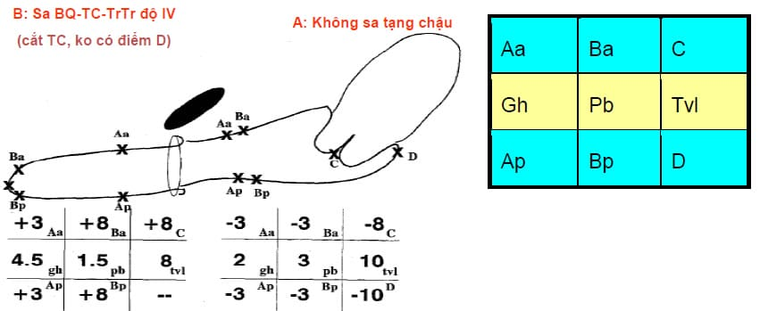
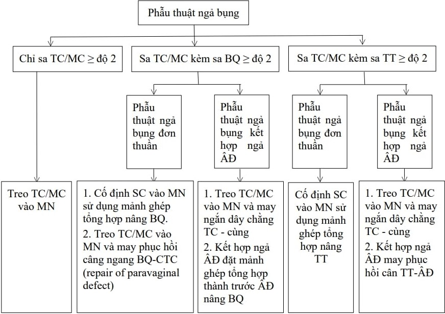
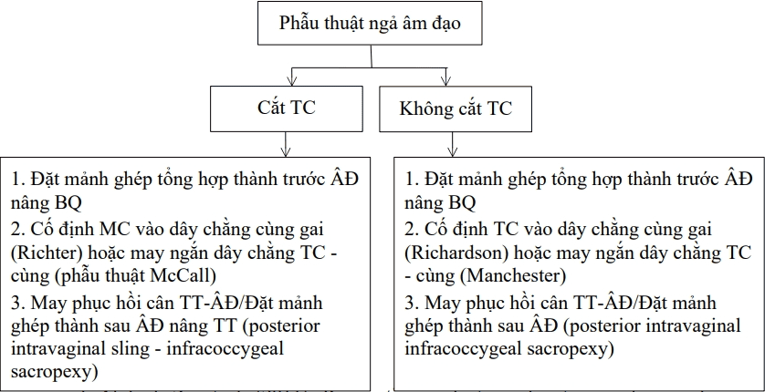

Sa các tạng trong vùng chậu (Pelvic Organ Prolapse - POP) là sự tụt xuống của tử cung, bàng quang, trực tràng, thành trước, thành sau âm đạo… ra khỏi vị trí giải phẫu bình thường, do tổn thương và suy yếu các cấu trúc cân – cơ – dây chằng nâng đỡ sàn chậu.

**Hệ thống nâng đỡ các cơ quan tiểu khung:**

- **Hệ thống nâng đỡ:** Cơ nâng hậu môn và cơ nâng sàn hội âm.
- **Hệ thống treo:** Dây chằng mu-niệu đạo, mạc mu-cổ tử cung, dây chằng tử cung-cùng, dây chằng ngang tử cung, cân Halban, cân trực tràng–âm đạo.
- **Hệ thống định hướng:** Dây chằng tròn, dây chằng rộng.

## Phân loại và phân độ

### Phân loại

| Vị trí giải phẫu so với thành âm đạo | Tạng chậu sa và phân loại                                                              | Xét nghiệm cần thiết     |
| ------------------------------------ | -------------------------------------------------------------------------------------- | ------------------------ |
| **Thành trước (ngăn trước)**         | Sa bàng quang: trung tâm, bên, kết hợp Sa niệu đạo                                  | Niệu động học            |
| **Vòm âm đạo (ngăn giữa)**           | Túi sa ruột non: trước, sau Sa tử cung Sa mỏm cắt                                | MRI động ± Niệu động học |
| **Thành sau (ngăn sau)**             | Túi trực tràng: cao, giữa, thấp Sa trực tràng Khối lồng trong trực tràng hậu môn | MRI động ± Niệu động học |

### Phân độ

_Phân loại - Phân độ sa tạng chậu._

**Quy ước 9 mốc cần đo:**

- Đơn vị đo cm, người bệnh tư thế sản phụ khoa, đầu cao 45°, rặn trong quá trình đánh giá.
- Dụng cụ: van âm đạo, thước đo, kẹp tim, pozzi.
- **Điểm cố định:**
  - Aa, Ap: cách mép âm đạo (niệu quản) 3 cm.
  - C, D (cùng đồ) nếu còn tử cung.
  - Gh: khe niệu dục.
  - Pb: thể sàn chậu.
  - Tvl: chiều dài âm đạo.
- **Điểm thay đổi:**
  - Ba, Bp: điểm phồng xa nhất của đoạn âm đạo (khi rặn hoặc kéo cổ tử cung).
- Trên/dưới mép màng trinh: đánh dấu +/– trước giá trị.

**Phân độ POP-Q:**

- **Độ 0:** không sa tạng chậu.
  - Aa, Ba, Ap, Bp: đều ở +3 cm trên màng trinh.
  - C, D: (tvl–2) cm ≤ C, D ≤ tvl.
- **Độ I:** bất kỳ điểm Ba hoặc Bp ở trên màng trinh >1 cm.
- **Độ II:** Ba hoặc Bp nằm trong khoảng ±1 cm quanh màng trinh.
- **Độ III:** Ba hoặc Bp sa >1 cm dưới màng trinh nhưng <(tvl–2) cm.
- **Độ IV:** sa toàn bộ, Ba hoặc Bp ≥ (tvl–2) cm.

_Sơ đồ chẩn đoán sa tạng chậu._

## Xét nghiệm chẩn đoán và chuyên biệt

### Xét nghiệm thường quy

- Đánh giá và điều trị yếu tố nguy cơ: viêm âm đạo, nhiễm trùng tiểu, tiểu đường, thiếu máu…
- Loại trừ bệnh lý phụ khoa kèm (rong huyết, u xơ tử cung, u nang buồng trứng…).
- Siêu âm bụng tổng quát khi cần phẫu thuật hoặc nghi bế tắc đường tiểu do khối sa.

### Bilan niệu động học

- Chỉ định ở BN có sa thành trước (sa bàng quang, tiểu không kiểm soát khi gắng sức).
- Hướng dẫn điều trị và đánh giá trước – sau phẫu thuật.

### Chụp MRI động học (Defecography-MRI)

- Tiêu chuẩn vàng để đánh giá cấu trúc và chức năng sàn chậu.
- Chỉ định khi rối loạn tiêu hóa dưới nặng, sa tầng giữa/hạ độ III.

### Siêu âm 3D ngả trực tràng

- Đánh giá tổn thương cơ thắt hậu môn, nút sàn chậu.

### Đo áp lực ống hậu môn và điện cơ tầng sinh môn

- Đánh giá chức năng cơ sàn chậu, hướng dẫn tập phục hồi.

## Chẩn đoán

Dựa vào lâm sàng (POP-Q) và kết quả cận lâm sàng, ghi rõ:

- Tạng sa, độ sa.
- Rối loạn tiết niệu hoặc đi cầu kèm theo.
- Tổn thương kèm: rách cơ thắt, táo bón…

**Ví dụ:**  
Sa tử cung độ III, sa bàng quang độ II, sa trực tràng độ II, tiểu không kiểm soát khi gắng sức, rách cơ thắt hậu môn diện rộng, táo bón.

## Điều trị

### Nội khoa

#### Chỉ định

Sa độ I–II, triệu chứng nhẹ, chưa ảnh hưởng chất lượng sống.

#### Phương pháp

- Thay đổi thói quen (giảm cân, tránh gắng sức).
- Estrogen tại chỗ (viên đặt hoặc kem âm đạo).
- Vật lý trị liệu sàn chậu (tập Kegel, tập với máy, kích thích điện).
- Pessary âm đạo hỗ trợ nâng tạng.

### Ngoại khoa

#### Nguyên tắc

- Phục hồi cấu trúc cân – cơ – dây chằng.
- Bảo tồn cổ tử cung nếu có thể, chỉ cắt tử cung khi có bệnh lý thực thể.

#### Chỉ định

- Sa độ ≥ II có triệu chứng, thất bại điều trị bảo tồn 3–6 tháng.
- BN yêu cầu phẫu thuật sau tư vấn đầy đủ.

#### Lựa chọn phương pháp

- Dựa vào tạng sa, độ sa, tuổi, mong muốn sinh đẻ, sức khỏe, điều kiện thiết bị, kinh nghiệm phẫu thuật viên.

##### Sa thành trước

- **Bàng quang:**
  - Repair paravaginal defect (mảnh ghép polypropylene hoặc may cân ngang).
- **Niệu đạo:**
  - Sling (TOT/TVT/mini-sling), phẫu thuật Burch.

##### Sa thành sau

- **Trực tràng:**
  - May cân trực tràng–âm đạo, mảnh ghép polypropylene.
- Khâu phục hồi cơ nâng hậu môn, tái tạo nút sàn chậu.

##### Sa tử cung và mỏm cắt

- Treo tử cung vào mỏm nhô hoặc dây chằng cùng–gai (khâu không tan hoặc mảnh ghép).
- May ngắn dây chằng tử cung–cùng.
- Cắt tử cung bán phần hoặc toàn phần kèm cố định mỏm cắt.

#### Mảnh ghép tổng hợp

- **Chỉ định:** sa độ III–IV, sa tái phát, chống chỉ định phẫu thuật kéo dài.
- **Chống chỉ định tuyệt đối:** rối loạn đông máu, xơ gan, bệnh lý mạch máu, đái tháo đường không kiểm soát, nhiễm khuẩn, tiền ung thư chưa điều trị, xạ trị vùng chậu, nghiện thuốc lá nặng.
- **Chống chỉ định tương đối:** niêm mạc âm đạo mỏng, vết thương niệu đạo/bàng quang/trực tràng, kèm cắt tử cung, không đủ mô che phủ.

#### Đường vào phẫu thuật

- **Ngả âm đạo:** BN cao tuổi (>70), gây mê ngắn, vết mổ nhiều lần, béo phì.
- **Ngả bụng/nội soi:** BN trẻ, mong muốn bảo tồn tử cung, sa độ III–IV, thất bại phẫu thuật ngả âm đạo.
- **Kết hợp:** khi cần đặt mảnh ghép qua cả hai đường để tăng hiệu quả.

_Phác đồ chẩn đoán và xử trí sa tạng chậu – Bệnh viện Từ Dũ._

_Phẫu thuật ngả bụng – Bệnh viện Từ Dũ._

_Phẫu thuật đường âm đạo – Bệnh viện Từ Dũ._

## Nguồn tham khảo

- Bệnh viện Từ Dũ (2022) – _Phác đồ điều trị Sản Phụ khoa_
