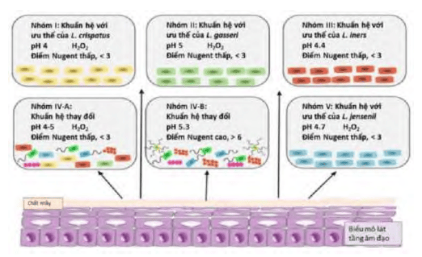
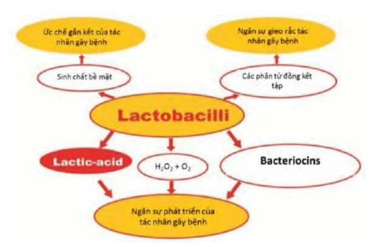
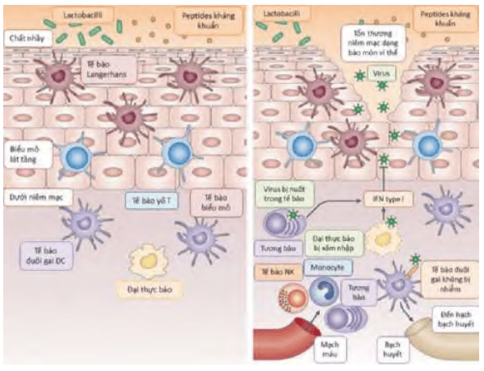
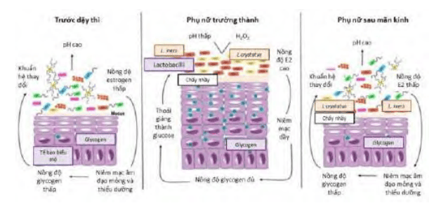
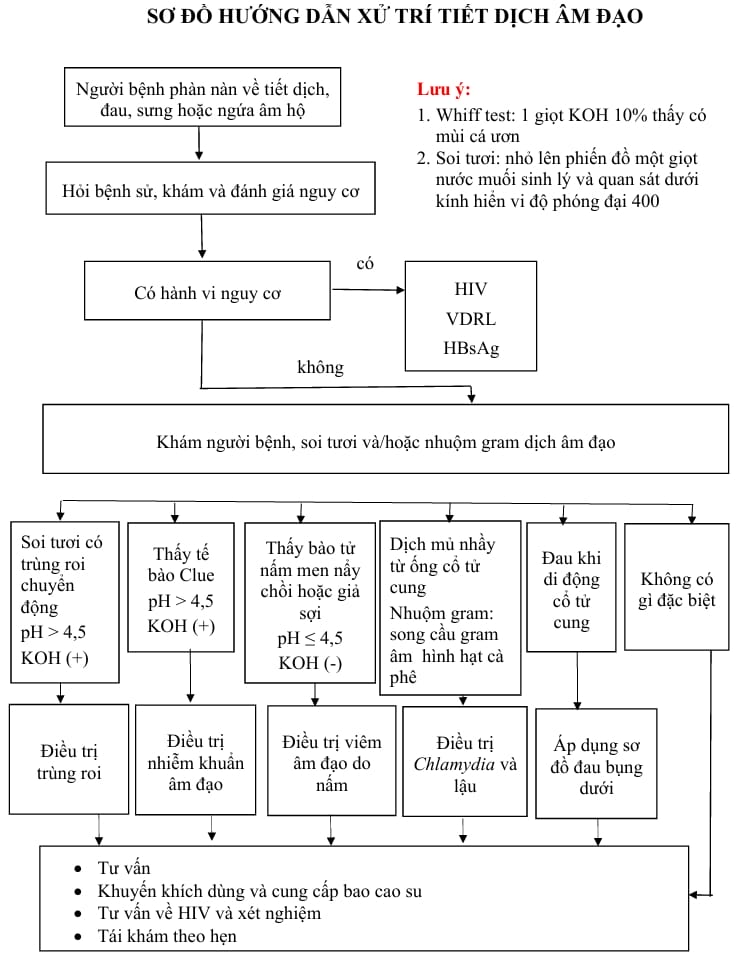

## Hệ vi khuẩn âm đạo

Khuẩn hệ âm đạo (vaginal microbiome hay vaginal microbiota) ở phụ nữ ở độ tuổi sinh sản bao gồm các loại vi khuẩn kỵ khí và hiếu khí thường trú. Các vi khuẩn này tồn tại trong mối quan hệ cộng sinh giữa vật chủ là môi trường âm đạo và bản thân chúng là các ký sinh vật.

Âm đạo cung cấp dưỡng chất cho vi sinh vật, đảm bảo sự phát triển của cộng đoàn vi sinh vật. 1 số dưỡng chất được cung cấp từ các tế bào lát tầng, 1 số dưỡng chất khác từ các tuyến. Ngược lại, cộng đoàn vi sinh vật đóng vai trò quan trọng trong cơ chế bảo vệ vật chủ bằng cách ngăn ngừa sự trú đóng (colonization) của các vi khuẩn gây bệnh. Rối loạn của khuẩn hệ âm đạo ảnh hưởng mạnh đến tình trạng sức khỏe và bệnh tật của vật chủ.

Mật độ vi khuẩn của âm đạo rất cao, khoảng $10^8 - 10^9$ vi khuẩn trong mỗimL dịch âm đạo. Ở người phụ nữ trong độ tuổi sinh sản, bình thường và khỏe mạnh, Lactobacillus sp là vi khuẩn chiếm ưu thế trong khuẩn hệ. Lactobacillus sp hay còn gọi là khuẩn Döderlein, là vi khuẩn hình que, Gram dương, kỵ khí không bắt buộc, thuộc nhóm vi khuẩn lactic acid, chúng có khả năng chuyển đổi lactose và các loại đường khác thành acid lactic để thu nhận năng lượng.

### Vai trò của Lactobacillus

Lactobacillus có vai trò chính bảo vệ vật chủ thông qua việc cung cấp lactic acid và qua đó duy trì pH thấp của âm đạo, trong khoảng từ 3.5 đến 4.5.

_Phân kiểu trạng thái khuẩn hệ được dựa trên chủng vi khuẩn ưu thế và điểm Nugent._

Khuẩn hệ âm đạo tham gia vào cơ chế bảo vệ sơ cấp chống lại nhiễm khuẩn thông qua loại bỏ các tác nhân xâm nhập. Ở các cá thể khác nhau, các trạng thái khuẩn hệ khác nhau về thành phần lẫn chức năng, có những cơ chế tham gia tiến trình bảo vệ vật chủ không như nhau.

_Lactobacillus sp sản xuất các chất ức chế các vi sinh vật có hại._

Chính lactic acid chứ không phải pH đảm trách nhiệm vụ bảo vệ vật chủ. Lactic acid còn kích hoạt hệ thống miễn dịch bẩm sinh (innate immunity) chống lại các vi khuẩn Gram âm. Ngoài lactic acid, Lactobacillus còn sản xuất ra các bacteriocins chuyên biệt trên mục tiêu (target-specific bacteriocins) và $H_2O_2$ với phổ hoạt động rộng. Bacteriocins là protein (proteinaceous) có hoạt tính diệt khuẩn. Bacteriocins được tổng hợp bởi vi khuẩn và có phổ hoạt động hẹp. Hoạt tính chủ yếu của nó là đánh vào tính thấm của màng tế bào. Vai trò chủ yếu của bacteriocins là đánh vào các vi khuẩn lạ (ngoại lai) hay gây bệnh xuất hiện trong âm đạo. Nhiều chủng Lactobacillus sản xuất $H_2O_2$ trong điều kiện yếm khí. $H_2O_2$ là chất có khả năng ức chế sự trú đóng (colonization) của vi khuẩn có xu hướng gây bệnh. Tuy nhiên, chứng cứ về khả năng bảo vệ trực tiếp $H_2O_2$ là không rõ ràng, dường như là $H_2O_2$ có vai trò trung gian trong chuỗi bảo vệ khác.

Các con đường miễn dịch bẩm sinh (innate immunity) thông qua các tế bào hình răng cưa (dendritic cells) (DC), tế bào giết tự nhiên (natural killer cells) (NK) và đại thực bào dẫn đến hiện tượng thực bào và phóng thích IFN-γ. Các con đường miễn dịch thích ứng cũng tham gia vào cơ chế bảo vệ này, khi các tác nhân gây bệnh xâm nhập thành công qua khỏi hệ thống bảo vệ biểu mô. Ngoài ra, quá trình đáp ứng miễn dịch còn chế tiết các chất ức chế phân hủy protein từ bạch cầu giúp bảo vệ vùng mô tại chỗ khỏi các sản phẩm độc chất của quá trình viêm và nhiễm trùng.

_Được thực hiện thông qua cơ chế miễn dịch bẩm sinh (innate immunity) với các đại thực bào, tế bào hình răng (DC), tế bào giết tự nhiên (NK) và các cơ chế của miễn dịch thích nghi (adaptive immunity)._

### Khái niệm hệ vi khuẩn lành mạnh

Môi trường âm đạo được thiết kế cho sự phát triển cộng sinh của chủng loại vi khuẩn cộng sinh chuyên biệt.

Sự thay đổi bất cứ thành phần nào trong khuẩn hệ cũng sẽ làm thay đổi phân bố các chủng vi khuẩn của khuẩn hệ. Thành phần của khuẩn hệ thay đổi theo giai đoạn hoạt động nội tiết trong cuộc đời người nữ. Ở bé gái chưa dậy thì và phụ nữ đã mãn kinh, do âm đạo không nhận được estrogen từ buồng trứng, nên môi trường âm đạo là môi trường nghèo glycogen. Hệ quả là khuẩn hệ âm đạo ở các cá thể này có ít khuẩn Lactobacillus thường trú hơn so với phụ nữ trong độ tuổi sinh sản. Ở phụ nữ độ tuổi sinh sản, hiện diện của lactic acid làm pH âm đạo được duy trì ở mức 3.5 - 4.7. Trong khi đó, pH của âm đạo ở trẻ chưa dậy thì và người đã mãn kinh là 6 - 8.

_Hình trái và phải ở bé gái chưa dậy thì và người đã mãn kinh, các vi khuẩn không phải Lactobacillus sp. chi phối khuẩn hệ. Hình giữa sự hiện diện của estrogen đảm bảo nguồn cung cấp glycogen cho tế bào âm đạo dẫn đến ưu thế của Lactobacillus sp._

Khi khuẩn hệ âm đạo bị đối mặt với các tác nhân trường diễn hay cấp diễn gây bởi hành vi của con người như dùng kháng sinh, dùng thuốc tránh thai nội tiết và các biện pháp kiểm soát sinh sản khác, thói quen hoạt động tình dục, dùng chất bôi trơn, thói quen thụt rửa âm đạo... nó sẽ có những điều chỉnh để đối phó lại các biến động khuẩn hệ.

Khái niệm về khuẩn hệ "bình thường" và "lành mạnh" được xây dựng trên chức năng bảo vệ của khuẩn hệ hơn là chính bản thân cấu trúc và thành phần của khuẩn hệ.

### Các thành phần sinh lý của dịch tiết vùng âm đạo

Vùng âm hộ chứa các nang lông, tuyến bã, tuyến mồ hôi, được bao phủ bởi biểu mô lát tầng sừng hóa. Âm đạo được phủ bởi biểu mô lát tầng không sừng hóa.

Bình thường âm đạo có tiết dịch. Dịch tiết âm đạo có nguồn gốc từ nhiều nơi. Lượng lớn dịch là chất nhầy từ cổ tử cung; lượng ít hơn từ dịch nội mạc tử cung; 1 phần nhỏ từ các tuyến phụ như tuyến Skène và các tuyến Bartholin. Đó là các dịch tiết bình thường của âm đạo. Các tế bào vẩy bị tróc ra từ thành âm đạo tạo nên từ màu trắng đến không màu cho dịch tiết. Các thành phần từ dịch tiết âm đạo cung cấp môi trường bôi trơn sinh lý, ngăn ngừa triệu chứng khô và sự kích thích tại chỗ. Số lượng và tính chất bình thường của dịch tiết có thể thay đổi dưới ảnh hưởng của các yếu tố như nội tiết tố, tình trạng dịch, thai kỳ, suy giảm miễn dịch, thụt rửa hay hoạt động tình dục. Phụ nữ bình thường sản xuất 1.5g huyết trắng sinh lý mỗi ngày.

## Sơ đồ xử trí

_Sơ đồ xử trí tiết dịch âm đạo bất thường theo Bệnh viện Từ Dũ._

Các biệt dược được sử dụng trên thị trường:

- Clomaz Forte (Clotrimazole 500mg): Nhạy cảm với nấm Candida Albicans, các nấm da, men, mốc... Ngoài ra, clotrimazole còn tác động đến Trichomonas, Vaginalis, các vi khuẩn gram dương.
- Neo Penotran (Metronidazole 500mg + Miconazole nitrate 100mg): Thường được sử dụng để điều trị nhiễm trùng âm đạo do vi khuẩn kị khí và Gardnerella vaginalis, Trichomonas vaginalis và nhiễm khuẩn âm đạo hỗn hợp, nhiễm nấm.
- Sadetabs (Neomycin sulphate 83mg + Clotrimazole 100mg + Metronidazole 500mg): Thích hợp với điều trị viêm âm đạo do tạp khuẩn và nấm nhẹ.
- Timbov (Clotrimazole 500mg): Điều trị các bệnh nấm ở âm hộ, âm đạo, cũng như bệnh nấm Candida. Nhiễm khuẩn hỗn hợp tại âm đạo, viêm âm đạo kèm theo huyết trắng, ngứa do nhiễm khuẩn và nấm, viêm âm đạo do Trichomonas, viêm âm đạo do nguyên nhân hỗn hợp.

Chi tiết điều trị cụ thể đọc thêm tại [Viêm âm đạo nhiễm khuẩn](/phu-khoa/004-02_viem-am-dao-nhiem-khuan), [Viêm âm đạo do nấm](/phu-khoa/004-03_viem-am-dao-do-nam), [Viêm âm đạo do Trichomonads](/phu-khoa/004-04_viem-am-dao-do-trichomonas).

## Nguồn tham khảo

- TEAM-BASED LEARNING - Trường Đại học Y Dược Thành phố Hồ Chí Minh 2020.
- PHÁC ĐỒ ĐIỀU TRỊ SẢN PHỤ KHOA - Bệnh viện Từ Dũ.
