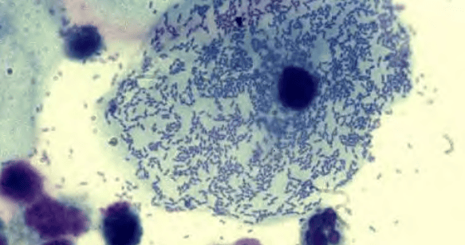
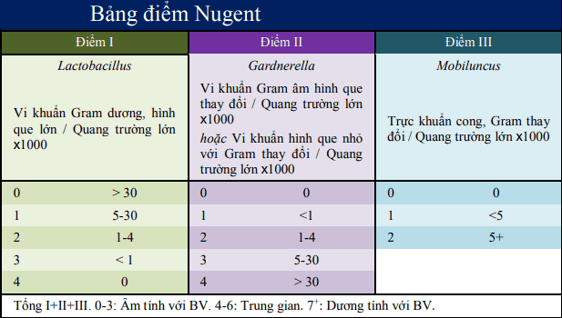
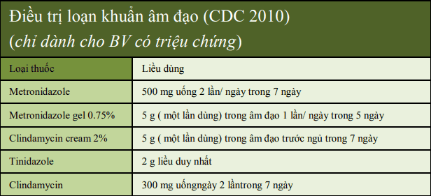

Nhiễm khuẩn âm đạo (loạn khuẩn âm đạo) là hội chứng do rối loạn vi khuẩn âm đạo: giảm sút nồng độ Lactobacilli và gia tăng vi khuẩn yếm khí.

## Định nghĩa và biểu hiện

Loạn khuẩn âm đạo (bacterial vaginosis) (BV) là tình trạng rối loạn vi khuẩn rất thường gặp ở phụ nữ trong độ tuổi sinh sản.

Biểu hiện lâm sàng chính của loạn khuẩn âm đạo là tiết dịch âm đạo nặng mùi.

_Dịch âm đạo màu trắng xám, loãng, "có mùi" hoặc "mùi cá thối". Chỉ có khoảng 25% các trường hợp là có kích ứng nhẹ ở âm hộ._

## Nguyên nhân

Thường do vi khuẩn kỵ khí, đặc biệt Gardnerella vaginalis. Gardnerella làm tăng nguy cơ viêm nhiễm vùng chậu, mổm âm đạo sau cắt tử cung. Nếu có thai sẽ dễ bị rỉ ối, nhiễm trùng ối, sinh non, viêm nội mạc tử cung sau sinh, sau mổ lấy thai.

## Các yếu tố nguy cơ

Các yếu tố nguy cơ mạnh nhất của loạn khuẩn âm đạo gồm:

- Có bạn tình mới.
- Thói quen thụt rửa âm đạo.
- Không dùng bao cao su.

## Tiêu chuẩn chẩn đoán

### Tiêu chuẩn Amsel

:::note[Tiêu chuẩn Amsel chẩn đoán loạn khuẩn âm đạo:]

1. Tiết dịch âm đạo đồng chất, trắng xám, nặng mùi và không có biểu hiện viêm.
2. Sự có mặt của tế bào "clue cells" trên phiến âm đạo.
3. pH dịch âm đạo > 4.5.
4. Dịch âm đạo mùi "cá thối", trước hay sau test KOH.

Cần 3/4 tiêu chuẩn để xác lập chẩn đoán. Sensitivity (Se) và Specificity (Sp) của tiêu chuẩn Amsel là 70 và 94% khi so với các test khác.
:::

_Là các tế bào biểu mô có nhiều vi khuẩn hình cầu bám dính trên bề mặt, làm mất ranh giới màng tế bào và bào chất, giống hình ảnh "kính mờ". Clue cells là yếu tố chỉ điểm loạn khuẩn âm đạo đáng tin cậy nhất. PPV trong chẩn đoán loạn khuẩn âm đạo khi hiện diện tế bào này là 95%._

### Điểm Nugent

Điểm Nugent là công cụ khác để chẩn đoán loạn khuẩn âm đạo, chỉ căn cứ đơn thuần vào hình thái học vi sinh, căn cứ trên:

1. Sự hiện diện của các vi khuẩn hình que lớn (Lactobacillus): càng nhiều thì điểm càng nhỏ, từ 0-4.
2. Sự hiện diện của các vi khuẩn hình que nhỏ (Gardnerella vaginalis, Prevotella, Porphyromonas, và Peptostreptococcus), hiện diện càng nhiều thì điểm càng lớn, từ 0-4.
3. Sự hiện diện của vi khuẩn hình que cong và cầu khuẩn (Mobiluncus sp), càng nhiều thì điểm càng lớn, từ 0-2.

Tổng của chúng gọi là điểm Nugent, có thể là từ 0 đến 10. Điểm Nugent từ 7-10 được xem là có loạn khuẩn âm đạo.

_Tiêu chuẩn chẩn đoán loạn khuẩn âm đạo theo điểm Nugent có Se là 89% và Sp là 83% nếu so với tiêu chuẩn Amsel._

### Bệnh viện Từ Dũ

Có 2 trong 3 tiêu chuẩn:

1. Lâm sàng: Huyết trắng nhiều, màu trắng xám, rất hôi, nhất là sau giao hợp.
2. Cận lâm sàng:
   - Whiff test (+): nhỏ KOH 10% sẽ có mùi hôi như cá ươn.
   - Phết âm đạo: Nhiều "Clue cell", nhuộm gram có nhiều coccobacilli nhỏ (Clue cell có > 20% trong quang trường).

## Điều trị

### Điều trị theo CDC 2010

Đa số tình trạng loạn khuẩn âm đạo có thể tự khỏi mà không cần bất cứ can thiệp nào. Điều này xác nhận rằng khuẩn hệ có khả năng tự điều chỉnh để thích nghi với các biến động bất lợi của môi trường âm đạo.

Khi cần điều trị, có 2 kháng sinh được đưa ra để lựa chọn là metronidazole (uống hay gel âm đạo) hoặc clindamycin (kem âm đạo). Loạn khuẩn âm đạo đáp ứng rất tốt với điều trị. Tuy nhiên, tỷ lệ tái phát của loạn khuẩn âm đạo rất cao, kể cả ngắn hạn (dưới 3 tháng) (15-30%) và trung hạn (dưới 1 năm) (đến 70%).

_Điều trị loạn khuẩn âm đạo theo CDC 2010._

### Phác đồ Bệnh viện Từ Dũ

Dùng đường uống hay đặt âm đạo:

- Metronidazole 500mg x 2 lần/ngày x 7 ngày (uống trong bữa ăn), hoặc
- Metronidazole gel 0.75% (5g)/ngày x 5 ngày (bơm âm đạo), hoặc
- Clindamycin 300mg x 2 lần/ngày x 7 ngày (uống), hoặc
- Clindamycin 100mg x 1 lần/ngày x 3 ngày (đặt âm đạo), hoặc
- Dequalinium chloride 10mg x 1 lần/ngày x 6 ngày (đặt âm đạo), hoặc
- Policresulen 90g x 1 lần/ngày x 6 ngày (đặt âm đạo)

Vệ sinh tại chỗ:

- Muối Nabica pha với nước để rửa vùng kín (ít bị khô rát âm đạo).
- Povidon iodin 10% (thường tạo cảm giác khô âm đạo).
- Acid lactic + lactoserum atomist.

:::caution[Lưu ý]
Metronidazole không dùng trong 3 tháng đầu thai kỳ.
:::

### Các vấn đề điều trị loạn khuẩn

#### Khi nào cần phải điều trị loạn khuẩn âm đạo?

Tuy rằng tiêu chuẩn chẩn đoán không rõ ràng, nhưng với các bằng chứng về sự kiên quan đến kết cục xấu trên thai kỳ hay trên các thủ thuật, phẫu thuật sản phụ khoa của các trường hợp "loạn khuẩn âm đạo không triệu chứng", nên việc điều trị các tình trạng này trong bối cảnh nhất định như thai phụ có nguy cơ cao sinh non hay trước phẫu thuật cắt tử cung có thể được xem như là cần thiết.

#### Phải điều trị loạn khuẩn âm đạo như thế nào?

Dù rằng khuẩn hệ có khả năng tự điều chỉnh, và dù rằng nhiều phụ nữ với triệu chứng lâm sàng của loạn khuẩn âm đạo có thể tự khỏi nhờ vào đáp ứng thích nghi của khuẩn hệ, nhưng với các phụ nữ có triệu chứng lâm sàng đồng thời thỏa các tiêu chuẩn của Amsel thì việc điều trị là cần thiết, nhằm vào việc giải quyết các than phiền chủ là tiết dịch âm đạo bất thường ảnh hưởng đến chất lượng cuộc sống.

Việc bổ sung các Lactobacillus có thể làm giảm tần xuất tái phát của loạn khuẩn âm đạo sau điều trị.

Điều trị chọn lọc khi loạn khuẩn âm đạo không triệu chứng, có 2 khả năng: (1) hoặc người này thuộc kiểu trạng thái khuẩn hệ không Lactobacillus với ưu thế yếm khí, (2) hoặc người này có khuẩn hệ bị rối loạn, nhưng bảo tồn về chức năng do đáp ứng thích nghi của khuẩn hệ. Trong tình huống này, nếu không có triệu chứng lâm sàng thì không có chỉ định can thiệp điều trị. Tuy nhiên, với nhóm đặc biệt này, sẽ cần phải điều trị khi:

1. Phải thực hiện phẫu thuật phụ khoa, can thiệp qua đường âm đạo như cắt tử cung, đặt dụng cụ tử cung…
2. Có thai và thuộc nhóm có nguy cơ cao sinh non. Trong trường hợp này, việc can thiệp sớm vào tình trạng loạn khuẩn âm đạo không triệu chứng có thể là có ích trong việc làm giảm nguy cơ sinh non, do khắc phục được tiến trình viêm mạn ở màng bào thai. Lưu ý rằng khi can thiệp cho loạn khuẩn âm đạo ở dạng chỉ định này, can thiệp chỉ có hiệu quả dự phòng sinh non nếu được thực hiện sớm, tức trước tuần thứ 20th, trước khi các cơ chế bệnh sinh của sinh non bị khởi động. Trong chỉ định này, dường như Clindamycin sẽ có hiệu quả hơn Metronidazole.

## Nguồn tham khảo

- Trường Đại học Y Dược TP. HCM (2020) – _Team-based learning_
- Bệnh viện Từ Dũ (2022) – _Phác đồ điều trị Sản Phụ khoa_
