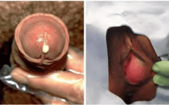
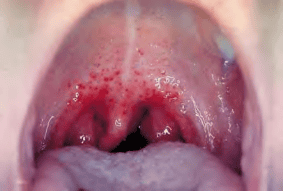

Bệnh lậu là bệnh lây truyền qua đường tình dục do song cầu khuẩn Gram âm _Neisseria gonorrhoeae_ gây ra. Vi khuẩn này chủ yếu lây qua quan hệ tình dục đường âm đạo, đường miệng hoặc đường hậu môn. Mức độ kháng thuốc của _N. gonorrhoeae_ đang ngày càng gia tăng, khiến việc chẩn đoán, điều trị và phòng ngừa trở nên thách thức hơn.

_N. gonorrhoeae là song cầu Gram âm, hình hạt cà phê, thường nằm trong và ngoài bạch cầu trung tính._

## Đặc điểm

### Lâm sàng

**Thời gian ủ bệnh**

- Nam giới: ước tính 3–5 ngày (có thể sớm 2 ngày hoặc kéo dài đến 7 ngày).
- Nữ giới: thường 5–7 ngày, đôi khi kéo dài đến 14 ngày.

Trong giai đoạn ủ bệnh, bệnh nhân không có triệu chứng nhưng vẫn có khả năng lây truyền.

#### Nhiễm lậu cầu không biến chứng

- **Nam giới**

  - Tiết dịch niệu đạo: ban đầu nhầy trắng, sau 2–3 ngày có thể chuyển thành mủ vàng xen lẫn mủ xanh.
  - Tiểu buốt, tiểu khó, có cảm giác nóng rát dọc niệu đạo.
  - Khám niệu đạo có thể thấy đầu niệu đạo đỏ, phù nề và có mủ chảy ra khi bóp nhẹ.

- **Nữ giới**

  - Hơn 50% không có triệu chứng rõ ràng.
  - Có thể: tiết dịch âm đạo bất thường (dịch mủ vàng hoặc mủ xanh), tiểu buốt, đau vùng bụng dưới, chảy máu âm đạo giữa kỳ kinh hoặc sau giao hợp.
  - Khám phụ khoa có thể thấy: cổ tử cung viêm đỏ, có mủ ở lỗ trong cổ tử cung, đôi khi viêm thành âm đạo.

- **Lậu trực tràng** (cả nam và nữ)

  - Thường không triệu chứng hoặc chỉ tiết dịch, ngứa, đau hoặc ra máu trực tràng.
  - Ở người quan hệ qua đường hậu môn, cần hỏi kỹ tiền sử quan hệ hậu môn để nghĩ đến chẩn đoán.

- **Lậu hầu họng**
  - Thường không triệu chứng; có thể viêm họng nhẹ, đau họng, sưng hạch góc hàm.
  - Được phát hiện khi sàng lọc STI hầu họng ở người quan hệ bằng miệng.

#### Nhiễm lậu cầu có biến chứng

- **Nam giới**

  - Viêm mào tinh hoàn: đau, sưng tinh hoàn, kèm sốt, ớn lạnh. Nếu không điều trị, có thể apsxe bìu và dẫn đến vô sinh.
  - Hẹp niệu đạo: do nhiễm trùng tái phát hoặc không được điều trị, gây tiểu khó mạn tính.

- **Nữ giới**

  - Viêm tiểu khung (PID): lan ngược lên vòi trứng, buồng trứng, gây đau bụng dưới, sốt, đôi khi áp xe buồng trứng.
  - Viêm vòi trứng và áp xe vòi trứng: có thể gây tắc vòi, dẫn đến vô sinh hoặc chửa ngoài tử cung.
  - Viêm nội mạc tử cung: nhẹ triệu chứng nhưng ảnh hưởng niêm mạc tử cung.
  - Mang thai: tăng nguy cơ sinh non, vỡ ối non, thai nhi nhẹ cân.

  

  _Tiết dịch cơ quan sinh dục._

- **Trẻ sơ sinh** (lây nhiễm qua đường sinh dục khi mẹ nhiễm lậu)

  - Viêm kết mạc mắt: khởi phát 2–5 ngày sau sinh, chảy mủ mắt, sưng mí, nếu không điều trị có thể dẫn đến loét giác mạc, sẹo và mù loà.

  

  _Lậu hầu họng._

### Cận lâm sàng

#### Nhuộm Gram

- **Ưu điểm**: Dễ thực hiện, giá thành thấp, có thể chẩn đoán sơ bộ nhanh ở nam giới có triệu chứng.
- **Kỹ thuật**: Lấy bệnh phẩm dịch niệu đạo (nam) hoặc dịch cổ tử cung (nữ), nhuộm Gram, quan sát song cầu Gram âm nằm trong bạch cầu đa nhân trung tính (PMN).
- **Độ nhạy**:
  - Nam có triệu chứng: 95%.
  - Nam không triệu chứng: 50–70%.
  - Nữ: 30–50% (kém nhạy hơn, thường dùng để loại trừ, vẫn cần xét nghiệm bổ sung nếu âm tính).

Nếu nhuộm Gram dương tính ở nam giới có triệu chứng, có thể chẩn đoán lậu ngay. Nếu âm tính hoặc ở nữ, cần kết hợp thêm xét nghiệm khác.

#### Nuôi cấy

- **Môi trường Thayer-Martin** bổ sung vancomycin (ức chế vi khuẩn Gram dương), colistin, nystatin (ức chế nấm), trimethoprim (ức chế Proteus).
- **Độ nhạy**: 85–95% (niệu đạo, cổ tử cung); thấp hơn ở hầu họng và trực tràng (50–70%).
- **Ưu điểm**:
  - Là tiêu chuẩn vàng để chẩn đoán.
  - Cho phép làm kháng sinh đồ (phải thiết để theo dõi kháng thuốc).
- **Hạn chế**:
  - Cần điều kiện phòng xét nghiệm chuyên sâu, kỹ thuật viên có kỹ năng.
  - Thời gian có kết quả: 2–5 ngày.

#### Xét nghiệm khuếch đại acid nucleic (NAATs)

- **Cơ chế**: Phát hiện DNA hoặc RNA của _N. gonorrhoeae_ trên nhiều loại bệnh phẩm: nước tiểu, dịch niệu đạo, dịch cổ tử cung, mẫu hầu họng, mẫu trực tràng.
- **Độ nhạy/độ đặc hiệu**: > 90–95%. Cao hơn nuôi cấy, đặc biệt ở mẫu không phải niệu đạo.
- **Ưu điểm**:
  - Kết quả nhanh (vài giờ đến 1 ngày).
  - Có thể sàng lọc người không triệu chứng (nữ, quan hệ bằng miệng, hậu môn).
- **Hạn chế**:
  - Không cung cấp kháng sinh đồ.
  - Chi phí cao hơn so với nhuộm Gram hoặc nuôi cấy.

### Chẩn đoán

#### Chẩn đoán xác định

:::note[Chẩn đoán xác định bệnh lậu]
**Lâm sàng**

- Tiết dịch hoặc mủ ở niệu đạo (nam) hoặc âm đạo/cổ tử cung (nữ), kèm tiểu buốt, tiểu nhiều, nóng rát niệu đạo.
- Tiền sử quan hệ tình dục không an toàn hoặc bạn tình có nhiễm lậu.

**Cận lâm sàng**

- **Nhuộm Gram**: Song cầu Gram âm hình hạt cà phê trong bạch cầu đa nhân trung tính (đặc biệt ở nam giới có triệu chứng).
- **Nuôi cấy**: Phân lập _N. gonorrhoeae_ trên môi trường Thayer-Martin.
- **NAATs**: Xét nghiệm khuếch đại acid nucleic phát hiện _N. gonorrhoeae_ trên dịch niệu đạo, dịch cổ tử cung, nước tiểu, mẫu hầu họng hoặc mẫu trực tràng.

_Bất kỳ kết quả dương tính từ một trong ba xét nghiệm trên đều khẳng định chẩn đoán lậu._

:::caution[Lưu ý]
Tại cơ sở không đủ điều kiện xét nghiệm, có thể chẩn đoán lâm sàng và điều trị theo hướng dẫn. Tại cơ sở có điều kiện, nên kết hợp lâm sàng và cận lâm sàng để chẩn đoán chính xác.  
:::

#### Chẩn đoán phân biệt

- **Lậu sinh dục**:

  - _Chlamydia trachomatis_: Tiết dịch mủ niệu đạo hoặc dịch âm đạo tương tự, nhưng thường ít mủ hơn, soi tươi nhuộm Gram không thấy song cầu.
  - _Trichomonas vaginalis_: Huyết trắng bọt, mùi tanh, soi tươi thấy trùng roi lắc lư.
  - _Candida albicans_: Khí hư đặc, trắng như phô mai, ngứa nhiều, soi tươi thấy bào tử và giả sợi.
  - _Ureaplasma urealyticum_/_Mycoplasma genitalium_: Ít triệu chứng, tiểu buốt, chẩn đoán bằng PCR chuyên biệt.
  - Viêm niệu đạo không do nhiễm trùng (viêm do chấn thương, kích ứng hóa chất).

- **Lậu hậu môn – trực tràng**:

  - _Chlamydia trachomatis_, _Treponema pallidum_ (giang mai), _Herpes simplex virus_ (HSV), _Candida_; cần soi, nuôi cấy, NAATs đặc hiệu.

- **Lậu hầu họng**:

  - _Streptococcus nhóm A_ (viêm họng liên cầu), _Mycoplasma pneumoniae_, _Chlamydia pneumoniae_, virus đường hô hấp.

- **Viêm kết mạc mắt do lậu ở trẻ sơ sinh**:
  - _Staphylococcus aureus_, _Streptococcus pneumoniae_, _Haemophilus influenzae_, _Chlamydia trachomatis_; cần nuôi cấy mẫu mủ mắt, NAATs nếu có.

:::caution[Lưu ý]
_N. gonorrhoeae_ và _C. trachomatis_ thường đồng nhiễm. Do đó, khi nghi ngờ lậu, luôn làm thêm xét nghiệm Chlamydia (NAATs) để điều trị đồng thời.  
:::

## Điều trị

### Nguyên tắc chung

1. **Điều trị sớm, đủ liều và đúng phác đồ** để ngăn ngừa biến chứng và giảm nguy cơ kháng thuốc.
2. **Điều trị đồng nhiễm Chlamydia**: Kết hợp thuốc phù hợp để bao phủ cả hai tác nhân.
3. **Điều trị bạn tình** (người có quan hệ tình dục trong vòng 60 ngày trước khi xuất hiện triệu chứng hoặc chẩn đoán).
4. **Kiêng quan hệ tình dục** trong thời gian điều trị và 7 ngày sau khi hoàn thành điều trị.
5. **Xét nghiệm HIV và giang mai** trước và/hoặc sau khi điều trị do tỉ lệ đồng nhiễm cao.

### Phác đồ

#### Nhiễm lậu sinh dục và hậu môn – trực tràng

- **Ưu tiên** (dựa vào kháng sinh đồ nếu có):

  1. **Ceftriaxon 250 mg tiêm bắp liều duy nhất**
  2. **Spectinomycin 2 g tiêm bắp liều duy nhất** (nếu không dùng được cephalosporin)
  3. **Cefixim 400 mg uống liều duy nhất** (thay thế khi không tiêm bắp được)

- **Kết hợp**:
  - **Azithromycin 1 g uống liều duy nhất** để điều trị đồng nhiễm _Chlamydia trachomatis_.

:::caution[Lưu ý]

- Phác đồ trên áp dụng cho cả phụ nữ mang thai (Ceftriaxon tiêm bắp an toàn, Azithromycin an toàn khi điều trị Chlamydia).
- Nếu tiền sử dị ứng ceftriaxon hoặc cephalosporin thế hệ ba: xem mục **Lưu ý đặc biệt** bên dưới.  
  :::

#### Nhiễm lậu hầu họng

- **Ưu tiên**:

  1. **Ceftriaxon 250 mg tiêm bắp liều duy nhất**
  2. **Cefixim 400 mg uống liều duy nhất** (nếu không tiêm bắp được)

- **Kết hợp**:

  - **Azithromycin 1 g uống liều duy nhất** để điều trị đồng nhiễm Chlamydia.

- **Theo dõi**:
  - Tái khám sau 7–14 ngày để kiểm tra bằng nuôi cấy hoặc NAATs (lưu ý dương tính giả do tồn dư acid nucleic). Nếu NAAT (+), làm nuôi cấy để khẳng định kháng thuốc trước khi điều trị lại.

#### Lậu mắt ở trẻ sơ sinh

- **Điều trị viêm kết mạc do lậu cầu:**

  - **Ceftriaxon 50 mg/kg tiêm bắp liều duy nhất** (tối đa 150 mg).
  - **Kanamycin 25 mg/kg tiêm bắp liều duy nhất** (tối đa 75 mg).
  - **Spectinomycin 25 mg/kg tiêm bắp liều duy nhất** (tối đa 75 mg).

- **Dự phòng ngay sau sinh (dùng cho cả hai mắt):**

  - Mỡ tra mắt Tetracyclin hydrochlorid 1%.
  - Mỡ tra mắt Erythromycin 0.5%.
  - Dung dịch Povidon Iod 2.5% (dung môi nước).
  - Dung dịch bạc nitrat 1%.
  - Mỡ Chloramphenicol 1%.

  _Lưu ý: Tránh chạm mắt khi tra thuốc. Không dùng Povidon Iod dung môi cồn do kích ứng._

:::caution[Lưu ý]

- **Dị ứng Penicillin/cephalosporin**:

  - Nguy cơ phản ứng chéo giữa Penicillin và Cephalosporin thế hệ đầu cao hơn, nhưng với cephalosporin thế hệ ba (Ceftriaxon, Cefixim) nguy cơ rất thấp (< 1%).
  - Nếu nghi ngờ quá mẫn IgE với Penicillin, có thể dùng:
    - **Gentamicin 240 mg tiêm bắp liều duy nhất** + **Azithromycin 2 g uống liều duy nhất**.
    - Nếu cơ sở có xét nghiệm đột biến **gyrA** (chỉ điểm kháng Ciprofloxacin), có thể dùng **Ciprofloxacin 500 mg uống liều duy nhất** nếu mẫu nhạy.

- **Phụ nữ mang thai**:

  - Điều trị bằng **Ceftriaxon 250 mg tiêm bắp liều duy nhất** + **Azithromycin 1 g uống liều duy nhất** (nếu chưa loại trừ nhiễm Chlamydia).
  - Tránh dùng Gentamicin vì nguy cơ độc tính trên tai và thận của thai nhi.

- **Người nhiễm HIV**:
  - Điều trị tương tự người không nhiễm HIV; lưu ý nguy cơ kháng thuốc cao hơn, cần theo dõi kỹ đáp ứng điều trị.

:::

### Thất bại điều trị

Xác định thất bại điều trị khi:

1. **Triệu chứng không cải thiện** sau 3–5 ngày điều trị, không có quan hệ tình dục trở lại.
2. **Nuôi cấy dương tính** sau ≥ 3 ngày điều trị hoặc **NAAT (+)** sau ≥ 7 ngày điều trị, không quan hệ tình dục.
3. **Kháng sinh đồ** cho thấy giảm nhạy cảm với cephalosporin, dù có quan hệ tình dục lại hay không.

**Phác đồ điều trị lại**:

- Nếu đã điều trị theo hướng dẫn:
  - **Ceftriaxon 500 mg tiêm bắp liều duy nhất** + **Azithromycin 2 g uống liều duy nhất**.
  - **Cefixim 800 mg uống liều duy nhất** + **Azithromycin 2 g uống liều duy nhất**.
  - **Gentamicin 240 mg tiêm bắp liều duy nhất** + **Azithromycin 2 g uống liều duy nhất**.
  - **Spectinomycin 2 g tiêm bắp liều duy nhất** (nếu không phải nhiễm hầu họng) + **Azithromycin 2 g uống liều duy nhất**.
- Nếu đã điều trị nhưng không theo phác đồ khuyến cáo: điều trị lại theo hướng dẫn.
- Nếu có kháng sinh đồ: điều trị lại dựa vào kết quả kháng sinh đồ.
- Nếu nghi ngờ tái nhiễm (bạn tình không điều trị hoặc quan hệ với người mới nhiễm): điều trị lại theo phác đồ ưu tiên và điều trị bạn tình.

## Theo dõi sau điều trị

- **Tái khám 3 tháng**: Tất cả trường hợp nhiễm lậu sinh dục hoặc trực tràng không biến chứng nên làm NAAT sau 3 tháng kể từ khi điều trị để phát hiện tái nhiễm, kể cả khi không còn triệu chứng.
- **Nếu không thể tái khám sau 3 tháng**: có thể xét nghiệm lại bất kỳ lúc nào trong 3–12 tháng sau điều trị đầu tiên.
- **Nhiễm lậu hầu họng**: tái khám sau 7–14 ngày để kiểm tra bằng nuôi cấy hoặc NAAT; lưu ý NAAT sau 7 ngày có thể dương tính giả do mảnh gien còn tồn tại, nên ưu tiên nuôi cấy để khẳng định.
- **Viêm niệu đạo, viêm cổ tử cung hoặc viêm trực tràng dai dẳng**: xem xét nguyên nhân khác (ví dụ: _Mycoplasma genitalium_, _Ureaplasma urealyticum_, _HSV_), làm xét nghiệm bổ sung khi cần.

## Phòng bệnh

- **Giáo dục, truyền thông** về STI, đường lây truyền, triệu chứng, biến chứng và cách phòng tránh.
- **Thực hành tình dục an toàn**:
  - Sử dụng bao cao su đúng cách mọi lúc khi quan hệ âm đạo, hậu môn hoặc miệng.
  - Hạn chế số bạn tình, sàng lọc STI định kỳ nếu có nguy cơ cao.
- **Khám sàng lọc định kỳ**: Đối với nhóm nguy cơ cao (trẻ vị thành niên, phụ nữ < 25 tuổi, nam quan hệ tình dục đồng giới, người chuyển giới, mại dâm).
- **Đào tạo chuyên môn**: Cập nhật kiến thức về kháng thuốc lậu cầu cho các bác sĩ đa khoa, chuyên khoa da liễu và sản phụ khoa.
- **Theo dõi kháng thuốc**: Đẩy mạnh nuôi cấy và làm kháng sinh đồ để giám sát mức độ kháng thuốc của _N. gonorrhoeae_ tại địa phương.

## Nguồn tham khảo

- BỘ Y TẾ (2021) – _Hành hướng dẫn chẩn đoán và điều trị bệnh lậu_
- Trường ĐH Y Dược TP. HCM (2020) – _Team-based learning_
