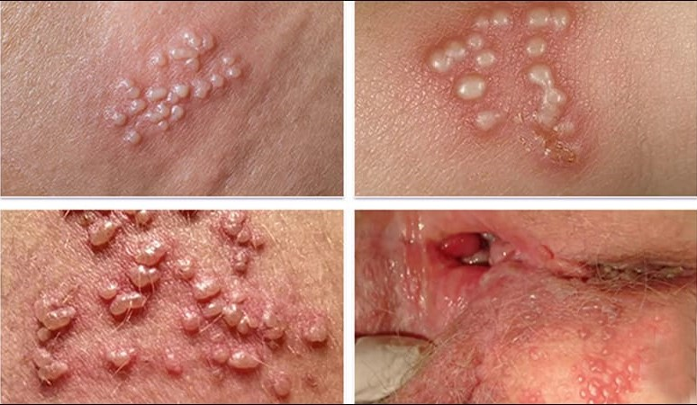

Herpes simplex virus (HSV) type 2, đôi khi có kèm type 1 có ái lực với tổ chức da niêm sinh dục, chui vào hạch bạch huyết vùng chậu, ẩn nấp trong đó và gây tác dụng lâu dài.

Thời gian ủ bệnh 3-7 ngày.

## Chẩn đoán

Dựa vào triệu chứng lâm sàng là chính, xét nghiệm cận lâm sàng ít thực hiện. Nếu cần hội chẩn thêm chuyên khoa.

### Lâm sàng

Sốt, đau cơ.

Nhiễm HSV lần đầu tiên có thể có tổn thương tại chỗ và toàn thân (vùng sinh dục, hậu môn).

Sang thương là những bóng nước, nổi lên từng mảng, sau đó vỡ ra thành vết loét rộng, nông, đau, bỏng rát, kéo dài 2-3 tuần.

Khí hư đục như mủ.

Hạch bẹn (+), 1 hoặc 2 bên, đau.

Những đợt tái phát: giống tổn thương ban đầu nhưng ngắn hơn, ít triệu chứng toàn thân, thường xuất hiện sau tình trạng stress.

_Herpes sinh dục._

### Cận lâm sàng (nếu có điều kiện)

Cấy virus.

Thể vùi trong tế bào (phết tế bào).

Kỹ thuật miễn dịch huỳnh quang (mẫu ở đáy vết loét).

Phản ứng huyết thanh tăng gấp 4 lần (2 - 3 tuần).

## Điều trị

Tùy theo giai đoạn bệnh:

- Giai đoạn cấp, dùng 1 trong các thuốc sau đây:
  - Acyclovir 400 mg uống 3 lần/ngày x 7-10 ngày.
  - Acyclovir 200 mg uống 5 lần/ngày x 7-10 ngày.
  - Famcyclovir 250 mg uống 3 lần/ngày x 7-10 ngày.
  - Valacyclovir 1g uống 2 lần/ngày x 7-10 ngày.
- Giai đoạn tái phát, dùng 1 trong các thuốc sau đây:
  - Acyclovir 400 mg uống 3 lần/ngày x 5 ngày.
  - Acyclovir 800 mg uống 2 lần/ngày x 5 ngày.
  - Acyclovir 800 mg uống 3 lần/ngày x 2 ngày.
  - Famciclovir 125 mg uống 2 lần/ngày x 5 ngày.
  - Famciclovir 1000 mg uống 2 lần/ngày x 1 ngày.
  - Famciclovir 500 mg uống 2 lần/ngày x 1 ngày.
  - Famciclovir 500 mg uống 1 lần, sau đó uống 250 mg 2 lần/ngày x 2 ngày.
  - Valacyclovir 500 mg uống 2 lần/ngày x 3 ngày.
  - Valacyclovir 1g uống 1 lần/ngày x 5 ngày.

Thuốc bôi.

Kháng sinh nếu bội nhiễm.

Giảm đau, vệ sinh tại chỗ.

### Theo dõi

Tái khám khi có gì lạ.

Khám phụ khoa định kỳ.

Lưu ý:

- Các thuốc điều trị Herpes hiện nay không có khả năng diệt virus mà chỉ làm giảm triệu chứng bệnh và giảm thời gian bị bệnh.
- Người bệnh có nguy cơ nhiễm HIV rất cao và nguy cơ lây nhiễm cao cho thai nhi (đặc biệt trong giai đoạn chuyển dạ).
- Khả năng lây cho bạn tình là rất cao trong suốt cuộc đời nên tư vấn phòng lây nhiễm (an toàn tình dục, sử dụng bao cao su đúng cách và thường xuyên) là rất quan trọng.
- Không điều trị trong 3 tháng đầu thai kỳ.
- Khi thai đủ trưởng thành nên mổ lấy thai, không nên để sinh đường âm đạo nhằm tránh nguy cơ lây nhiễm cho con.

## Nguồn tham khảo

- Bệnh viện Từ Dũ (2022) – _Phác đồ điều trị Sản phụ khoa_
