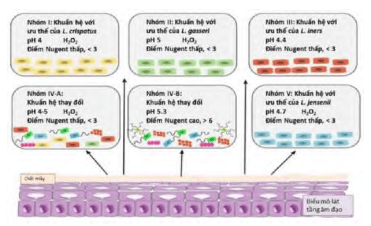
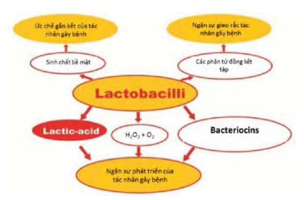
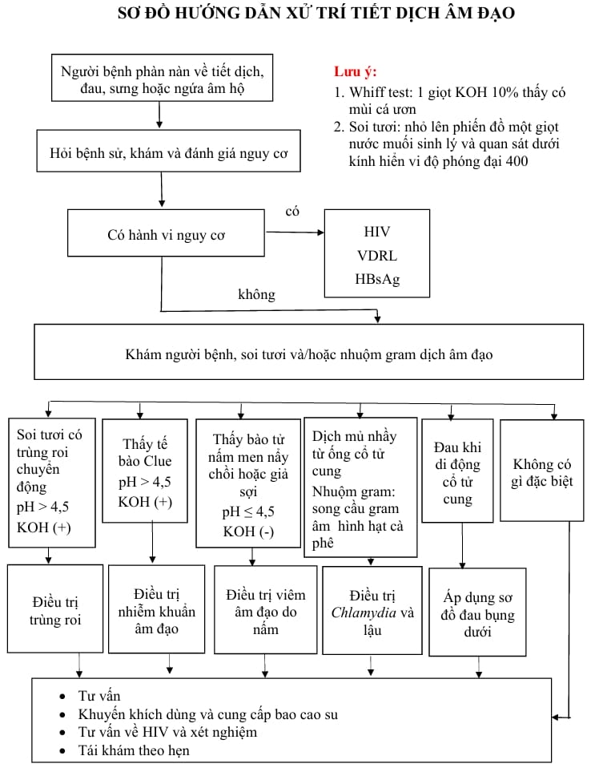

Hệ vi khuẩn âm đạo (vaginal microbiome) của phụ nữ trong độ tuổi sinh sản bao gồm cả vi khuẩn kỵ khí và hiếu khí thường trú, tồn tại trong quan hệ cộng sinh với môi trường âm đạo. Âm đạo cung cấp dưỡng chất (glycogen, protein, muối điện giải) cho vi sinh vật, đồng thời cộng đồng vi khuẩn đóng vai trò bảo vệ chủ thể bằng cách ngăn chặn vi khuẩn gây bệnh xâm nhập và phát triển quá mức. Rối loạn hệ vi khuẩn âm đạo có thể dẫn đến nhiều vấn đề sức khỏe, như viêm nhiễm, sảy thai, sinh non, thậm chí tăng nguy cơ lây nhiễm qua đường tình dục. Mật độ vi khuẩn trong dịch âm đạo rất cao, khoảng 10⁸-10⁹ vi khuẩn trên mỗi mL.

Ở phụ nữ trong độ tuổi sinh sản bình thường, _Lactobacillus spp_. (khuẩn Döderlein) chiếm ưu thế. Đây là vi khuẩn Gram dương, hình que, kỵ khí không bắt buộc, thuộc nhóm vi khuẩn lactic acid, có khả năng chuyển hóa glycogen thành lactic acid.

## Hệ vi khuẩn âm đạo

Các trạng thái hệ vi khuẩn âm đạo khác nhau (dựa trên chủng chiếm ưu thế, điểm Nugent) phản ánh sự biến động chức năng bảo vệ ở từng cá thể. Khi _Lactobacillus_ chiếm ưu thế, âm đạo được bảo vệ tốt; Ngược lại, giảm _Lactobacillus_ hoặc tăng vi khuẩn kỵ khí/gây hại sẽ dẫn đến rối loạn tiết dịch.

_Hình ảnh "Phân kiểu trạng thái khuẩn hệ dựa trên chủng vi khuẩn ưu thế và điểm Nugent"_.

_Hình ảnh "Lactobacillus spp. sản xuất lactic acid, H₂O₂ và bacteriocins để ức chế vi sinh vật gây bệnh"_.

**Vai trò** của _Lactobacillus_:

- **Duy trì pH âm đạo**: _Lactobacillus_ sản xuất lactic acid giúp giữ pH âm đạo ở mức 3.5-4.5, tạo môi trường không thuận lợi cho vi sinh vật gây bệnh.
- **Sản xuất H₂O₂**: Nhiều chủng _Lactobacillus_ tạo H₂O₂, có tác dụng ức chế một số vi khuẩn kỵ khí và vi nấm.
- **Tiết bacteriocins**: _Lactobacillus_ sinh ra các protein có hoạt tính kháng khuẩn (bacteriocins), nhắm kiểm soát vi khuẩn ngoại lai hoặc có hại.
- **Kích hoạt miễn dịch bẩm sinh**: Lactic acid không chỉ hạ pH mà còn kích thích đại thực bào, tế bào hình răng (dendritic cells), tế bào NK giải phóng cytokine (IFN-γ), góp phần chống lại vi khuẩn Gram âm.

Ngoài vai trò của _Lactobacillus_, hệ miễn dịch bẩm sinh (innate immunity) và thích ứng (adaptive immunity) cũng tham gia bảo vệ:

- **Miễn dịch bẩm sinh**: Đại thực bào, tế bào hình răng cưa (DC), tế bào giết tự nhiên (NK) thực bào và tiết cytokine (IFN-γ, TNF-α) để tiêu diệt mầm bệnh.
- **Miễn dịch thích ứng**: Khi vi khuẩn xuyên qua hàng rào biểu mô, lympho B-T sinh kháng thể IgA, IgG, CD4+ và CD8+ tham gia phản ứng đặc hiệu.

Môi trường âm đạo được hình thành bởi estrogen, kích thích biểu mô lát tầng tích tụ glycogen, tạo chất nền cho _Lactobacillus_ phát triển. Ở người chưa dậy thì và mãn kinh, thiếu estrogen → giảm glycogen → hệ vi khuẩn ít _Lactobacillus_, pH âm đạo cao (6-8). Ở tuổi sinh sản, pH 3.5-4.7, _Lactobacillus_ chiếm ưu thế, bảo vệ môi trường cân bằng. Hệ vi khuẩn âm đạo có thể thay đổi do các yếu tố:

- **Thuốc kháng sinh**.
- **Thuốc tránh thai nội tiết**.
- **Hoạt động tình dục, chất bôi trơn**.
- **Thụt rửa âm đạo**.
- **Stress, thay đổi dinh dưỡng**.

Khi bị nhiễm hoặc rối loạn, các vi khuẩn kỵ khí (_Gardnerella vaginalis_, _Mobiluncus spp_.), nấm (_Candida spp_.) hoặc ký sinh (_Trichomonas vaginalis_) có cơ hội phát triển quá mức, gây tiết dịch bất thường.

## Thành phần dịch âm đạo

Âm đạo luôn tiết một lượng dịch nhất định để bôi trơn và bảo vệ.

**Nguồn gốc**:

- Dịch nhầy cổ tử cung (chiếm phần lớn).
- Dịch nội mạc tử cung (ít hơn).
- Dịch tuyến Skène (lân cận niệu đạo).
- Dịch tuyến Bartholin (âm hộ ngoài).
- Tế bào niêm mạc lát tầng bong tróc (dẫn đến dịch trắng sữa).

**Thành phần**: Nước, glycoprotein (mucins), protein, amino acid, muối vô cơ, các vi sinh vật thường trú (_Lactobacillus spp_.).

**Chức năng**:

- Bôi trơn âm đạo, giảm ma sát khi giao hợp.
- Giúp loại bỏ tế bào chết, mảnh vụn vi khuẩn.
- Tạo môi trường ẩm ướt, bảo vệ biểu mô tránh khô rát.
- Tham gia cơ chế bảo vệ sinh lý (pH thích hợp, kháng khuẩn).

## Tiếp cận

Bình thường, phụ nữ sinh sản sản xuất khoảng 1.5 g dịch mỗi ngày. Thay đổi tính chất (màu, mùi, độ đặc, lượng) thường do các yếu tố nội tiết (thời kỳ rụng trứng, thai kỳ), tình trạng viêm nhiễm, thụt rửa hoặc stress. Tiết dịch âm đạo bất thường (abnormal vaginal discharge - AVD) là khi dịch có bất kỳ thay đổi nào so với bình thường.

### Lâm sàng

**Màu sắc**:

- Trắng đục, vón cục: Gợi ý nhiễm _Candida_.
- Xám hoặc vàng xám, bọt: Gợi ý viêm âm đạo do _Gardnerella_ (vaginosis).
- Vàng xanh, bọt, mùi tanh: Gợi ý _Trichomonas vaginalis_.
- Máu lẫn hoặc nâu: Gợi ý nguyên nhân tại tử cung/cổ tử cung (polyp, u xơ, viêm, ung thư).

**Mùi**:

- Hôi tanh: Thường do bacterial vaginosis.
- Chua hoặc hơi ngọt: Có thể do biến đổi pH sau rụng trứng, đôi khi kèm viêm nhẹ.
- Tanh hôi nặng, mủ vàng xanh: Gợi ý nhiễm trùng nặng (viêm cổ tử cung, viêm vùng chậu).

**Đặc tính**:

- Dính, loãng, bọt khí: Phân biệt theo tác nhân (ví dụ bọt khí thường gặp _Trichomonas_).
- Vón cục, giống phô mai: Thường gặp _Candida_.
- Nước, không mùi, ít: Có thể là sinh lý (rụng trứng) hoặc do kích thích nhẹ.

**Số lượng**:

- Tăng đáng kể: Dịch tiết nhiều, ướt đẫm quần lót, làm khó chịu.
- Giảm hoặc khô: Có thể do giảm estrogen (tiền mãn kinh, mãn kinh).

**Triệu chứng đi kèm**:

- Ngứa, rát, đau rát khi giao hợp
- Tiểu đau, tiểu rát
- Chảy máu sau giao hợp
- Đau vùng chậu, sốt (nặng, cảnh báo viêm sâu như PID)

### Cận lâm sàng

**Xét nghiệm cơ bản**:

- **Soi tươi dịch âm đạo**: KOH 10%: Phát hiện sợi nấm, bào tử (_Candida_); Nước muối 0.9%: Tìm tế bào clue (_Gardnerella_), trùng roi (_Trichomonas_).
- **Nhuộm Gram**: Đánh giá điểm Nugent (đếm _Lactobacillus_, Bacteroides, _Gardnerella_); Phân biệt bacterial vaginosis (Nugent ≥ 7), viêm nấm (Gram dương nhiều bào tử nấm).

**Khảo sát thêm (nếu lâm sàng chưa rõ)**:

- **Cấy nấm/vi khuẩn**: Khi nghi nhiễm _Candida_ kháng thuốc hoặc nhiễm khuẩn hỗn hợp.
- **PCR hoặc test nhanh kháng nguyên**: _Trichomonas vaginalis_, _Chlamydia trachomatis_, _Neisseria gonorrhoeae_.
- **Xét nghiệm HIV, giang mai**: Nếu có nguy cơ tình dục cao.

### Chẩn đoán phân biệt

- **Viêm âm đạo do _Candida_**: Dịch trắng vón cục, không mùi hoặc hơi chua, ngứa rát âm đạo.
- **Bacterial Vaginosis (BV)**: Dịch xám, loãng, mùi tanh ("fishy"), pH âm đạo > 4.5, tế bào clue dương tính.
- **Viêm âm đạo do _Trichomonas vaginalis_**: Dịch vàng xanh, bọt, mùi hôi, pH âm đạo > 5, ngứa, tiểu rát.
- **Viêm cổ tử cung mủ (Cervicitis)**: Dịch mủ vàng chảy tự do từ cổ tử cung, thường do _Chlamydia/Gonorrhea_.
- **_Chlamydia trachomatis_ / _Neisseria gonorrhoeae_**: Dịch mủ, đôi khi không triệu chứng, đau vùng chậu, đôi khi viêm cổ tử cung mạn tính.
- **Viêm vùng chậu (PID)**: Dịch mủ, sốt, đau vùng chậu, đau khi di động cổ tử cung.
- **Dị dạng cổ tử cung / polyp cổ tử cung / ung thư cổ tử cung**: Dịch lẫn máu, chảy máu sau giao hợp, dịch hôi lẫn mùi máu.

## Điều trị

_Hình ảnh "Sơ đồ xử trí tiết dịch âm đạo bất thường - Bệnh viện Từ Dũ"_.

**Clomaz Forte (Clotrimazole 500 mg)**:

- Điều trị: Nhiễm nấm _Candida_, viêm âm đạo do nấm, hỗn hợp _Trichomonas_ và _Gardnerella_, các vi khuẩn Gram (+).
- Liều: Đặt 1 viên duy nhất vào âm đạo trước khi ngủ.

**Neo Penotran (Metronidazole 500 mg + Miconazole nitrate 100 mg)**:

- Điều trị: Viêm âm đạo do vi khuẩn kỵ khí, _Gardnerella vaginalis_, _Trichomonas vaginalis_ và nhiễm hỗn hợp kèm _Candida_.
- Liều: Đặt 1 viên vào âm đạo trước khi ngủ mỗi đêm × 7 ngày.

**Sadetabs (Neomycin sulphate 83 mg + Clotrimazole 100 mg + Metronidazole 500 mg)**:

- Điều trị: Viêm âm đạo do tạp khuẩn và nấm _Candida_ nhẹ.
- Liều: Đặt 1 viên vào âm đạo mỗi đêm × 7 ngày.

**Timbov (Clotrimazole 500 mg)**:

- Điều trị: Nhiễm nấm âm hộ âm đạo, đặc biệt _Candida_, hoặc viêm hỗn hợp kèm vi khuẩn, _Trichomonas_.
- Liều: Đặt 1 viên vào âm đạo trước khi ngủ × 7-14 ngày tùy mức độ.

## Tài liệu tham khảo

- Trường ĐH Y Dược TP. HCM (2020) - _Team-based learning_
- Bệnh viện Từ Dũ (2022) - _Phác đồ điều trị Sản Phụ khoa_
