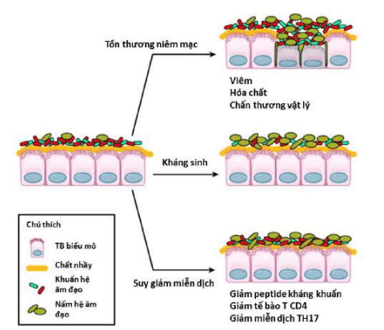
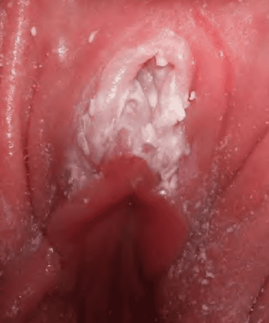
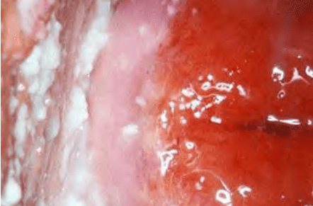

Khoảng 10% phụ nữ trên 18 tuổi trải qua ít nhất 2 đợt viêm âm hộ - âm đạo do Candida sp (Vulvo-Vaginal Candidiasis – VVC) trong vòng 1 năm gần nhất. Có tới 10% bạn tình nam bị nhiễm nấm dương vật. VVC không được xem như bệnh lây truyền qua đường tình dục.

## Nguyên nhân

- Candida sp là vi nấm men, gồm nhiều chủng khác nhau. Trong các chủng Candida, **Candida albicans** là phổ biến nhất. Các chủng khác có thể gặp là _Candida glabrata_, _Candida tropicalis_, hoặc _Torulopsis glabrata_. Candida albicans tồn tại tự nhiên trong hệ vi sinh âm đạo bình thường.
- Sự hiện diện của **glucose** và **sucrose** là điều kiện thuận lợi cho sự phát triển của Candida albicans. Chỉ khi Candida albicans phát triển quá mức thì bệnh nhân mới có biểu hiện lâm sàng. Cơ chế chuyển từ trạng thái cộng sinh sang gây bệnh của Candida albicans vẫn chưa được làm rõ hoàn toàn.

## Yếu tố nguy cơ

_Hình ảnh "3 yếu tố dẫn đến mất cân bằng giữa hệ vi sinh (microbiome) và hệ vi nấm (mycobiome): Tổn thương niêm mạc, kháng sinh và rối loạn miễn dịch"._

1. **Tổn thương niêm mạc âm đạo**: Trầy xước, viêm loét do quan hệ tình dục thô bạo, thủ thuật y khoa, hoặc kích ứng hóa chất.
2. **Sử dụng kháng sinh**: Kháng sinh diệt vi khuẩn nhưng cũng tiêu diệt Lactobacilli bảo vệ, tạo điều kiện cho nấm phát triển.
3. **Rối loạn miễn dịch và tăng glycogen âm đạo**: Thai kỳ, đái tháo đường, dùng thuốc ngừa thai chứa estrogen liều cao, suy giảm miễn dịch, môi trường âm đạo ẩm ướt, dùng corticosteroids.

## Chẩn đoán

### Lâm sàng

- **Khí hư**: Đặc trưng giống "phô mai sữa" (cottage cheese), không mùi, đặc, dính.
- **pH âm đạo**: Thường duy trì từ 4.0–5.0.
- **Triệu chứng**:
  - Ngứa âm đạo, âm hộ.
  - Đôi khi nóng rát, đau khi giao hợp, tiểu buốt.
  - Âm hộ và niêm mạc âm đạo viêm đỏ, lột da nhẹ.

_Hình ảnh "Âm hộ viêm đỏ rực, với các mảng trắng dầy. Bệnh nhân thường than phiền ngứa, rát, đau khi giao hợp và tiểu rát"._

_Hình ảnh "Tiết dịch âm đạo đặc, các mảng trắng bám thành âm đạo, niêm mạc viêm đỏ, khô"._

### Cận lâm sàng

- **Soi tươi**: Hòa bệnh phẩm (dịch âm đạo hoặc mảng bào tử) với NaCl 0.9% rồi quan sát dưới kính hiển vi; nhuộm xanh methylene hoặc Gram để phát hiện sợi tơ nấm và bào tử.
- **Nhuộm Gram**: Thường thấy bào tử nấm và sợi nấm giả (pseudohyphae).
- **Cấy nấm**: Chỉ định khi thất bại điều trị hoặc nghi ngờ chủng không phải Candida albicans, nhằm xác định chủng và làm kháng nấm đồ.
- **Xét nghiệm latex agglutination**: Dùng để xác định nhanh một số chủng Candida không sinh giả tơ nấm.

## Phân loại

Phân loại theo CDC 2010 chia thành 2 nhóm:

- **VVC không biến chứng**:
  - Nhiễm đơn thuần hoặc thỉnh thoảng.
  - Triệu chứng nhẹ đến trung bình.
  - Nghi ngờ Candida albicans.
  - Phụ nữ không suy giảm miễn dịch.
- **VVC có biến chứng**:
  - Tái phát ≥ 4 lần/năm.
  - Triệu chứng nặng.
  - Nghi ngờ hoặc có bằng chứng nhiễm nấm không phải Candida albicans.
  - Phụ nữ đái tháo đường, bệnh nội khoa nặng, hoặc suy giảm miễn dịch.

## Điều trị

### Nguyên tắc

- Việc tự dùng thuốc không kê toa cho VVC có thể an toàn và hiệu quả nếu bệnh nhân hiểu rõ triệu chứng điển hình.
- Nếu không đáp ứng hoặc tái phát sớm sau điều trị, cần khám bởi bác sĩ để xác định chính xác tình trạng và nguyên nhân (chủng Candida, yếu tố nguy cơ).
- Tránh sử dụng phối hợp kháng nấm với kháng sinh không cần thiết, vì có thể làm rối loạn thêm hệ vi sinh và mycobiome. Kháng viêm (steroid) chỉ giúp giảm triệu chứng viêm nhưng có thể ảnh hưởng tiêu cực đến cân bằng vi sinh.
- Điều trị cần dựa trên mức độ nặng, loại Candida, tình trạng thai kỳ, bệnh lý kèm theo.

### Không biến chứng

**Thuốc nhóm Azole (Imidazoles)**:

- **Miconazole, Clotrimazole, Butoconazole, Tioconazole, Terconazole** (dạng kem hoặc viên đặt).
  - Ví dụ: Clotrimazole 200 mg đặt âm đạo mỗi ngày x 3 ngày, hoặc Miconazole 100 mg đặt mỗi ngày x 7 ngày.
- **Fluconazole uống** 150 mg liều đơn.
  - Tác dụng nhanh, hiệu quả 90%.
  - Fluconazole liều thấp (150 mg) an toàn trong thai kỳ. Liều cao hàng ngày (400–800 mg) có liên quan đến nguy cơ khuyết tật thai nhi.
- **Nystatin** (dạng viên đặt âm đạo) là lựa chọn an toàn khi mang thai.

Tái phát sau 1 tháng chiếm 20–30% trường hợp.

- Nếu tái phát, có thể **Fluconazole uống 150 mg mỗi tuần x 6 tháng** (giảm tái phát 50%).
- Ngoài ra, liệu pháp đặt âm đạo 1–2 lần/tuần cũng được dùng để dự phòng.

**Bạn tình**:

- Nếu không có triệu chứng, không phải điều trị.
- Chỉ cân nhắc điều trị bạn tình khi bạn nữ tái phát nhiều lần mà không có yếu tố nguy cơ rõ ràng.

**Chủng Candida glabrata**:

- Thường kháng với imidazole.
- Điều trị thay thế có thể dùng **Boric acid viên nang đặt âm đạo** hoặc **Gentian violet** (mực tím).

### Có biến chứng

- Tái phát ≥ 4 lần/năm hoặc nhiễm nấm không phải C. albicans, cần cấy nấm và kháng nấm đồ.
- Đánh giá yếu tố nguy cơ: đái tháo đường, suy giảm miễn dịch.
- Liệu pháp dự phòng: Fluconazole 150 mg uống mỗi tuần x 6 tháng.
- Khuyến khích đánh giá và điều chỉnh các nguyên nhân nền (kiểm soát đường huyết, cân bằng miễn dịch).
- Probiotics chưa được chứng minh chắc chắn hiệu quả, chỉ dùng theo kinh nghiệm cho một số trường hợp tái phát nhiều lần.

### Tại chỗ

_Bảng "Thuốc kháng nấm tại chỗ (First line therapy) điều trị VVC không biến chứng"._
| Loại thuốc | Biệt dược | Dạng thuốc | Liều dùng |
| -------------------------------- | ------------------------------------------ | ------------------------------------------- | ----------------------------------------------------------------------------------------------------------------------------------------------------------- |
| **Butoconazole** | Gynazole-1, Mycclex-3 | 2% cream âm đạo | Gynazole-1: 1 lần/ngày x 1 ngày Mycclex-3: 1 lần/ngày x 3 ngày |
| **Clotrimazole** | Gyne-Lotrimin 7, Mecclex-7 | 1%–2% cream âm đạo hoặc viên | Gyne-Lotrimin 7 (1% cream) x 1/ngày x 7 ngày Mecclex-7 (2% cream) x 1/ngày x 3 ngày Gyne-Lotrimin 3 (200 mg viên) x 1/ngày x 3 ngày |
| **Clotrimazole + Betamethasone** | Lotrisone | 1% Clotrimazole + 0.05% Betamethasone cream | Bôi vùng âm hộ 2 lần/ngày x tối đa 2 tuần |
| **Miconazole** | Monistat-3, Monistat-7, Monistat Dual Pack | 2%–4% cream âm đạo hoặc viên đặt | Monistat-3 (4% cream) x 1/ngày x 7 ngày Monistat-7 (2% cream) x 1/ngày x 3 hoặc 7 ngày Monistat Dual Pack (1200 mg viên + 2% cream) x 1/ngày x 1 ngày |
| **Terconazole** (kê toa) | Terazol 3, Terazol 7 | 80 mg viên đặt hoặc 0.4–0.8% cream | Terazol 3 (80 mg viên) x 1/ngày x 3 ngày Terazol 7 (0.4% cream) x 1/ngày x 7 ngày hoặc 0.8% cream x 1/ngày x 3 ngày |
| **Tioconazole** | Vagistat-1, Monistat-1 | 6.5% gel/dầu âm đạo | 1 lần đặt âm đạo x 1 ngày |
| **Econazole nitrate** | Spectrazole | 1% cream âm đạo | Bôi vùng âm hộ 2 lần/ngày x 7 ngày |
| **Nystatin** | Pyolette Nystatin, Mycostatin | Viên đặt âm đạo hoặc bột bôi | Pyolette: 100,000 ĐV/viên x 1/ngày x 14 ngày (ưu tiên 3 tháng đầu thai kỳ) Mycostatin bột: 100,000 ĐV/g, bôi âm hộ 2 lần/ngày x 14 ngày |
| **Gentian violet** | (mực tím) | Dung dịch 1% | Bôi vào sang thương (được sử dụng khi kháng nấm thất bại) |

### Phác đồ Từ Dũ

**Thuốc đặt âm đạo**:

- Nystatin 100,000 đơn vị x 1 viên/ngày x 14 ngày.
- Clotrimazole 100 mg hoặc Metronidazole 100 mg đặt âm đạo x 1 viên/ngày x 7 ngày.
- Clotrimazole 200 mg hoặc Metronidazole 200 mg đặt âm đạo x 1 viên/ngày x 3 ngày.
- Clotrimazole 500 mg đặt âm đạo x 1 viên duy nhất.
- Econazole 150 mg đặt âm đạo x 1 viên/ngày x 3 ngày.
- Econazole nitrate (vi hạt) 150 mg đặt âm đạo x 1 viên/12 giờ x 1 ngày.
- Metronidazole 1200 mg đặt âm đạo x 1 viên duy nhất.

**Thuốc uống**:

- Fluconazole 150 mg uống 1 viên duy nhất.
- Itraconazole 100 mg uống 2 viên/ngày x 3 ngày.

**Thuốc bôi ngoài da (âm hộ)**: Clotrimazole kem bôi x 7 ngày.

**Vệ sinh tại chỗ**:

- Rửa âm hộ bằng dung dịch povidone iodine 10%.
- Rửa bằng natri hydrocarbonat (muối NaBica) 5 g pha với nước ấm.

:::caution

- Chỉ điều trị bạn tình khi có một trong các triệu chứng sau:
  - Viêm ngứa bao quy đầu.
  - Nấm có trong nước tiểu.
  - Bạn nữ tái phát nhiều lần mà không có yếu tố nguy cơ rõ ràng.
- **Metronidazole không dùng trong 3 tháng đầu thai kỳ** (dẫn xuất 5-nitroimidazole).

:::

## Tài liệu tham khảo

- Trường Đại học Y Dược TP. HCM (2020) – _Team-based learning: Viêm âm đạo do nấm_
- Bệnh viện Từ Dũ (2022) – _Phác đồ điều trị Sản Phụ khoa_
- Ghebre, M., & Wang, X. (2018) – _Diagnosis and Treatment of Vulvovaginal Candidiasis_
- Centers for Disease Control and Prevention (CDC) (2010) – _Sexually Transmitted Diseases Treatment Guidelines_
- Sobel, J. D. (2016). _Vulvovaginal candidosis_
