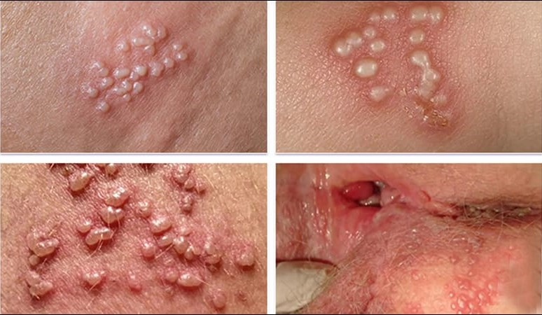

Herpes sinh dục do virus Herpes simplex (HSV) type 2 (hiếm hơn kèm HSV type 1) có ái lực mạnh với niêm mạc và da vùng sinh dục – hậu môn. Sau khi xâm nhập qua các vi tổn thương trên da niêm, HSV di chuyển dọc sợi thần kinh đến hạch bạch huyết vùng chậu (thường là hạch cùng – S2 – S4) và tồn tại ở dạng tiềm ẩn (latent) trong các tế bào thần kinh. Khi có điều kiện thuận lợi (stress, suy giảm miễn dịch, rối loạn kinh nguyệt...), virus tái hoạt và di chuyển ngược lên niêm mạc, gây tái phát tổn thương.

## Chẩn đoán

- Thời gian ủ bệnh trung bình 3–7 ngày (dao động từ 2–12 ngày) kể từ khi tiếp xúc với nguồn lây.

- Chẩn đoán Herpes sinh dục chủ yếu dựa vào lâm sàng, trong khi xét nghiệm cận lâm sàng thường ít được chỉ định trừ khi cần phân biệt với các bệnh lý khác hoặc trong trường hợp điều trị thất bại cần hội chẩn chuyên khoa.

### Lâm sàng

1. **Triệu chứng toàn thân (thường gặp ở lần nhiễm đầu tiên)**

   - Sốt nhẹ đến sốt vừa (37.5–38.5 °C), mệt mỏi, đau cơ, nhức đầu...
   - Trong 1–2 ngày trước khi xuất hiện tổn thương, bệnh nhân có thể cảm giác ngứa, tê, bỏng rát tại vùng dự định phát ban (gia đoạn tiền triệu).

2. **Tổn thương tại chỗ**

   - Vị trí: Vùng mu, môi lớn – môi bé, âm đạo, cổ tử cung (phụ nữ), bao quy đầu – thân dương vật, bìu (nam), quanh hậu môn (cả hai giới).
   - Giai đoạn khởi phát (lần đầu):

     - Ban đầu là các đám mụn nước nhỏ (hạt kê) mọc thành cụm, nổi cao trên nền da niêm đỏ.
     - Sau 1–2 ngày, mụn nước vỡ, tạo thành các vết loét nông, rìa vết loét không đều, đáy ướt, rỉ dịch, đau dữ dội, kèm cảm giác bỏng rát.
     - Vết loét thường kéo dài 2–3 tuần mới tái tạo da hoàn toàn.

   - Khí hư (ở phụ nữ):

     - Thường xuất hiện dịch tiết âm đạo đục, đôi khi lẫn máu hoặc mủ nếu có bội nhiễm.

   

   _Herpes sinh dục: mụn nước, vết loét ở vùng môi bé và âm đạo._

3. **Hạch bẹn**

   - Xuất hiện hạch bẹn lớn, thường 1 hoặc 2 bên, hạch mềm, di động, đau khi sờ.
   - Trong lần nhiễm đầu tiên, hạch bẹn thường to và đau nhiều hơn so với các đợt tái phát.

4. **Tái phát**

   - Thường ít triệu chứng toàn thân hoặc không có, chủ yếu chỉ là giai đoạn tiền triệu (ngứa, tê rát nhẹ) rồi xuất hiện mụn nước đơn lẻ hoặc thành cụm nhỏ, vỡ nhanh, lành vết loét trong vòng 5–10 ngày.
   - Tần suất tái phát phụ thuộc vào thể trạng và yếu tố thuận lợi (stress tinh thần, cảm cúm, suy giảm miễn dịch, kinh nguyệt).
   - Triệu chứng thường nhẹ hơn đợt đầu, ít đau rát, khả năng tự khỏi nhanh hơn, ít để lại sẹo.

### Cận lâm sàng

- **Nuôi cấy virus (Culture)**:

  - Lấy mẫu dịch hoặc mảnh tổn thương đáy vết loét, nuôi cấy trên tế bào cảm thụ (Vero, HELA...). Tỷ lệ nhạy cao nhất trong 48–72 giờ kể từ khi xuất hiện mụn nước.
  - Kết quả dương tính xác định chẩn đoán, nhưng tốn thời gian và chi phí.

- **Phết tổn thương tìm thể vùi (Tzanck smear)**:

  - Lấy dịch trong mụn nước hoặc lớp dịch tiết ở đáy vết loét, nhuộm Giemsa hoặc Wright.
  - Quan sát tế bào khổng lồ đa nhân, có thể vùi (multinucleated giant cells).
  - Phương pháp nhanh, giá rẻ nhưng độ nhạy/đặc hiệu không cao, chỉ hỗ trợ chẩn đoán ban đầu.

- **Kỹ thuật kháng thể huỳnh quang trực tiếp (DFA – Direct Fluorescent Antibody)**:

  - Lấy mẫu tế bào đáy vết loét, nhuộm kháng thể gắn huỳnh quang đặc hiệu HSV-1/HSV-2.
  - Kết quả nhanh trong vài giờ, độ nhạy/đặc hiệu tương đối cao.

- **Xét nghiệm PCR**:

  - Phát hiện DNA HSV từ dịch tiết vết loét, hạch, hoặc huyết tương.
  - Có độ nhạy và đặc hiệu cao nhất, cho phép phân biệt rõ HSV-1 và HSV-2.
  - Chi phí cao, thường chỉ áp dụng khi cần chẩn đoán phân biệt hoặc theo dõi điều trị kháng virus.

- **Xét nghiệm huyết thanh (Serology)**:

  - Tìm kháng thể IgM/IgG đặc hiệu HSV.
  - IgM xuất hiện trong 2–3 tuần đầu sau nhiễm, IgG xuất hiện muộn hơn và tồn tại dài hạn.
  - Thang tăng kháng thể gấp ≥ 4 lần giữa mẫu huyết thanh giai đoạn cấp và hồi phục (2–3 tuần sau) mới coi là dương tính chắc chắn.

## Điều trị

Điều trị Herpes sinh dục bao gồm: dùng thuốc kháng virus toàn thân làm giảm triệu chứng, rút ngắn thời gian lành thương, giảm khả năng lây lan; kết hợp điều trị hỗ trợ tại chỗ, giảm đau và phòng bội nhiễm.

### Giai đoạn cấp

- **Acyclovir**:

  - 400 mg uống 3 lần/ngày x 7–10 ngày.
  - Hoặc 200 mg uống 5 lần/ngày x 7–10 ngày.

- **Famciclovir**:

  - 250 mg uống 3 lần/ngày x 7–10 ngày.

- **Valacyclovir**:

  - 1 g uống 2 lần/ngày x 7–10 ngày.

- Tất cả các chế phẩm trên cần bắt đầu càng sớm càng tốt, lý tưởng trong vòng 72 giờ kể từ khi xuất hiện ban đầu để đạt hiệu quả tối ưu.

### Giai đoạn tái phát

- **Acyclovir**:

  - 400 mg uống 3 lần/ngày x 5 ngày.
  - Hoặc 800 mg uống 2 lần/ngày x 5 ngày.
  - Hoặc 800 mg uống 3 lần/ngày x 2 ngày.

- **Famciclovir**:

  - 125 mg uống 2 lần/ngày x 5 ngày.
  - Hoặc 1000 mg uống 2 lần/ngày x 1 ngày (liệu trình nhanh).
  - Hoặc 500 mg uống 2 lần/ngày x 1 ngày.
  - Hoặc 500 mg uống liều duy nhất, sau đó 250 mg 2 lần/ngày x 2 ngày.

- **Valacyclovir**:

  - 500 mg uống 2 lần/ngày x 3 ngày.
  - Hoặc 1 g uống 1 lần/ngày x 5 ngày.

- Liều dùng và thời gian có thể điều chỉnh tùy theo mức độ nặng – nhẹ của đợt tái phát, chức năng thận người bệnh và khả năng tuân thủ điều trị.

### Hỗ trợ

- **Thuốc bôi kháng virus tại chỗ**:

  - Acyclovir kem 5% bôi vùng tổn thương 5 lần/ngày, kéo dài 4–5 ngày (hỗ trợ giảm triệu chứng nhưng không thay thế điều trị toàn thân).
  - Kem Penciclovir 1% tương tự (bôi 2 giờ/lần x 4 ngày).

- **Thuốc giảm đau, kháng viêm**:

  - Paracetamol hoặc NSAIDs (Ibuprofen, Naproxen) nếu đau nhiều, sốt.
  - Gel Lidocaine 2% bôi nhẹ để giảm đau rát trước khi đi tiểu hoặc tiếp xúc.

- **Vệ sinh tại chỗ**:

  - Rửa vùng sinh dục bằng nước muối ấm pha loãng hoặc dung dịch sát khuẩn nhẹ (ví dụ Chlorhexidine 0.05%) 2 – 3 lần/ngày, nhẹ nhàng để tránh kích ứng thêm.
  - Giữ khô thoáng, tránh mặc đồ bó sát, quần lót bằng sợi tổng hợp – ưu tiên cotton.
  - Không dùng quần lót chung hay cọ xát mạnh lên vết loét để hạn chế lây nhiễm và bội nhiễm.

- **Kháng sinh dự phòng hoặc điều trị bội nhiễm**:

  - Chỉ khi có bằng chứng bội nhiễm vi khuẩn (chảy mủ đục, mùi hôi, sốt cao, hạch bẹn sưng to, đau nhiều hơn) mới dùng kháng sinh kín phổ (Cephalosporin thế hệ 2–3, hay β-lactam kết hợp clavulanate) trong 5–7 ngày hoặc điều trị theo kháng sinh đồ.

### Dự phòng tái phát

- Ở người tái phát ≥ 6 lần/năm hoặc có yếu tố nguy cơ cao (suy giảm miễn dịch, HIV), cân nhắc điều trị ức chế long-term:

  - Acyclovir 400 mg uống 2 lần/ngày.
  - Valacyclovir 500 mg uống 1 lần/ngày.
  - Thời gian: 6–12 tháng, đánh giá lại mỗi 6 tháng để quyết định tiếp tục hay ngừng.

:::caution

- **Thuốc kháng virus hiện nay không thể loại bỏ hoàn toàn HSV trong cơ thể**, chỉ ức chế sự nhân lên của virus, giảm mức độ triệu chứng và rút ngắn thời gian lành thương.
- **Nguy cơ nhiễm HIV**: Người bị Herpes sinh dục có nguy cơ nhiễm HIV cao hơn do tổn thương niêm mạc tạo điều kiện cho HIV xâm nhập.
- **Nguy cơ lây cho bạn tình và thai nhi**:

  - Lây truyền chủ yếu qua tiếp xúc da với da niêm, ngay cả khi không có tổn thương rõ ràng (virus có thể tiết ra không triệu chứng).
  - Tư vấn về biện pháp quan hệ tình dục an toàn (sử dụng bao cao su đúng cách, nghĩ đến sử dụng màng chắn giảm nguy cơ lây).
  - Phụ nữ mang thai bị Herpes sinh dục cần được theo dõi kỹ, kiểm tra dấu hiệu hoạt động của HSV trước sinh.

- **Phụ nữ mang thai**:

  - Hạn chế dùng kháng virus trong 3 tháng đầu.
  - Từ tuần 36 thái kỳ, có thể dùng Valacyclovir 500 mg uống 2 lần/ngày để giảm nguy cơ tái phát tại thời điểm sinh.
  - Nếu có tổn thương hoạt động (tiếp tục có mụn nước, vết loét) khi chuyển dạ, chỉ định sinh mổ để tránh lây nhiễm cho trẻ.
  - Nếu không có tổn thương (đã lành > 4 tuần), có thể cân nhắc sinh đường âm đạo nhưng cần kiểm tra kỹ âm đạo – cổ tử cung trước khi chuyển dạ.

:::

### Theo dõi sau điều trị

- **Khám lại khi có thay đổi bất thường**:

  - Vết loét ngày càng lan rộng, đau không giảm, có dấu hiệu bội nhiễm (chảy mủ, mùi hôi).
  - Sốt cao kéo dài, hạch bẹn to, đau tăng.
  - Xuất hiện biến chứng (viêm não do HSV, viêm tuỷ sống hiếm gặp).

- **Khám phụ khoa/nội tiết định kỳ (nữ)**:

  - Đánh giá tình trạng nhiễm khuẩn phối hợp, HPV, tầm soát ung thư cổ tử cung theo khuyến cáo (Pap smear, HPV-DNA test).
  - Tư vấn sức khỏe sinh sản, tránh quan hệ khi đang có tổn thương.

- **Theo dõi chức năng thận (với thuốc ức chế dài ngày)**:

  - Định kỳ 3 – 6 tháng xét nghiệm creatinin huyết thanh, ước tính độ lọc cầu thận (eGFR) để điều chỉnh liều Acyclovir/Valacyclovir nếu cần.

## Nguồn tham khảo

- Bệnh viện Từ Dũ (2022) – _Phác đồ điều trị Sản Phụ khoa_
- Bộ Y tế (2021) – _Hướng dẫn chẩn đoán và điều trị một số bệnh nhiễm khuẩn lây truyền qua đường tình dục_
- Workowski KA, Bolan GA (2020) – _Sexually Transmitted Diseases Treatment Guidelines, Centers for Disease Control and Prevention (CDC)_
