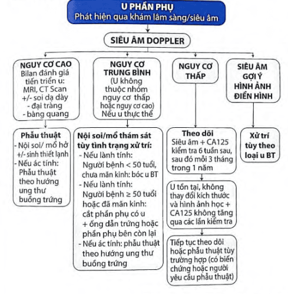

U phần phụ hay gặp là u nang (chiếm 90%) ở độ tuổi sinh sản.

## Chẩn đoán

### Lâm sàng

Tiền sử bản thân và gia đình: ung thư vú, ung thư đại tràng, ung thư nội mạc tử cung hay ung thư buồng trứng đang điều trị.

Bệnh sử:

- Tình trạng kinh nguyệt: thống kinh, rong kinh, rong huyết.
- Thời điểm phát hiện u buồng trứng.
- Các triệu chứng liên quan: bụng to, nặng bụng.
- Các triệu chứng chèn ép: rối loạn tiêu hóa, tiết niệu.

Thăm khám mô tả đặc tính khối u.

### Cận lâm sàng

Siêu âm Doppler chỉ định sau khi đã phát hiện u buồng trứng bằng siêu âm đen trắng. Siêu âm mô tả chẩn đoán và nguy cơ ác tính theo khuyến cáo cảu Hiệp hội Siêu âm Sản phụ khoa Thế giới (ISUOG).

MRI chỉ định khi đánh giá tổn thường xâm lấn vào các cơ quan lân cận.

CT Scan chỉ định khi nghi ngờ ung thư có di căn xa hoặc chống chỉ định với MRI.

Dấu ấn sinh học (tumor markers) như CA125, AFP, CEA, beta-hCG, HE4, AMH...

Thuật toán ước tính nguy cơ ác tính ung thư buồng trứng (ROMA value, RMI).

## Nguồn tham khảo

- PHÁC ĐỒ ĐIỀU TRỊ SẢN PHỤ KHOA 2022 - Bệnh viện Từ Dũ.
