U xơ cơ tử cung (leiomyoma) là khối u lành tính của cơ trơn và mô liên kết tử cung, phụ thuộc estrogen–progesterone để phát triển.

## Bệnh sinh

- **ER/PR dương tính**: Tế bào u xơ có thụ thể ER-α và PR; progesterone thúc đẩy phân bào và sinh ECM.
- **Growth factors**: EGF, IGF-1... tăng cao, kích thích tăng trưởng tế bào u.

## Yếu tố nguy cơ

- **Tuổi**: Tăng đến tiền mãn kinh, giảm sau mãn kinh.
- **Di truyền**: đột biến MED12, trisomy 12, đảo đoạn 12q, 6p...
- **Nội tiết/chuyển hóa**: Béo phì, kháng insulin, tăng lipid, tăng huyết áp.
- **Gia đình**: Mẹ/chị em gái có u xơ.

## Yếu tố bảo vệ

- Đa sinh.
- Vận động thể lực.
- Ăn cá, rau xanh, vitamin A động vật.

## Phân loại

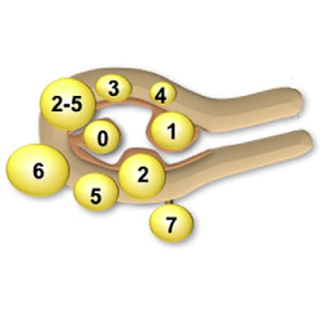

_Phân loại FIGO 2011._

| Category                                                          | Description                                                                                                                                                                                                         |
| ----------------------------------------------------------------- | ------------------------------------------------------------------------------------------------------------------------------------------------------------------------------------------------------------------- |
| **S (Submucosal)** Dưới niêm mạc                               | **0** Có cuống, hoàn toàn trong lòng tử cung **1** < 50% trong cơ **2** ≥ 50% trong cơ _(inferred)_                                                                                                           |
| **O (Other)** Khác                                             | **3** Tiếp xúc nội mạc, 100% trong cơ **4** Trong cơ **5** Dưới thanh mạc, ≥ 50% trong cơ **6** Dưới thanh mạc, < 50% trong cơ **7** Dưới thanh mạc, có cuống **8** Khác: Ghi rõ (vd: cổ tử cung...) |
| **H (Hybrid leiomyomas)** Tiếp xúc đồng thời thanh và niêm mạc | Thể hiện bằng 2 con số: - **Số thứ nhất**: Liên quan niêm mạc (dùng mã S) - **Số thứ hai**: Liên quan thanh mạc (dùng mã O) _Ví dụ: 2-5 = Dưới thanh mạc + dưới niêm mạc (cả hai ≥50% trong cơ)_           |

_Phân loại FIGO 2011._

## Chẩn đoán

### Lâm sàng

- **Cơ năng**: Cường/rong kinh, thống kinh, đau hạ vị, chèn ép bàng quang/niệu quản/trực tràng, thiếu máu
- **Thực thể**: Tử cung to, khối cứng, di động kém, sốt (thoái hóa)

### Cận lâm sàng

- **Siêu âm thang xám**: Khối giảm âm, giới hạn rõ, bóng giảm âm sau.

  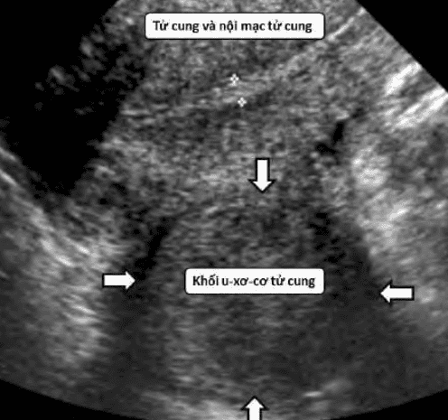

  _U xơ tử cung trên siêu âm._

  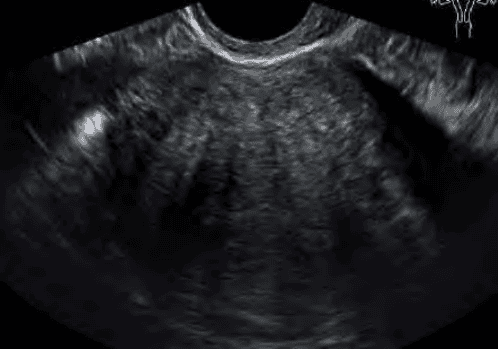

  _Adenomyosis trên siêu âm._

  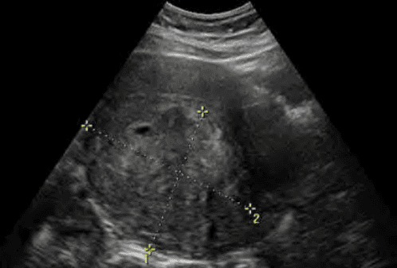

  _Leiomyosarcoma trên siêu âm._

- **Doppler**: Mạch ngoại vi u xơ; phân biệt với polyp (mạch trung tâm) và adenomyosis (mạch nội vi).

  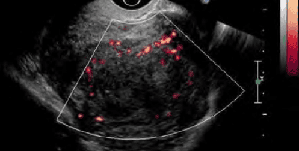

  _U xơ tử cung trên siêu âm Doppler._

  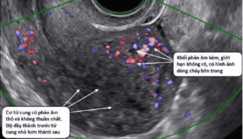

  _Adenomyosis trên siêu âm Doppler._

- **Siêu âm 4D/đàn hồi**: đánh giá JZ, độ cứng.

  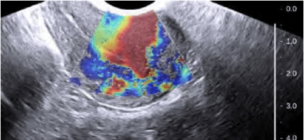

  _Adenomyosis trên siêu âm đàn hồi._

- **Siêu âm bơm nước**: Với u xơ dưới niêm mạc.

  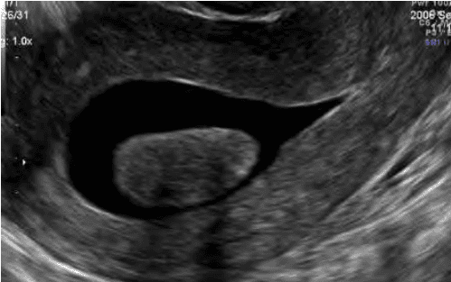

  _U xơ tử cung FIGO 0 trên SIS._

  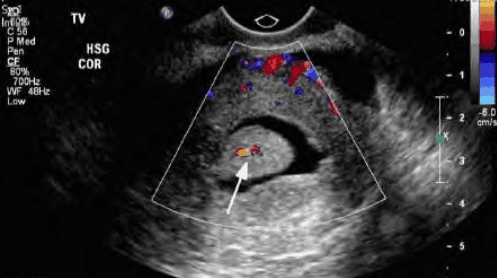

  _Phân biệt polyp và u xơ tử cung FIGO 1 bằng Doppler._

- **MRI**: Phân biệt adenomyosis (JZ dày > 40%, tín hiệu hỗn hợp) với u xơ (tín hiệu đồng nhất giảm trên T2W).

  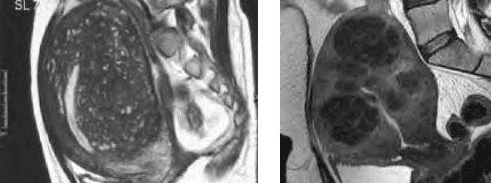

  _Hình ảnh MRI của adenomyosis và u xơ tử cung._

  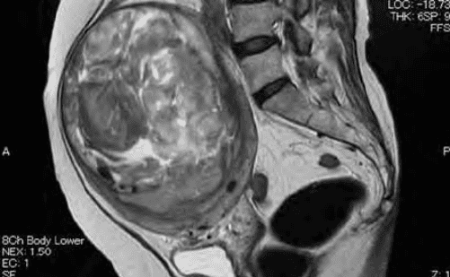

  _Leiomyosarcoma trên MRI._

### Chẩn đoán phân biệt

- Bệnh tuyến cơ tử cung (Adenomyosis).
- Tử cung to do có thai.
- Polyp nội mạc tử cung (u xơ dưới niêm mạc).
- Khối u buồng trứng (u xơ dưới thanh mạc có cuống).
- Leiomyosarcoma: Sarcoma tử cung được chẩn đoán xác định dựa trên giải phẫu bệnh...

## Biến chứng

- **Xuất huyết**: Cường/rong kinh (30% chỉ định can thiệp).
- **Chèn ép**: Bàng quang, niệu quản (thận ứ nước), trực tràng, TM chủ dưới.
- **Thoái hóa/u xoắn**: đau cấp, sốt, tăng bạch cầu.
- **Hiếm muộn**: Dưới niêm mạc, biến dạng lòng tử cung.
- **Thai kỳ**: Ngôi bất thường, rau tiền đạo, bong non, sinh non

## Điều trị

### Không can thiệp

**Theo dõi** triệu chứng và kích thước mỗi 6–12 tháng (sau mãn kinh 3–6 tháng) nếu không triệu chứng.

### Nội khoa

| Phương pháp                      | Mục tiêu                  | Ghi chú                                                               |
| -------------------------------- | ------------------------- | --------------------------------------------------------------------- |
| **Tranexamic acid**              | Giảm cường kinh           | 250–500 mg × 3 lần/ngày; chống chỉ định tràn khí màng phổi/thuyên tắc |
| **COC**                          | Giảm máu kinh             | Không ảnh hưởng khối u                                                |
| **Progestin (LNG-IUS, implant)** | Tạo teo nội mạc, giảm máu | LNG-IUS không giảm thể tích u                                         |
| **GnRHa**                        | Giảm > 50% thể tích u     | Chuẩn bị trước mổ 1–3 tháng; Hạn chế <6 tháng, có flare-up            |
| **GnRHa add-back (E/P)**         | Hạn chế tác dụng phụ      | Chưa chứng minh giảm khối u thêm                                      |
| **GnRH anta**                    | Giảm estrogen nhanh       | Tránh flare-up; hiệu quả tương đương GnRHa                            |
| **Aromatase inhibitors**         | ức chế tổng hợp estrogen  | Letrozole 12 tuần; ít tác dụng phụ hơn GnRHa                          |
| **SPRMs (Ulipristal acetate)**   | Giảm chảy máu, thu nhỏ u  | 5 mg/ngày, 3 tháng; gián đoạn 2 tháng ≤ 8 đợt; theo dõi chức năng gan |
| **Mifepristone**                 | Giảm thể tích u           | 2.5 mg/ngày, 3–6 tháng; không có đăng ký chính thức                   |

### Ngoại khoa

- **Bóc u xơ**

  - Nội soi buồng tử cung: Submucosal L0–L2 ≤ 5 cm.
  - Nội soi ổ bụng: Subserosal/intramural ≤ 10 cm.
  - Mổ mở: U lớn, lan tỏa, đa nhân.

- **Cắt tử cung**

  - Nghi ngờ ác tính, u đa nhân khó bóc, đủ con hoặc mong muốn bỏ tử cung.
  - Đường nội soi, âm đạo hoặc mở tùy tổn thương & BN.

- **Xâm lấn tối thiểu**

  - UAE, HIFU, RFA.

## Nguồn tham khảo

- Trường ĐH Y Dược TP. HCM (2020) – _Team-based learning_
- Bệnh viện Từ Dũ (2022) – _Phác đồ điều trị Sản Phụ khoa_
