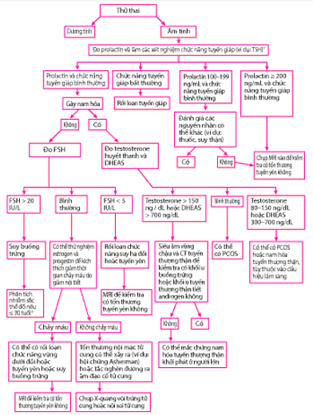

**Vô kinh** là tình trạng vắng mặt hoặc ngừng kinh nguyệt bất thường.

**Vô kinh nguyên phát** chưa có kinh nguyệt ở những trường hợp sau:

- Chưa có kinh nguyệt ở tuổi 15 trong khi đã phát triển giới tính thứ cấp bình thường.
- Chưa có kinh nguyệt trong vòng 5 năm sau khi phát triển vú nếu tuyến vú phát triển trước 10 tuổi.
- Không phát triển vú ở tuổi 13.

**Vô kinh thứ phát:** Không có kinh nguyệt ≥ 3 tháng ở người có kinh nguyệt đều, hoặc ≥ 6 tháng ở người có kinh nguyệt không đều.

## Bệnh sinh

Khi trục hạ đồi-yên-buồng trứng gặp trục trặc, sự rối loạn chức năng rụng trứng sẽ dẫn đến:

- Chu kỳ sản sinh estrogen do gonadotropin kích thích bị gián đoạn.
- Nội mạc tử cung không phát triển theo chu kỳ.
- Không có phóng noãn → không có kinh nguyệt.

**Rối loạn chức năng phóng noãn** là nguyên nhân phổ biến nhất, đặc biệt ở vô kinh thứ phát. Ngoài ra, vô kinh vẫn xảy ra khi phóng noãn bình thường nhưng có bất thường về cấu trúc đường sinh dục (tắc nghẽn bởi dị tật bẩm sinh, hội chứng Asherman...).

## Nguyên nhân

Mặc dù có nhiều nguyên nhân khác nhau, nhưng hầu hết các trường hợp vô kinh là do 6 tình trạng chính:

- Hội chứng buồng trứng đa nang (PCOS).
- Tăng prolactin máu (hyperprolactinemia).
- Rối loạn chức năng tuyến giáp (thyroid dysfunction).
- Suy tuyến sinh dục do vùng dưới đồi/tuyến yên (hypogonadotropic hypogonadism).
- Suy tuyến sinh dục do buồng trứng (hypergonadotropic hypogonadism).
- Bất thường giải phẫu (anatomic abnormalities).

### Rối loạn chức năng rụng trứng

**Thường gặp nhất ở vô kinh thứ phát**, có thể là nguyên phát nếu rụng trứng chưa từng khởi phát (dậy thì muộn, bất thường giới tính, hội chứng nhiễm sắc thể Y...). Nguyên nhân chính liên quan đến trục hạ đồi-yên-buồng trứng.

_Bảng "Nguyên nhân vô kinh do rối loạn chức năng rụng trứng"_.

| Nguyên nhân vô kinh do rối loạn chức năng rụng trứng | Ví dụ điển hình                                                                                                                                                                                                                                                       |
| ---------------------------------------------------- | --------------------------------------------------------------------------------------------------------------------------------------------------------------------------------------------------------------------------------------------------------------------- |
| **Rối loạn vùng dưới đồi**                           | - Giảm sản sinh GnRH: Do thiếu hụt năng lượng (ăn kiêng quá mức, tập luyện nặng), stress, bệnh mạn tính. - Rối loạn di truyền: Thiếu hụt GnRH bẩm sinh, hội chứng Prader-Willi. - Xâm lấn hoặc tổn thương (u, nhiễm lao, lymphoma, chấn thương sọ não, xạ trị). |
| **Rối loạn tuyến yên**                               | - U tuyến yên hoặc mô ngoại lai (adenoma, meningioma, tăng prolactin...). - Hoại tử sau sinh (Sheehan), chấn thương, sarcoidosis, lao. - Thiếu hụt gonadotropin đơn độc, hội chứng Kallmann.                                                                    |
| **Suy buồng trứng nguyên phát**                      | - Tự miễn (viêm buồng trứng tự miễn). - Di truyền (Hội chứng Turner, bất sản nang noãn). - Hóa trị, xạ trị vùng chậu. - U buồng trứng (theca, Brenner, u quái...).                                                                                           |
| **Rối loạn nội tiết khác**                           | - Hội chứng buồng trứng đa nang (PCOS). - Cushing, suy giáp, cường giáp. - Thiếu nhạy cảm androgen/estrogen. - Nam hóa (androgen, progestin liều cao, steroid đồng hóa). - Béo phì, khối u sản sinh androgen/estrogen.                                    |

### Bất thường giải phẫu đường sinh dục

**Dòng chảy kinh nguyệt bị tắc nghẽn dù nội tiết bình thường.** Hậu quả bế kinh (âm đạo/phúc mạc phồng), tích huyết tử cung (tử cung to, có thể nhầm khối vùng chậu).

_Bảng "Nguyên nhân vô kinh do bất thường sinh dục"_.

| Nguyên nhân vô kinh do bất thường đường sinh dục | Ví dụ                                                                   |
| ------------------------------------------------ | ----------------------------------------------------------------------- |
| **Bẩm sinh**                                     | Màng trinh bất thường, vách ngăn âm đạo, bất sản âm đạo/tử cung.        |
| **Mắc phải**                                     | Hội chứng Asherman, hẹp cổ tử cung, polyp, u xơ tắc nghẽn, lao nội mạc. |

## Chẩn đoán

_Hình ảnh "Đánh giá vô kinh nguyên phát"_.

_Hình ảnh "Đánh giá vô kinh thứ phát"_.

### Lâm sàng

#### Tiền sử

- Tiền sử phẫu thuật, can thiệp nội mạc, đặt dụng cụ tử cung.
- Tiền sử dùng thuốc (dopaminergic, hormon, hóa trị, steroids, androgen...).

#### Bệnh sử

**Nguyên phát** chưa có kinh + ≥ 1 tiêu chí:

- 13 tuổi không dấu hiệu dậy thì.
- 3 năm sau xuất hiện nhú vú.
- 15 tuổi chưa kinh dù phát triển giới tính bình thường.

**Thứ phát** từng có kinh + ≥ 1 tiêu chí:

- Mất ≥ 3 tháng (chu kỳ trước đều) hoặc ≥ 6 tháng (không đều).
- < 9 kỳ/năm hoặc chu kỳ > 38 ngày.
- Thay đổi liên tục về tần suất, khối lượng, thời gian.

**Các thông tin khác:**

- Ngày đầu kỳ kinh cuối, độ dài và độ đều chu kỳ, lượng và mô tả kinh nguyệt.
- Triệu chứng kèm: Đau bụng, đau vú, thay đổi tâm trạng.
- Thói quen ăn uống, tập luyện, stress, cân nặng, tiền sử rối loạn ăn uống.

#### Thực thể

- **Đánh giá dấu hiệu dậy thì:** Giai đoạn Tanner.
- **Khám tuyến vú:** Tiết sữa.
- **Khám vùng chậu:** Âm hộ, âm đạo, cổ tử cung, tử cung, buồng trứng.
- **Dấu hiệu nội tiết:** Nam hóa, rậm lông, sắc tố da (acanthosis nigricans), triệu chứng suy giáp/cường giáp.
- Sinh hiệu, BMI, dấu hiệu cảm ứng stress hay biếng ăn.

### Cận lâm sàng

#### Xét nghiệm cơ bản

- Thử thai β-hCG.
- FSH, LH, estradiol.
- Prolactin, TSH, T₄.
- Testosterone, DHEAS.
- Karyotype (nếu nghi ngờ bất thường di truyền).

#### Chẩn đoán hình ảnh

- **Siêu âm** vùng chậu (thăm dò tắc nghẽn, cấu trúc).
- **MRI** não nếu nghi ngờ tổn thương hạ đồi/tuyến yên.

#### Thử nghiệm nội tiết động

- **Thử thách progestin** (medroxyprogesterone 5-10 mg x 7-10 ngày).
- **Thử thách estrogen/progestin** (estrogen 21 ngày + progestin 7-10 ngày).
- **Thử nghiệm clomiphene hoặc gonadotropin stimulation.**

## Điều trị

Điều trị tùy **theo nguyên nhân** và **mong muốn sinh đẻ:**

- **Gây rụng trứng:** Clomiphene citrate, letrozole, gonadotropin.
- **Thay thế hormon:** Vòng kinh nhân tạo (estriol 1 mg x 14 ngày → kết hợp estrogen/progestin 12 ngày; Dừng 2 ngày để xuất huyết); Điều trị kéo dài để phòng loãng xương, khô âm đạo.
- **Giảm thừa androgen:** Spironolactone, thuốc ức chế androgen, biện pháp tẩy lông.
- **Phẫu thuật hoặc can thiệp giải phẫu:** Nong/khâu mở cổ tử cung, tách dính trong Asherman; Điều trị u vùng hạ đồi/tuyến yên.

## Tài liệu tham khảo

- Dieutri - [_Bài giảng vô kinh không hành kinh_](https://www.dieutri.vn/bgsanphukhoa/bai-giang-vo-kinh-khong-hanh-kinh)
- MSD Manual - [_Amenorrhea_](https://www.msdmanuals.com/professional/gynecology-and-obstetrics/menstrual-abnormalities/amenorrhea)
- ASRM 2024 - _Đánh giá vô kinh_
