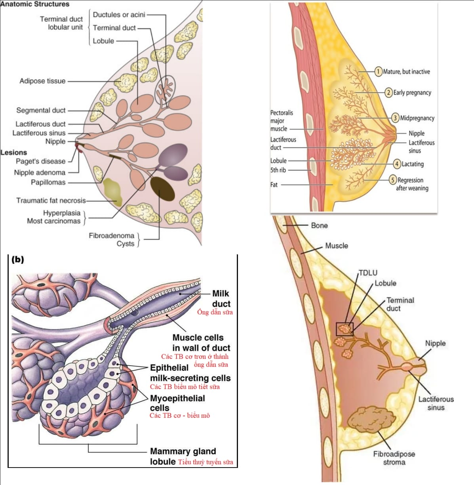
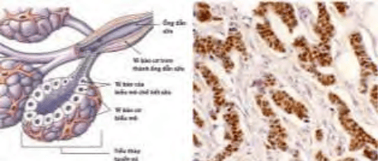

**Tuyến vú (mammary gland)** là một cơ quan da phụ có chức năng sinh sản quan trọng, chịu trách nhiệm sản xuất và bài xuất sữa.

Vú được cấu tạo chính bởi hai thành phần: Mô tuyến (epithelial tissue) và mô mỡ - liên kết (adipose-connective tissue). Tỷ lệ giữa hai thành phần này thay đổi tùy theo lứa tuổi, giai đoạn nội tiết (kinh nguyệt, thai kỳ) và trạng thái cho con bú.

## Giải phẫu

_Hình ảnh "Giải phẫu mặt cắt ngang tuyến vú và mối tương quan với cơ ngực"_.

**Vị trí:** Tuyến vú nằm trên thành ngực, phủ lên các cơ ngực lớn (pectoralis major) và cơ ngực bé (pectoralis minor). Vú được cố định vào thành ngực bởi hệ thống cân mạc sâu (Cooper’s ligaments) và các dây chằng lỏng lẻo (suspensory ligaments) nối từ da xuống cân cơ ngực.

**Hình thái:**

- Hình dạng: Hình bán cầu với đáy rộng tiếp xúc thành ngực, chóp bán cầu là núm vú (nipple) và quầng vú (areola). Núm vú là nơi đổ ra của hệ thống ống dẫn sữa, còn quầng vú là vùng da thâm xung quanh, chứa các tuyến Montgomery (tuyến bã nhờn) giúp bôi trơn khi cho con bú.
- **Núm vú (Nipple):** Vùng nhô cao, màu hồng nâu - đậm hơn so với da xung quanh, có nhiều lỗ nhỏ (lỗ ống dẫn sữa).
- **Quầng vú (Areola):** Đường kính khoảng 2-4 cm, chứa các hạch Montgomery sản xuất bã và chất nhầy giữ ẩm, ngăn vi khuẩn.
- **Bầu vú (Breast mound):** Gồm mô tuyến trải rộng từ bờ ngoài xương ức (sternum) đến đường giữa nách (axilla), và từ sụn sườn 2 đến sụn sườn 6-7 về phía dưới.

**Mạch máu và bạch huyết:**

- **Động mạch chính:** Động mạch ngực ngoài (lateral thoracic artery) (nhánh của động mạch nách) cung cấp cho phần ngoài - dưới vú; Động mạch ngực trong (internal thoracic artery) (nhánh của động mạch dưới đòn) cấp máu cho phần trong - giữa vú qua các nhánh perforating; Động mạch gian sườn bên (lateral intercostal arteries) và động mạch gian sườn trước (anterior intercostal arteries) hỗ trợ nhánh phụ.
- **Tĩnh mạch:** Thông qua hệ tĩnh mạch tương tự, đổ về tĩnh mạch nách, tĩnh mạch dưới đòn và tĩnh mạch ngực trong.
- **Hệ bạch huyết** vú chia làm hai đường chính: **Đường nách (Axillary pathway)** khoảng 75% bạch cầu vú đổ về hạch nách (axillary lymph nodes), bao gồm nhóm hạch cửa sổ (pectoral/central) và hạch vùng giữa (mid-axillary), hạch dưới đòn. Đây là con đường chính khi khảo sát di căn hạch trong ung thư vú; **Đường cạnh ức - hạ đòn (Parasternal & Supraclavicular pathway)** khoảng 20% bạch huyết chảy qua hạch cạnh ức (parasternal/internal mammary nodes) rồi lên hạch thượng đòn (supraclavicular nodes). Việc đánh giá hạch nách và hạch thượng đòn rất quan trọng trong tầm soát và định giai đoạn ung thư vú, cũng như hướng dẫn bệnh nhân tự khám vú.

**Mô liên kết:**

- Chiếm khoảng 50-80% thể tích vú ở phụ nữ trưởng thành, đặc biệt ở người không cho con bú.
- Mô mỡ nằm xen kẽ giữa các tiểu thùy và bọc quanh hệ thống ống tuyến, đóng vai trò bảo vệ, tạo hình và cung cấp năng lượng.

## Mô học

**Tiểu thùy (Lobe) và tiểu tiểu thùy (Lobule):**

- Mỗi bên vú gồm 10-20 tiểu thùy (lobe), tách biệt nhau bởi mô liên kết và mô mỡ.
- Một tiểu thùy chia thành nhiều tiểu tiểu thùy (lobule) - tức là các đơn vị tận cùng chức năng (terminal duct lobular unit, TDLU). TDLU gồm: **Ống tuyến tận (Terminal duct):** Ống nhỏ nhất, nối tiếp vào nang sữa (acinus). **Nang sữa (Acinus):** Đơn vị sản xuất sữa, có cấu tạo tổ chức biểu mô đơn lớp (cuboidal/trụ) lót bên trong, bên ngoài là lớp tế bào cơ biểu mô (myoepithelial cells).

**Hệ thống ống dẫn sữa (Latiferous duct):**

- **Ống dẫn sữa lớn (Lactiferous ducts):** Mỗi tiểu thùy xuất phát từ một ống lớn có khẩu kính khoảng 0.5 mm, dẫn sữa từ TDLU về phía núm vú.
- **Xoang sữa (Lactiferous sinuses):** Ở gần núm vú, đường kính ống giãn rộng thành xoang, đóng vai trò như túi chứa tạm thời sữa trước khi bài xuất.
- **Niêm mạc ống:** Lớp trong cùng: Biểu mô trụ thấp (simple cuboidal/columnar epithelium) - chịu trách nhiệm hình thành và bài tiết sữa. Lớp ngoài: Tế bào cơ biểu mô (myoepithelial cells) - co bóp để đẩy sữa ra ngoài khi cho con bú.

**Biểu mô tuyến vú:**

- **Biểu mô lót ống và nang:** Các tế bào có thụ thể estrogen (ER) và progesterone (PR), nhạy cảm với thay đổi nội tiết theo chu kỳ và thai kỳ.
- **Màng đáy (Basement membrane):** Nằm dưới lớp biểu mô, tiếp xúc với tế bào cơ biểu mô, tạo khung đỡ và kiểm soát sự phân tách mô.
- **Mô liên kết quanh ống và nang:** Chứa mạch máu, fibroblast và một tỷ lệ lớn nguyên bào sợi - tế bào miễn dịch, giúp bảo vệ và tái tạo.

**Thành phần mô mỡ và liên kết:**

- Mô mỡ xung quanh các ống và nang tạo độ đàn hồi, đặc biệt thay đổi theo hormone và cân nặng cơ thể.
- Các dải mô liên kết (Cooper’s ligaments) kéo dài từ da xuống tới fascia cơ ngực, giữ cho bầu vú không bị sa trễ khi đứng và vận động.

## Liên quan

**Ưu thế xuất phát từ biểu mô:** Hầu hết các khối u vú xuất phát từ biểu mô ống (ductal carcinoma) hơn là biểu mô nang (lobular carcinoma) do diện tích biểu mô ống lớn hơn.

**Thụ thể hormone (ER/PR):**

- Các tế bào biểu mô vú bình thường và ác tính đều có thể biểu lộ thụ thể estrogen (ER) và progesterone (PR).
- Tương tác ER/PR với estrogen và progesterone góp phần điều hòa phát triển ống, nang và bài xuất sữa.
- Trong ung thư vú, đánh giá ER/PR là bắt buộc để xác định hướng điều trị (hormon therapy) và tiên lượng: **ER/PR dương tính:** Khối u thường đáp ứng thuốc ức chế hormon (tamoxifen, aromatase inhibitors), tiến triển chậm hơn. **ER/PR âm tính:** Khối u không đáp ứng liệu pháp hormon, khả năng xâm lấn và di căn cao hơn.

_Bảng "Phân biệt thụ thể estrogen và progesterone"_.

| Thụ thể Estrogen (ER)                             | Thụ thể Progesterone (PR)                                     |
| ------------------------------------------------- | ------------------------------------------------------------- |
| - Kích thích tăng sinh ống tuyến vú.              | - Hỗ trợ phát triển các tiểu thùy (lobule).                   |
| - Thúc đẩy tăng sinh tế bào mỡ xen kẽ mô tuyến.   | - Kích thích phân chia và biệt hóa tế bào nang sữa (acinus).  |
| - Quyết định tính nhạy cảm với liệu pháp hormone. | - Tham gia quá trình bài xuất sữa trong giai đoạn cho con bú. |

_Hình ảnh "(Trái) Nang sữa (acinus) gồm lớp tế bào cơ biểu mô (myoepithelial) bên ngoài và tế bào biểu mô trụ thấp/trụ lót bên trong, dựa trên màng đáy. (Phải) Mô hình hóa mô miễn dịch (immunohistochemistry) cho thấy sự biểu hiện của thụ thể estrogen (màu nâu) trên tế bào biểu mô ống tuyến"_.

## Tài liệu tham khảo

- Trường Đại học Y Dược TP. HCM (2020) - _Team-based learning: Giải phẫu và mô học tuyến vú_
- Gray H (2019) - _Gray’s Anatomy for Students: Breast Anatomy_
- Kurman RJ, Ellenson LH, Ronnett BM (2019) - _Blaustein’s Pathology of the Female Genital Tract_
