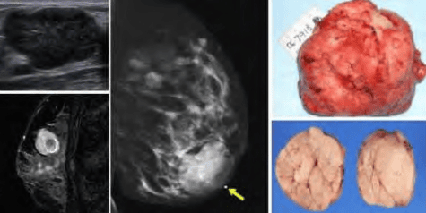
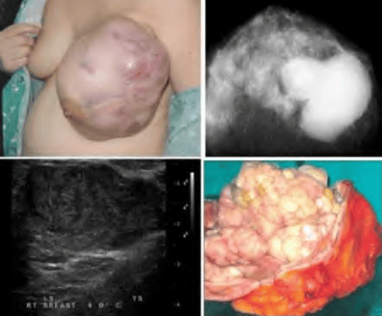
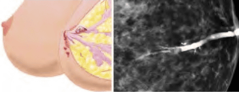
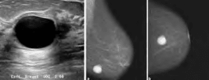
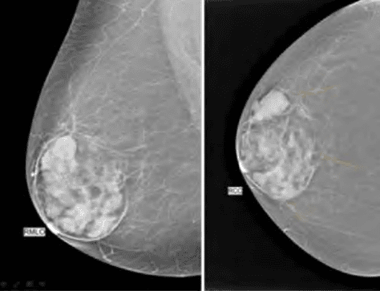
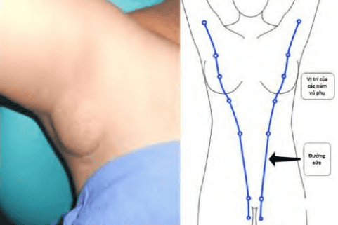

Bệnh lý lành tính tuyến vú rất đa dạng, thường ít nguy hiểm nhưng có thể gây lo lắng cho người bệnh do sờ thấy khối hoặc có triệu chứng tiết dịch.

## Phân loại

Các bệnh lý này được phân loại theo:

1. **Đặc điểm lâm sàng**: Dựa vào triệu chứng, dấu hiệu khi thăm khám, chẩn đoán hình ảnh (hình thành khối, tiết dịch, đau, thay đổi da).
2. **Mô học**: Dựa vào kết quả sinh thiết, phân loại tổn thương tế bào và mô đệm.

### Theo lâm sàng

_Bảng "Phân loại bệnh lý tuyến vú theo đặc điểm lâm sàng"._
| Loại tổn thương                                             | Các dạng cụ thể                                                                                                                                                                                                                                                                  |
| ----------------------------------------------------------- | -------------------------------------------------------------------------------------------------------------------------------------------------------------------------------------------------------------------------------------------------------------------------------- |
| **Đau vú**                                                  | Đau vú                                                                                                                                                                                                                                                                           |
| **Các mảng và khối u** (Tumors and masses)                  | - Khối u hoặc nốt sần (Nodularity and glandular) - Nang - Nang bọc sữa (Galactoceles) - Bướu sợi tuyến - Xơ nang tuyến vú (Sclerosing adenosis) - Bướu mỡ - Hamartoma - Bệnh lý tuyến vú do tiểu đường - Bướu diệp thể (Cystosarcoma phylloides)         |
| **Tiết dịch núm vú**                                        | Tiết dịch núm vú                                                                                                                                                                                                                                                                 |
| **Nhiễm trùng vú và viêm vú**                               | - Viêm vú nội sinh (Intrinsic mastitis) - Căng sữa sau sinh - Viêm vú khi cho bú - Áp xe vú khi cho bú - Áp xe dưới quầng vú tái phát mạn tính - Viêm vú cấp tính liên quan đến các nang vú - Nhiễm trùng vú ngoại sinh (Extrinsic infection) - Bệnh Mondor |
| **Những tổn thương có nguy cơ phát triển thành ung thư vú** | - Tăng sinh trong ống dẫn sữa (Ductal hyperplasia) - Bệnh lý xơ nang tuyến vú (Sclerosing adenosis) - Bướu sợi tuyến phức tạp (Complex fibroadenomas) - Tăng sản không điển hình (Atypical hyperplasia) - Sẹo hình sao (Radial scar)                                 |

### Theo mô học

_Bảng "Phân loại bệnh lý tuyến vú theo mô học"._
| Loại tổn thương                                                           | Các dạng cụ thể                                                                                                                                                                                      |
| ------------------------------------------------------------------------- | ---------------------------------------------------------------------------------------------------------------------------------------------------------------------------------------------------- |
| **Tổn thương không tăng sinh**                                            | - Nang đơn giản - Nang phức tạp                                                                                                                                                                   |
| **Tổn thương tăng sinh không có tế bào không điển hình (without atypia)** | - Tăng sinh ống tuyến vú (Ductal hyperplasia) - Bướu sợi tuyến - U nhú trong ống tuyến (Intraductal adenoma) - Bệnh xơ nang tuyến vú (Sclerosing adenoma) - Sẹo hình sao (Radical scars) |
| **Tăng sinh không điển hình**                                             | - Tăng sinh ống tuyến không điển hình (Ductal) - Tăng sinh tiểu thùy không điển hình (Lobular)                                                                                                    |

## Bướu sợi tuyến

Bướu sợi-tuyến (Fibroadenoma) là khối u lành tính phát triển từ cả biểu mô ống và mô đệm của đơn vị tận cùng (terminal duct lobular unit – TDLU). Nếu xét về mô học, bướu sợi-tuyến là kết quả tăng sinh đồng thời cả hai thành phần: Biểu mô và mô đệm, tạo thành một khối chắc, di động.

### Chẩn đoán

#### Lâm sàng

- Thường gặp nhất ở phụ nữ 20–30 tuổi.
- Thường đơn độc; khi có nhiều khối, cần phân biệt với đa nang sợi, bệnh di truyền...
- Người bệnh sờ thấy khối vú không đau, di động, mật độ chắc, có thể kích thước từ 1–5 cm (nhỏ hơn 2 cm là phổ biến).
- Vị trí: Thường ở 1/4 trên ngoài vú, ít khi ở giữa hoặc vú đối diện.
- Biến đổi kích thước nhẹ theo chu kỳ kinh nguyệt, có thể tự teo dần sau mãn kinh.

#### Cận lâm sàng

_Hình ảnh "(Trái, trên) Siêu âm bướu sợi-tuyến: Khối giảm âm, bờ đa cung, đồng nhất. (Trái, dưới) MRI bướu sợi-tuyến: giới hạn rõ, đồng nhất, có vùng thoái hóa. (Giữa) Nhũ ảnh MLO: khối có lớp mỡ mỏng bao quanh. (Phải) Hình ảnh đại thể bướu sợi-tuyến: vỏ bao rõ, mặt cắt phồng đồng nhất"._

- **Siêu âm**:
  - Khối giảm âm đồng nhất, bờ rõ, đôi khi có múi, thành trước dày, tăng âm phía sau (posterior acoustic enhancement).
  - Hình dạng: Hình tròn hoặc bầu dục, chiều dài lớn hơn chiều ngang (orientation "parallel" với da).
- **Nhũ ảnh**:
  - Khối hình tròn/bầu dục, bờ sắc nét, có thùy nhẹ, không xâm lấn mô xung quanh.
  - Thường bao quanh bởi vầng sáng mỏng (halo) do mô mỡ – đặc trưng cho khối lành tính.
  - Đôi khi thấy vùng thấu quang bên trong do thoái hóa mỡ.

#### Chẩn đoán phân biệt

- **Ung thư vú**: Ung thư thường có đóng vôi vi thể (microcalcifications) tập trung ở trung tâm khối, bờ không đều, xâm lấn mô xung quanh.
- **Nang vú**: Nang thường có phản âm trống (anechoic) trên siêu âm, bờ mỏng, bóng lưng rõ.
- **FNA**: Chọc hút tế bào bằng kim nhỏ có thể giúp phân biệt khối đặc (bướu sợi-tuyến) và nang, nhưng không đáp ứng mô học.
- **Core biopsy**: Cần thiết khi khối > 2 cm, có hình ảnh không điển hình hoặc nghi ngờ: giúp xác định chắc chắn mô học.

### Điều trị

- Nếu khối nhỏ (< 2 cm), không triệu chứng, có thể theo dõi định kỳ 6–12 tháng bằng siêu âm và khám vú.
- Khối lớn (> 2 cm) hoặc có triệu chứng (đau, lo ngại thẩm mỹ), hoặc chẩn đoán hình ảnh nghi ngờ, phẫu thuật lấy khối để chẩn đoán giải phẫu bệnh.
- Hiếm khi tái phát nếu mổ lấy trọn vẹn vỏ bao.

## Bướu diệp thể

Bướu diệp thể (Phyllodes tumor) là khối u phát triển nhanh, xuất phát từ mô đệm của tuyến vú. Bướu được chia theo mô học làm ba loại: Lành (benign, 60%), giáp biên (borderline, 20%) và ác tính (malignant, 20%).

### Chẩn đoán

#### Lâm sàng

- Thường gặp ở phụ nữ > 40 tuổi (trong khi fibroadenoma phổ biến hơn ở 20–30 tuổi).
- Kích thước khối thường lớn, phát triển nhanh trong vài tuần đến vài tháng.
- Khối to, chắc, di động, thường không đau.
- Da vùng khối căng, mỏng, có thể giãn tĩnh mạch hoặc loét do khối chèn ép.
- Núm vú hiếm khi bị xâm lấn, nếu có, là dấu hiệu nghi ngờ ác tính.
- Hạch nách sờ thấy trong 20% trường hợp (thường là phản ứng viêm, hiếm di căn).

#### Cận lâm sàng

_Hình ảnh "Bướu diệp thể: Khối lớn, rõ, có các vùng hóa nang và thùy. Nhũ ảnh cho thấy vôi hóa không đồng nhất, siêu âm thể hiện khe rãnh và hóa nang"._

- **Siêu âm**:
  - Khối giảm âm, bờ rõ, có thể có các vùng hóa nang (cystic spaces) phân bố rải rác.
  - Gợi ý phẫu thuật ngay nếu khối lớn, tăng sinh mạch máu bất thường.
- **Nhũ ảnh**: Khối lớn, giới hạn rõ, có thể bầu dục, hình tròn hoặc chia thùy, thỉnh thoảng thấy vôi hóa (ít phổ biến hơn fibroadenoma).
- **MRI**: Thần kinh hóa mô đệm rõ, khối đồng nhất hoặc có vùng thoái hóa, bắt thuốc mạnh – thường dùng trong khối nghi ngờ ác tính hoặc khối tái phát.

#### Chẩn đoán phân biệt

- **Fibroadenoma lớn, khối u xơ-nhân khác**: Khối không tăng nhanh hoặc không có vùng hóa nang rõ. FNA kém tin cậy do thành phần mô không đồng nhất.
- **Core biopsy**: Cần thiết để phân biệt giữa lành, giáp biên và ác, dựa vào độ xâm lấn mô đệm, biệt hóa tế bào, tỷ lệ tế bào nhân lên.

### Điều trị

- **Phẫu thuật cắt rộng**: Bướu benign cần mổ lấy rộng bờ ≥ 1 cm, bướu borderline/ ác tính cần cắt rộng càng nhiều càng tốt.
- **Tái phát**: Liên quan trực tiếp đến bờ phẫu thuật. Khoảng 20% bướu diệp thể tái phát khi bờ phẫu thuật không đủ rộng.
- **Mổ cắt đoạn hoặc cắt toàn bộ vú (mastectomy)**: Nếu khối quá lớn so với vú, không thể bảo tồn vú.
- **Xạ trị hậu phẫu**: đôi khi cân nhắc cho bướu borderline hoặc ác tính, nhất là khối tái phát hoặc bờ mổ dương tính.

## Bướu nhú trong ống dẫn sữa

Bướu nhú (Intraductal papilloma) là khối tăng sinh dạng nhú, xuất phát từ biểu mô ống tuyến, thường gây tiết dịch núm vú máu hoặc huyết thanh-máu.

### Chẩn đoán

#### Lâm sàng

- Chiếm 60–80% trường hợp tiết dịch núm vú dạng máu/huyết thanh-máu.
- Khối thường đơn độc, vị trí gần quầng vú (< 1 cm), có thể nhỏ, khó sờ thấy.
- Tiết dịch thường là dấu hiệu chính, lượng ít, lẫn máu hoặc huyết thanh.

#### Cận lâm sàng

_Hình ảnh "(Trái) Sơ đồ vị trí u nhú gây tiết dịch máu. (Phải) Chụp cản quang ống tuyến vú cho thấy hình ảnh u nhú trong ống"._

- **Siêu âm**:
  - Ba dạng hình ảnh: Trong ống tuyến (đường ống giãn có khối nội dịch), trong nang (khối trong khối nang), hoặc dạng đặc (khối ranh giới rõ).
  - Nếu khối quá nhỏ, chỉ thấy ống dẫn sữa giãn.
- **Nhũ ảnh**: Thường không thấy khối rõ ngoại trừ trường hợp kích thước lớn. Nếu có, khối nhỏ, bờ rõ, có thể có vôi hóa vi thể nhẹ.
- **Chụp cản quang ống tuyến (Ductogram/ Galactogram)**: Bơm thuốc cản quang vào ống dẫn sữa, quan sát hình ảnh lấp đầy ống bằng khối nhú.

### Điều trị

- **Bệnh nhú đa ổ, carcinoma dạng nhú (Papillary carcinoma)**: Phân biệt bằng sinh thiết lõi hoặc sinh thiết mở.
- **Chọc hút FNA**: ít giá trị, thường không phân biệt được với tổn thương sợi bọc hoặc carcinoma in situ.
- **Sinh thiết định vị dưới siêu âm (Wire Localization Biopsy)**: Giúp xác định chính xác vị trí tổn thương trong ống, phẫu thuật lấy trọn khối thám bệnh.
- **Sinh thiết mở**: Chỉ định khi khối nhú có triệu chứng tiết dịch máu, khối lớn, nghi ngờ dị sản hoặc carcinoma.

## Nang vú

Nang vú (Simple/Macrocystic cyst) là hình ảnh giãn dãn và thoái triển của tiểu thùy, chứa dịch bên trong.

### Chẩn đoán

#### Lâm sàng

- Có thể gặp ở bất kỳ lứa tuổi nào, phổ biến nhất ở phụ nữ 35–50 tuổi.
- Tỷ lệ giảm dần sau mãn kinh (do thoái hóa mô tuyến).
- Nang có thể thay đổi kích thước theo chu kỳ kinh nguyệt, thường đau, căng tức trước kỳ kinh.
- Nang đơn độc hoặc đa nang, thường di động, bờ rõ, mật độ trung tâm.

#### Cận lâm sàng

_Hình ảnh "Nang vú trên siêu âm: (Trái) nang điển hình: phản âm trống, bóng lưng rõ; (Phải) nang không điển hình: vách dày, cặn lắng"._

- **Siêu âm**:
  - **Nang điển hình**: Khối dạng tròn/bầu dục, bờ mỏng, phản âm trống (anechoic), bóng lưng (posterior acoustic enhancement), không có thành dày hay chồi nội dịch.
  - **Nang không điển hình** (complicated cyst): Có vách dày, cặn lắng bờ dưới, không hoàn toàn bóng lưng. Cần chọc hút hoặc theo dõi chặt.
- **Nhũ ảnh**:
  - Nang xuất hiện dưới dạng vùng đậm độ thấp (hypodense), giới hạn rõ, không vôi hóa.
  - Đôi khi không phân biệt rõ nang đặc – đặc biệt nang nhỏ < 5 mm.

### Điều trị

- Nếu nang điển hình, không triệu chứng: Theo dõi định kỳ 6–12 tuần.
- **Chọc hút FNA**:
  - Nếu dịch trong, màu vàng; nang xẹp hoàn toàn sau hút; không cần tái khám sớm.
  - Nếu dịch màu sắc bất thường (máu, cặn), hoặc nang không xẹp hoàn toàn: Chỉ định sinh thiết định vị hoặc sinh thiết mở.
- Nang tái phát nhiều lần hoặc nang lớn gây đau: Có thể cân nhắc phẫu thuật cắt nang.

## Bệnh Hamartoma (Fibroadenolipoma)

Hamartoma là khối tổ chức lành tính, gồm các thành phần bình thường của vú (mô tuyến, mô mỡ, mô liên kết) nhưng phân bố và cấu trúc rối loạn. Được xem như "tân sinh" nhưng không có tính xâm lấn.

### Chẩn đoán

#### Lâm sàng

- Gặp ở phụ nữ mọi lứa tuổi, thường u ổn định phát triển chậm.
- Khối thường không đau, di động, mật độ mềm – chắc.
- Ít khi gây triệu chứng, thường phát hiện tình cờ qua chẩn đoán hình ảnh.

#### Cận lâm sàng

_Hình ảnh "Nhũ ảnh Hamartoma vú: Hình ảnh "vú trong vú", vỏ bao mỏng bao quanh tổ hợp mô thấu quang – cản quang"._

- **Siêu âm**:
  - Khối đồng nhất, hỗn hợp âm (mixed echogenicity) do thành phần mỡ và mô đặc xen kẽ.
  - Bờ rõ, đôi khi có vòng sáng mỏng (halo) do mô mỡ tràn xung quanh.
- **Nhũ ảnh**:
  - Hình ảnh "vú trong vú" (breast within breast): Khối tròn/bầu dục, biên rõ, có vùng mỡ thấu quang xen lẫn vùng cản quang (tổ hợp mô đặc – mỡ).
  - Có vỏ bao mỏng, phân biệt rõ với mô xung quanh.

#### Chẩn đoán phân biệt

- Fibroadenoma: Hamartoma có thành phần mỡ rõ, không đồng nhất; fibroadenoma thường đặc đồng nhất và không có mỡ.
- Lipoma: Lipoma hoàn toàn mỡ, siêu âm hoàn toàn giảm âm, không có vùng cản quang.
- U xơ-nhân khác: Cần core biopsy khi có nghi ngờ.

### Điều trị

- Hamartoma lành tính, không triệu chứng: Theo dõi định kỳ, không cần điều trị.
- Nếu khối to, gây lo ngại thẩm mỹ hoặc biểu hiện tăng nhanh: Phẫu thuật cắt bỏ trọn khối cùng vỏ bao.
- Lưu ý: đa hamartoma có thể là thành phần hội chứng Cowden hoặc Bannayan-Riley-Ruvalcaba (đột biến gene PTEN) – cần tầm soát thêm khi nghi ngờ hội chứng.

:::caution
Đa hamartoma (xuất hiện nhiều khối ở nhiều vị trí khác cơ quan) là dấu hiệu gợi ý hội chứng Cowden hoặc Bannayan-Riley-Ruvalcaba (đột biến gene PTEN). Đối tượng này cần tầm soát ung thư vú, giáp và mô lympho khác theo hướng dẫn nguy cơ cao.
:::

## Bệnh Mondor

Bệnh Mondor (Mondor’s disease) là tình trạng viêm tắc tĩnh mạch nông vùng ngực – vú, thường gặp ở tĩnh mạch ngực thượng vị hoặc tĩnh mạch xung quanh vú.

### Chẩn đoán

#### Lâm sàng

- Gặp ở nữ > nam; tiền sử chấn thương, phẫu thuật vú, tập thể thao mạnh hoặc rối loạn đông máu (ví dụ đột biến yếu tố V Leiden).
- Triệu chứng:
  - Đau nhói dọc theo đường TM nông, sờ thấy dải cứng, đau khi ấn, căng da.
  - Thay đổi màu da có thể đỏ, tím theo đường TM.
- Thường tự giới hạn, triệu chứng giảm dần trong 4–8 tuần.

#### Cận lâm sàng

- **Siêu âm Doppler**: Tĩnh mạch nông dày lên, không có lưu thông (no flow) hoặc giảm tín hiệu Doppler, biểu hiện tụ huyết nội mạch (echogenic clot).

### Điều trị

- Không có điều trị đặc hiệu.
- Nghỉ ngơi, tránh ép da mạnh.
- Giảm đau và viêm: NSAIDs (Ibuprofen, Naproxen).
- Đeo băng ép nhẹ hoặc hỗ trợ áo ngực ôm sát.
- Theo dõi khỏi tự nhiên; nếu kéo dài > 8 tuần, cần đánh giá tắc tĩnh mạch sâu hoặc nguyên nhân ác tính.

## U mỡ

U mỡ (Lipoma) là khối u lành tính thường gặp nhất ở mô mỡ, bao gồm các tế bào mỡ trưởng thành. Ở vú, u mỡ chiếm tỷ lệ nhỏ do mô mỡ xen kẽ giữa nhiều thành phần khác.

### Chẩn đoán

#### Lâm sàng

- Gặp ở phụ nữ trưởng thành, thường không triệu chứng.
- Khối mềm, di động, bờ rõ, không đau, tăng kích thước chậm theo thời gian.
- Vú có nhiều mô mỡ, nên u mỡ đôi khi khó phân biệt lâm sàng.

#### Cận lâm sàng

- **Siêu âm**: Khối giảm âm đồng nhất, bóng lưng nhẹ, bờ rõ, cấu trúc âm học giống mô mỡ xung quanh.
- **Nhũ ảnh**: đậm độ thấp, giống mô mỡ, bờ mờ nhẹ hoặc rõ; nếu khối lớn, có thể thấy vùng thấu quang.
- **MRI**: Khối có tính chất tín hiệu giống mỡ, căng tín hiệu trên T1, giảm tín hiệu trên STIR/ fat-sat, không bắt thuốc tương phản.

#### Chẩn đoán phân biệt

- Hamartoma: Hamartoma có vùng mô đặc xen kẽ, u mỡ chỉ có mô mỡ.
- Liposarcoma (hiếm): Cần MRI và core biopsy nếu khối to, tăng nhanh, có vùng dày đặc tế bào (non-lipomatous).

### Điều trị

- Nếu khối nhỏ, không triệu chứng, có thể theo dõi.
- Nếu khối lớn, gây biến dạng vú, đề nghị phẫu thuật cắt bỏ toàn bộ khối cùng vỏ bao.

## Tuyến vú phụ (Polythelia & Polymastia)

- **Tuyến vú phụ (Polymastia)**: Xuất hiện mô tuyến vú ngoài vị trí vú chính, thường dọc theo "đường sữa" (milk line) từ nách đến háng.
- **Núm vú phụ (Polythelia)**: Núm vú hoặc các nhú vú phụ không kèm nhu mô đầy đủ.

### Chẩn đoán

_Hình ảnh "(Trái) Tuyến vú phụ ở nách; (Phải) Sơ đồ đường sữa dọc ngực"._

- Tần suất khoảng 1–5% trong dân số, nữ > nam (một số nghiên cứu ghi nhận tỉ lệ gần nhau).
- Vị trí phổ biến: Vùng nách (most common), dưới vú chính, dọc đường sữa.
- Thường không triệu chứng, chỉ thẩm mỹ; mô vú phụ vẫn có thể bị bệnh lý giống vú chính (u, viêm, nhiễm trùng).

### Điều trị

- Chỉ cắt bỏ khi gây ảnh hưởng thẩm mỹ hoặc có biến chứng (viêm, đau, u hóa).
- Cần chú ý: Mô vú phụ cần đánh giá tương tự vú chính (siêu âm, nhũ ảnh, sinh thiết nếu nghi ngờ tổn thương).

## Bệnh vú thay đổi sợi bọc

Bệnh vú thay đổi sợi bọc (Fibrocystic changes) là nhóm tổn thương lành tính liên quan đến sự thoái hóa hoặc tăng sinh bất thường của mô đệm và biểu mô tuyến vú, thường do mất cân bằng estrogen và progesterone.

### Chẩn đoán

- Thường gặp ở phụ nữ 20–50 tuổi, đặc biệt tuổi sinh đẻ.
- Khoảng 50–60% phụ nữ có thay đổi mô học, khoảng 30–50% có triệu chứng lâm sàng:
  - Đau căng vú (mastodynia) hai bên, tăng khi đến kỳ kinh.
  - Sờ thấy nhiều mô cục, hạt nhỏ (lumpiness), đặc biệt ở 1/4 trên ngoài.
  - Tiết dịch núm vú (hiếm), thường là dịch trong suốt lệch pha.
- Phân loại theo mô bệnh học:
  1. **Sclerosing adenosis (xơ hóa tuyến)**:
    - Tăng sinh acini và mô đệm xơ hóa, đôi khi làm tổn thương giống u đặc (mass) trên hình ảnh.
    - Đôi khi kèm vi xâm (microinvasion) không rõ, cần sinh thiết để loại trừ carcinoma in situ.
  2. **Complex sclerosing lesion / Radial scar (sẹo hình sao)**:
    - Kết cấu gồm mô xơ hình sao, xoay quanh một vùng trung tâm có nang hoặc acini giãn.
    - Trên nhũ ảnh có thể tạo bóng xơ (spiculated mass) giả u ác tính, cần sinh thiết để phân biệt.
  3. **Fibrocystic changes tổng quát**:
    - Nang đa, xơ hóa mô đệm, tăng sản biểu mô không điển hình (atypical hyperplasia).
    - Thay đổi thường phân bố rải rác khắp vú, không thành khối lớn.

#### Cận lâm sàng

- **Siêu âm**:
  - Nhiều nang nhỏ, cấu trúc hỗn hợp âm do nang và mô đặc xen kẽ.
  - Khu vực xơ hóa có thể giảm âm không đồng nhất, bờ không rõ bước.
- **Nhũ ảnh**:
  - Vú đậm đặc, mô xơ tăng sinh, có thể thấy vi xơ (microcalcifications) dạng "chuỗi" hoặc "hạt" rải rác.
  - Radial scar biểu hiện dưới dạng bóng xơ có tia kéo (spiculated).

### Điều trị

- Khi nghi ngờ hình ảnh bất thường (hình xơ spiculated, microcalcifications đáng ngờ), cần **core biopsy** để loại trừ carcinoma in situ hoặc invasive.
- Điều trị triệu chứng:
  - NSAIDs, thuốc giảm đau, vú đeo áo mút mềm hỗ trợ.
  - Thay đổi chế độ ăn (giảm caffein, muối), bổ sung vitamin E, dầu cá (có thể cải thiện đau căng vú).
- Theo dõi định kỳ: Siêu âm/nhũ ảnh 6–12 tháng nếu có rối loạn mô học không điển hình nhưng không ung thư.

## Nguồn tham khảo

- Trường ĐH Y Dược TP. HCM (2020) – _Team-based learning_
- Gray H (2019) – _Gray’s Anatomy for Students: Breast Anatomy_
- Kurman RJ, Ellenson LH, Ronnett BM (2019) – _Blaustein’s Pathology of the Female Genital Tract_
