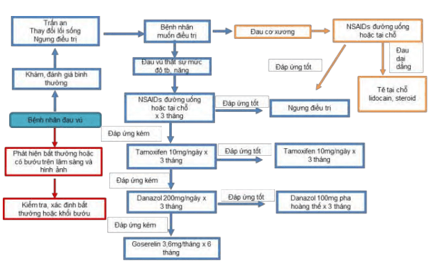
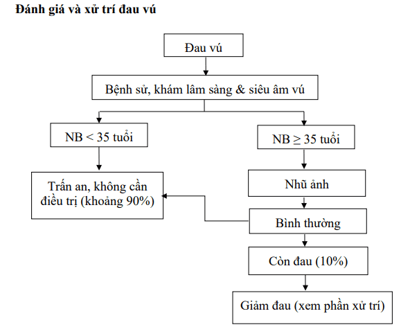

**Đau vú (mastalgia)** là triệu chứng thường gặp và là nguyên nhân chính khiến phụ nữ tìm đến khám tuyến vú.

Khoảng 50% phụ nữ khi đến khám liên quan đến vấn đề đau vú. Có đến 60-70% phụ nữ từng trải qua ít nhất một lần đau vú ở mức độ nhẹ, trong khi khoảng 10-20% từng bị đau vú trầm trọng hơn.

**Hai mối lo ngại lớn nhất** của người phụ nữ khi bị đau vú là:

1. Đau vú có phải là biểu hiện của ung thư vú không?
2. Đau vú ảnh hưởng đến sinh hoạt hàng ngày và đời sống tình dục ra sao?

## Phân loại

Đau vú được phân thành ba nhóm chính dựa trên mối liên hệ với chu kỳ kinh và vị trí đau:

1. **Đau vú theo chu kỳ (cyclical mastalgia)**.
2. **Đau vú không theo chu kỳ (noncyclical mastalgia)**.
3. **Đau vú do nguyên nhân ngoài tuyến vú**.

### Theo chu kỳ

#### Bệnh sinh

Nguyên nhân chính của đau vú theo chu kỳ liên quan đến thay đổi nội tiết tố trong chu kỳ kinh nguyệt. Có ba giả thuyết lớn:

**Tăng nồng độ estrogen**:

- Khi estrogen tăng cao trong pha nang trứng, có thể gây quá kích tế bào biểu mô vú, dẫn đến căng giãn và đau.
- Tuy nhiên, các nghiên cứu cho thấy nồng độ estrogen ở nhóm phụ nữ đau vú và nhóm chứng tương tự, nên giả thuyết này chưa được khẳng định.

**Thiếu progesterone**:

- Một số nghiên cứu ghi nhận nồng độ progesterone ở pha hoàng thể thấp hơn ở phụ nữ đau vú so với nhóm đối chứng.
- Thiếu progesterone có thể khiến mô vú không được duy trì cân bằng, dẫn đến phù nề và đau.
- Tuy vậy, lẽ ra nếu nguyên nhân chỉ do progesterone thì đau phải đều ở hai bên vú, nhưng thực tế một số trường hợp lại đau nặng ở một bên, cho thấy còn có yếu tố khác phối hợp.

**Tăng prolactin**:

- Nồng độ prolactin cao bất thường, kể cả khi không có thai, có thể gây ra đau căng vú.
- Stress cũng làm tăng prolactin và gây co giãn các ống dẫn sữa, dẫn đến đau.
  Ngoài ra, một số yếu tố khác có thể góp phần:

**Giữa nước chu kỳ**: Giữ nước có thể khiến mô vú phù nề, nhưng các nghiên cứu so sánh tổng lượng nước cơ thể ở ngày thứ 5 và thứ 25 của chu kỳ không thấy khác biệt rõ rệt giữa nhóm đau vú và nhóm không đau.

**Chế độ ăn chứa methylxanthine** (caffeine, theobromine): Mặc dù lý thuyết cho rằng methylxanthine có thể kích thích quá mức mô vú, nhưng các thử nghiệm ngẫu nhiên về chế độ không chứa caffeine chưa chứng minh được hiệu quả giảm đau.

#### Đặc điểm

- Thường gặp ở phụ nữ từ 30-40 tuổi, liên quan chặt chẽ đến chu kỳ kinh nguyệt.
- Xuất hiện 1-2 tuần trước khi hành kinh, đau lan toả hai bên vú, khó định vị. Nhiều trường hợp đau nghiêm trọng hơn ở một bên vú.
- Người bệnh mô tả cảm giác nặng, căng tức, thậm chí có thể lan lên nách hoặc cánh tay.
- Đau thường giảm dần hoặc hết hẳn khi hành kinh bắt đầu.
- Triệu chứng có thể tự hết khi mang thai hoặc sau thời kỳ mãn kinh, nhưng cũng có một số phụ nữ vẫn bị đau vú kéo dài sau mãn kinh.

### Không theo chu kỳ

#### Bệnh sinh

Đau vú không theo chu kỳ có thể do nhiều yếu tố:

- **Rối loạn chu kỳ kinh nguyệt** (thiếu đều): Làm thay đổi cân bằng nội tiết.
- **Stress tâm lý**: Tăng cortisol, thay đổi hormone, gây đau mạn tính.
- **Hoại tử mô mỡ (fat necrosis)**: Sau chấn thương hoặc phẫu thuật vú, mô mỡ có thể bị tổn thương, tạo nên cục đau tại chỗ.
- **Sẹo mổ cũ**: Tạo dải xơ hóa kéo căng dây chằng Cooper, gây đau khi vặn người hoặc vận động.
- **Viêm mô vú không nhiễm khuẩn**: Ví dụ viêm xơ tuyến vú, viêm quanh chẩn tuyến.
- **Xoắn dây chằng Cooper**: Nhiều khi chẩn đoán muộn do mô vú nhỏ co kéo dây chằng.
- **Hội chứng Mondor**: Viêm tắc tĩnh mạch nông vùng thành ngực, đau dọc theo tĩnh mạch.
- **Bệnh lý tuyến vú ở người đái tháo đường**: Thường kèm xơ hóa và đau.
- **Khối u hoặc nang vú**: Mặc dù lành tính, nhưng nếu gây chèn ép, xoắn hoặc viêm, có thể đau.
- **Ung thư vú**: Ít khi biểu hiện bằng đau đơn độc, nhưng không thể loại trừ nếu đau khu trú, dai dẳng và kèm các triệu chứng khác (thay đổi da, sờ thấy cục, tiết dịch máu).

#### Đặc điểm

- Thường gặp ở phụ nữ 40-50 tuổi, giai đoạn gần hoặc sau mãn kinh.
- Vị trí đau thường khu trú một bên, thường ở một phần tư vú (thường là 1/4 trên ngoài).
- Bệnh nhân mô tả cảm giác nóng bỏng, nhói, đau liên tục hoặc tái phát không theo chu kỳ.

### Nguyên nhân ngoài tuyến vú

Đau vú có thể phản ánh bệnh lý nằm ngoài tuyến vú nhưng lan truyền đau đến vùng ngực:

- **Viêm sụn sườn (hội chứng Tietze)**: Đau tại khớp sụn sườn, thường kèm phù viêm, ấn theo chỗ đau tăng.
- **Chấn thương thành ngực**: Gãy xương sườn, bầm cơ, làm đau nặng khi hô hấp, ho.
- **Đau thần kinh liên sườn**: Do viêm hoặc chèn ép dây thần kinh, đau rát, lan dọc khe liên sườn.
- **Viêm rễ thần kinh**: Do thoát vị đĩa đệm cột sống ngực, đau lan xuống dưới.
- **Herpes zoster (zona)**: Vệt mụn nước kèm đau rát, thường kèm ngứa, đau trước khi thấy mụn nước.
- **Trào ngược dạ dày - thực quản**: Đau rát ngực lan ra sau xương ức, có thể nhầm với đau vú.
- **Đau tim (thiếu máu cơ tim)**: Đau ngực lan vai, cánh tay có thể nhầm sang vú bên trái.
- **Viêm đường mật**: Đau vùng thượng vị lan lên vai phải, không phải từ vú nhưng bệnh nhân có thể mô tả lan tới ngực.

## Chẩn đoán

### Chụp nhũ ảnh

- Với phụ nữ ≥ 35 tuổi khi có triệu chứng đau vú, **nhũ ảnh** cần được thực hiện để loại trừ các bất thường cấu trúc (như u đặc, vôi hóa vi thể).
- Nhũ ảnh kỹ thuật số (Digital Mammography) ưu việt hơn nhũ ảnh phim nhờ khả năng xử lý hình ảnh số, cho phép phóng to, điều chỉnh độ tương phản.
- Hai tư thế tiêu chuẩn bắt buộc: **CC (Craniocaudal View)** cho hình ảnh toàn bộ vú, thấy rõ cơ ngực lớn phía sau, bao gồm cả 1/4 trong và 1/4 ngoài của vú. **MLO (Mediolateral Oblique View)** cho phép đánh giá vùng 1/4 trên ngoài - nơi thường gặp tổn thương ác tính, và nhìn thấy cơ ngực lớn để xác định độ sâu của mô vú.
- Nếu hình ảnh nhũ ảnh bình thường và không phát hiện khối cục, bệnh nhân có thể được trấn an. Nếu có bất thường (khối, vôi hóa, xơ hóa nghi ngờ), cần kết hợp siêu âm hoặc sinh thiết.

### Siêu âm

**Chỉ định**:

- Phụ nữ < 35 tuổi hoặc vú đậm đặc mà nhũ ảnh kém nhạy.
- Khám lâm sàng phát hiện khối u hoặc đau khu trú không rõ nguyên nhân.
- Hướng dẫn thủ thuật FNA (chọc hút tế bào) hoặc core biopsy.

**Ưu điểm**:

- Phân biệt nang - khối đặc, xác định tính chất dịch bên trong.
- Định vị chính xác khối để sinh thiết hoặc chọc hút.
- Không sử dụng tia X, an toàn cho phụ nữ mang thai hoặc cho con bú.

**Quy trình**:

- Bệnh nhân nằm ngửa, hai tay đặt lên đầu để căng giãn mô vú.
- Thăm dò theo các lát cắt: Lưới dọc - ngang, nan hoa (radial) và tiếp tuyến (antiradial).
- Khảo sát hạch nách để phát hiện hạch to, thay đổi cấu trúc.
- Siêu âm Doppler để đánh giá tưới máu khối u (giúp phân biệt lành - ác).

:::caution
Nếu nhũ ảnh và siêu âm đều không phát hiện tổn thương, bệnh nhân có thể được theo dõi lâm sàng. Nếu vẫn đau dai dẳng hoặc có hình ảnh nghi ngờ, cần cân nhắc sinh thiết.
:::

## Điều trị

Việc điều trị đau vú chỉ được khuyến nghị khi triệu chứng ảnh hưởng đến chất lượng cuộc sống. Nếu đau vú do nguyên nhân ngoài tuyến vú (như viêm sụn sườn, zona), cần điều trị theo nguyên nhân. Với đau vú nguyên nhân không xác định rõ, hiệu quả của các biện pháp điều trị còn nhiều tranh cãi. **Chỉ định điều trị** dựa trên 4 yếu tố:

1. Mức độ nghiêm trọng của đau (điểm số đau, tác động sinh hoạt).
2. Tuổi tác và chu kỳ sinh sản (mong muốn mang thai, cho con bú).
3. Tình trạng tổng thể (tiền sử bệnh lý, thuốc đang dùng).
4. Mong muốn của bệnh nhân (sẵn sàng thử thách nghiệm pháp, tác dụng phụ).

**Tiếp cận** bệnh nhân:

- Bắt đầu bằng khám lâm sàng, hỏi tiền sử, phân loại đau (chu kỳ, không chu kỳ, ngoài vú).
- Nếu ≥ 35 tuổi và chưa có nhũ ảnh gần đây (< 1 năm), chỉ định nhũ ảnh kết hợp siêu âm (nếu cần).
- Nếu < 35 tuổi, bắt đầu với siêu âm toàn bộ vú.
- Nếu phát hiện khối bất thường hoặc bất kỳ hình ảnh nghi ngờ, thực hiện sinh thiết (FNA, core biopsy) tùy hướng dẫn hình ảnh.
- Với các trường hợp đau vú lành tính, không có khối trên hình ảnh, áp dụng biện pháp không dùng thuốc, điều chỉnh lối sống và theo dõi sau 6-12 tuần.
- Nếu không cải thiện, cân nhắc điều trị nội tiết tố theo thứ tự: Tamoxifen → Danazol → Bromocriptine (chỉ khi thật cần và có giám sát).

_Hình ảnh "Điều trị đau vú - Phác đồ Cardiff, 2009"._

_Hình ảnh "Đánh giá và xử trí đau vú - Bệnh viện Từ Dũ"._

### Không dùng thuốc

**Chọn áo ngực phù hợp**:

- Khuyến khích phụ nữ đo đúng kích cỡ áo ngực, tránh mặc áo chật hoặc dây chật ngang lưng.
- Áo ngực thể thao hoặc áo định hình vú ôm sát có thể giảm co kéo dây chằng Cooper, giảm đau đáng kể.

**Liệu pháp thư giãn**: Các bài tập thở, yoga, thiền tập trung thư giãn vùng ngực trong 4 tuần giúp giảm cường độ đau ở khoảng 60% phụ nữ.

**Giảm đau tại chỗ bằng gel NSAIDs**:

- Gel Diclofenac 1% thoa vào vùng đau 2-3 lần/ngày trong 2-4 tuần.
- Gel Ibuprofen hoặc Ketoprofen cũng có tác dụng giảm đau tương tự, không gây tác dụng phụ hệ thống.

**Chế độ ăn và lối sống**:

- Hạn chế thực phẩm chứa nhiều chất béo bão hòa và đường tinh luyện (có thể làm tăng estrogen nội sinh).
- Giảm cân nếu béo phì: Béo phì ở phụ nữ mãn kinh liên quan đến tăng estrogen (do mô mỡ tổng hợp aromatase), có thể làm tăng đau vú.
- Hạn chế caffeine (cà phê, trà đặc, cacao, chocolate): Các nghiên cứu về lợi ích giảm đau khi kiêng caffeine cho kết quả không đồng nhất, nhưng một số phụ nữ vẫn cảm thấy giảm triệu chứng khi hạn chế.
- Tập thể dục nhẹ nhàng (đi bộ, bơi, yoga) giúp điều hòa nội tiết, giảm đau và cải thiện tâm trạng.

**Bổ sung vitamin**:

- Vitamin E (400-800 IU/ngày) đôi khi được chỉ định theo kinh nghiệm lâm sàng, nhưng các nghiên cứu chưa cung cấp bằng chứng mạnh.
- Vitamin B6 (pyridoxine) liều thấp (50-100 mg/ngày) có thể giúp cải thiện triệu chứng, nhưng cần theo dõi tác dụng phụ.

**Thoa dầu thảo dược**: Một số dầu thảo dược (dầu hoa anh thảo, dầu dừa, dầu jojoba) được thoa lên vú vào buổi tối theo kinh nghiệm, nhưng hiệu quả không khác biệt so với giả dược.

### Nội khoa

Do nguy cơ tác dụng phụ, liệu pháp nội tiết chỉ nên dùng trong 2-6 tháng, khi biện pháp không dùng thuốc không hiệu quả.

**Thuốc tránh thai kết hợp (COCs)**:

- Ở một số phụ nữ, COCs liều thấp (Ethinylestradiol 20 μg phối hợp một progestin) giúp cân bằng nội tiết, giảm đau vú.
- Một số phụ nữ khởi dùng COCs có thể bị đau vú tăng lên trong 1-2 chu kỳ đầu.
- Nếu dùng COCs, cần theo dõi sát sao và đánh giá lại sau 3 tháng.

**Progestogen (progesterone)**:

- Các progestogen đường uống như lynestrenol hoặc promegestone dùng trong pha hoàng thể (ngày 14-28) có thể cải thiện đau vú ở 66-80% phụ nữ.
- Có thể dùng progestogen tại chỗ (gel hoặc kem thoa) nếu chỉ đau khu trú, nhưng bằng chứng còn hạn chế.

**Tamoxifen**:

- Tamoxifen 10 mg/ngày trong 3 tháng giúp giảm 70-90% đau vú theo chu kỳ, giảm 56% đau vú không theo chu kỳ.
- Tái phát đau ở 50% sau khi ngừng thuốc.
- Chưa được cấp phép chính thức cho điều trị đau vú; Liều dùng không quá 6 tháng để tránh nguy cơ ung thư nội mạc tử cung, đông đặc, hay thay đổi chuyển hóa mỡ máu.
- Tác dụng phụ: Bốc hỏa, rối loạn kinh nguyệt, đau khớp, nguy cơ tăng ung thư nội mạc tử cung sau 5 năm sử dụng.

**Danazol**:

- Danazol (200 mg/ngày) chẹn gonadotropin, có tác dụng androgen nhẹ, giảm đau vú ở 70% chu kỳ và 31% không theo chu kỳ.
- Tác dụng phụ nặng: Rậm lông, mụn trứng cá, giọng trầm, tăng cân, rối loạn kinh nguyệt, thay đổi tâm thần kinh. Tiếp tục ngưng nếu xuất hiện triệu chứng nam hóa hoặc trầm cảm.
- Chỉ dùng khi thất bại với Tamoxifen (3-6 tháng), duy trì tối thiểu 3 tháng, tối đa 6 tháng.
- Cảnh báo: Gây quái thai, phụ nữ dùng cần kết hợp biện pháp tránh thai không hormone (ví dụ dùng bao cao su).

**Bromocriptine**:

- Đồng vận dopamine, ức chế tiết prolactin, liều 2.5-5 mg/ngày chia 2 lần, kéo dài 2-3 tháng. Giảm đau vú ở 47-88% trường hợp.
- Tác dụng phụ: Buồn nôn, nôn, chóng mặt, hạ huyết áp tư thế. Nhiều bệnh nhân không chịu được các tác dụng phụ nên tự ngưng thuốc.

### Ngoại khoa

- Chỉ cân nhắc phẫu thuật khi điểm đau **cực kỳ khu trú**, xác định rõ vùng nhỏ trên lâm sàng và không đáp ứng với điều trị bảo tồn.
- Việc cắt bỏ vùng đau (local excision) đôi khi giúp giảm đau đáng kể nếu nguồn đau đến từ một mô xơ hóa, u giả cân...
- Với đau vú lan toả, **không khuyến cáo phẫu thuật cắt bỏ vú** (mastectomy), vì 50% trường hợp sau mổ vẫn còn đau hoặc tái phát.
- Nếu bệnh nhân vẫn yêu cầu mastectomy hủy vú để tái tạo, cần đánh giá tâm lý kỹ, giải thích biến chứng tiềm ẩn và cơ hội thành công không cao.

## Tài liệu tham khảo

- Trường ĐH Y Dược TP. HCM (2020) - _Team-based learning_
- Bệnh viện Từ Dũ (2022) - _Phác đồ điều trị Sản Phụ khoa_
