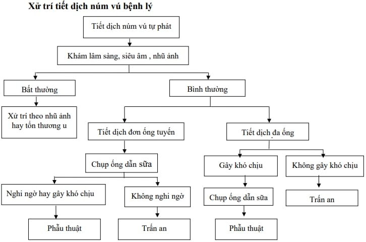

Tiết dịch núm vú (nipple discharge) là hiện tượng có dịch chảy ra từ một hoặc cả hai núm vú. Phần lớn nguyên nhân gây tiết dịch núm vú là lành tính, nhưng cần phân biệt kỹ để không bỏ sót các tổn thương ác tính. Dịch tiết có thể đa dạng về màu sắc (trắng như sữa, vàng, máu, nâu, đục, mủ), số lượng, tính chất, và mức độ liên quan đến kích thích hay chủ động tự phát.

## Phân loại

**Tiết sữa (galactorrhea)**:

- Thường là dịch trắng đục, giống sữa, tự phát hoặc khi ấn nhẹ vào núm vú.
- Xuất hiện hai bên, chảy từ nhiều ống tuyến.
- Nguyên nhân chủ yếu do tăng prolactin máu (prolactin máu thường > 20 ng/mL ở phụ nữ không mang thai).

**Tiết dịch bệnh lý (pathologic nipple discharge)**:

- Thường là dịch một bên, chỉ chảy ra từ một ống tuyến (nhất là khi bệnh nhân không ấn núm vú).
- Màu sắc có thể là máu tươi, nâu sẫm, mủ hoặc dịch đục lẫn máu.
- Nguy cơ liên quan đến tổn thương ống tuyến (như bướu nhú, ung thư ống) cao hơn.

:::caution

- **Tiết dịch tự phát, một bên, có lẫn máu** là dấu hiệu cảnh báo cao đối với bướu nhú (intraductal papilloma) hoặc carcinoma tại chỗ/xâm lấn trong ống tuyến vú.
- Khi có các đặc điểm kể trên, cần thực hiện các bước chẩn đoán hình ảnh và xâm lấn để loại trừ ác tính.

:::

## Tiết sữa

Tiết sữa (galactorrhea) là tình trạng tiết dịch giống sữa, thường hai bên vú, không liên quan đến việc cho con bú. Hiện tượng này chủ yếu do tăng tiết hormone prolactin, tác động lên biểu mô ống tuyến vú.

### Chẩn đoán

#### Lâm sàng

**Tăng prolactin từ u tuyến yên**: U tuyến yên (prolactinoma) thường đi kèm triệu chứng phù gai thị, rối loạn thị giác (do khối u chèn ép thần kinh thị); Triệu chứng toàn thân: Đau đầu, giảm thị lực, rối loạn kinh nguyệt, vô kinh.

**Tổn thương thần kinh tủy sống hoặc chấn thương thành ngực**: Tác động cơ học làm tăng tín hiệu thần kinh kích thích quá mức vào vùng trung ương điều hòa prolactin.

**Bệnh lý nội tiết - chuyển hóa**:

- **Nhược giáp (hypothyroidism)**: Tăng TRH làm kích thích đồng thời tiết prolactin.
- **Suy thận mạn**: Giảm thanh thải prolactin, dẫn đến tăng prolactin máu.

**Thuốc**:

- **Thuốc ức chế bơm proton (ranitidine, cimetidine)**: Gây tăng prolactin do ức chế thụ thể dopamin D2 ở tuyến yên.
- **Thuốc chống trầm cảm ba vòng (amitriptyline, nortriptyline)**: Ức chế tái hấp thu serotonin, gián tiếp làm tăng prolactin.
- **Thuốc hướng thần kinh (antipsychotics)**: Haloperidol, risperidone, olanzapine... ức chế dopamin, gây tăng prolactin.
- **Thuốc trị tăng huyết áp nhóm methyldopa**: Kích thích tiết prolactin.

**Kích thích núm vú quá mức**: Vệ sinh, sờ nắn hoặc kích thích tình dục lặp lại có thể gây phản xạ thần kinh tăng tiết prolactin.

#### Cận lâm sàng

**Đo prolactin máu**

- Mẫu máu lấy lúc sáng (8-9 giờ), sau khi bệnh nhân nghỉ ngơi 30 phút và nhịn ăn.
- Mức prolactin > 20 ng/mL (nữ) hoặc > 15 ng/mL (nam) gợi ý galactorrhea.

**Định lượng TSH (Thyroid Stimulating Hormone)**: Thăm dò chức năng tuyến giáp, loại trừ nhược giáp (TSH thường > 4.0 µIU/mL).

**Chụp MRI tuyến yên**:

- Nếu prolactin tăng > 50 ng/mL hoặc có triệu chứng lâm sàng gợi ý u tuyến yên (đau đầu, rối loạn thị giác), cần MRI để xác định khối u.
- Nếu bệnh nhân chống chỉ định MRI (ví dụ mang máy tạo nhịp), có thể dùng CT scan có tương phản.

**Xét nghiệm chức năng thận - gan**: Để loại trừ suy thận mạn, xơ gan (gây giảm thanh thải prolactin).

**Xét nghiệm nội tiết tố khác**: Estradiol, FSH, LH: Đánh giá tình trạng mãn kinh hoặc rối loạn tuyến sinh dục.

### Điều trị

#### Theo nguyên nhân

- **Nếu do thuốc**: Ngưng hoặc thay thế bằng thuốc khác ít gây tăng prolactin.
- **Nếu do nhược giáp**: Điều trị thay thế hormone tuyến giáp (levothyroxine).
- **Nếu do rối loạn chức năng thận-gan**: Xử lý theo chuyên khoa tương ứng.

#### Nội khoa

**Bromocriptine** (đồng vận dopamine):

- Liều khởi đầu 1.25-2.5 mg/ngày, chia 2 lần, sau đó tăng dần 2.5 mg mỗi 2-7 ngày, đến khi prolactin về mức bình thường.
- Liều duy trì: 2.5-15 mg/ngày, chia 2-3 lần.
- Theo dõi prolactin sau 4-6 tuần điều trị; Nếu hết tiết sữa, bắt đầu giảm liều dần và ngưng sau 3 tháng ổn định.

**Cabergoline** (đồng vận dopamine chọn lọc):

- Liều 0.25-0.5 mg 1-2 lần/tuần, hiệu quả kéo dài, ít tác dụng phụ vã mồ hôi, buồn nôn hơn Bromocriptine.
- Dùng trong 3-6 tháng, theo dõi prolactin mỗi 4-6 tuần.

#### Theo dõi sau điều trị

- Đo lại prolactin máu sau 1-2 tháng.
- Nếu u tuyến yên > 10 mm hoặc còn triệu chứng thần kinh thị, cần tái khám chuyên khoa thần kinh - nội tiết đánh giá khả năng phẫu thuật hoặc xạ trị.

## Tiết dịch bệnh lý

Tiết dịch bệnh lý (pathologic nipple discharge) là hiện tượng dịch có tính chất bất thường (máu, mủ, dịch đục) chảy tự phát từ một ống tuyến ở một bên vú. Tình trạng này luôn cần được đánh giá kỹ để loại trừ bướu nhú, ung thư ống tại chỗ (DCIS) hoặc ung thư xâm lấn.

### Nguyên nhân

**Bướu nhú trong ống (Intraductal papilloma)**:

- Tổn thương lành tính, xuất phát từ biểu mô ống, thường nằm ở khu vực quanh quầng vú (< 1 cm).
- Dịch máu hoặc dịch lẫn máu là đặc trưng, bệnh nhân sờ không rõ khối (vì khối nhỏ).
- Tần suất: Chiếm 60-80% trường hợp tiết dịch bệnh lý có máu hoặc giả máu.

**Dãn ống tuyến (Duct ectasia)**:

- Ống tuyến giãn to, thành dày, đôi khi lắng đọng chất sừng hoặc cặn nhỏ.
- Dịch có thể vàng, xanh đục, đôi khi lẫn mủ.
- Thường gặp ở phụ nữ mãn kinh, kèm cảm giác rát, sưng quanh núm.

**Ung thư ống tại chỗ (Ductal Carcinoma In Situ - DCIS)**:

- Tổn thương tiền ung thư, đôi khi biểu hiện bằng máu từ ống.
- Cần loại trừ ngay khi dịch máu xuất hiện, nhất là ở phụ nữ > 50 tuổi.

**Ung thư xâm lấn (Invasive ductal carcinoma)**:

- Ít khi biểu hiện chỉ là tiết dịch, thường kèm khối u, dính da, dính núm.
- Nếu phát hiện dịch máu trong ống dường như trống, cần sinh thiết càng sớm càng tốt.

**Viêm vú (Mastitis/Periductal mastitis)**:

- Viêm ống tuyến hoặc áp xe vú, thường kèm sốt, đau, sưng đỏ, dịch mủ.
- Biểu hiện cấp tính hoặc mạn tính, kèm hạch nách sưng.

**Thay đổi sợi bọc ống tuyến (Fibrocystic changes)**: Các khối xơ-nang, u xơ có thể chèn ép ống, gây dịch đục hoặc xuất tiết.

**Các nguyên nhân khác**:

- **Nang áp-xe ống tuyến**: Dịch mủ kèm biểu hiện viêm.
- **Xơ hóa ống tuyến phức tạp (Complex sclerosing lesion/Radial scar)**: Hiếm hơn nhưng có thể làm chảy dịch lẫn máu.
- **Từng xạ trị ngực**: Viêm mạch máu - ống tuyến dễ chảy dịch.

### Chẩn đoán

#### Lâm sàng

**Một bên vú**: Dịch chỉ xuất hiện ở một vú, thường không đau hoặc chỉ đau nhẹ.

**Một ống tuyến**: Bệnh nhân có thể chỉ ra rõ vị trí ống chảy dịch khi ấn nhẹ xung quanh quầng vú.

**Tự phát, không liên quan kích thích**: Dịch chảy tự nhiên, không cần ép mạnh hoặc kích thích kéo dài.

**Màu sắc bất thường**:

- **Máu tươi hoặc nâu đậm** (dấu hiệu nguy cơ ung thư cao).
- **Dịch mủ**: Gợi ý áp xe hoặc viêm ống tuyến.
- **Dịch đục hoặc vàng đục**: Thường gặp trong viêm vú hoặc tổn thương apocrine.

#### Cận lâm sàng

**Đo prolactin máu**: Mục đích loại trừ galactorrhea, nếu bệnh nhân có tiết dịch trắng, hai bên, prolactin tăng, cần ưu tiên chẩn đoán tiết sữa.

**Siêu âm**:

- Phát hiện khối u (như Intraductal papilloma), nang, ống giãn, áp xe.
- Hướng dẫn chọc hút dịch, sinh thiết lõi nếu thấy khối nhỏ hoặc dãn ống khu trú.

**Nhũ ảnh**:

- **Microcalcifications**: Gợi ý DCIS.
- **Khối ranh giới không đều**: Gợi ung thư xâm lấn.
- **Ống giãn**: Đường ống giãn kéo dài về quầng.

**Chụp ống tuyến (Ductography/Galactography)**:

- Bơm thuốc cản quang qua ống chảy dịch, chụp X-quang để định vị tổn thương (như bướu nhú, hẹp ống, khối xơ).
- Hình ảnh: Lấp đầy nhánh ống bởi khối, chỗ hẹp, biến dạng lòng ống.

**Tế bào học dịch núm vú**:

- Lấy dịch tận gốc ống, nhuộm Giemsa hoặc Papanicolaou.
- Đánh giá tế bào: Hiệu quả trong phát hiện tế bào ung thư nếu có dòng điển hình; Hạn chế Không phân biệt được tổn thương in situ hay xâm lấn, có thể âm tính giả nếu lấy sai ống.

### Điều trị

_Hình ảnh "Xử trí tiết dịch núm vú bệnh lý - Bệnh viện Từ Dũ"._

**Bước 1 Phân loại dịch**:

- **Dịch sữa (trắng đục)**: Đo prolactin, TSH → xử trí như tiết sữa.
- **Dịch bệnh lý (màu bất thường, một bên, một ống)**: Chuyển sang bước chẩn đoán hình ảnh.

**Bước 2 Kết hợp chẩn đoán hình ảnh**:

- **Nhũ ảnh + Siêu âm** (đều ưu tiên cho phụ nữ ≥ 35 tuổi): Nếu phát hiện **khối** hoặc **microcalcification** đáng ngờ → Sinh thiết lõi (core biopsy). Nếu có **ống giãn khu trú** mà không thấy khối → Chụp ống tuyến (ductography) để khoanh vùng, sau đó sinh thiết định vị.
- **Chụp ống tuyến** (nếu siêu âm và nhũ ảnh không xác định rõ tổn thương nhưng vẫn có tiết máu/lẫn máu): Bơm thuốc cản quang, xác định chỗ lấp đầy, khối u nhỏ trong ống. Dựa vào kết quả ductography, chỉ định sinh thiết mở hoặc sinh thiết lõi có định vị dưới hình ảnh.

**Bước 3 Sinh thiết**:

- **Core biopsy (sinh thiết lõi) hướng dẫn siêu âm/nhũ ảnh**: Ưu tiên khi phát hiện khối u rõ hoặc vùng ống có dãn bất thường. Lấy ít nhất 4-6 mẫu mô để đánh giá mô học (xác định bướu nhú, DCIS, carcinoma xâm lấn).
- **Wire localization biopsy (định vị bằng kim dẫn hướng)**: Dùng khi tổn thương chỉ thấy trên ductography hoặc MRI, không phát hiện rõ trên siêu âm. Kim định vị được đặt chính xác vào tổn thương, sau đó phẫu thuật cắt mô định hướng.
- **Sinh thiết mở (excisional biopsy)**: Khi core biopsy không thể thực hiện hoặc kết quả không rõ ràng. Lấy toàn bộ tổn thương cùng vỏ bao, vừa chẩn đoán vừa điều trị.

**Bước 4 Xử trí hậu sinh thiết**:

- **Hoàn toàn lành tính (ví dụ Intraductal papilloma lành, duct ectasia không viêm)**: Nếu không triệu chứng (ít dịch, không đau), có thể theo dõi lâm sàng, không cần phẫu thuật. Nếu còn tiếp tục chảy dịch hoặc cảm giác khó chịu, có thể cân nhắc phẫu thuật cắt ống chảy dịch (microdochectomy).
- **Tổn thương có nguy cơ (bướu nhú có tế bào atypia, sclerosing lesion phức tạp)**: Phẫu thuật cắt rộng hơn hoặc theo dõi chặt chẽ (nhũ ảnh + siêu âm 6 tháng/lần).
- **Ung thư ống tại chỗ (DCIS) hoặc carcinoma xâm lấn**: - Chuyển sang phác đồ điều trị ung thư vú (phẫu thuật, xạ trị, hóa - nội tiết tùy giai đoạn và phân nhóm mô học).

## Tài liệu tham khảo

- Trường ĐH Y Dược TP. HCM (2020) - _Team-based learning_
- Bệnh viện Từ Dũ (2022) - _Phác đồ điều trị Sản Phụ khoa_
