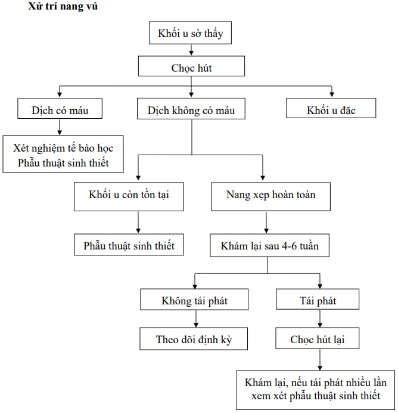
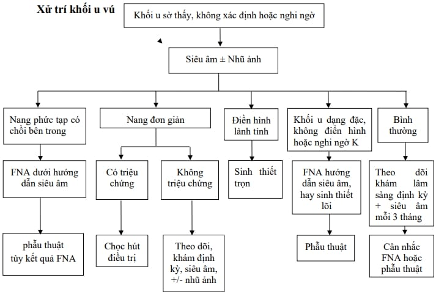

U vú có thể lành tính hoặc ác tính, tuy nhiên phần lớn là u lành tính.

## Chẩn đoán

Đánh giá các yếu tố nguy cơ ung thư vú: Tuổi, tiền sử gia đình có người mắc ung thư vú, tiền sử cá nhân từng bị ung thư vú, có kết quả sinh thiết trước đó cho thấy tăng sản không điển hình, hoặc đã từng phẫu thuật tuyến vú.

### Lâm sàng

Ghi nhận kích thước, vị trí khối u (so với núm vú), mức độ di động, mật độ (căng chắc hay mềm), tính chất bề mặt (trơn láng hay gồ ghề), bờ rõ hay không rõ, và phân biệt khối đặc hay nang.

### Cận lâm sàng

Siêu âm và nhũ ảnh để phân loại theo BIRADS. Các tổn thương BIRADS II và III thường lành tính, cần theo dõi hoặc xử trí theo phác đồ.

_Bảng "BIRADS - Hiệp hội Quang tuyến Hoa Kỳ (ACR)"._
| BIRADS | Kết quả | Hướng xử trí |
| ------ | ----------------------------------------------------- | ----------------------------------------------------------- |
| **0** | Không đầy đủ | Cần thêm hình ảnh (spot compression, phóng đại, siêu âm...) |
| **1** | Âm tính | Tiếp tục nhũ ảnh tầm soát định kỳ |
| **2** | Lành tính (u nang lành, hạch lành, vôi hóa lành tính) | Tiếp tục nhũ ảnh tầm soát định kỳ |
| **3** | Có khả năng lành tính (> 98% là tổn thương lành tính) | Theo dõi nhũ ảnh mỗi 6 tháng trong 2 năm |
| **4A** | Nghi ngờ ác tính mức độ thấp | Cân nhắc sinh thiết |
| **4B** | Nghi ngờ ác tính mức độ trung bình | Cân nhắc sinh thiết |
| **4C** | Gợi ý ác tính (không điển hình) | Cân nhắc sinh thiết |
| **5** | Gợi ý mạnh ác tính (> 95% khả năng ung thư) | Bắt buộc sinh thiết |
| **6** | Đã xác định ung thư qua sinh thiết trước đó | Theo dõi điều trị (imaging for treatment monitoring) |

## Điều trị

_Hình ảnh "Xử trí nang vú – Bệnh viện Từ Dũ"._

_Hình ảnh "Xử trí khối u vú – Bệnh viện Từ Dũ"._

## Tài liệu tham khảo

- Trường ĐH Y Dược TP. HCM (2020) – _Team-based learning_
- Bệnh viện Từ Dũ (2022) – _Phác đồ điều trị Sản Phụ khoa_
