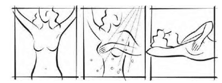
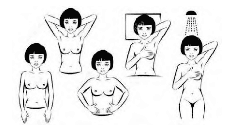
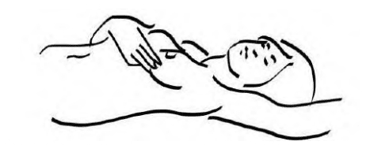
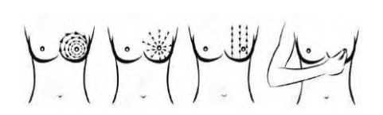
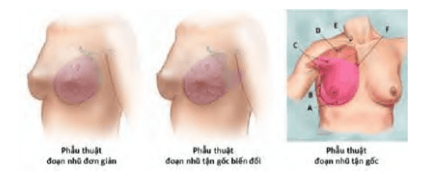
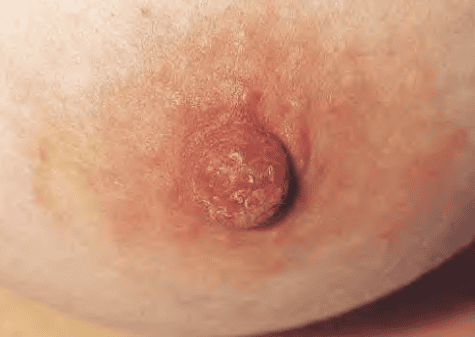

**Ung thư vú là bệnh lý ác tính** thường gặp nhất ở phụ nữ, chiếm khoảng 18% các trường hợp ung thư ở nữ giới, và là nguyên nhân gây tử vong hàng đầu trong độ tuổi từ 40-50. Tỷ lệ mắc ung thư vú đã gia tăng trong những thập kỷ gần đây, tuy nhiên nếu được phát hiện ở giai đoạn sớm, khả năng sống còn sau 5 năm có thể lên tới hơn 90%. Do đó, tầm soát ung thư vú giữ vai trò sống còn trong cải thiện kết quả điều trị.

## Tầm soát

**Khả năng sống còn sau 5 năm của bệnh nhân ung thư vú phụ thuộc rất lớn vào giai đoạn bệnh khi được phát hiện và phẫu thuật**. Nếu phát hiện ở giai đoạn sớm (u chỉ khu trú tại vú, kích thước nhỏ, chưa di căn hạch), tỷ lệ sống sau 5 năm có thể đạt đến 98%. Trong một nghiên cứu kéo dài 18 năm, những phụ nữ có khối u ≤ 1 cm và được điều trị bằng phẫu thuật bảo tồn kèm nạo hạch không phát hiện di căn, tỷ lệ sống còn sau đó vẫn lên tới 89%.

Do vậy, tầm soát định kỳ giúp phát hiện ung thư vú giai đoạn sớm, giúp giảm tử vong và hạn chế phẫu thuật triệt để. Các khuyến cáo tầm soát thường dựa trên nguy cơ của người phụ nữ (nguy cơ trung bình hay nguy cơ cao) dựa vào tuổi, tiền sử gia đình, và các yếu tố nguy cơ khác. Các công cụ chính được sử dụng để tầm soát ung thư vú gồm:

**Nhũ ảnh (Mammography)**:

- Là tiêu chuẩn vàng cho tầm soát ung thư vú ở phụ nữ có nguy cơ trung bình.
- Có thể phát hiện tổn thương không triệu chứng lâm sàng, đặc biệt ở phụ nữ ≥ 40 tuổi.
- Giảm 16-35% tỷ lệ tử vong do ung thư vú ở phụ nữ ≥ 50 tuổi, và 15-20% ở nhóm tuổi 40-49.

**Cộng hưởng từ vú (Breast MRI)**:

- Được chỉ định chủ yếu cho đối tượng có nguy cơ cao (như đột biến BRCA, tiền sử xạ trị ngực lúc trẻ...).
- Độ nhạy rất cao (khoảng 98%), tuy nhiên độ đặc hiệu (specificity) thấp hơn (khoảng 75%) so với nhũ ảnh.
- Không thay thế nhũ ảnh mà thường được phối hợp song song ở nhóm nguy cơ cao.

**Khám lâm sàng**:

- Hiệp hội Ung thư Hoa Kỳ (ACS) khuyến cáo bác sĩ phụ khoa hoặc chuyên gia y tế có kinh nghiệm khám vú định kỳ.
- Tuy nhiên bằng chứng cho lợi ích tầm soát bằng khám lâm sàng là hạn chế.

**Tự khám vú (Breast Self-Exam, BSE)**:

- Không được ACS xem là phương pháp tầm soát chính thức, nhưng khuyến cáo mọi phụ nữ ≥ 20 tuổi nên tự khám vú hàng tháng để làm quen với cấu trúc bình thường của vú và phát hiện sớm các thay đổi bất thường. Khoảng 50% số trường hợp ung thư vú được phát hiện khi phụ nữ tự khám vú (khi khối u đã lớn hoặc đã lan ra ngoài bề mặt).
- Thời điểm lý tưởng để tự khám vú là ngày thứ 8-10 sau khi bắt đầu chu kỳ kinh, khi vú có kích thước nhỏ nhất, ít chịu ảnh hưởng của estrogen, và mô vú mềm.

**Siêu âm vú**:

- Không được khuyến cáo làm tầm soát đơn độc cho ung thư vú do độ đặc hiệu thấp (khoảng 92%) và dễ dẫn đến dương tính giả.
- Được sử dụng bổ sung cho nhũ ảnh ở phụ nữ có mô vú dày, phát hiện khối chưa rõ ràng, hoặc khi có tổn thương nghi ngờ sau nhũ ảnh.

**Chọc hút kim nhỏ (Fine-Needle Aspiration, FNA) và Sinh thiết lõi (Core Needle Biopsy)**: Không phải công cụ tầm soát, mà là phương pháp chẩn đoán mô học khi đã có tổn thương nghi ngờ trên lâm sàng hoặc hình ảnh.

| Giá trị của các phương tiện chẩn đoán và tầm soát ung thư vú | Độ nhạy (%) | Độ đặc hiệu (%) | PPV (%) |
| ------------------------------------------------------------ | ----------- | --------------- | ------- |
| **Khám lâm sàng**                                            | 86          | 90              | 95      |
| **Nhũ ảnh**                                                  | 86          | 90              | 95      |
| **Siêu âm**                                                  | 90          | 92              | 95      |
| **MRI**                                                      | 98          | 75              | 80      |
| **FNA**                                                      | 95          | 95              | 99.8    |
| **Sinh thiết lõi**                                           | 85-98       | 95              | 100     |

### Khám vú

Theo khuyến cáo của ACOG (2017), có khoảng 50% trường hợp ung thư vú ở phụ nữ ≥ 50 tuổi và 71% ở phụ nữ < 50 tuổi được phát hiện bởi chính người phụ nữ khi tự khám. Phụ nữ cần được giáo dục về các dấu hiệu và triệu chứng bất thường của vú:

- Xuất hiện khối u (có thể là khối mới hoặc vùng mô lổn nhổn).
- Đau vú kéo dài, không phải đau theo chu kỳ kinh, đặc biệt ở phụ nữ mãn kinh.
- Thay đổi màu da vú (đỏ, sần vỏ cam, co rút da).
- Tiết dịch núm vú bất thường (màu sắc bất thường, có máu, chỉ một bên).
- Phì đại hạch nách hoặc hạch đòn mới phát hiện.

#### Tự khám vú

**Quan sát trước gương**: Thực hiện trước gương, hai tay lần lượt đặt sau gáy, chống hông hoặc buông xuôi để quan sát hình dạng, kích thước, đối xứng vú và da vú (phát hiện ửng đỏ, co kéo, loét, thụt núm vú).

_Hình ảnh "Tự quan sát trước gương và tự sờ nắn khi tắm và khi nằm"_.

_Hình ảnh "Các tư thế tự quan sát trước gương và các tư thế để tự sờ nắn"_.

**Sờ nắn vú**:

- Thực hiện khi tắm với tay trơn xà phòng, hoặc khi nằm thư giãn.
- Chia vú thành 4 phần (tứ phân) và lần lượt sờ nắn theo lộ trình xoắn ốc hoặc theo đường ngang - dọc để phát hiện khối hoặc vùng mô lổn nhổn bất thường.
- Khám cả vùng hạch nách và hạch đòn.
- Khi sờ nắn, dùng 3 ngón giữa áp sát vùng mô, phối hợp bàn tay đặt sau gáy để cố định ngực và di chuyển các ngón tay từ ngoài vào trong.

_Hình ảnh "Khám vú bằng cách dùng 3 ngón giữa của 2 bàn tay. Khi tự sờ nắn, bàn tay để sau gáy sẽ giúp cảm nhận tốt hơn"_.

_Hình ảnh "Lộ trình của các ngón tay khi tự khám vú"_.

#### Các dấu hiệu bất thường

**Khối u hoặc vùng mô lổn nhổn mới**:

- Khối u đơn độc, có thể cứng, không di động.
- Vùng mô lổn nhổn, không đối xứng ở phụ nữ tiền mãn kinh/mãn kinh.
- Tình trạng viêm hoặc áp-xe vú không đáp ứng điều trị có thể che giấu ác tính.

**Phì đại hạch nách hoặc hạch đòn**: Hạch to mới phát hiện cần được đánh giá vì có thể là di căn.

**Đau vú bất thường**:

- Đau không theo chu kỳ, liên tục, không đáp ứng thuốc giảm đau.
- Đau kèm khối hoặc chỉ ở một bên vú.
- Đau ảnh hưởng chất lượng cuộc sống (mastodynia).

**Tiết dịch núm vú**:

- Cần phân biệt tiết dịch 1 hay 2 bên, màu sắc (trong, vàng, máu) và độ quánh.
- Nghiêm trọng nếu: Người ≥ 50 tuổi tiết dịch; Tiết dịch 1 bên ở người < 50 tuổi; Tiết dịch lẫn máu; Kèm co rút/núm vú biến dạng.

### Chẩn đoán hình ảnh

#### Nhũ ảnh

**Chỉ định**:

- Mọi phụ nữ có nguy cơ trung bình, tuổi ≥ 40-50 (tùy khuyến cáo).
- Không chỉ định nhũ ảnh đơn thuần ở nhóm nguy cơ cao (như đột biến BRCA) mà cần kết hợp với MRI.

**Lợi ích**:

- Giảm 16-35% tử vong do ung thư vú ở phụ nữ ≥ 50 tuổi.
- Giảm 15-20% tử vong ở phụ nữ 40-49 tuổi, do ung thư ở nhóm tuổi này thường phát triển nhanh và mô vú dày hơn, làm giảm độ nhạy của nhũ ảnh.

**Quy trình**:

- Nhũ ảnh hai bình diện (CC và MLO) hàng năm hoặc hai năm/lần tùy khuyến cáo.
- So sánh với phim nhũ ảnh cũ để phát hiện tổn thương mới hoặc thay đổi.
- Khi nhũ ảnh phát hiện nhiễu hạt (clustered microcalcifications), khối hình bóng mờ hay bóng khuếch tán, cần đánh giá thêm bằng phóng đại (magnification) hoặc siêu âm.

**BIRADS (Breast Imaging-Reporting and Data System)**: Hệ thống phân loại kết quả nhũ ảnh và MRI, giúp chuẩn hóa báo cáo và hướng dẫn xử trí.

| BIRADS | Kết quả                                               | Hướng xử trí                                                |
| ------ | ----------------------------------------------------- | ----------------------------------------------------------- |
| **0**  | Không đầy đủ                                          | Cần thêm hình ảnh (spot compression, phóng đại, siêu âm...) |
| **1**  | Âm tính                                               | Tiếp tục nhũ ảnh tầm soát định kỳ                           |
| **2**  | Lành tính (u nang lành, hạch lành, vôi hóa lành tính) | Tiếp tục nhũ ảnh tầm soát định kỳ                           |
| **3**  | Có khả năng lành tính (> 98% là tổn thương lành tính) | Theo dõi nhũ ảnh mỗi 6 tháng trong 2 năm                    |
| **4A** | Nghi ngờ ác tính mức độ thấp                          | Cân nhắc sinh thiết                                         |
| **4B** | Nghi ngờ ác tính mức độ trung bình                    | Cân nhắc sinh thiết                                         |
| **4C** | Gợi ý ác tính (không điển hình)                       | Cân nhắc sinh thiết                                         |
| **5**  | Gợi ý mạnh ác tính (> 95% khả năng ung thư)           | Bắt buộc sinh thiết                                         |
| **6**  | Đã xác định ung thư qua sinh thiết trước đó           | Theo dõi điều trị (imaging for treatment monitoring)        |

#### MRI

**Chỉ định**:

- Phụ nữ có nguy cơ cao (đột biến BRCA1/BRCA2, tiền sử xạ trị ngực lúc 10-30 tuổi, tiền sử gia đình có nhiều người bị ung thư vú/nhũ...).
- Đánh giá tổng thể vú khi nghi ngờ nhiều ổ bệnh.
- Hỗ trợ lên kế hoạch phẫu thuật cho ung thư vú giai đoạn sớm hoặc khả năng có ung thư nhiều ổ.

**Ưu điểm**:

- Độ nhạy rất cao (98%).
- Phát hiện tổn thương nhỏ, nhiều ổ, hoặc ung thư dưới mầu xạ (occult lesion).

**Hạn chế**:

- Độ đặc hiệu thấp (75%) dẫn đến dương tính giả cao.
- Chi phí cao, thời gian chụp lâu và cần tiêm thuốc tương phản gadolinium.

### Giải phẫu bệnh

#### Sinh thiết lõi

**Mục đích**:

- Chẩn đoán mô học xác định ung thư hoặc lành tính.
- Lấy đủ mô để nghiên cứu về các chỉ điểm hóa mô miễn dịch (ER, PR, HER2) trước khi quyết định phẫu thuật và điều trị toàn thân.

**Kỹ thuật**:

- Dùng kim lõi trung bình (14-18G) dưới hướng dẫn của hình ảnh (nhũ ảnh đối với vôi hóa, siêu âm đối với khối u sờ thấy hoặc không sờ thấy).
- Có thể đánh dấu vị trí bằng kim titanium để hỗ trợ phẫu thuật định vị sau này.

**Ưu điểm so với FNA**: Lấy được nhiều mô, cho kết quả tin cậy hơn trong phân loại tổn thương (xác định độ biệt hóa, đánh giá biểu hiện kháng nguyên...).

#### Chọc hút kim nhỏ

**Mục đích**: Lấy tế bào từ khối u hoặc hạch nghi ngờ di căn để xét nghiệm tế bào học nhanh.

**Kỹ thuật**: Kim nhỏ (20-22G) xuyên qua da vào khối để hút tế bào.

**Ưu - Nhược điểm**:

- Độ chính xác cao (độ nhạy 85-90%, âm tính giả 10-15%, dương tính giả < 1%).
- Không lấy được cấu trúc mô nên không thể đánh giá đầy đủ loại u hoặc đánh giá các chỉ điểm hóa học.
- Nếu FNA âm tính nhưng lâm sàng hoặc hình ảnh vẫn nghi ngờ, cần phải sinh thiết lõi hoặc sinh thiết mỏm (excisional biopsy).

#### Sinh thiết trọn khối

**Mục đích**:

- Khi FNA và sinh thiết lõi không thực hiện được (khối quá nhỏ, vị trí khó tiếp cận) hoặc kết quả không rõ ràng, mâu thuẫn với lâm sàng.
- Cắt bỏ toàn bộ sang thương để xét nghiệm giải phẫu bệnh.

**Ưu điểm**: Có mô xung quanh u giúp đánh giá rìa (margin) và loại bỏ hoàn toàn tổn thương nghi ngờ.

**Hạn chế**: Phải làm dưới gây tê hoặc gây mê, nên nguy cơ biến chứng nhiều hơn so với sinh thiết lõi.

### Lịch tầm soát

#### Nguy cơ trung bình

| Lịch tầm soát ung thư vú cho phụ nữ nguy cơ trung bình | ACOG, 2017                                                                | USPSTF, 2018                                        | ACS, 2016                                                                                                            | Mạng lưới Ung thư Quốc gia (NCCN), 2015                          |
| ------------------------------------------------------ | ------------------------------------------------------------------------- | --------------------------------------------------- | -------------------------------------------------------------------------------------------------------------------- | ---------------------------------------------------------------- |
| **Khám lâm sàng**                                      | 1-3 năm/lần ở phụ nữ 25-35 tuổi Mỗi năm ở phụ nữ ≥ 40 tuổi             | Không đủ bằng chứng để khuyến cáo                   | Không khuyến cáo                                                                                                     | 1-3 năm/lần ở phụ nữ 25-35 tuổi Mỗi năm ở phụ nữ ≥ 40 tuổi    |
| **Tuổi bắt đầu chụp nhũ ảnh**                          | Từ 40 tuổi Phụ nữ 40-45 tuổi: Tư vấn cá nhân Không muộn hơn 50 tuổi | Từ 50 tuổi  40-49 tuổi: Cân nhắc từng trường hợp | 45-54 tuổi: Hàng năm  40-44 tuổi: Tùy chọn cá nhân ≥ 55 tuổi: 1 lần/2 năm (nếu đã chụp   hàng năm trước đó) | Từ 40 tuổi                                                       |
| **Tần suất chụp nhũ ảnh**                              | 1 lần/năm hoặc 1 lần/2 năm tùy nguyện vọng và nguy cơ                     | 1 lần/2 năm                                         | 1 lần/năm (45-54 tuổi)  1 lần/2 năm (≥ 55 tuổi nếu đã chụp hàng năm)                                              | 1 lần/năm                                                        |
| **Tuổi ngưng tầm soát**                                | Tiếp tục đến 75 tuổi                                                      | Không đủ bằng chứng để khuyến cáo sau 74 tuổi       | Khi thời gian sống kỳ vọng < 10 năm                                                                                  | Khi tình trạng bệnh lý nặng làm giảm thời gian sống còn < 10 năm |

:::caution
Khi thực hiện nhũ ảnh thường quy ở phụ nữ 40-49 tuổi, có ít nhất một lần dương tính giả trong suốt thời gian tầm soát. Nhũ ảnh đơn thuần không đủ nhạy cho nhóm nguy cơ cao (theo mô hình Claus) hoặc nhóm có nguy cơ đặc biệt (đột biến BRCA, tiền sử gia đình phức tạp, xạ trị ngực khi trẻ), những trường hợp này cần phối hợp MRI và siêu âm.
:::

#### Nguy cơ cao

| Lịch tầm soát ung thư vú cho phụ nữ nguy cơ cao          | ACOG, 2011                                                                                     | USPSTF, 2016                                                                    | ACS, 2015                                                                  |
| -------------------------------------------------------- | ---------------------------------------------------------------------------------------------- | ------------------------------------------------------------------------------- | -------------------------------------------------------------------------- |
| **Đột biến BRCA1/BRCA2**                                 | - Khám lâm sàng vú 2 lần/năm - Nhũ ảnh hàng năm - MRI hàng năm - Tự khám vú           | - Khám lâm sàng vú 2 lần/năm - Nhũ ảnh + MRI hàng năm (bắt đầu ở tuổi 25-30) | - Nhũ ảnh + MRI hàng năm (bắt đầu từ 25 tuổi)                              |
| **Tiền sử xạ trị ngực (10-30 tuổi)**                     | - MRI hàng năm - Khám vú 6-12 tháng/lần (bắt đầu sau 8-10 năm kể từ xạ trị hoặc từ 25 tuổi) | - MRI hàng năm (bắt đầu sau 8-10 năm xạ trị)                                    | - MRI hàng năm (bắt đầu sau 8-10 năm xạ trị hoặc từ 25 tuổi tùy điều kiện) |
| **Tiền sử gia đình (FDR\* bị ung thư vú)**               | - Bắt đầu tầm soát từ 40 tuổi                                                                  | - Chưa có khuyến cáo rõ ràng                                                    | - Nhũ ảnh hàng năm từ 40 tuổi - MRI nếu nguy cơ ≥ 20%                   |
| **Nguy cơ cao khác (đột biến gen, hội chứng di truyền)** | - MRI + nhũ ảnh hàng năm                                                                       | - MRI + nhũ ảnh hàng năm (nếu nguy cơ ≥ 20%)                                    | - MRI + nhũ ảnh hàng năm (bắt đầu sớm nếu có chỉ định)                     |

_\*FDR: First-degree relative (cha mẹ, anh chị em, con ruột)_.

**Đối tượng cần tầm soát phối hợp (Nhũ ảnh + MRI hàng năm)**:

- Có tỷ lệ nguy cơ suốt đời (lifetime risk) ≥ 20-25% (theo mô hình tiền sử gia đình hoặc mô hình tính GRUP).
- Đột biến BRCA1/BRCA2 đã được xác nhận.
- Chưa xét nghiệm BRCA nhưng có người thân trực hệ mắc đột biến BRCA1/BRCA2.
- Từng xạ trị ngực ở tuổi 10-30 (khuyến cáo bắt đầu MRI hàng năm sau 8-10 năm kể từ khi xạ trị hoặc khi ≥ 25 tuổi).
- Mắc hội chứng Li-Fraumeni, hội chứng Cowden, hội chứng Bannayan-Riley-Ruvalcaba, hoặc có người thân trực hệ mắc các hội chứng này.

:::caution
Theo ACS (2015), với các nhóm nguy cơ đặc biệt tăng cao như LCIS, ADH, DCIS, tiền sử ung thư vú, mặc dù chưa có chứng cứ đủ cho MRI đơn thuần, nhưng vẫn khuyến cáo phối hợp MRI và nhũ ảnh hàng năm để theo dõi.
:::

## Ung thư vú

### Yếu tố nguy cơ

**Tiền sử gia đình và đột biến gen**:

- Người thân bậc 1 (FDR) có mắc ung thư vú hoặc buồng trứng (chiếm 20-30% ca ung thư vú).
- Đột biến gene BRCA1/BRCA2: Làm tăng nguy cơ ung thư vú lên 35-85% trong suốt đời, và nguy cơ ung thư vú đối bên lên đến 65%. BRCA1 còn liên quan đến ung thư buồng trứng, BRCA2 liên quan đến ung thư vú ở nam.
- Nên làm xét nghiệm BRCA khi có ≥ 3 người thân (bao gồm một người < 50 tuổi) mắc ung thư vú/buồng trứng; Hoặc ≥ 2 FDR mắc ung thư vú/buồng trứng; Hoặc người thân mắc ung thư vú nam; Hoặc bệnh nhân ung thư vú được chẩn đoán trước 50 tuổi.

**Bệnh lý vú tiền căn**:

- Tăng sản không điển hình (Atypical Ductal Hyperplasia, ADH) hoặc tăng sản không điển hình tiểu thùy (Atypical Lobular Hyperplasia, ALH).
- Carcinoma tại chỗ tiểu thùy (Lobular Carcinoma In Situ, LCIS).
- Carcinoma ống tại chỗ (Ductal Carcinoma In Situ, DCIS).

**Hormone và sinh sản**:

- Dậy thì sớm (< 11 tuổi) và mãn kinh muộn (> 55 tuổi) do kéo dài thời gian tiếp xúc estrogen-progesterone.
- Chưa từng sinh con hoặc sinh con đầu lòng ở tuổi > 30 tuổi: Phụ nữ sinh con đầu sau 30 tuổi có nguy cơ cao gấp 2 lần so với sinh con đầu khi < 20 tuổi; Sinh con muộn (> 35 tuổi) làm tăng nguy cơ gấp 3 lần.
- Không cho con bú: Cho con bú mẹ có liên quan giảm nguy cơ ung thư vú, đặc biệt với các khối u dương tính nội tiết.
- Điều trị liệu pháp hormone thay thế (hormonotherapy) sau mãn kinh: Dùng phối hợp estrogen-progestin ≥ 5 năm làm tăng nguy cơ ung thư vú đáng kể; Nguy cơ tăng vẫn kéo dài đến 10 năm sau khi ngưng thuốc.

**Đặc điểm cá nhân**:

- Tuổi càng cao: Sau 30 tuổi, nguy cơ ung thư vú tăng đột biến; Cứ mỗi 10 năm tuổi, nguy cơ tăng gấp đôi. Dưới 25 tuổi chỉ chiếm 1% số ca.
- Chủng tộc: Phụ nữ Do Thái Ashkenazi có tỷ lệ đột biến BRCA cao hơn.
- Chỉ số khối cơ thể (BMI) lớn, uống rượu, hút thuốc làm tăng nguy cơ.
- Mật độ mô vú dày trên nhũ ảnh: Phụ nữ có mô vú dày có nguy cơ ung thư vú cao hơn do khó phát hiện tổn thương nhỏ.
- Tiếp xúc xạ trị ngực cường độ cao ở tuổi 10-30 (ví dụ điều trị Hodgkin's lymphoma): Nguy cơ ung thư vú tăng, đặc biệt nhóm 10-14 tuổi có nguy cơ cao.

### Bệnh sinh

**Mức độ biệt hóa (Histologic Grade)**:

- Grade 1: Biệt hóa tốt.
- Grade 2: Biệt hóa trung bình.
- Grade 3: Biệt hóa kém.

**Dạng mô học (Histologic Subtype)**:

- Ung thư ống xâm lấn (Invasive Ductal Carcinoma, IDC).
- Ung thư tiểu thùy xâm lấn (Invasive Lobular Carcinoma, ILC).
- Ngoài ra còn có các dạng khác như ung thư vi vôi hóa, ung thư dạng hormone âm tính (TNBC)... nhưng hai dạng IDC và ILC chiếm tỉ lệ cao nhất.

**Chỉ báo hóa mô miễn dịch (Biomarkers)**:

- **ER (Estrogen Receptor)/PR (Progesterone Receptor)**: Dương tính hay âm tính với thụ thể steroid, quyết định hướng điều trị nội tiết.
- **HER2/neu (Human Epidermal Growth Factor Receptor 2)**: Ung thư HER2 dương tính có xu hướng phát triển nhanh, đáp ứng điều trị kháng HER2 (trastuzumab).
- **Ki-67**: Chỉ số phân bào, cho biết mức độ tăng sinh tế bào.
- **Triple-negative (ER-, PR-, HER2-)**: Thể ung thư ác tính, khó điều trị bằng liệu pháp hormone hoặc kháng HER2.

**Tốc độ phát triển** của ung thư vú thay đổi theo thể bệnh, đặc điểm sinh học và giai đoạn:

- Thời gian nhân đôi khối u (doubling time) có thể từ vài tuần đến vài tháng.
- Thời gian tiềm ẩn dưới lâm sàng (disease latency) thường kéo dài, tạo cơ hội cho tầm soát phát hiện trước khi có triệu chứng.
- Ung thư vú có xu hướng xâm lấn và di căn sớm, thường di căn đến xương, phổi, gan, não, và hạch.

### Phân chia giai đoạn (TNM)

| Phân giai đoạn ung thư vú theo hệ TNM | Phân loại TNM                    | Giải thích                                                                                           |
| ------------------------------------- | -------------------------------- | ---------------------------------------------------------------------------------------------------- |
| **0**                                 | Tis, N0, M0                      | **Tis**: Carcinoma in situ (ung thư tại chỗ) **N0**: Không di căn hạch **M0**: Không di căn xa |
| **IA**                                | T1, N0, M0                       | **T1**: Khối u ≤ 2 cm (T1mi: ≤ 0.1 cm) **N0**: Không di căn hạch **M0**: Không di căn xa       |
| **IB**                                | T0-T1, N1mi, M0                  | **N1mi**: Di căn vi thể hạch (0.2-2 mm) **M0**: Không di căn xa                                   |
| **IIA**                               | T0-T1, N1, M0 hoặc T2, N0, M0    | **T2**: Khối u 2-5 cm **N1**: Di căn 1-3 hạch nách **M0**: Không di căn xa                     |
| **IIB**                               | T2, N1, M0 hoặc T3, N0, M0       | **T3**: Khối u > 5 cm **N0**: Không di căn hạch **M0**: Không di căn xa                        |
| **IIIA**                              | T0-T2, N2, M0 hoặc T3, N1-N2, M0 | **N2**: Di căn 4-9 hạch nách hoặc hạch vú trong **T4**: Xâm lấn thành ngực/da                     |
| **IIIB**                              | T4, N0-N2, M0                    | **T4a**: Xâm lấn thành ngực **T4b**: Loét da/viêm da **T4d**: Ung thư vú viêm                  |
| **IIIC**                              | T bất kỳ, N3, M0                 | **N3**: Di căn ≥ 10 hạch nách hoặc hạch dưới-đòn/ trên-đòn **M0**: Không di căn xa                |
| **IV**                                | T bất kỳ, N bất kỳ, M1           | **M1**: Di căn xa (xương, phổi, gan, não)                                                            |

### Điều trị

#### Trước phẫu thuật

**Đánh giá lâm sàng và hình ảnh**

- Khám lâm sàng vú hai bên, khám hạch nách, hạch đòn.
- Nhũ ảnh hai bên: Xác định kích thước, vị trí, số lượng ổ bệnh, hình ảnh vôi hóa.
- Siêu âm vú hai bên: Hỗ trợ đánh giá khối, đặc biệt ở vú dày.
- Nếu nghi ngờ di căn xa hoặc có triệu chứng gợi ý, thực hiện: X-quang phổi (Chest X-ray); CT scan ngực-bụng-chậu; Xạ hình xương (Bone scan); PET-CT nếu nghi ngờ giai đoạn III-IV.

:::caution
CT scan, MRI toàn thân hoặc xạ hình xương chỉ cần thiết khi có triệu chứng lâm sàng hoặc xét nghiệm bất thường gợi ý di căn.  
:::

**Sinh thiết lõi (Core Needle Biopsy)**:

- Xác nhận chẩn đoán mô học, xác định biểu hiện ER, PR, HER2 để định hướng điều trị toàn thân.
- Nếu khối ở vú đã sờ thấy hoặc hình ảnh có vị trí rõ, có thể sinh thiết trực tiếp; Nếu không, sinh thiết dưới hướng dẫn siêu âm hoặc nhũ ảnh (khi phát hiện vôi hóa).

**Xét nghiệm cơ bản**:

- Huyết đồ toàn bộ, chức năng gan-thận, điện giải đồ.
- Các markers ung thư vú (CA15-3, CEA) nếu cần theo dõi.
- ECG hoặc đánh giá tim cho người có tiền sử tim mạch trước khi phẫu thuật.

#### Phẫu thuật

**Chỉ định**:

- Sinh thiết xác định là ung thư.
- **U nhỏ** (≤ 4 cm hoặc trong bối cảnh vú lớn, có thể bảo tồn).
- **Lâm sàng không phát hiện hạch** (hoặc hạch nghi ngờ cần sinh thiết hạch trước/phẫu thuật).
- **Không có bằng chứng di căn xa**.
- Nếu lâm sàng nghi ngờ giai đoạn II-III (có hạch hoặc u lớn), cần bổ sung xạ hình xương, CT bụng-chậu và có thể PET-CT.

**Phẫu thuật bảo tồn vú (Breast-Conserving Surgery, BCS)**:

- Cắt bỏ khối u kèm biên an toàn tối thiểu 1 cm mô lành xung quanh (hoặc rìa âm tính). Đảm bảo không còn tổ chức ép tinto hay vôi hóa bất thường ở rìa cắt. Kèm nạo vét hạch nách (sentinel lymph node biopsy hoặc nạo vét hạch một phần).
- **Chỉ định**: Sang thương đơn độc trên nhũ ảnh và lâm sàng; U ≤ 4 cm (nếu > 4 cm, có thể bớt lựa chọn nếu vú lớn và khoang mô đủ để bảo tồn); Không di căn hạch lâm sàng.
- **Yếu tố tiên lượng tái phát tại chỗ** sau BCS: Bờ mô dương tính (positive margin); Tuổi < 35 tuổi; Xâm lấn mạch máu hoặc bạch huyết; Mức độ mô học grade II-III; Đặc điểm sinh học ác tính (ER/PR âm tính, HER2 dương tính, Ki-67 cao).
- Tiên lượng sống còn sau 20 năm tương đương với phẫu thuật đoạn nhũ (mastectomy) nếu điều trị xạ trị hậu phẫu đầy đủ.

**Phẫu thuật đoạn nhũ**:

_Hình ảnh "Đoạn nhũ đơn giản (Simple mastectomy), Đoạn nhũ tận gốc cải tiến (Modified radical mastectomy), và Đoạn nhũ tận gốc (Radical mastectomy: Halsted)"_.

- **Simple Mastectomy (Đoạn nhũ đơn giản)**: Cắt bỏ toàn bộ vú (mô vú, núm vú, quầng vú), nhưng không cắt các cơ ngực. Nạo vét hạch 1/4 trên ngoài hoặc hạch nách dưới tùy thiết kế.
- **Modified Radical Mastectomy (Đoạn nhũ tận gốc cải tiến)**: Cắt bỏ toàn bộ vú và nạo vét hạch nách mức I-II, bảo tồn các cơ ngực lớn và bé.
- **Radical Mastectomy (Halsted, Đoạn nhũ tận gốc)**: Cắt bỏ toàn bộ vú, cơ ngực lớn+bé và nạo vét hạch nách toàn bộ. Do tỷ lệ tử suất cao và di chứng nặng, hiện chỉ áp dụng khi ung thư xâm lấn rộng vào cơ ngực.
- **Chỉ định**: U trung tâm, đa ổ (multifocal/multicentric) không thể bảo tồn; U > 4 cm, không thể bảo tồn do kích thước; Bệnh nhân yêu cầu đoạn nhũ hoặc có chỉ định dự phòng (đột biến BRCA); Không có bằng chứng di căn hạch lâm sàng hoặc âm tính nhưng gia đình có nguyện vọng cắt bỏ.

#### Theo dõi sau phẫu thuật

**Khám lâm sàng vú và hạch**:

- Hàng năm trong 5 năm đầu, sau đó mỗi năm hoặc theo chỉ định lâm sàng.
- Đối với bệnh nhân đã cắt bỏ, khám vú còn lại và hạch. Đối với BCS, khám cả hai vú.

**Nhũ ảnh**:

- Sau BCS: Nhũ ảnh vú còn lại hàng năm, bắt đầu 6-12 tháng sau xạ trị hoặc phẫu thuật.
- Sau đoạn nhũ: Nhũ ảnh vú đối bên hàng năm.

**MRI/Siêu âm**:

- MRI chỉ định khi có mô vú dày, sẹo lớn, hoặc nguy cơ tái phát cao, nếu nhũ ảnh không đánh giá được rõ.
- Siêu âm hỗ trợ khi nghi ngờ tái phát cục bộ (nốt), đặc biệt ở vú dày.

**Xét nghiệm định kỳ**: Không có chỉ định định kỳ CA15-3, CEA nếu không có triệu chứng hoặc nghi ngờ tái phát.

**Hỗ trợ giảm đau và chăm sóc vết mổ**:

- Theo dõi biến chứng thường gặp: Tụ dịch, nhiễm trùng, hoại tử vạt da.
- Hướng dẫn vận động, vật lý trị liệu để tránh phù bạch huyết (lymphedema).

### Xạ trị

**Chỉ định**:

- Sau BCS: Tất cả bệnh nhân đều phải xạ trị toàn vú (whole breast irradiation) để giảm tái phát tại chỗ.
- Sau đoạn nhũ chỉ định xạ trị thành ngực và hạch nách nếu: U nguyên phát > 5 cm; Có ≥ 4 hạch nách dương tính; Ung thư ống viêm (inflammatory breast cancer); Có di căn hạch đòn, dưới đòn.

**Biến chứng thường gặp**:

- Phản ứng da (erythema, desquamation).
- Dãn mao mạch.
- Viêm phổi do xạ (radiation pneumonitis).
- Hoại tử da-xương do phóng xạ (osteoradionecrosis).

**Kỹ thuật xạ trị**:

- Xạ trị toàn vú sau BCS (toàn thể vú ± nách).
- Xạ trị vào thành ngực (chest wall) sau đoạn nhũ (kèm hoặc không kèm nách).
- Hạn chế liều đến phổi và tim, đặc biệt ở vú trái.

### Hỗ trợ

**Mục tiêu**: Loại bỏ vi di căn (micrometastases) sau phẫu thuật, giảm nguy cơ tái phát tại chỗ và tái phát xa. Chỉ áp dụng cho bệnh nhân có nguy cơ tái phát ≥ 10% trong 10 năm.

**Hóa trị (Chemotherapy)**:

- Ưu tiên cho bệnh nhân: Khối u > 1 cm và âm tính thụ thể nội tiết (ER-/PR-); Có di căn hạch; Grade III, HER2 dương tính (thường phối hợp kháng HER2).
- Phác đồ thường dùng: AC-T (Adriamycin + Cyclophosphamide, sau đó Taxane), CMF (Cyclophosphamide, Methotrexate, 5-FU), TAC (Taxane, Adriamycin, Cyclophosphamide)...
- Tác dụng phụ: Suy giảm miễn dịch, nguy cơ nhiễm trùng; Độc với tim (doxorubicin), độc thần kinh (taxane), buồn nôn, rụng tóc, giảm sinh tủy; Ảnh hưởng nhận thức thần kinh (chemobrain).

**Liệu pháp nội tiết (Endocrine Therapy)**:

- Dành cho bệnh nhân ER-dương tính hoặc PR-dương tính.
- **Tamoxifen**: Kháng estrogen chọn lọc (SERM), dành cho phụ nữ trước và sau mãn kinh. Liều thường dùng: 20 mg/ngày, kéo dài 5-10 năm. Tác dụng phụ: Nguy cơ ung thư nội mạc tử cung, bốc hỏa, huyết khối tĩnh mạch sâu.
- **Aromatase Inhibitors (AI)**: Letrozole, Anastrozole, Exemestane, chỉ định cho phụ nữ sau mãn kinh. Tác dụng phụ: Loãng xương, đau cơ-khớp, tăng cholesterol máu.
- Có thể điều trị đơn độc hoặc kết hợp sequental (ví dụ: Tamoxifen 2-3 năm, sau đó AI).

**Liệu pháp nhắm mục tiêu (Targeted Therapy)**

- **Kháng HER2 (Trastuzumab, Pertuzumab, T-DM1)**: Dành cho bệnh nhân HER2 dương tính. Trastuzumab kết hợp hóa trị làm giảm nguy cơ tái phát và tử vong. Theo dõi chức năng tim thường xuyên (do nguy cơ suy tim).
- **CDK4/6 Inhibitors (Palbociclib, Ribociclib, Abemaciclib)**: Kết hợp với liệu pháp nội tiết cho bệnh nhân ER+/HER2- giai đoạn tiến xa.

**Liệu pháp miễn dịch (Immunotherapy)**: Hiện đang nghiên cứu ở thể triple-negative (TNBC), một số thử nghiệm giai đoạn II-III cho kết quả khả quan khi kết hợp với thuốc ức chế PD-1/PD-L1.

### Tái phát tại chỗ

Yếu tố nguy cơ tái phát tại chỗ:

- Di căn hạch nách (dương tính hạch).
- Ung thư xâm lấn mạch máu, bạch huyết (lymphovascular invasion).
- Mô học grade III (kém biệt hóa).
- Kích thước khối u ≥ 4 cm.
- Đặc điểm sinh học: ER/PR âm tính, HER2 dương tính, Ki-67 cao.

| Yếu tố nguy cơ của tái phát tại chỗ | Tăng nguy cơ tái phát | Giảm nguy cơ tái phát |
| ----------------------------------- | --------------------- | --------------------- |
| Kích thước u                        | T3, T2                | T1, T0                |
| Độ biệt hóa                         | Thấp                  | Cao                   |
| Xâm lấn mạch máu hoặc mạch lympho   | Có                    | Không                 |
| Thu thể hormon                      | Âm tính               | Dương tính            |
| Her-2/neu                           | Cao                   | Thấp                  |

## Ung thư vú và thai kỳ

Ung thư vú liên quan đến thai kỳ (Pregnancy-Associated Breast Cancer, PABC) được định nghĩa là ung thư vú khởi phát trong khi mang thai hoặc trong 1 năm sau sinh. Tỷ lệ chiếm khoảng 1-2% tổng số ung thư vú, trong đó 25% trường hợp ở phụ nữ < 35 tuổi, 15% ở phụ nữ > 40 tuổi.

### Chẩn đoán

- Thường phát hiện muộn do vú thay đổi kích thước và cấu trúc trong thai kỳ, dẫn đến giãn mô, khó phân biệt u.
- Khoảng 65% trường hợp PABC đã di căn hạch khi phát hiện.

### Quản lý

**Tam cá nguyệt I-II**:

- Nếu ung thư được chẩn đoán trong tam cá nguyệt I-II, có thể chỉ định phẫu thuật bảo tồn vú hoặc đoạn nhũ, tùy kích thước và giai đoạn.
- Hóa trị có thể bắt đầu từ tam cá nguyệt II (sau tuần 12-14) nếu cần, ưu tiên sử dụng các phác đồ an toàn (ví dụ: AC). Tránh dùng anthracycline trong tam cá nguyệt I do nguy cơ quái thai.
- Xạ trị bị chống chỉ định trong thai kỳ, đặc biệt trong tam cá nguyệt I-II.

**Tam cá nguyệt III**:

- Có thể phẫu thuật ngay nếu có chỉ định (u nhỏ, không di căn xa).
- Nếu u lớn hoặc cần hóa trị tiền phẫu, có thể trì hoãn phẫu thuật đến sau sinh (sau sinh nếu > 34-35 tuần).
- Hóa trị có thể thực hiện trong tam cá nguyệt III nếu cần, theo dõi chặt chẽ cho mẹ và thai nhi.

**Chấm dứt thai kỳ**:

- Chỉ xem xét nếu thai ≥ 30-32 tuần (đủ sống) và mẹ có chỉ định điều trị gấp.
- Sau chấm dứt, tiếp tục điều trị ung thư vú theo phác đồ tiêu chuẩn.

**Sau sinh**:

- Hóa trị và xạ trị có thể thực hiện bình thường sau khi sinh (nếu mẹ không cho con bú).
- Khuyến cáo tránh mang thai lại ít nhất 2-3 năm sau điều trị do 80% tái phát xảy ra trong 2 năm đầu.

:::caution
Phụ nữ sau phẫu thuật bảo tồn ung thư vú vẫn có thể cho con bú vú còn lại, tuy nhiên cần tham khảo ý kiến bác sĩ phụ khoa, bác sĩ ung bướu để đánh giá nguy cơ tái phát.
:::

## Bệnh Paget núm vú

Bệnh Paget núm vú là một dạng ung thư hiếm gặp (1-2% ung thư vú) xuất phát từ vùng da núm vú và quầng vú, thường liên quan đến ung thư biểu mô bên dưới (DCIS hoặc ung thư xâm lấn).

### Chẩn đoán

_Hình ảnh "Bệnh Paget núm vú thường bị chẩn đoán trễ do biểu hiện lâm sàng tương tự chàm (ngứa, bỏng rát), trong khi đa số kèm theo ung thư mô vú bên dưới"_.

#### Lâm sàng

- Thay đổi da dạng chàm (eczema-like) ở núm vú/quầng vú: Da đỏ, ngứa, bong vảy, chảy dịch.
- Cảm giác nóng rát hoặc ngứa kéo dài.
- Khi tiến triển, có thể xuất hiện loét, núm vú căng cứng, tụt vào trong.
- Do biểu hiện giống chàm thông thường, nên thường chẩn đoán muộn khi đã có ung thư ở mô vú bên dưới.

#### Cận lâm sàng

- Sinh thiết da vùng núm vú/quầng vú: Tìm các tế bào Paget (Paget cells) trong thượng bì.
- Nhũ ảnh và siêu âm vú: Tìm khối u hoặc các vùng microcalcifications.
- Nếu hình ảnh bình thường, nhưng sinh thiết dương tính Paget, vẫn phải đánh giá toàn bộ vú để loại trừ ung thư tiềm ẩn bên dưới.

### Điều trị

**Có ung thư mô vú bên dưới (DCIS hoặc xâm lấn)**:

- Điều trị theo phác đồ ung thư dưới vú: BCS hoặc mastectomy (tùy kích thước và giai đoạn), kèm nạo hạch nếu cần.
- Xạ trị toàn vú sau BCS.

**Không có ung thư mô vú bên dưới (chỉ Paget tại chỗ)**:

- Phẫu thuật cắt u bảo tồn: Cắt bỏ vùng Paget (núm vú và quầng) với biên an toàn ≥ 1-2 cm, kết hợp xạ trị toàn vú sau phẫu thuật.
- Nếu không thể bảo tồn vú vì vị trí hoặc diện tích tổn thương, có thể phẫu thuật mastectomy.

## Tài liệu tham khảo

- Trường Đại học Y Dược TP. HCM (2020) - _Team-Based Learning_
- American Cancer Society (ACS) (2016) - _Breast Cancer Screening Guidelines_
- U.S. Preventive Services Task Force (USPSTF) (2018) - _Recommendation Statement: Breast Cancer Screening_
- American College of Obstetricians and Gynecologists (ACOG) (2017) - _Practice Bulletin: Breast Cancer Risk Assessment and Screening in Average and High-Risk Women_
- National Comprehensive Cancer Network (NCCN) (2015) - _Breast Cancer Screening and Diagnosis Guidelines_
- Hiệp hội Quang tuyến Hoa Kỳ (ACR) (2015) - _Breast Imaging Reporting and Data System (BIRADS) Atlas_
