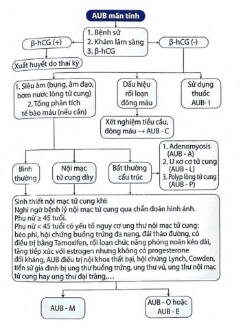

Xuất huyết tử cung bất thường (Abnormal uterine bleeding - AUB) hay gặp ở phụ nữ trong độ tuổi sinh sản.

## Phân loại AUB

Theo FIGO 2018 chia làm 2 hệ thống:

- Hệ thống 1: Theo định nghĩa xuất huyết tử cung bất thường.
- Hệ thống 2: Theo nguyên nhân gây xuất huyết (PALM - COEIN)

### Theo định nghĩa

AUB mạn tính: chảy máu trong lòng tử cung trong 6 tháng gần nhất với sự bất thường về số lượng, thời gian ra máu, tần suất và mất tính chu kỳ.

AUB cấp tính: chảy máu ở phụ nữ trong tuổi sinh sản, không có thai, mức độ nặng, cần can thiệp nhanh để hạn chế lượng máu mất.

| Đặc điểm                                         | Bình thường                                                        | Bất thường                                                                          |
| ------------------------------------------------ | ------------------------------------------------------------------ | ----------------------------------------------------------------------------------- |
| Tần suất                                         | &ge;24 và &le;28 ngày                                              | Vô kinh Chảy máu không thường xuyên(>38 ngày) Chảy máu thường xuyên(<24 ngày) |
| Thời gian                                        | &le;8 ngày                                                         | Kéo dài >8 ngày                                                                     |
| Sự đều đặn (sự thay đổi về độ dài giữa 2 chu kỳ) | Đều (18-25 tuổi và 42-45 tuổi: &le;9 ngày; 26-41 tuổi;&le; 7 ngày) | Không đều (sự thay đổi &ge; 8-10 ngày)                                              |
| Thể tích máu (theo đánh giá của người bệnh)      | 5-80ml                                                             | Ít <5mL  Nhiều >80mL                                                             |
| Xuất huyết giữa chu kỳ                           | Không có                                                           | Chảy máu bất thường giữa 2 chu kỳ (đầu, giữa, cuối)                                 |

### Theo nguyên nhân (PALM - COEIN)

a. Nguyên nhân về cấu trúc

**P**olyps (AUB-P).

**A**denomyosis (AUB-A) - Bệnh lý lạc tuyến trong cơ tử cung.

**L**eiomyomas (AUB-L) - U xơ tử cung.

**Ma**alignancy & Hyperplasia (AUB-M) - Bệnh lý ác tính và tăng sinh nội mạc tử cung.

_Phân loại u xơ tử cung theo FIGO 2011_

| Vị trí u xơ   | Đặc điểm                                                                                                                               |
| ------------- | -------------------------------------------------------------------------------------------------------------------------------------- |
| Dưới niêm mạc | 0 dưới niêm mạc có cuống 1 <50% trong cơ 2 &le; 50% trong cơ 3 100% trong cơ                                                  |
| Vị trí khác   | 4 trong cơ 5 dưới thanh mạc &le; 50% trong cơ 6 dưới thanh mạc <50% 7 dưới thanh mạc có cuống 8 cổ tử cung, dây chằng rộng |
| H-hybrid      | 2-5 <50% dưới thanh mạc và <50% dưới niêm mạc                                                                                          |

b. Nguyên nhân không thuộc cấu trúc

**C**oagulopathy (AUB-C) - Bệnh lý về đông máu.

**O**vulatory dysfuntion (AUB-O) - Rối loạn chức năng phóng noãn.

**E**ndometrial disorders (AUB-E) - Rối loạn chức năng cầm máu nội mạc tử cung.

**I**atrogenic (AUB-I) - Do thuốc.

**N**ot otherwise classfied - Chưa phân loại.

## Tiếp cận

Hỏi bệnh và khám giúp định hướng cơ bản nguyên nhân và chỉ định xét nghiệm.

Cận lâm sàng:

- beta-hCG để loại trừ có thai.
- Tổng phân tích tế bào máu.
- Nội tiết: tùy theo dấu hiệu và thăm khám gồm chức năng tuyến giáp (FT3, FT4, TSH), prolaction, testosterone, FSH hay LH, estrogen.
- Đông máu khuyến cáo cho các trường hợp AUB nặng tuổi dậy thì, bản thân và gia đình có tiền sử bất thường.
- Tầm soát ung thư cổ tử cung.
- Sinh thiết nội mạc tử cung.
- Xét nghiệm hình ảnh: Siêu âm đầu dò bụng - âm đạo, siêu âm bơm nước buồng tử cung, MRI,...
- Nội soi buồng chẩn đoán.

## Nguồn tham khảo

- PHÁC ĐỒ ĐIỀU TRỊ SẢN PHỤ KHOA 2022 - Bệnh viện Từ Dũ.
