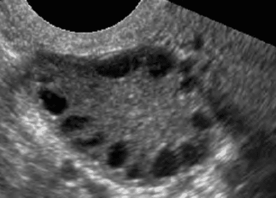
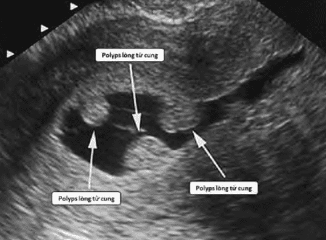

**Xuất huyết tử cung cơ năng** là kiểu xuất huyết tử cung bất thường gây ra do các cơ chế liên quan đến hoạt động nội tiết của buồng trứng hoặc do sử dụng nội tiết ngoại lai. Thuật ngữ này loại trừ tất cả các trường hợp xuất huyết tử cung có liên quan đến bệnh lý thực thể vùng chậu, bệnh lý nội khoa hoặc thai nghén.

## Bệnh sinh

Xuất huyết tử cung cơ năng thường xảy ra khi nội mạc tử cung không còn chịu ảnh hưởng của nội tiết có chu kỳ. Trong chu kỳ có phóng noãn, nội mạc tử cung phát triển dưới tác động của estrogen ở nửa đầu chu kỳ, sau đó là sự kết hợp của estrogen và progesterone ở nửa sau. Khi không có phóng noãn, estrogen đơn độc tiếp tục kích thích nội mạc tử cung kéo dài, dẫn đến tăng sinh liên tục mà không bong tróc theo chu kỳ. Điều này khiến các mạch máu nuôi nội mạc không đủ cung cấp máu, gây thiếu máu cục bộ, hoại tử từng vùng, bong tróc không đều và gây ra xuất huyết tử cung.

- Sự kích thích liên tục của **estrogen liều thấp** thường gây ra xuất huyết tử cung nhẹ, không thường xuyên.
- Sự kích thích liên tục của **estrogen liều cao** dẫn đến những đợt xuất huyết tử cung nhiều và kéo dài.

## Nguyên nhân

- **Tuổi dậy thì**: Chiếm 20% nguyên nhân. Trong vòng 18 tháng đầu sau khi hành kinh, trục hạ đồi - tuyến yên - buồng trứng chưa trưởng thành hoàn toàn nên có thể không đáp ứng đầy đủ với estrogen và progesterone, dẫn đến tình trạng không phóng noãn và xuất huyết tử cung chức năng.
- **Tuổi tiền mãn kinh**: Chiếm 50% nguyên nhân. Ở phụ nữ tuổi 40-50, số lượng và chất lượng nang noãn đều giảm. Các nang noãn phát triển nhưng không tạo đỉnh LH để gây phóng noãn, do nồng độ gonadotropin cơ bản tăng cao (giảm Inhibin B). Nang noãn tiếp tục sản xuất lượng nhỏ estrogen kéo dài, không có progesterone đối kháng, gây tăng sinh nội mạc tử cung và xuất huyết tử cung chức năng.
- **Phụ nữ béo phì**: Ở phụ nữ béo phì, estrone (một dạng estrogen) có thể được tổng hợp từ androgen tại mô mỡ ngoại vi thông qua enzym aromatase. Lượng estrone này không có đối kháng của progesterone, dẫn đến nội mạc tử cung bị kích thích kéo dài, gây xuất huyết tử cung chức năng.
- **Thiếu hụt hormone hoàng thể**: Tình trạng này xảy ra khi buồng trứng có phóng noãn nhưng hoàng thể không sản xuất đủ progesterone, hoặc đáp ứng nội mạc tử cung với progesterone không đầy đủ. Điều này làm rối loạn chu kỳ nội mạc tương tự như không phóng noãn.
- **Tăng prolactin máu**: Ức chế hoạt động trục hạ đồi - tuyến yên - buồng trứng, gây rối loạn phóng noãn. Nguyên nhân có thể do u tuyến yên (microadenoma), thuốc hướng thần kinh, thuốc kháng histamin, thuốc kháng bơm proton, thuốc chống nôn, thuốc điều trị trầm cảm
- **Hội chứng buồng trứng đa nang (PCOS)**: Do rối loạn phát triển nang noãn, không hình thành nang trội, dẫn đến không phóng noãn. Đây là nguyên nhân phổ biến gây xuất huyết tử cung chức năng.
- **Thuốc tránh thai kết hợp (estrogen-progestogen)**: Loại liều thấp (ethinyl estradiol dưới 20 µg) có thể gây xuất huyết nhẹ, kéo dài.
- **Thuốc tránh thai khẩn cấp**: Dùng progestin liều cao hoặc SPRM (selective progesterone receptor modulator) gây mất cân bằng estrogen-progesterone, dẫn đến bong nội mạc tử cung sớm.
- **Các hệ thống phóng thích steroid kéo dài (que cấy, thuốc tiêm progestin, viên uống progestin đơn thuần)**: Dễ gây mất cân bằng nội tiết và xuất huyết tử cung bất thường.

## Chẩn đoán

**Chẩn đoán xuất huyết tử cung cơ năng là một chẩn đoán loại trừ**, chỉ được đưa ra sau khi đã loại trừ các nguyên nhân thực thể và nội khoa khác.

### Lâm sàng

#### Tiền sử

- Tiền sử nội tiết, dấu hiệu có thai.
- Tiền sử dùng biện pháp tránh thai, chấn thương sinh dục.

#### Bệnh sử

- Tuổi, lần cuối có kinh, số ngày và lượng máu ra, chảy máu sau giao hợp.
- Các loại thuốc đã và đang sử dụng (nội tiết, NSAIDs, thuốc chống đông, thuốc hướng thần...).

#### Thực thể

- Dấu hiệu rối loạn nội tiết toàn thân (cường giáp, nhược giáp).
- Dấu hiệu cường androgen (mụn trứng cá nặng, rậm lông, béo phì kiểu nam).
- Khám phụ khoa để loại trừ các bất thường cấu trúc của tử cung và buồng trứng.

_Hình ảnh "Acantosis nigricans, rậm lông và mụn trứng cá nặng, quan sát thấy ở hội chứng buồng trứng đa nang, là các dấu hiệu chỉ báo nguyên nhân của xuất huyết tử cung bất thường"_.

### Cận lâm sàng

#### Xét nghiệm cơ bản

| Xét nghiệm cần cân nhắc thực hiện         | Mục đích                                                                   |
| ----------------------------------------- | -------------------------------------------------------------------------- |
| **hCG (nước tiểu hay máu)**               | Loại trừ thai                                                              |
| **Công thức máu và chức năng đông máu**   | Loại trừ bệnh lý rối loạn đông máu                                         |
| **FSH, LH, Estrogen**                     | Đánh giá giai đoạn của buồng trứng                                         |
| **Free T₄/T₃, TSH**                       | Loại trừ bệnh lý tuyến giáp                                                |
| **Androgen (Testosterone tự do, DHEA-S)** | Chẩn đoán tình trạng cường androgen trong hội chứng buồng trứng đa nang    |
| **Insulin, glucose máu**                  | Khi BMI > 25 hoặc nghi kháng insulin (PCOS)                                |
| **Prolactin máu**                         | Chẩn đoán tăng prolactin máu gây rối loạn phóng noãn                       |
| **MRI sọ não**                            | Nếu prolactin > 100 ng/mL, cần thêm MRI để khảo sát microadenoma tuyến yên |

#### Chẩn đoán hình ảnh

Có thể thực hiện **siêu âm quy ước** để khảo sát độ dày nội mạc tử cung, phản âm, bất thường trong buồng tử cung.

_Hình ảnh "Chuỗi hạt kinh điển của buồng trứng đa nang. Các nang noãn nhỏ xếp thành chuỗi, phân bố ở ngoại vi buồng trứng"_.

_Hình ảnh "Siêu âm bơm nước của polyps buồng tử cung (SIS)"_.

:::caution

- Siêu âm có thể giúp định hướng nguyên nhân như u xơ tử cung, buồng trứng đa nang...
- Siêu âm bơm nước buồng tử cung (SIS) được chỉ định khi nghi ngờ có tổn thương nội mạc tử cung (polyp, dính buồng tử cung...).

:::

**MRI**: Tuyến yên nếu Prolactin tăng cao nghiêm trọng (> 100 ng/mL) hoặc có triệu chứng u tuyến yên (nhức đầu, rối loạn thị giác); Nghi u xơ tử cung kích thước lớn, nhiều khối u, cần đánh giá mối liên quan với cơ tử cung; Nghi ngờ lạc nội mạc tử cung.

#### Pap’s test (Pap smear)

Tầm soát ung thư cổ tử cung, loại trừ chảy máu nguồn gốc từ cổ tử cung, đặc biệt khi phát hiện máu tươi hoặc chảy máu sau giao hợp.

#### Sinh thiết nội mạc tử cung

Chẩn đoán xác định, thường được chỉ định khi:

- Phụ nữ > 35 tuổi có xuất huyết tử cung bất thường.
- Phụ nữ đã mãn kinh có xuất huyết tử cung.
- Giúp đánh giá mô học nội mạc tử cung và loại trừ tăng sinh, loạn sản hoặc ung thư.

#### Nội soi buồng tử cung

Giúp quan sát trực tiếp và loại trừ nguyên nhân thực thể trong buồng tử cung. Chỉ định khi nghi ngờ tổn thương nội mạc không rõ ràng trên siêu âm.

## Điều trị

**Mục tiêu**: Cầm máu và tái lập chu kỳ kinh nguyệt bình thường.

**Lựa chọn điều trị dựa vào**:

- Nguyên nhân xuất huyết tử cung.
- Mức độ chảy máu.
- Tuổi bệnh nhân.
- Mong muốn có thai.

### Nội khoa

**Thuốc cầm máu và tăng co tử cung**:

- **Oxytocin** tiêm bắp hoặc truyền TM.
- **Ergometri**n 0.2 mg, 1-2 ống/ngày, tiêm bắp.
- **Tranexamic acid, calci clorid** tiêm TM.

**Thuốc nội tiết**:

- **Thuốc tránh thai phối hợp (estrogen-progestogen)**: 2-4 viên/ngày, giảm dần khi ngừng ra máu. Không dùng loại có < 20 µg ethinyl estradiol.
- **Estrogen đơn thuần**: Dùng khi nội mạc tử cung < 5 mm để phục hồi nội mạc → sau đó bổ sung progestogen.
- **Progestin**: Dùng nếu nội mạc tử cung > 10 mm, liều 2 viên/ngày trong 10-15 ngày. Có thể dùng đơn độc để đối kháng.
- **Biệt dược phổ biến**: Estrogen: Progynova®, Valiera®, Provames®; Progesterone: Utrogestan®, Duphaston®; Thuốc tránh thai phối hợp: Marvelon®, Regulon®, Rigevidon®, Microgynon®.

:::caution
Thường uống vào buổi tối, giờ cố định để giảm tác dụng phụ. Khi giảm liều mà ra máu lại, cần tăng liều trở lại và giảm từ từ.
:::

### Ngoại khoa

**Chỉ định khi điều trị nội khoa thất bại hoặc có nguyên nhân thực thể**:

- **Nạo buồng tử cung**: Giúp cầm máu tức thì.
- **Đốt nội mạc tử cung**: Giải pháp lâu dài nhưng làm mất khả năng sinh sản.
- **Cắt tử cung**: Chỉ định sau cùng khi thất bại với mọi phương pháp điều trị khác.

## Tài liệu tham khảo

- Trường ĐH Y Dược TP. HCM (2020) - _Team-based learning_
