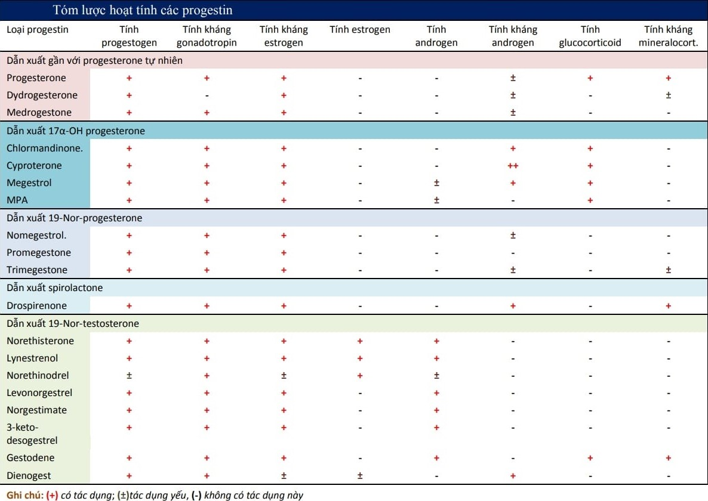

Tuổi dậy thì ở bé gái là tiến trình với sự thay đổi cả về thể chất và hành vi, chuyển đổi từ cá thể chưa trưởng thành trở thành người phụ nữ có khả năng sinh sản. Bắt đầu xuất hiện khi đứa bé gái được khoảng từ 8 đến 10 tuổi.

## Đặc trưng hệ trục hạ đồi-yên-buồng trứng tuổi dậy thì

Đặc trưng của hệ trục hạ đồi-yên-buồng trứng tuổi dậy thì là chưa ổn định hoạt động.

Trục hạ đồi-yên-buồng trứng hầu như không hoạt động trong khoảng thời gian trước dậy thì. Hiện tượng nội tiết đầu tiên xảy ra tại hạ đồi ở thời điểm ngay trước dậy thì là sự xuất hiện các xung GnRH.

Các xung GnRH lúc đầu thưa thớt, đủ để gây đáp ứng FSH trên tuyến yên, nhưng không đủ để gây nên đáp ứng bằng LH đủ mạnh. Dưới tác dụng ổn định của FSH, noãn nang phát triển, sản xuất estradiol, tạo nên các đặc điểm sinh dục thứ phát. Ngay từ trong giai đoạn sớm của thời kỳ dậy thì, hoạt động chế tiết FSH của tuyến yên đã khá ổn định. FSH gây nên sự phát triển của các nang noãn đã được chiêu mộ. Buồng trứng bắt đầu hoạt động chế tiết estrogen.

Estrogen từ buồng trứng sẽ đến các cơ quan đích có nguồn gốc Muller và tuyến vú. Sự phát triển các cơ quan này giúp hình thành các đặc điểm sinh dục thứ phát. Tuyến vú, tử cung phát triển và dần đạt đến kích thước của các cơ quan này ở người trưởng thành. Estrogen cũng gây cốt hóa xương dài. Trên lâm sàng, các đặc tính sinh dục thứ phát chịu tác động của estrogen gồm sự xuất hiện của lông mu, phát triển của môi lớn và môi nhỏ, sừng hóa niêm mạc âm đạo, phát triển của tử cung, tăng tích mỡ ở hông và đùi sẽ xuất hiện sau thời điểm khởi động trục khoảng 2.5 năm. Khi estrogen đã đạt được nồng độ đủ để gây phát triển của nội mạc tử cung thì kinh nguyệt sẽ xuất hiện. Đứa bé sẽ có kinh lần đầu tiên khi được khoảng 12.8 ± 1.2 tuổi.

Càng về sau, hoạt động chế tiết GnRH hạ đồi càng tăng dần về tần số và biên độ. Cuối cùng cũng đạt đến mức có thể gây được đỉnh LH khi có phản hồi dương từ estradiol. Tính không ổn định của hoạt động trục hạ đồi-yên-buồng trứng được thể hiện qua sự không hiệu quả của phản hồi dương của estrogen. Trong thời gian khá dài, các xung GnRH chỉ có thể gây nên đáp ứng FSH của tuyến yên. Do các xung GnRH có tần số thưa và có biên độ thấp nên chúng chưa thể kích hoạt tuyến yên tạo đỉnh LH trong phản hồi dương với estradiol.

Các đỉnh LH hoặc vắng mặt, hoặc không đủ cao, hoặc không hiệu quả. Hệ quả là hầu hết các chu kỳ buồng trứng đầu tiên ở thời kỳ dậy thì là các chu kỳ không phóng noãn. Các chu kỳ không phóng noãn dẫn đến hệ quả tất yếu là sự vắng mặt hay sự yếu kém của hoạt động hoàng thể. Thiếu hụt progesterone là hệ quả trực tiếp của chu kỳ không phóng noãn. Thiếu hụt progesterone làm nội mạc không thể bị phân tiết. Hoàng thể bất toàn cũng không tạo được nồng độ đủ cao của progesterone, dẫn đến sự bất toàn trong cơ chế ly giải hoàng thể. Vắng mặt hoàng thể hay hoàng thể không bị ly giải dẫn đến sụp đổ từng phần hay không sụp đổ của nội mạc tử cung. Rối loạn kinh nguyệt là biểu hiện của hiện tượng sụp đổ bất thường của nội mạc tử cung.

## Biểu hiện xuất huyết tử cung cơ năng tuổi dậy thì

Xuất huyết tử cung cơ năng là hiện tượng "bất thường" "rất thường gặp" do hoạt động chưa ổn định của hệ trục hạ đồi-tuyến yên-buồng trứng.

Bản chất của lần chảy máu tử cung đầu tiên là sự sụp đổ của nội mạc bị thiếu hụt steroid. Thiếu hụt steroid gây ra lần chảy máu đầu tiên này có thể là thiếu hụt của cả 2 steroid estrogen và progesterone (giống như cơ chế của kỳ hành kinh "tiêu chuẩn"), hay chỉ do sự tụt giảm của steroid duy nhất là estrogen.

Sau lần chảy máu tử cung đầu tiên, nội mạc tử cung tiếp tục phát triển dưới estrogen đơn độc nếu không có sự phóng noãn, hoặc phát triển và phân tiết dưới tác dụng hiệp đồng của estrogen và progesterone trong trường hợp có xảy ra phóng noãn.

Khoảng thời gian chờ đợi để có đủ cả 2 steroid dài hay ngắn lệ thuộc vào thời điểm mà đỉnh LH được thiết lập. Thời gian này là lâu hay mau tùy thuộc từng cá thể, có thể đến vài năm. Khoảng thời gian này chính là khoảng thời gian xảy ra xuất huyết tử cung cơ năng tuổi dậy thì.

Xuất huyết cơ năng tuổi dậy thì thường xảy ra trong khoảng thời gian vài năm đầu kế tiếp sau lần chảy máu tử cung đầu tiên. Tình trạng xuất huyết tử cung này xảy ra không đều, và rất thay đổi về tính chất và lượng máu kinh. Hầu hết các trường hợp xuất huyết cơ năng tuổi dậy thì sẽ tự ổn định về chu kỳ có rụng trứng và trở nên đều đặn hơn. Tuy nhiên, xuất huyết tử cung bất thường xảy ra ở trong độ tuổi dậy thì có thể là dấu hiệu của nhiều tình trạng bệnh lý nội khoa khác nhau, đôi khi rất nặng nề.

## Chiến lược tiếp cận

### Định hướng nguyên nhân

Chẩn đoán xuất huyết tử cung cơ năng tuổi dậy thì là chẩn đoán loại trừ.

Đánh giá độ nặng của chảy máu dựa vào các dấu hiệu toàn thân (sinh hiệu, da niêm, sinh hoạt học tập hàng ngày) và huyết đồ (mức độ thiếu máu thiếu sắt).

Trong các nguyên nhân ngoài sinh dục, rối loạn đông cầm máu là nhóm nguyên nhân thường gặp nhất. Nguyên nhân của xuất huyết tử cung có thể đến từ bất thường của con đường đông máu nội sinh hay ngoại sinh. Các bệnh lý di truyền về đông cầm máu có thể phát hiện được qua hỏi tiền sử và bệnh sử. Các bệnh lý lành tính hay ác tính trên ảnh hưởng trên dòng tiểu cầu có thể được nhận biết qua huyết đồ. Việc dùng các thuốc có thể ảnh hưởng trên đông cầm máu cũng cần được chú ý. Sai lầm thường mắc phải nhất là chỉ thấy có rối loạn phóng noãn mà không nhìn thấy bệnh hệ thống ẩn mình phía sau rối loạn phóng noãn. Nói cách khác, rối loạn phóng noãn tuổi dậy thì không phải chỉ có nguyên nhân duy nhất là sự không ổn định có tính sinh lý của trục hạ đồi-yên-buồng trứng. Rối loạn chức năng phóng noãn có thể đến từ mọi nguyên nhân ảnh hưởng đến trục hạ đồi-yên-buồng trứng và làm trì hoãn quá trình thiết lập sự ổn định sinh lý của trục hạ đồi-yên-buồng trứng. Bệnh lý tuyến giáp và bệnh lý thượng thận là 2 ví dụ cho nhóm nguyên nhân này. Điều trị bệnh lý tuyến giáp hay thượng thận mới mang lại cơ hội phục hồi hoạt động của trục hạ đồi-yên-buồng trứng nói chung và trục hạ đồi-yên-buồng trứng nói riêng. Nhiều thuốc cũng có thể ảnh hưởng đến trục hạ đồi-yên, đặc biệt là các thuốc hướng thần kinh và các thuốc corticosteroids. Các bệnh hệ thống có thể gây trì hoãn sự thiết lập có hiệu quả feed-back thứ nhì của trục hạ đồi-yên. Đái tháo đường có thể ảnh hưởng nghiêm trọng đến cơ chế gây phóng noãn. Trong trường hợp này, sẽ là rối loạn phóng noãn thường trực chứ không phải là rối loạn phóng noãn mang tính chất "sinh lý" ở tuổi dậy thì. Béo phì ở trẻ em là nhóm nguyên nhân ngày càng phổ biến. Trục hạ đồi yên ở trẻ béo phì khó đi vào ổn định hơn, và là nguy cơ gây ra rối loạn phóng noãn thường trực sau này.

Trong các nguyên nhân tại sinh dục, các nguyên nhân thực thể là các nguyên nhân thường gặp nhất. Nhiễm trùng có liên quan đến hoạt động tình dục hay không liên quan đến hoạt động tình dục là nguyên nhân phổ biến nhất. Bệnh lý tân lập ác tính hay không ác tính của buồng trứng thuộc nhóm u tế bào của dây giới bào (sex cord) như u tế bào vỏ-hạt sản xuất tại chỗ các estrogen là đối tượng ưu tiên phải tìm cách để loại trừ. Bệnh lý tại tử cung hiếm gặp ở tuổi trẻ, nhưng phải được loại trừ. Nội tiết sinh dục ngoại lai cũng là tình huống cần để tránh bỏ sót. Cần tế nhị hỏi xem đứa bé đã có dùng các nội tiết ngoại lai hay không, mà thường nhất là nội tiết ngoại lai cho mục tiêu tránh thai khẩn cấp. Nguyên nhân tại sinh dục "dễ bị bỏ quên" nhất là thai kỳ. Cho dù rằng phóng noãn hiếm gặp ở tuổi dậy thì, nhưng không có nghĩa là hoàn toàn không có phóng noãn. Khi buồng trứng đã bắt đầu có hoạt động và đứa bé đã có quan hệ tình dục thì khả năng có xuất huyết tử cung bất thường liên quan đến thai kỳ thai là hoàn toàn phải nghĩ đến để loại trừ.

Sau khi đã loại trừ tất cả mọi khả năng khác, thì có thể thiết lập chẩn đoán xuất huyết tử cung cơ năng do chu kỳ không phóng noãn ở tuổi dậy thì.

### Các bước cụ thể

Như vậy, các bước cần làm cụ thể sẽ là:

1. Hỏi tiền sử kinh nguyệt: tuổi khi có lần hành kinh đầu tiên, tính chất chu kỳ kinh , đau bụng kinh, kỳ kinh cuối cùng... Hỏi về hoạt động tình dục, thói quen tình dục (kể cả thủ dâm), đánh giá nguy cơ mắc bệnh lây truyền qua tình dục, dùng các loại thuốc (nhất thuốc tránh thai khẩn cấp)... Hỏi về các bệnh lý toàn thân của bệnh nhi hay gia đình.
2. Khám lâm sàng nhằm đánh giá toàn thân, chú ý những dấu hiệu đi cùng chu kỳ kinh không đều của bệnh nhi và gia đình: cường androgen (acantosis nigricans, rậm lông, mụn), quá cân, biểu hiện của bệnh lý tuyến giáp (thay đổi cân nặng, tuyến giáp to), dễ chảy máu (vết bầm máu, chấm xuất huyết)... Về phía phụ khoa, đánh giá các dấu hiệu của dậy thì (vú, lông mu), khám vùng chậu tìm các khối u.
3. Huyết đồ và khảo sát đông cầm máu là khảo sát trước tiên giúp đáng giá mức độ ảnh hưởng. Siêu âm vùng chậu là phương tiện sơ cấp, cung cấp nhiều thông tin quan trọng và hữu ích.

## Xử trí

### Nguyên tắc không làm ảnh hưởng đến hệ trục hạ đồi-yên-buồng trứng

Trong xử trí, cần chú trọng đến việc hạn chế gây thêm xáo trộn, tổn thương hệ trục hạ đồi-yên-buồng trứng còn non nớt, chưa trường thành. Xuất huyết tử cung cơ năng tuổi dậy thì thường sẽ tự ổn định sau 2-3 năm. Tiên lượng của xuất huyết tử cung cơ năng tuổi dậy thì thường tốt và ổn định sau vài năm xáo trộn đầu tiên. Sau khoảng 2 năm chu kỳ kinh nguyệt trở nên đều đặn. Việc theo dõi gồm nhật ký kinh nguyệt, liệu pháp bổ sung sắt và đo lường mức độ thiếu máu. Đối với tất cả các trường hợp phải đảm bảo bổ sung sắt đầy đủ cùng với theo dõi bằng lịch kinh nguyệt (menstrual calendar) có thể giúp ích trong thời gian chờ đợi sự trưởng thành về hoạt động của trục.

Xử trí tùy thuộc vào mức độ mất máu và ảnh hưởng đến đời sống của bé gái. Nếu ra huyết không gây ảnh hưởng đến việc học hành và sinh hoạt thường ngày của bé gái, thì việc can thiệp bằng nội tiết là không cần thiết, thậm chí gây hại cho hệ sinh sản còn non nớt. Nếu tình trạng chảy máu cần phải phải được điều trị thì có thể cân nhắc đến liệu pháp nội tiết. Liệu pháp này nhằm vào mục tiêu duy nhất là củng cố tình trạng nội mạc tử cung bị ảnh hưởng bất lợi từ việc chỉ bị phơi bày duy nhất với estrogen.

### Liệu pháp progestogen

Chảy máu trong chu kỳ không phóng noãn có nguyên nhân là do sự sụp đổ từng phần nội mạc tử cung không được phân tiết. Trong trường hợp này, dưới ảnh hưởng của estrogen đơn độc từ buồng trứng, nội mạc tử cung cứ ở trong trạng thái phát triển, dầy lên, nhưng không được phân tiết, đến lúc nào đó sẽ trở nên không còn bền vững, và bị sụp đổ 1 phần. Xuất huyết trong trường hợp này thường là kéo dài, với lượng không hằng định. Việc điều trị hợp lý nhất là điều trị trên cơ sở của progestogen. Progestogen ngoại sinh được cho trong thời gian và với lượng vừa đủ để phân tiết hóa toàn bộ nội mạc tử cung. Sau khoảng thời gian ngắn này, ngưng progestogen ngoại sinh. Việc ngưng này có hệ quả là gây sự sụp đổ hoàn toàn và trọn vẹn của toàn bộ nội mạc tử cung bất thường "do thiếu progesterone" trước đó, tạo ra 1 lần hành kinh có thể là nhiều hơn bình thường, nhưng gọn và dứt khoát. Sau đó là các chu kỳ để chờ đợi hoạt động phóng noãn tự nhiên. Nếu trong các chu kỳ sau, hiện tượng phóng noãn có xảy ra thì chảy máu tử cung cơ năng sẽ không bị tái diễn. Nếu tình trạng phóng noãn vẫn không được thiết lập thì có thể lặp lại khi lại có xuất huyết tương tự.

:::caution[Lưu ý]
Progestogen trong điều trị này nên là progestogen có hoạt tính anti-estrogenic đủ mạnh để phân tiết nội mạc bị phơi bày trường diễn với estrogen đơn độc, đồng thời có hoạt tính kháng hạ đồi yếu để đảm bảo rằng không gây mất khả năng tạo đỉnh LH nội sinh của trục hạ đồi-yên trong các chu kỳ sau đó. Các progestogen kiểu dydrogesterone có ái lực mạnh trên thụ thể của progesterone có nên có tính kháng estrogenic vừa phải, và ít ảnh hưởng đến hạ đồi. Các progestogen kiểu norethindrone hay lynestrenol có hoạt tính kháng estrogen rất mạnh, nhưng đồng thời cũng có tính kháng hạ đồi mạnh. Các progestogen dẫn xuất từ nor-19 progesterone có tính kháng estrogen tương đối mạnh và khả năng ức chế hạ đồi tương đối yếu, cũng có thể là lựa chọn.
:::

_Phân loại các progestin và SPRM theo nguồn gốc hóa học. Các progestin thuốc nhóm dẫn xuất của 19-nor testosterone là các progestin có hoạt tính kháng estrogen mạnh nhất, nhưng cũng có khả năng ức chế mạnh nhất trên hạ đồi, vì thế có nguy cơ gây tổn hại vĩnh viễn trục hạ đồi-yên. Trong điều trị xuất huyết tử cung tuổi dậy thì, thường dùng nhất là nhóm retroprogesterone, do khả năng ức chế trục rất yếu của nhóm progestin này._

### Liệu pháp phối hợp estrogen và progestogen

Trong xuất huyết tử cung cơ năng tuổi dậy thì, hiện tượng sụp đổ nội mạc có thể là nghiêm trọng. Nội mạc có thể bị sụp đổ 1 phần hay toàn phần, kiểu "loang lỗ da beo". Các mạch máu lớn bị hở và gây chảy máu nhiều. Trong trường hợp chảy máu nghiêm trọng, điều trị bằng estrogen theo sau đó là estrogen và progesterone sẽ là cần thiết.

Vai trò của estrogen trong điều trị này là nhanh chóng tạo ra nội mạc phát triển, để cầm máu tức thời các mạch máu lớn bị hở do quá trình bong tróc. Estrogen còn tạo ra thụ thể của progesterone cho điều trị progestogen tiếp theo sau đó. Estrogen được cho bằng bất cứ dạng thức nào. Estrogen liên hợp, ester hay ethinyl estradiol đều có thể được dùng. Do tác động của estrogen là tác động genomic, nên estrogen cần được cho với liều đủ cao hợp lý. Liều rất cao estrogen không hiệu quả hơn 1 liều đủ cao estrogen. Hơn nữa, do là tác động genomic nên việc tăng liều steroid sinh dục ngoại sinh hay dùng bằng đường tĩnh mạch không làm tăng đáp ứng cầm máu. Tăng liều steroid sinh dục ngoại sinh có thể gây ra nhiều tác dụng phụ hơn là lợi ích. Cũng do tác động của estrogen là tác động genomic, nên cần phải có thời gian để hormone này phát huy tác dụng genomic. Cầm máu bằng estrogen không phải là cầm máu có tác dụng tức thời.

Estrogen chỉ tạo ra sự phát triển tức thời của nội mạc tử cung để cầm máu, giải quyết được vấn đề cốt lõi của bệnh lý là không có progesterone. Trong mọi trường hợp, sau khi đã cầm máu được, thì phải tiếp tục duy trì estrogen để tránh gây sụp đổ do giảm estrogen, đồng thời phải cho progestogen để phân tiết hóa nội mạc tạo bởi estrogen ngoại sinh, tương tự như với progestogen đơn thuần.

Thuốc tránh thai nội tiết phối hợp (COC) là giải pháp được ưa chuộng do dễ dùng, dễ tìm.

:::caution[Lưu ý]
COC có thể có hiệu quả cho cầm máu, nhưng đồng thời khả năng ức chế hạ đồi của COC là rất mạnh. Dùng COC lâu dài hay liều cao có thể làm hư hại lâu dài hoạt động của trục hạ đồi-yên.
:::

Nếu sau 2-3 năm, tính chất của xuất huyết vẫn không thay đổi, các hành kinh bình thường không được tái lập thì phải xem đây là rối loạn phóng noãn thường trực do nguyên nhân khác, và được xử lý như những nguyên nhân này.

_Tóm lược hoạt tính của ác progestin._

Xem thêm tại điều trị [Xuất huyết tử cung do cơ năng](/phu-khoa/002-01_xuat-huyet-tu-cung-co-nang/).

## Nguồn tham khảo

- TEAM-BASED LEARNING - Trường Đại học Y Dược Thành phố Hồ Chí Minh 2020.
