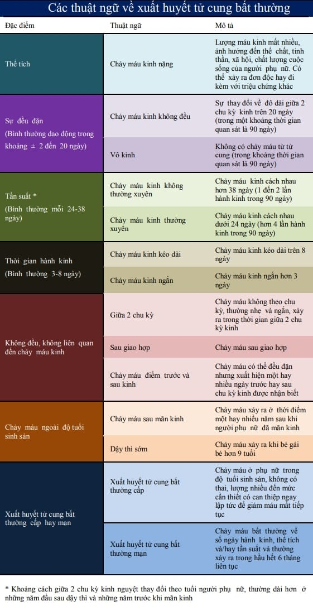
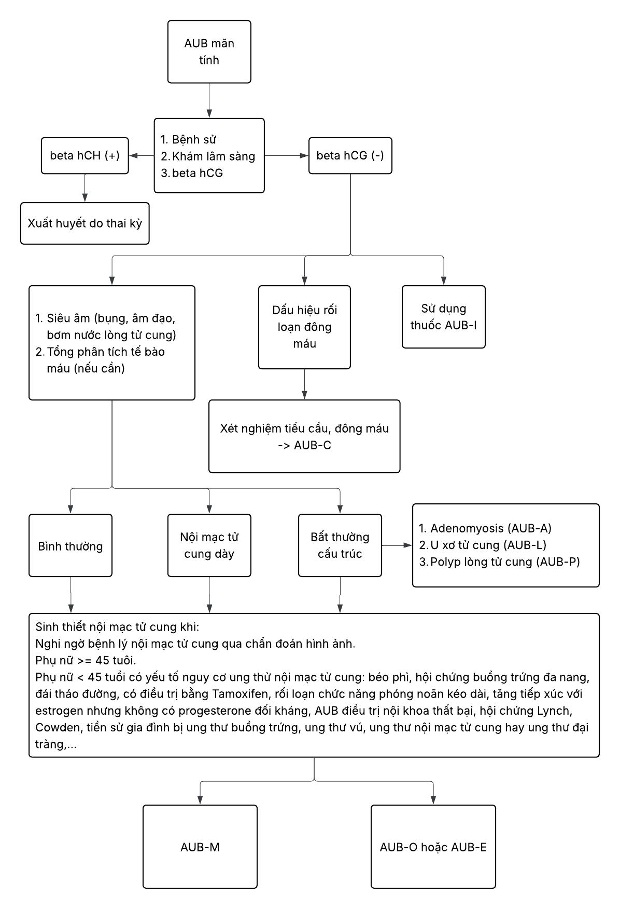
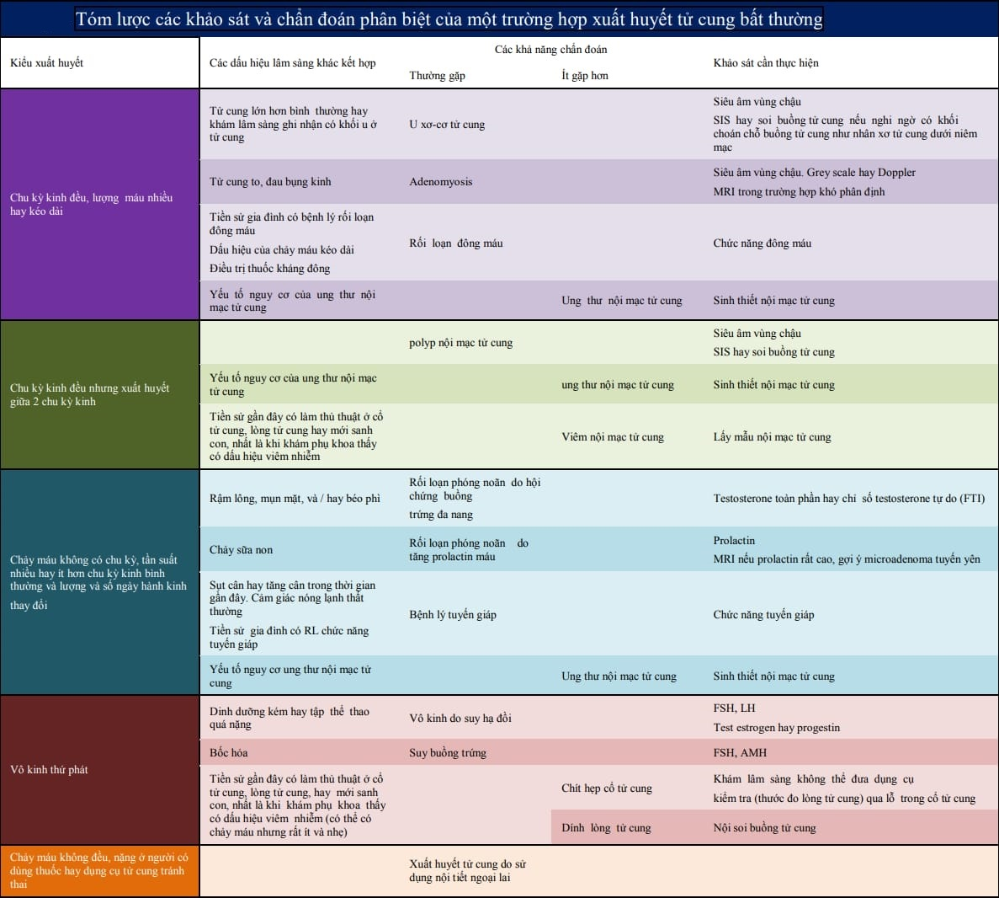

**Xuất huyết tử cung bất thường (Abnormal uterine bleeding - AUB)** là tình trạng chảy máu từ tử cung nhưng có sự thay đổi khác với chu kỳ kinh bình thường về tính chu kỳ, số ngày hành kinh, lượng máu kinh và/hoặc các triệu chứng đi kèm. AUB thường gặp ở phụ nữ trong độ tuổi sinh sản và có thể ảnh hưởng đến chất lượng cuộc sống, khả năng sinh sản và sức khỏe tổng thể.

## Phân loại

Theo khuyến cáo của FIGO 2018, AUB được phân thành hai hệ thống:

- **Hệ thống 1**: Theo định nghĩa xuất huyết tử cung bất thường (mạn tính hoặc cấp tính).
- **Hệ thống 2 (PALM-COEIN)**: Theo nguyên nhân gây xuất huyết, chia thành nguyên nhân **cấu trúc** (PALM) và **không cấu trúc** (COEIN).

### Theo định nghĩa

**AUB mạn tính**: Chảy máu tử cung bất thường kéo dài ít nhất **6 tháng** gần nhất, với bất thường ở một hoặc nhiều khía cạnh sau:

- Số ngày hành kinh (quá dài > 8 ngày hoặc quá ngắn < 2 ngày).
- Số chu kỳ (chu kỳ quá dài > 38 ngày hoặc quá ngắn < 24 ngày).
- Lượng máu (tiêu chuẩn mất > 80 mL mỗi kỳ kinh hoặc có biểu hiện thiếu máu).
- Mất tính chu kỳ (ra máu không theo quy luật, có lúc spotting giữa chu kỳ).

**AUB cấp tính**: Xuất huyết tử cung nặng, đột ngột ở phụ nữ độ tuổi sinh sản, không có thai, cần can thiệp cấp cứu để cầm máu và ổn định tình trạng mất máu. AUB cấp tính có thể xảy ra trên nền AUB mạn tính hoặc lần đầu tiên khởi phát mà mức độ chảy máu rất nặng (Hb giảm nhanh, choáng váng, tụt huyết áp).

### Theo nguyên nhân (PALM-COEIN)

|                              | Nguyên nhân thuộc cấu trúc (PALM)                                                  |
| ---------------------------- | ---------------------------------------------------------------------------------- |
| **P**olyps                   | Polyp nội mạc tử cung                                                              |
| **A**denomyosis              | Lạc nội mạc trong cơ tử cung                                                       |
| **L**eiomyomas               | U xơ tử cung (chủ yếu u xơ dưới niêm mạc và trong cơ)                              |
| **M**alignancy & Hyperplasia | Tăng sinh nội mạc (simple/complex, có/không loạn sản) hoặc ung thư nội mạc tử cung |

|                           | Nguyên nhân không thuộc cấu trúc (COEIN)                                             |
| ------------------------- | ------------------------------------------------------------------------------------ |
| **C**oagulopathy          | Rối loạn đông máu (di truyền hoặc mắc phải)                                          |
| **O**vulatory Dysfunction | Rối loạn phóng noãn (ví dụ: PCOS, thiếu hụt nội tiết)                                |
| **E**ndometrial           | Rối loạn cơ chế cầm máu tại nội mạc (ví dụ: Bất thường mạch máu nội mạc)             |
| **I**atrogenic            | Do thuốc hoặc các thủ thuật y tế (thiếu ốc chèn, dụng cụ tử cung, thuốc nội tiết...) |
| **N**ot yet classified    | Nguyên nhân chưa rõ hoặc chưa phân loại được                                         |

## Chẩn đoán

_Hình ảnh "Sơ đồ tiếp cận AUB mạn tính - Bệnh viện Từ Dũ"_.

_Hình ảnh "Tóm lược các khảo sát và chẩn đoán phân biệt của một trường hợp AUB"_.

### Lâm sàng

#### Tiền sử

- **Tiền sử sản khoa - tình dục**: Hoạt động tình dục, phương thức tránh thai (đặc biệt dụng cụ tử cung), đánh giá nguy cơ STI. Tiền sử sảy thai, nong nạo, nạo hút buồng tử cung, chấn thương, can thiệp phụ khoa.
- **Tiền sử bệnh lý hệ thống và nội tiết**: Bệnh lý đông máu (bản thân, gia đình), đái tháo đường, tăng huyết áp, rối loạn tuyến giáp, hội chứng buồng trứng đa nang (PCOS). Thuốc đang dùng: NSAID, kháng đông (warfarin, heparin...), corticosteroid, thuốc điều trị tuyến giáp, thuốc tránh thai, thuốc nội tiết thay thế, GnRH đồng vận, tamoxifen, SERM, SPRM.

#### Bệnh sử

- Tuổi có kinh lần đầu, tính chất chu kỳ (dài/ ngắn, đều/ không đều), độ dài và lượng máu, có cục máu đông kèm không.
- Các triệu chứng đi kèm: Đau bụng kinh, mệt mỏi, choáng váng, triệu chứng thiếu máu (hoa mắt, chóng mặt).
- Tần suất spotting giữa chu kỳ.

#### Thực thể

- **Tổng quát**: Kiểm tra sinh hiệu, đánh giá mức độ thiếu máu (da niêm nhợt, mạch nhanh), dấu hiệu rối loạn đông (bầm tím, chảy máu chân răng).
- **Khám dấu hiệu nội tiết**: Cường androgen (mụn trứng cá, rậm lông, acanthosis nigricans), rối loạn tuyến giáp (bướu cổ, run tay), dấu hiệu Cushing (gầy yếu, vết rạn, mỡ bụng).
- **Chỉ số BMI**: Thừa cân/ béo phì gợi ý PCOS, kháng insulin.
- **Quan sát bên ngoài âm hộ, âm đạo** để loại trừ tổn thương viêm nhiễm, loét, u.
- **Khám âm đạo - cổ tử cung** (nếu bệnh nhân cho phép): Quan sát polyp, viêm cổ tử cung. Nếu chưa quan hệ, chỉ khám ngoài và siêu âm qua thành bụng hoặc đầu dò nhỏ.

### Cận lâm sàng

#### Xét nghiệm cơ bản

| Xét nghiệm cần cân nhắc thực hiện         | Mục đích                                                                   |
| ----------------------------------------- | -------------------------------------------------------------------------- |
| **hCG (nước tiểu hay máu)**               | Loại trừ thai                                                              |
| **Công thức máu và chức năng đông máu**   | Loại trừ bệnh lý rối loạn đông máu                                         |
| **FSH, LH, Estrogen**                     | Đánh giá giai đoạn của buồng trứng                                         |
| **Free T₄/T₃, TSH**                       | Loại trừ bệnh lý tuyến giáp                                                |
| **Androgen (Testosterone tự do, DHEA-S)** | Chẩn đoán tình trạng cường androgen trong hội chứng buồng trứng đa nang    |
| **Insulin, glucose máu**                  | Khi BMI > 25 hoặc nghi kháng insulin (PCOS)                                |
| **Prolactin máu**                         | Chẩn đoán tăng prolactin máu gây rối loạn phóng noãn                       |
| **MRI sọ não**                            | Nếu prolactin > 100 ng/mL, cần thêm MRI để khảo sát microadenoma tuyến yên |

#### Chẩn đoán hình ảnh

**Siêu âm đầu dò âm đạo (TVUS)** là khảo sát hình ảnh đầu tay:

- Đo độ dày nội mạc: < 4-5 mm (đã qua giai đoạn hành kinh, không dùng tamoxifen) được coi là bình thường. ≥ 5 mm cần đánh giá thêm (đặc biệt ≥ 8 mm hoặc có dày không đều nên nghi tăng sinh).
- Hình thái nội mạc: Đồng nhất hay không, có polyp, u xơ dưới niêm mạc, hình ảnh _chuỗi hạt_ PCOS (ở tuổi trẻ).
- Buồng trứng: U nang, u lạc nội mạc, PCOS.

**Siêu âm bơm nước buồng tử cung (SIS)**:

- Chỉ định khi nghi polyp nội mạc hoặc dính buồng tử cung (nội mạc không bong đều).
- SIS làm đầy buồng tử cung bằng dung dịch nước muối vô trùng để quan sát rõ tổn thương khu trú như polyp, u xơ dưới niêm mạc.

**MRI** nếu:

- Nghi u xơ tử cung kích thước lớn, nhiều khối u, cần đánh giá mối liên quan với cơ tử cung.
- Nghi u tuyến yên (lactotroph adenoma) nếu prolactin tăng cao.
- Nghi ngờ u lạc nội mạc hoặc tổn thương lan tỏa trong cơ.

#### Pap’s test (Pap smear)

Tầm soát ung thư cổ tử cung, loại trừ chảy máu nguồn gốc từ cổ tử cung, đặc biệt khi phát hiện máu tươi hoặc chảy máu sau giao hợp.

#### Sinh thiết nội mạc tử cung

**Chỉ định**:

- Phụ nữ > 45 tuổi có AUB.
- Phụ nữ < 45 tuổi có nguy cơ cao ung thư nội mạc (đái tháo đường, béo phì, tăng huyết áp, sử dụng tamoxifen).
- AUB không đáp ứng điều trị nội tiết ban đầu.

**Phương pháp**:

- Pipelle® biopsy (khám ngoại trú, không gây mê).
- D&C (nếu Pipelle lấy mẫu không đủ hoặc nghi ngờ tổn thương khu trú).

#### Nội soi buồng tử cung

Chỉ định khi SIS hoặc TVUS không xác định rõ tổn thương, hoặc kết quả sinh thiết mù âm tính nhưng nghi ngờ tổn thương khu trú. Lợi ích giúp quan sát trực tiếp nội mạc, lấy mẫu chính xác hoặc cắt bỏ polyp/u dưới niêm mạc.

## Điều trị

### Nguyên tắc

**Cầm máu cấp** (nếu AUB cấp tính hoặc mạn tính nặng):

- Điều trị nội khoa khẩn cấp bằng steroid ngoại sinh (estrogen và/hoặc progestogen).
- Các thuốc cầm máu không chuyên biệt: NSAID (ibuprofen, naproxen) giảm prostaglandin, anti-fibrinolytics (tranexamic acid).

**Xử trí nguyên nhân**:

- Nếu do nguyên nhân cấu trúc (PALM): Loại bỏ polyp, cắt bỏ u xơ, điều trị lạc nội mạc cơ tử cung, xử lý tăng sinh/nội mạc.
- Nếu do rối loạn nội tiết (COEIN-O hoặc E): Điều chỉnh steroid ngoại sinh, cân bằng estrogen-progestogen, cân nhắc GnRH đồng vận, SERM, SPRM.
- Nếu do rối loạn đông (COEIN-C): Điều trị rối loạn đông, phối hợp với chuyên khoa huyết học.

**Tái lập chu kỳ kinh nguyệt đều đặn**: Duy trì nội tiết tố cân bằng để nội mạc phát triển-phân tiết đều đặn, tránh bong tróc không đều.

**Các yếu tố cần cân nhắc**:

- **Tuổi bệnh nhân**: < 35 tuổi ưu tiên điều trị bảo tồn, mong muốn có thai; 35-45 tuổi cân nhắc nguy cơ tăng sinh nội mạc, ung thư nội mạc; > 45 tuổi thăm khám, loại trừ tăng sinh/nội mạc, ung thư, cân nhắc điều trị triệt để (nạo, cắt tử cung).
- **Mong muốn sinh con**: Nếu bệnh nhân muốn có thai, hạn chế dùng biện pháp triệt phá nội mạc (ablation, cắt tử cung); Nếu không có nhu cầu sinh thêm, có thể chọn liệu pháp xâm lấn tối thiểu hoặc cắt tử cung khi điều trị bảo tồn thất bại.

### Nội khoa

**Cầm máu cấp bằng steroid sinh dục**:

- **Estrogen đơn thuần** (trường hợp chảy máu nặng, nội mạc rất mỏng): Ethinyl estradiol 2 mg × 4 lần/ngày trong 2-3 ngày, sau đó giảm dần dần; Hoặc estradiol valerate 2-3 mg × 3 lần/ngày.
- **Estrogen phối hợp progestogen**: Ethinyl estradiol 30 µg + Levonorgestrel 150 µg × 2-3 viên/ngày trong 5-7 ngày, sau đó chuyển sang liều duy trì (1 viên/ngày); Hoặc premarin (estrogen liên hợp) 25 mg/ngày × 5-7 ngày, sau đó bổ sung progestin (medroxyprogesterone acetate 10 mg/ngày × 10-14 ngày).

:::caution
Estrogen cần được cho đủ liều để nội mạc phát triển nhanh nhằm bít kín mạch máu hở. Không nên tăng liều quá mức, vì tác dụng genomic cần thời gian và liều quá cao tăng nguy cơ huyết khối.
:::

**Cầm máu cấp bằng hỗ trợ không chuyên biệt**:

- **NSAID** (giảm prostaglandin, co mạch nhẹ): Ibuprofen 400-600 mg × 3 lần/ngày, hoặc naproxen 500 mg × 2 lần/ngày, dùng trong 3-5 ngày đầu chảy máu.
- **Anti-fibrinolytics**: Tranexamic acid 1 g × 3-4 lần/ngày khi còn chảy máu, tối đa 4-5 ngày; Giúp giảm thể tích máu mất khoảng 30-50%.

**Xử trí nguyên nhân nội tiết**:

- **Progestogen đơn thuần** (đối với rối loạn phóng noãn hoặc nội mạc suy yếu): Medroxyprogesterone acetate 10-20 mg/ngày (ngày 14-25 chu kỳ hoặc 10-14 ngày mỗi tháng); Hoặc Dydrogesterone 10 mg × 2 lần/ngày (ngày 14-25 chu kỳ); Hoặc Levonorgestrel IUD (LNG-IUD) phóng thích 20 µg/ngày cầm máu hiệu quả cao trong cầm máu AUB do nguyên nhân nội mạc, u xơ dưới niêm mạc nhỏ, PCOS. Dùng dài hạn (5 năm), đồng thời bảo vệ nội mạc khỏi tăng sinh do estrogen ngoại sinh.
- **Liệu pháp phối hợp estrogen - progestogen (COC)**: Ethinyl estradiol 30 µg + Levonorgestrel 150 µg: Dùng hàng ngày trong 21 ngày, nghỉ 7 ngày; Có thể chỉ định liên tục (28 ngày liền) nếu cần ổn định nội mạc nhanh.
- **GnRH đồng vận (GnRH agonist)**: Leuprolide 3.75 mg tiêm bắp mỗi tháng hoặc 11.25 mg mỗi 3 tháng. Tạo _cắt tuyến yên nội khoa_, giảm sản xuất estrogen từ buồng trứng. Chỉ định ngắn hạn (6 tháng), thường kết hợp add-back therapy (estrogen/progestin liều thấp) để giảm triệu chứng mãn kinh.
- **Selective Estrogen Receptor Modulator (SERM)**: Clomiphene citrate 50-100 mg/ngày (ngày 5-9 chu kỳ) để kích phóng noãn ở trường hợp PCOS; Hoặc Raloxifene không thường dùng cho AUB nhưng có thể tác động đến nội mạc.
- **Selective Progesterone Receptor Modulator (SPRM)**: Ulipristal acetate 5 mg/ngày trong 3 tháng (dành cho u xơ tử cung) hoặc mifepristone liều thấp (5-10 mg/ngày). Giảm kích thước u xơ, giảm xuất huyết, ổn định nội mạc.

### Ngoại khoa

**Nội soi buồng tử cung (Hysteroscopic surgery)**:

- **Cắt polyp nội mạc**: Loại bỏ polyp lành tính, hạn chế chảy máu và cải thiện sinh sản.
- **Cắt class u xơ dưới niêm mạc**: Bóc tách khối u xơ chèn ép nội mạc, giảm chứng rong huyết.
- **Dính buồng tử cung**: Nong tách và cắt dính, khôi phục buồng tử cung.

**Đốt/vắc bỏ nội mạc tử cung (Endometrial ablation/resection)**:

- Dùng các phương pháp: Sóng vi sóng, laser, năng lượng radio, thòng lọng điện (resectoscope) để tiêu hủy lớp nội mạc tận gốc.
- Chỉ định cho phụ nữ đã đủ con và muốn điều trị triệt để AUB cơ năng hoặc tăng sinh nội mạc nhẹ.
- Hạn chế: Không áp dụng khi nghi ngờ hoặc đã chẩn đoán tăng sinh nội mạc nặng, loạn sản hoặc ung thư; Không dành cho người có u xơ lớn > 3-4 cm (ngoại trừ u xơ dưới niêm mạc nhỏ đã cắt hết).

**Thuyên tắc động mạch tử cung (Uterine artery embolization - UAE)**:

- Chỉ định chủ yếu cho u xơ tử cung gây chảy máu nặng, không muốn phẫu thuật, hoặc nguy cơ phẫu thuật cao.
- Phương pháp: Bít tắc động mạch cung cấp máu cho cơ tử cung, làm khối u xơ teo nhỏ, giảm chảy máu.

:::caution
Thuyên tắc động mạch tử cung có thể coi là biện pháp tương đương cắt tử cung về mặt triệt để cầm máu, nhưng giữ lại tử cung cho bệnh nhân.
:::

**Cắt tử cung (Hysterectomy)**:

- Phương pháp triệt để cho AUB cơ năng hoặc thực thể khi: Thất bại với mọi phương pháp điều trị bảo tồn; Có kèm các bệnh lý thực thể nặng (u xơ lớn, loạn sản/ung thư nội mạc); Bệnh nhân không còn nhu cầu sinh thêm con.
- Các đường mổ: Mổ mở, nội soi, nội soi hỗ trợ qua âm đạo (TLH, LAVH, VH) tùy điều kiện.

## Tài liệu tham khảo

- Trường ĐH Y Dược TP. HCM (2020) - _Team-based learning_
- Bệnh viện Từ Dũ (2022) - _Phác đồ điều trị Sản Phụ khoa_
- FIGO (2018) - _PALM-COEIN Classification of Causes of Abnormal Uterine Bleeding_
- UpToDate (2024) - _Abnormal uterine bleeding in reproductive-aged women (truy cập tháng 5/2025)_
- ACOG Practice Bulletin No. 128 (2021) - _Diagnosis of Abnormal Uterine Bleeding in Reproductive-Aged Women_
